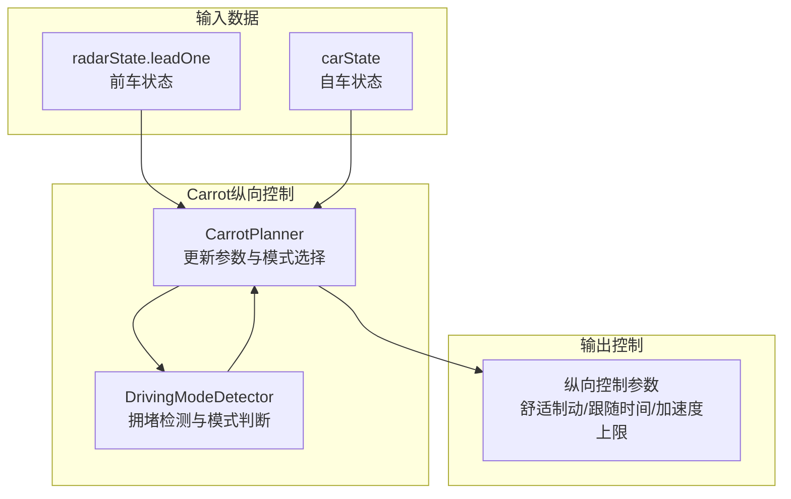
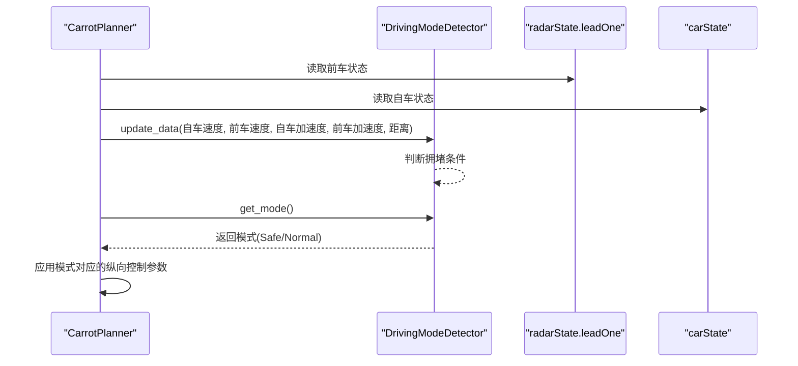
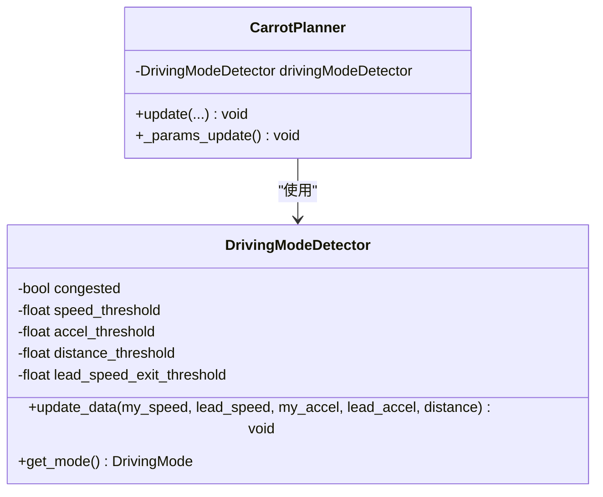
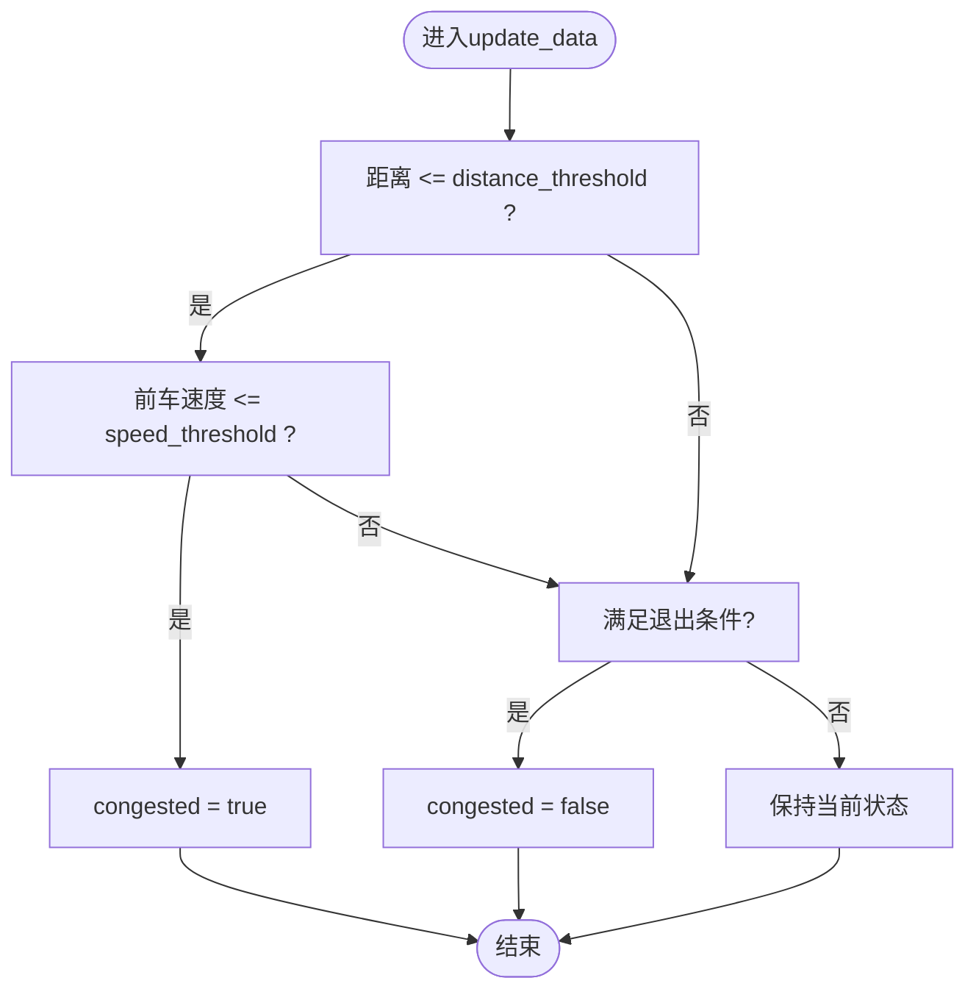
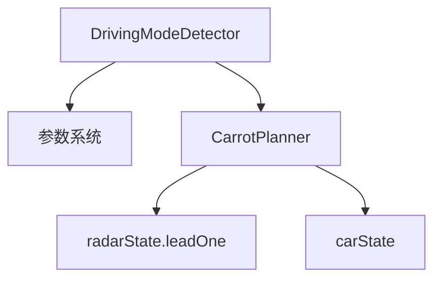

# 驾驶模式检测器

<cite>
**本文档引用的文件**
- [carrot_functions.py](file://selfdrive/carrot/carrot_functions.py)
- [carrot_settings.json](file://selfdrive/carrot_settings.json)
- [cruise.py](file://selfdrive/car/cruise.py)
- [params_keys.h](file://common/params_keys.h)
- [log.capnp.h](file://cereal/gen/cpp/log.capnp.h)
</cite>

## 目录
1. [简介](#简介)
2. [项目结构](#项目结构)
3. [核心组件](#核心组件)
4. [架构概览](#架构概览)
5. [详细组件分析](#详细组件分析)
6. [依赖分析](#依赖分析)
7. [性能考虑](#性能考虑)
8. [故障排除指南](#故障排除指南)
9. [结论](#结论)
10. [附录](#附录)

## 简介
本文档深入解析DrivingModeDetector驾驶模式检测器的实现原理与工作机制。该检测器基于前车状态与自车动态数据，实时判断拥堵与正常驾驶场景，并据此在安全模式(Safe)与正常模式(Normal)之间自动切换。文档将详细阐述update_data方法的数据处理逻辑、get_mode方法的模式判断策略，以及拥堵条件的判定标准（距离阈值、速度阈值、加速度阈值、前车速度退出阈值）。同时，我们将解释安全模式和正常模式的切换机制，以及模式检测对纵向控制参数的影响，并提供模式检测的准确性分析与阈值调优指南。

## 项目结构
DrivingModeDetector位于Carrot纵向控制框架中，作为CarrotPlanner的一部分被调用。其核心职责是根据雷达前车数据与自车状态，动态调整驾驶模式，从而影响纵向控制参数（如舒适制动、跟随时间间隔、加速度上限等）。

**图表来源**
- [carrot_functions.py:346-521](file://selfdrive/carrot/carrot_functions.py#L346-L521)
- [carrot_functions.py:524-542](file://selfdrive/carrot/carrot_functions.py#L524-L542)

**章节来源**
- [carrot_functions.py:346-521](file://selfdrive/carrot/carrot_functions.py#L346-L521)
- [carrot_functions.py:524-542](file://selfdrive/carrot/carrot_functions.py#L524-L542)

## 核心组件
- DrivingModeDetector类：负责拥堵检测与模式判断的核心逻辑，包含四个阈值参数与两个方法（update_data、get_mode）。
- CarrotPlanner类：集成DrivingModeDetector，周期性更新数据并根据模式选择调整纵向控制参数。

关键特性
- 自动模式开关：当MyDrivingModeAuto启用时，系统会根据拥堵检测结果自动在Safe与Normal模式间切换。
- 参数驱动：通过参数系统动态调整阈值与模式行为，便于现场调试与优化。
- 与纵向控制解耦：模式检测独立运行，仅通过DrivingMode影响控制参数，保持系统稳定性。

**章节来源**
- [carrot_functions.py:524-542](file://selfdrive/carrot/carrot_functions.py#L524-L542)
- [carrot_functions.py:92-101](file://selfdrive/carrot/carrot_functions.py#L92-L101)
- [carrot_functions.py:146-156](file://selfdrive/carrot/carrot_functions.py#L146-L156)

## 架构概览
DrivingModeDetector的工作流如下：每帧从radarState.leadOne与carState获取前车速度、加速度、距离与自车加速度，调用update_data进行拥堵状态判断；随后在参数更新阶段，根据 congested 状态返回对应模式（Safe或Normal）。

**图表来源**
- [carrot_functions.py:386](file://selfdrive/carrot/carrot_functions.py#L386)
- [carrot_functions.py:541-542](file://selfdrive/carrot/carrot_functions.py#L541-L542)

## 详细组件分析

### DrivingModeDetector类
DrivingModeDetector采用简单而稳健的规则引擎实现拥堵检测，包含以下要素：
- 状态变量：congested（布尔型，表示是否处于拥堵状态）
- 阈值参数：
  - distance_threshold：距离阈值（单位：米）
  - speed_threshold：速度阈值（单位：km/h）
  - accel_threshold：加速度阈值（单位：m/s²）
  - lead_speed_exit_threshold：前车速度退出阈值（单位：km/h）

update_data方法的处理逻辑
- 入口参数：my_speed（km/h）、lead_speed（km/h）、my_accel（m/s²）、lead_accel（m/s²）、distance（m）
- 触发拥堵条件：当距离小于等于阈值且前车速度小于等于阈值时，标记为拥堵
- 退出拥堵条件：当满足以下任一条件时，清除拥堵状态
  - 前车加速度大于阈值
  - 自车速度大于前车速度退出阈值
  - 距离达到远端阈值（视为畅通）

get_mode方法的模式判断策略
- 若处于拥堵状态：返回Safe模式
- 否则：返回Normal模式

**图表来源**
- [carrot_functions.py:524-542](file://selfdrive/carrot/carrot_functions.py#L524-L542)
- [carrot_functions.py:98-99](file://selfdrive/carrot/carrot_functions.py#L98-L99)

拥堵条件判定流程图

**图表来源**
- [carrot_functions.py:532-539](file://selfdrive/carrot/carrot_functions.py#L532-L539)

**章节来源**
- [carrot_functions.py:524-542](file://selfdrive/carrot/carrot_functions.py#L524-L542)

### 模式切换机制与纵向控制参数影响
CarrotPlanner在参数更新阶段根据DrivingModeDetector的返回模式调整纵向控制参数：
- 当模式为Safe时：
  - 舒适制动系数降低（提高舒适性）
  - 跟随时间间隔（tFollow）减小（更积极的跟随）
  - 加速度上限适当下调（提升安全性）
- 当模式为Normal时：
  - 使用默认的舒适制动与跟随参数
  - 加速度上限按车辆特性曲线设定

此外，CarrotPlanner还通过参数系统动态加载多项纵向控制相关参数，包括：
- 动态跟随时间间隔（DynamicTFollow/DynamicTFollowLC）
- 舒适制动系数（ComfortBrake）
- 跟随时间间隔（TFollowGap1~TFollowGap4）
- 高速模式因子（MyHighModeFactor）

这些参数在不同模式下会被乘以相应的因子，从而实现模式间的平滑过渡。

**章节来源**
- [carrot_functions.py:196-213](file://selfdrive/carrot/carrot_functions.py#L196-L213)
- [carrot_functions.py:162-182](file://selfdrive/carrot/carrot_functions.py#L162-L182)
- [carrot_functions.py:370-376](file://selfdrive/carrot/carrot_functions.py#L370-L376)

### 参数配置与持久化
DrivingModeDetector的阈值与模式自动切换功能通过参数系统实现：
- MyDrivingMode：手动选择的驾驶模式（1:Eco, 2:Safe, 3:Normal, 4:High）
- MyDrivingModeAuto：自动模式开关（0:关闭, 1:开启）
- 对应参数键名与持久化定义见参数键表与生成头文件

**图表来源**
- [carrot_functions.py:92-99](file://selfdrive/carrot/carrot_functions.py#L92-L99)
- [carrot_functions.py:146-156](file://selfdrive/carrot/carrot_functions.py#L146-L156)
- [params_keys.h:209-210](file://common/params_keys.h#L209-L210)
- [log.capnp.h:11210](file://cereal/gen/cpp/log.capnp.h#L11210)

**章节来源**
- [carrot_functions.py:92-99](file://selfdrive/carrot/carrot_functions.py#L92-L99)
- [carrot_functions.py:146-156](file://selfdrive/carrot/carrot_functions.py#L146-L156)
- [params_keys.h:209-210](file://common/params_keys.h#L209-L210)
- [log.capnp.h:11210](file://cereal/gen/cpp/log.capnp.h#L11210)

## 依赖分析
DrivingModeDetector的依赖关系简洁明确，主要依赖于参数系统与CarrotPlanner的调度。其内部不直接依赖具体硬件或传感器，而是通过传入的数值进行逻辑判断，具备良好的可移植性与可测试性。

**图表来源**
- [carrot_functions.py:524-542](file://selfdrive/carrot/carrot_functions.py#L524-L542)
- [carrot_functions.py:386](file://selfdrive/carrot/carrot_functions.py#L386)

**章节来源**
- [carrot_functions.py:524-542](file://selfdrive/carrot/carrot_functions.py#L524-L542)
- [carrot_functions.py:386](file://selfdrive/carrot/carrot_functions.py#L386)

## 性能考虑
- 计算复杂度：update_data为O(1)，仅包含若干比较与赋值操作，开销极低。
- 调用频率：CarrotPlanner每帧调用一次update_data，确保响应及时性。
- 参数缓存：通过参数系统集中管理阈值与控制参数，减少重复初始化成本。
- 抖动抑制：结合CarrotPlanner中的其他逻辑（如ExistCounter等），可进一步平滑模式切换。

[本节为通用性能讨论，无需特定文件来源]

## 故障排除指南
常见问题与排查要点
- 模式切换过于频繁
  - 检查阈值设置是否过严或过松
  - 确认前车数据质量（radarState.leadOne.status与radar可用性）
  - 关注自车加速度噪声（carState.aEgo）对判断的影响
- 模式切换不生效
  - 确认MyDrivingModeAuto参数已启用
  - 检查参数系统是否正确写入与读取
  - 验证CarrotPlanner的参数更新路径是否被执行
- 纵向控制参数未按预期变化
  - 核对ComfortBrake、TFollowGap系列参数是否正确加载
  - 检查模式因子（mySafeFactor/myHighModeFactor）是否按Safe/Normal正确应用

**章节来源**
- [carrot_functions.py:146-156](file://selfdrive/carrot/carrot_functions.py#L146-L156)
- [carrot_functions.py:162-182](file://selfdrive/carrot/carrot_functions.py#L162-L182)

## 结论
DrivingModeDetector通过简洁可靠的规则实现了拥堵场景下的自动模式切换，有效提升了纵向控制的安全性与舒适性。其阈值参数可通过参数系统灵活调整，配合CarrotPlanner的参数加载机制，可在不同车型与场景下实现快速适配。建议在实际部署中结合实车数据进行阈值校准，并持续监控模式切换的准确性与用户体验。

[本节为总结性内容，无需特定文件来源]

## 附录

### 阈值调优指南
- 距离阈值（distance_threshold）
  - 适用场景：判断前车是否接近
  - 调优建议：结合车辆长度与期望的最小跟车距离，通常设置在10~20米范围
- 速度阈值（speed_threshold）
  - 适用场景：判断前车是否处于低速或停止状态
  - 调优建议：一般设置在0~5 km/h，避免误判静止物体
- 加速度阈值（accel_threshold）
  - 适用场景：判断前车是否正在加速，从而退出拥堵状态
  - 调优建议：根据前车动力特性设置，通常在1.0~2.0 m/s²
- 前车速度退出阈值（lead_speed_exit_threshold）
  - 适用场景：当自车速度显著高于前车时，主动退出拥堵状态
  - 调优建议：结合道路限速与期望的行驶速度，通常设置在20~40 km/h

调优步骤
1. 在畅通路段进行基准测试，记录正常模式下的舒适制动与跟车表现
2. 在典型拥堵场景下观察模式切换点，调整距离与速度阈值
3. 通过加速场景验证退出阈值，避免过早退出
4. 使用参数系统逐步微调，观察对纵向控制参数的影响
5. 在多场景下进行回归测试，确保稳定性与鲁棒性

**章节来源**
- [carrot_functions.py:524-542](file://selfdrive/carrot/carrot_functions.py#L524-L542)
- [carrot_settings.json:1604-1629](file://selfdrive/carrot_settings.json#L1604-L1629)