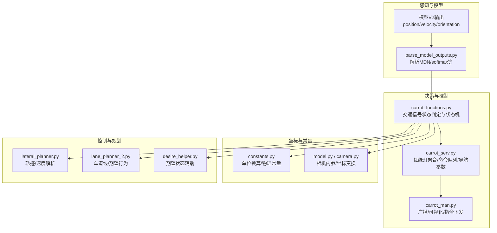
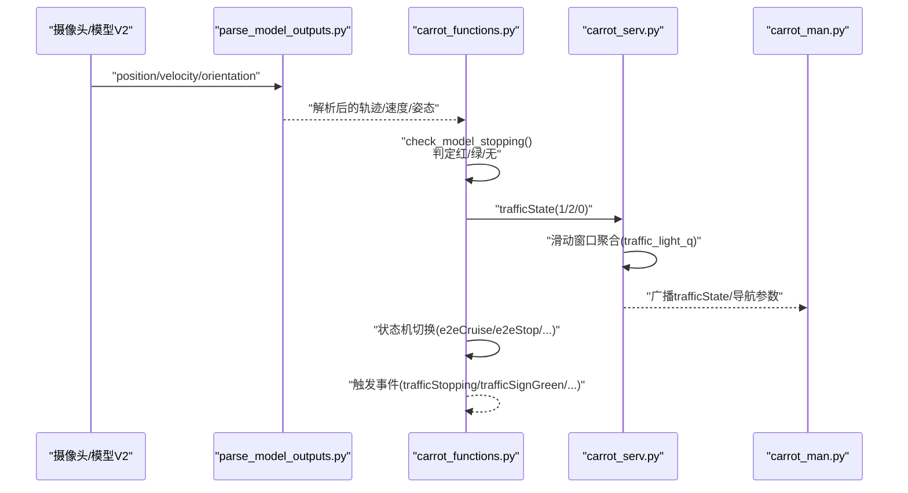
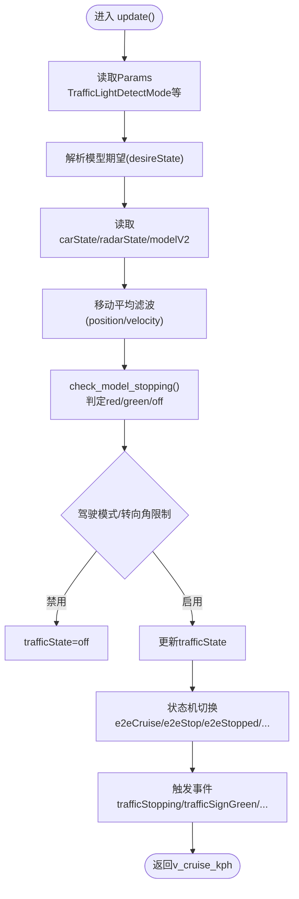
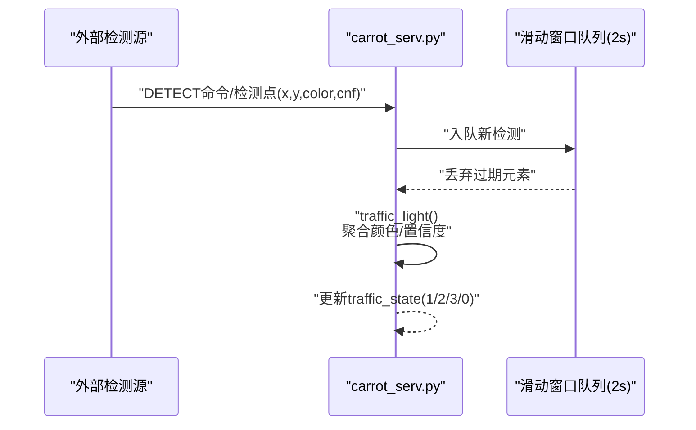
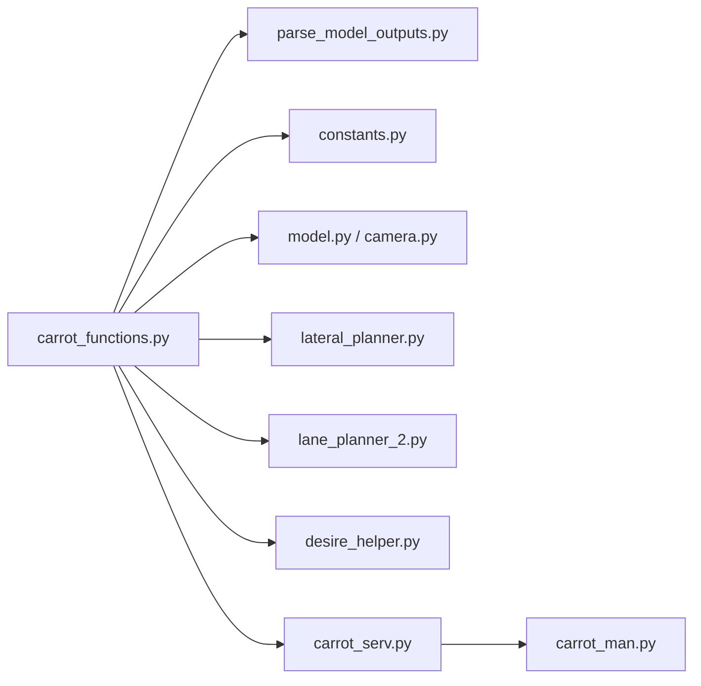

# 交通信号检测算法

<cite>
**本文引用的文件**
- [carrot_functions.py](file://selfdrive/carrot/carrot_functions.py)
- [carrot_serv.py](file://selfdrive/carrot/carrot_serv.py)
- [carrot_man.py](file://selfdrive/carrot/carrot_man.py)
- [parse_model_outputs.py](file://selfdrive/modeld/parse_model_outputs.py)
- [constants.py](file://common/constants.py)
- [model.py](file://common/transformations/model.py)
- [camera.py](file://common/transformations/camera.py)
- [lateral_planner.py](file://selfdrive/controls/lib/lateral_planner.py)
- [lane_planner_2.py](file://selfdrive/controls/lib/lane_planner_2.py)
- [desire_helper.py](file://selfdrive/controls/lib/desire_helper.py)
- [原车acc增强系统设计.md](file://原车acc增强系统设计.md)
- [原车acc增强系统重构文档.md](file://原车acc增强系统重构文档.md)
</cite>

## 目录
1. [简介](#简介)
2. [项目结构](#项目结构)
3. [核心组件](#核心组件)
4. [架构总览](#架构总览)
5. [详细组件分析](#详细组件分析)
6. [依赖关系分析](#依赖关系分析)
7. [性能考量](#性能考量)
8. [故障排查指南](#故障排查指南)
9. [结论](#结论)
10. [附录](#附录)

## 简介
本算法文档围绕基于摄像头模型的红绿灯识别与响应机制展开，重点解释模型V2输出的解析与应用、位置/速度/行为预测的处理逻辑、交通信号状态检测算法（停止与启动信号的判定）、检测模式配置（None、Stop、Stop&Go）及其适用场景，并结合实际代码路径展示实时处理与状态转换流程。文档同时给出关键配置项、参数与返回值定义，以及与导航、雷达、纵向控制等模块的交互关系。

## 项目结构
与交通信号检测相关的关键模块分布如下：
- 自动驾驶主控与纵向策略：carrot_functions.py
- 交通信号状态聚合与命令下发：carrot_serv.py
- 人机交互与可视化广播：carrot_man.py
- 模型输出解析与后处理：parse_model_outputs.py
- 常量与单位换算：constants.py
- 摄像头/相机模型与坐标变换：model.py、camera.py
- 控制层模型解析与期望行为提取：lateral_planner.py、lane_planner_2.py、desire_helper.py
- 设计与实现参考文档：原车acc增强系统设计.md、原车acc增强系统重构文档.md

图表来源
- [carrot_functions.py:120-121](file://selfdrive/carrot/carrot_functions.py#L120-L121)
- [carrot_serv.py:268-317](file://selfdrive/carrot/carrot_serv.py#L268-L317)
- [parse_model_outputs.py:95-122](file://selfdrive/modeld/parse_model_outputs.py#L95-L122)
- [constants.py:4-23](file://common/constants.py#L4-L23)
- [model.py:14-70](file://common/transformations/model.py#L14-L70)
- [camera.py:49-72](file://common/transformations/camera.py#L49-L72)
- [lateral_planner.py:105-130](file://selfdrive/controls/lib/lateral_planner.py#L105-L130)
- [lane_planner_2.py:147-173](file://selfdrive/controls/lib/lane_planner_2.py#L147-L173)
- [desire_helper.py:258-391](file://selfdrive/controls/lib/desire_helper.py#L258-L391)

章节来源
- [carrot_functions.py:120-121](file://selfdrive/carrot/carrot_functions.py#L120-L121)
- [carrot_serv.py:268-317](file://selfdrive/carrot/carrot_serv.py#L268-L317)
- [parse_model_outputs.py:95-122](file://selfdrive/modeld/parse_model_outputs.py#L95-L122)
- [constants.py:4-23](file://common/constants.py#L4-L23)
- [model.py:14-70](file://common/transformations/model.py#L14-L70)
- [camera.py:49-72](file://common/transformations/camera.py#L49-L72)
- [lateral_planner.py:105-130](file://selfdrive/controls/lib/lateral_planner.py#L105-L130)
- [lane_planner_2.py:147-173](file://selfdrive/controls/lib/lane_planner_2.py#L147-L173)
- [desire_helper.py:258-391](file://selfdrive/controls/lib/desire_helper.py#L258-L391)

## 核心组件
- 交通信号状态判定器（carrot_functions.py）
  - 基于模型V2输出的位置、速度、姿态进行“减速/启动”信号识别
  - 结合驾驶模式与转向角限制，决定是否启用检测
  - 维护状态机：off/red/green，并触发事件
- 交通信号聚合器（carrot_serv.py）
  - 接收外部红绿灯检测结果，进行滑动窗口聚合，输出稳定状态
  - 提供命令队列与导航参数，支持“检测”指令
- 人机交互与广播（carrot_man.py）
  - 将当前状态广播至移动端/可视化界面
  - 提供导航指令与目标速度下发通道
- 模型输出解析（parse_model_outputs.py）
  - 对模型输出进行softmax/sigmoid/MDN解析，生成概率与假设集
- 坐标与常量（model.py、camera.py、constants.py）
  - 提供相机内参、坐标系变换矩阵与单位换算工具
- 控制层解析（lateral_planner.py、lane_planner_2.py、desire_helper.py）
  - 解析模型轨迹、速度、期望行为，为交通信号响应提供上下文

章节来源
- [carrot_functions.py:37-44](file://selfdrive/carrot/carrot_functions.py#L37-L44)
- [carrot_functions.py:283-288](file://selfdrive/carrot/carrot_functions.py#L283-L288)
- [carrot_serv.py:176-317](file://selfdrive/carrot/carrot_serv.py#L176-L317)
- [parse_model_outputs.py:95-122](file://selfdrive/modeld/parse_model_outputs.py#L95-L122)
- [model.py:14-70](file://common/transformations/model.py#L14-L70)
- [camera.py:49-72](file://common/transformations/camera.py#L49-L72)
- [constants.py:4-23](file://common/constants.py#L4-L23)
- [lateral_planner.py:105-130](file://selfdrive/controls/lib/lateral_planner.py#L105-L130)
- [lane_planner_2.py:147-173](file://selfdrive/controls/lib/lane_planner_2.py#L147-L173)
- [desire_helper.py:258-391](file://selfdrive/controls/lib/desire_helper.py#L258-L391)

## 架构总览
下图展示了从模型V2输出到最终状态机与事件触发的整体流程，以及与导航、雷达、控制层的交互。

图表来源
- [parse_model_outputs.py:95-122](file://selfdrive/modeld/parse_model_outputs.py#L95-L122)
- [carrot_functions.py:247-288](file://selfdrive/carrot/carrot_functions.py#L247-L288)
- [carrot_serv.py:268-317](file://selfdrive/carrot/carrot_serv.py#L268-L317)
- [carrot_man.py:583-625](file://selfdrive/carrot/carrot_man.py#L583-L625)

## 详细组件分析

### 组件A：交通信号状态判定器（carrot_functions.py）
- 输入
  - modelV2：position.x/y/z、velocity.x/y/z、temporalPose等
  - carState：vEgo、aEgo、steeringAngleDeg、gasPressed、brakePressed、softHoldActive等
  - radarState：leadOne.status/vLead/aLead/dRel等
  - Params：TrafficLightDetectMode、StopDistanceCarrot、TFollowGap*、DrivingMode等
- 处理逻辑
  - 使用移动平均滤波对模型输出进行平滑
  - 基于模型位置、速度与前车距离，判定“减速信号”或“启动信号”
  - 结合驾驶模式与转向角阈值，决定是否启用检测
  - 更新状态机：off/red/green，并在合适时机触发事件
- 关键函数与路径
  - check_model_stopping：判定停止/启动信号
  - update：主循环，整合输入、更新状态、返回目标速度
  - 状态机分支：根据trafficState与软保持/前车状态切换e2eCruise/e2eStop/e2eStopped等

图表来源
- [carrot_functions.py:346-521](file://selfdrive/carrot/carrot_functions.py#L346-L521)
- [carrot_functions.py:247-288](file://selfdrive/carrot/carrot_functions.py#L247-L288)
- [carrot_functions.py:414-484](file://selfdrive/carrot/carrot_functions.py#L414-L484)

章节来源
- [carrot_functions.py:143-184](file://selfdrive/carrot/carrot_functions.py#L143-L184)
- [carrot_functions.py:247-288](file://selfdrive/carrot/carrot_functions.py#L247-L288)
- [carrot_functions.py:346-521](file://selfdrive/carrot/carrot_functions.py#L346-L521)

### 组件B：交通信号聚合器（carrot_serv.py）
- 输入
  - 外部红绿灯检测结果（x,y,color,cnf）
  - 内部滑动窗口队列（2秒）
- 处理逻辑
  - 对相同位置的检测进行颜色与置信度聚合
  - 判定红/绿/左转/无效状态，更新traffic_state
  - 提供命令处理（如DETECT命令）与导航参数（turn/limit/speed等）
- 关键函数与路径
  - traffic_light：滑动窗口聚合与状态判定
  - update_params/_update_cmd：参数读取与命令处理
  - update_navi：导航指令与目标速度下发

图表来源
- [carrot_serv.py:255-317](file://selfdrive/carrot/carrot_serv.py#L255-L317)
- [carrot_serv.py:201-254](file://selfdrive/carrot/carrot_serv.py#L201-L254)

章节来源
- [carrot_serv.py:176-317](file://selfdrive/carrot/carrot_serv.py#L176-L317)
- [carrot_serv.py:201-254](file://selfdrive/carrot/carrot_serv.py#L201-L254)

### 组件C：人机交互与广播（carrot_man.py）
- 功能
  - 将当前状态（xState、trafficState、v_ego、v_cruise等）广播至移动端/可视化
  - 接收导航指令与目标速度，参与目标速度融合
- 关键函数与路径
  - make_send_message：组装广播消息
  - carrot_navi_route：导航路径与曲率计算
  - carrot_speed_serv：目标速度查询与可视化

章节来源
- [carrot_man.py:583-625](file://selfdrive/carrot/carrot_man.py#L583-L625)
- [carrot_man.py:479-581](file://selfdrive/carrot/carrot_man.py#L479-L581)
- [carrot_man.py:408-477](file://selfdrive/carrot/carrot_man.py#L408-L477)

### 组件D：模型输出解析（parse_model_outputs.py）
- 功能
  - 对模型输出进行softmax/sigmoid/MDN解析，生成概率与假设集
  - 为后续位置/速度/姿态解析提供基础
- 关键函数与路径
  - parse_outputs：统一解析入口
  - parse_vision_outputs：解析pose、lane_lines、road_edges、desire_pred、meta、lead_prob、lead等

章节来源
- [parse_model_outputs.py:95-122](file://selfdrive/modeld/parse_model_outputs.py#L95-L122)

### 组件E：控制层解析与期望行为（lateral_planner.py、lane_planner_2.py、desire_helper.py）
- 功能
  - 解析模型轨迹与速度，评估横向加速度与曲率
  - 提取期望行为（如左右转意图），为交通信号响应提供上下文
- 关键函数与路径
  - lateral_planner：解析轨迹、速度、加速度
  - lane_planner_2：解析车道线与期望概率
  - desire_helper：期望状态辅助与打分

章节来源
- [lateral_planner.py:105-130](file://selfdrive/controls/lib/lateral_planner.py#L105-L130)
- [lane_planner_2.py:147-173](file://selfdrive/controls/lib/lane_planner_2.py#L147-L173)
- [desire_helper.py:258-391](file://selfdrive/controls/lib/desire_helper.py#L258-L391)

## 依赖关系分析
- 模块耦合
  - carrot_functions依赖模型V2输出与Params，耦合度中等
  - carrot_serv独立负责外部检测聚合，与carrot_functions通过trafficState耦合
  - carrot_man仅负责广播与可视化，耦合度较低
- 外部依赖
  - 摄像头/相机模型与坐标变换（model.py、camera.py）
  - 单位换算（constants.py）
  - 控制层解析（lateral_planner、lane_planner_2、desire_helper）

图表来源
- [carrot_functions.py:346-521](file://selfdrive/carrot/carrot_functions.py#L346-L521)
- [parse_model_outputs.py:95-122](file://selfdrive/modeld/parse_model_outputs.py#L95-L122)
- [constants.py:4-23](file://common/constants.py#L4-L23)
- [model.py:14-70](file://common/transformations/model.py#L14-L70)
- [camera.py:49-72](file://common/transformations/camera.py#L49-L72)
- [lateral_planner.py:105-130](file://selfdrive/controls/lib/lateral_planner.py#L105-L130)
- [lane_planner_2.py:147-173](file://selfdrive/controls/lib/lane_planner_2.py#L147-L173)
- [desire_helper.py:258-391](file://selfdrive/controls/lib/desire_helper.py#L258-L391)
- [carrot_serv.py:268-317](file://selfdrive/carrot/carrot_serv.py#L268-L317)
- [carrot_man.py:583-625](file://selfdrive/carrot/carrot_man.py#L583-L625)

## 性能考量
- 滤波与平滑
  - 使用移动平均对模型位置与速度进行平滑，降低抖动
- 状态判定延迟
  - 通过计数器与时间阈值（DT_MDL）避免瞬时误判
- 参数化调节
  - 通过Params动态调整停止距离、舒适减速度、期望行为权重等
- 计算复杂度
  - 滑动窗口大小与滤波长度影响实时性，需在精度与延迟间权衡

## 故障排查指南
- 症状：频繁红绿灯误判
  - 排查要点：滑动窗口置信度阈值、颜色判定权重、外部检测源稳定性
  - 参考路径：carrot_serv.py中的traffic_light聚合逻辑
- 症状：检测不生效
  - 排查要点：TrafficLightDetectMode是否被设为0（禁用）、转向角过大导致关闭检测
  - 参考路径：carrot_functions.py中模式与转向角限制
- 症状：状态机无法从停止恢复
  - 排查要点：绿灯置信度阈值、softHoldActive状态、前车距离与lead状态
  - 参考路径：carrot_functions.py中状态机切换逻辑
- 症状：目标速度异常
  - 排查要点：导航曲率/限速/ATC目标速度融合策略
  - 参考路径：carrot_man.py与carrot_serv.py中的目标速度计算

章节来源
- [carrot_serv.py:268-317](file://selfdrive/carrot/carrot_serv.py#L268-L317)
- [carrot_functions.py:414-484](file://selfdrive/carrot/carrot_functions.py#L414-L484)
- [carrot_functions.py:478-484](file://selfdrive/carrot/carrot_functions.py#L478-L484)
- [carrot_man.py:479-581](file://selfdrive/carrot/carrot_man.py#L479-L581)

## 结论
该交通信号检测算法以模型V2输出为核心，结合移动平均滤波与滑动窗口聚合，形成稳定的红绿灯状态判定与响应机制。通过TrafficLightDetectMode实现灵活的检测策略（None/Stop/Stop&Go），并在不同驾驶模式与转向状态下进行自适应调整。与导航、雷达、控制层的协同确保了在复杂场景下的安全与顺滑体验。

## 附录

### 配置选项与参数
- TrafficLightDetectMode（整型）
  - 0：禁用（None）
  - 1：仅停止（Stop）
  - 2：停止与启动（Stop&Go）
  - 影响：是否启用检测与启动信号判定
  - 参考路径：carrot_functions.py中Params读取与模式判断
- StopDistanceCarrot、TFollowGap*、DrivingMode等
  - 影响：停止距离、跟随时间窗、驾驶模式因子
  - 参考路径：carrot_functions.py中_params_update()

章节来源
- [carrot_functions.py:160-184](file://selfdrive/carrot/carrot_functions.py#L160-L184)
- [carrot_functions.py:414-417](file://selfdrive/carrot/carrot_functions.py#L414-L417)

### 返回值与状态枚举
- TrafficState（枚举）
  - off=0、red=1、green=2
  - 来源：carrot_functions.py中的TrafficState枚举与状态更新
- xState（枚举）
  - cruise、e2eCruise、e2eStop、e2eStopped、e2ePrepare、lead等
  - 来源：carrot_functions.py中的XState枚举与状态机切换

章节来源
- [carrot_functions.py:37-44](file://selfdrive/carrot/carrot_functions.py#L37-L44)
- [carrot_functions.py:15-25](file://selfdrive/carrot/carrot_functions.py#L15-L25)

### 实际代码示例路径
- 红绿灯状态判定与事件触发
  - [carrot_functions.py:247-288](file://selfdrive/carrot/carrot_functions.py#L247-L288)
  - [carrot_functions.py:425-437](file://selfdrive/carrot/carrot_functions.py#L425-L437)
- 外部检测聚合与命令处理
  - [carrot_serv.py:255-317](file://selfdrive/carrot/carrot_serv.py#L255-L317)
- 导航与目标速度融合
  - [carrot_man.py:479-581](file://selfdrive/carrot/carrot_man.py#L479-L581)
- 模型输出解析
  - [parse_model_outputs.py:95-122](file://selfdrive/modeld/parse_model_outputs.py#L95-L122)