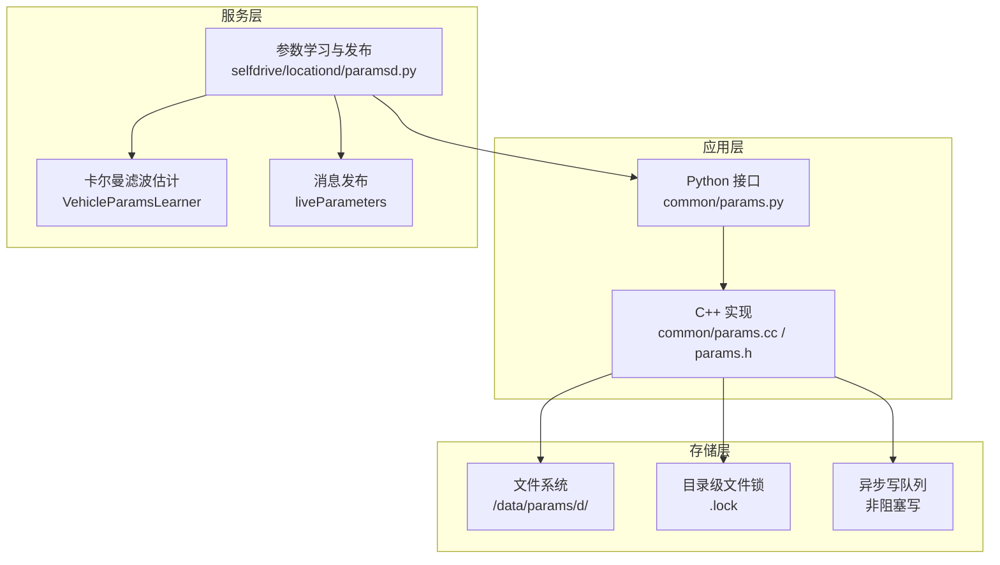
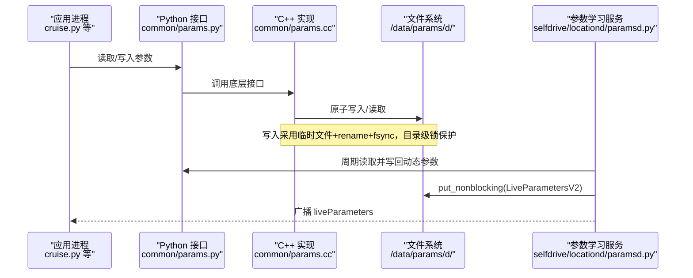
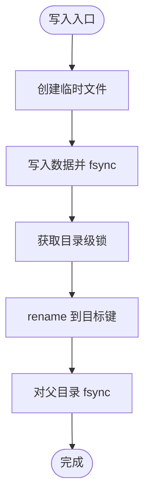
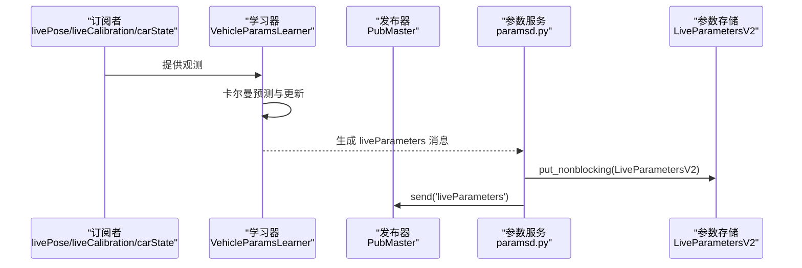
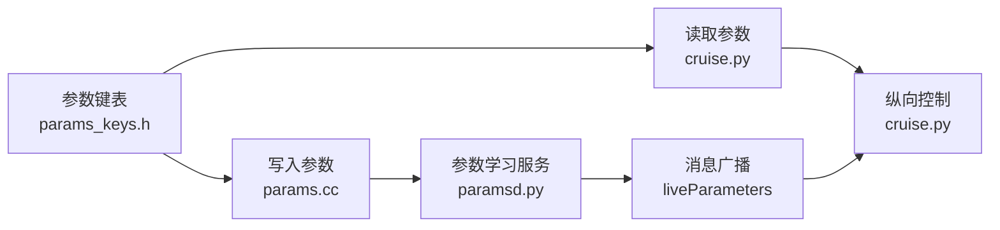

# 参数管理系统

<cite>
**本文引用的文件**
- [common/params.cc](file://common/params.cc)
- [common/params.h](file://common/params.h)
- [common/params.py](file://common/params.py)
- [common/params_keys.h](file://common/params_keys.h)
- [selfdrive/locationd/paramsd.py](file://selfdrive/locationd/paramsd.py)
- [tools/analyze_live_params.py](file://tools/analyze_live_params.py)
- [selfdrive/car/cruise.py](file://selfdrive/car/cruise.py)
- [docs/params_reference.md](file://docs/params_reference.md)
- [BYD_内切压线问题诊断报告.txt](file://BYD_内切压线问题诊断报告.txt)
- [test_button_injection_logic.py](file://test_button_injection_logic.py)
</cite>

## 目录
1. [简介](#简介)
2. [项目结构](#项目结构)
3. [核心组件](#核心组件)
4. [架构总览](#架构总览)
5. [详细组件分析](#详细组件分析)
6. [依赖关系分析](#依赖关系分析)
7. [性能考量](#性能考量)
8. [故障排查指南](#故障排查指南)
9. [结论](#结论)
10. [附录](#附录)

## 简介
本文件面向“参数管理系统”的算法与实现，聚焦以下目标：
- 参数更新机制与实时参数调整的实现细节
- 参数分类与存储结构（驾驶模式、跟车距离、制动等）
- 参数更新频率与缓存机制（参数计数器、刷新逻辑）
- 动态参数调整算法（范围限制、平滑处理、异常值过滤）
- 来自实际代码库的具体示例（读取、写入、验证）
- 配置项、参数与返回值说明
- 与其他组件的关系
- 常见问题与解决方案

## 项目结构
参数系统由三层组成：
- 存储层：基于文件系统的键值存储，支持原子写入、目录级锁与异步写队列
- 应用层：Python/C++接口封装，提供类型化读取、阻塞读取、批量清理等能力
- 服务层：参数学习与发布服务，周期性持久化动态参数，并对外广播

图表来源
- [common/params.cc:122-159](file://common/params.cc#L122-L159)
- [common/params.py:1-19](file://common/params.py#L1-19)
- [selfdrive/locationd/paramsd.py:267-316](file://selfdrive/locationd/paramsd.py#L267-L316)

章节来源
- [common/params.cc:122-159](file://common/params.cc#L122-L159)
- [common/params.py:1-19](file://common/params.py#L1-19)
- [selfdrive/locationd/paramsd.py:267-316](file://selfdrive/locationd/paramsd.py#L267-L316)

## 核心组件
- 参数键定义与分类：集中于键表，按生命周期与用途标记（持久化、随启动清空、开发专用等）
- 参数存储与访问：C++实现提供原子写入、阻塞读取、批量清理；Python接口用于命令行与工具脚本
- 动态参数学习与发布：基于传感器观测的在线估计，周期性写回并广播
- 参数使用方：纵向控制（巡航）、横向控制（扭矩参数）、导航与自动功能等

章节来源
- [common/params_keys.h:6-311](file://common/params_keys.h#L6-L311)
- [common/params.cc:122-159](file://common/params.cc#L122-L159)
- [selfdrive/locationd/paramsd.py:267-316](file://selfdrive/locationd/paramsd.py#L267-L316)

## 架构总览
参数系统采用“键值文件 + 原子写 + 异步队列 + 周期持久化”的组合架构，既保证可靠性，又兼顾实时性。

图表来源
- [common/params.cc:122-159](file://common/params.cc#L122-L159)
- [common/params.cc:219-234](file://common/params.cc#L219-L234)
- [selfdrive/locationd/paramsd.py:304-311](file://selfdrive/locationd/paramsd.py#L304-L311)

## 详细组件分析

### 组件A：参数键定义与分类
- 键表集中定义了所有参数键及其属性位（生命周期、日志策略、开发限制等）
- 示例键族：
  - 驾驶模式与个性：LongitudinalPersonality、LongitudinalPersonalityMax
  - 巡航与跟车：CruiseOnDist、StopDistanceCarrot、StoppingAccel、VEgoStopping、CruiseMaxVals*
  - 横向控制：LateralTorqueKpV、LateralTorqueKiV、LateralTorqueKd、LateralTorqueKf、LateralTorqueAccelFactor、LateralTorqueFriction、LateralTorqueCustom
  - 自动功能：AutoEngage、AutoCruiseControl、AutoTurnControl、AutoCurveSpeed*
  - 动态参数：LiveParameters、LiveParametersV2、LiveTorqueParameters
  - 导航与显示：NavSetting*、Mapbox*、Show*、CarName、EVTable 等

章节来源
- [common/params_keys.h:6-311](file://common/params_keys.h#L6-L311)
- [docs/params_reference.md:101-155](file://docs/params_reference.md#L101-L155)

### 组件B：参数存储与访问（C++）
- 原子写入流程
  - 创建临时文件，写入数据并 fsync
  - 获取目录级锁，rename 到目标键路径
  - 对父目录 fsync，确保落盘
- 阻塞读取
  - 支持 block=true 的轮询读取，直到文件存在或收到退出信号
- 清理策略
  - 按键类型批量删除，同时清理未在键表中的“孤儿”文件
- 非阻塞写队列
  - putNonBlocking 将写请求入队，按需启动异步线程批量消费
  - 队列消费时重复键保留最新值（注释提示未来可优化为去重）

图表来源
- [common/params.cc:122-159](file://common/params.cc#L122-L159)

章节来源
- [common/params.cc:122-159](file://common/params.cc#L122-L159)
- [common/params.cc:198-234](file://common/params.cc#L198-L234)

### 组件C：动态参数学习与发布（paramsd）
- 学习器（VehicleParamsLearner）
  - 基于卡尔曼滤波估计转向传动比、悬架刚度、横摆角等
  - 使用观测约束（如yaw rate、roll、角偏移）与先验范围，防止发散
  - 通过滞回判断（check_valid_with_hysteresis）稳定有效性判定
- 发布与持久化
  - 每帧根据观测更新消息体，每1200帧（约1分钟）将消息体写回参数存储
  - 同时通过消息总线广播 liveParameters
- 迁移与初始化
  - 旧版 LiveParameters 迁移到 LiveParametersV2
  - 从上一段行程的参数与 CarParams 初始化滤波器状态

图表来源
- [selfdrive/locationd/paramsd.py:267-316](file://selfdrive/locationd/paramsd.py#L267-L316)
- [selfdrive/locationd/paramsd.py:198-203](file://selfdrive/locationd/paramsd.py#L198-L203)

章节来源
- [selfdrive/locationd/paramsd.py:32-195](file://selfdrive/locationd/paramsd.py#L32-L195)
- [selfdrive/locationd/paramsd.py:206-264](file://selfdrive/locationd/paramsd.py#L206-L264)
- [selfdrive/locationd/paramsd.py:304-311](file://selfdrive/locationd/paramsd.py#L304-L311)

### 组件D：参数读取与使用（以纵向控制为例）
- 读取参数
  - 从参数存储读取整型/浮点/布尔等，进行单位换算与裁剪
  - 示例：CruiseOnDist（厘米→米）、SpeedFromPCM（选择速度来源）、CruiseSpeedUnit 等
- 参数更新频率
  - 在纵向控制循环中按帧更新参数，确保控制逻辑与用户设置一致
- 使用场景
  - 巡航设定、跟车距离阈值、停止检测阈值、速度表等

章节来源
- [selfdrive/car/cruise.py:260-281](file://selfdrive/car/cruise.py#L260-L281)
- [selfdrive/car/cruise.py:282-353](file://selfdrive/car/cruise.py#L282-L353)

### 组件E：参数分析与可视化（工具）
- 日志分析工具
  - 从 qlog/rlog 中提取 liveParameters 的 roll、angleOffset、stiffnessFactor 等统计
  - 输出均值、标准差、范围，辅助定位偏右/偏左与方向盘居中问题
- 报告与建议
  - 基于参数调整报告给出保守/激进/微调方案与步骤

章节来源
- [tools/analyze_live_params.py:15-95](file://tools/analyze_live_params.py#L15-L95)
- [BYD_内切压线问题诊断报告.txt:72-106](file://BYD_内切压线问题诊断报告.txt#L72-L106)

## 依赖关系分析
- 参数键表是全局契约，所有读写方均依赖该表进行键校验与分类
- paramsd 依赖 livePose/livCalibration/carState 等传感器与状态消息
- 纵向控制模块依赖参数存储中的驾驶模式、跟车与制动相关参数
- Python 接口为工具链提供统一的参数读写入口

图表来源
- [common/params_keys.h:6-311](file://common/params_keys.h#L6-L311)
- [selfdrive/car/cruise.py:260-281](file://selfdrive/car/cruise.py#L260-L281)
- [selfdrive/locationd/paramsd.py:267-316](file://selfdrive/locationd/paramsd.py#L267-L316)

章节来源
- [common/params_keys.h:6-311](file://common/params_keys.h#L6-L311)
- [selfdrive/car/cruise.py:260-281](file://selfdrive/car/cruise.py#L260-L281)
- [selfdrive/locationd/paramsd.py:267-316](file://selfdrive/locationd/paramsd.py#L267-L316)

## 性能考量
- 原子写入与目录 fsync：确保数据一致性，但会带来磁盘写放大
- 异步写队列：putNonBlocking 将高频写合并，降低锁竞争与系统调用开销
- 周期持久化：paramsd 每 1200 帧写一次，平衡实时性与持久化成本
- 阻塞读取：在关键路径上慎用 block=true，避免阻塞主循环
- 参数范围限制：在读取后进行裁剪与有效性检查，避免异常参数导致控制抖动

## 故障排查指南
- 参数读取失败
  - 检查键是否存在与拼写是否正确
  - 若使用阻塞读取，确认参数文件是否最终出现
- 参数写入不生效
  - 确认是否使用了 putNonBlocking，必要时等待异步线程完成
  - 检查目录级锁是否被占用（例如进程崩溃未释放）
- 动态参数不稳定
  - 观察 liveParameters 的 validity 字段与标准差
  - 使用 analyze_live_params.py 对多段日志进行统计分析
- 参数迁移问题
  - 旧版 LiveParameters 会自动迁移到 LiveParametersV2
  - 若迁移失败，清理旧键后重启服务

章节来源
- [common/params.cc:170-191](file://common/params.cc#L170-L191)
- [common/params.cc:219-234](file://common/params.cc#L219-L234)
- [selfdrive/locationd/paramsd.py:206-223](file://selfdrive/locationd/paramsd.py#L206-L223)
- [tools/analyze_live_params.py:15-95](file://tools/analyze_live_params.py#L15-L95)

## 结论
参数管理系统通过“键表契约 + 原子写 + 异步队列 + 周期持久化 + 在线学习”的组合，实现了高可靠、低耦合、可扩展的参数基础设施。它支撑了驾驶模式、跟车距离、制动、转向等关键控制参数的动态调整与实时生效，同时提供了分析工具与迁移机制，保障长期运行的稳定性与可维护性。

## 附录

### 参数分类与存储结构
- 驾驶模式参数
  - LongitudinalPersonality、LongitudinalPersonalityMax
  - 作用：控制纵向驾驶风格（激进/标准/放松等）
- 跟车距离参数
  - CruiseOnDist、StopDistanceCarrot、StoppingAccel、VEgoStopping、CruiseMaxVals*
  - 作用：决定巡航开启距离、停车距离、停止检测阈值与速度表
- 制动参数
  - ComfortBrake、StoppingAccel、VEgoStopping 等
  - 作用：影响制动舒适性与停止判定
- 横向控制参数
  - LateralTorqueKpV、LateralTorqueKiV、LateralTorqueKd、LateralTorqueKf、LateralTorqueAccelFactor、LateralTorqueFriction、LateralTorqueCustom
  - 作用：调节转向响应、稳态误差、阻尼与摩擦补偿
- 自动功能参数
  - AutoEngage、AutoCruiseControl、AutoTurnControl、AutoCurveSpeed* 等
  - 作用：控制自动功能的启用与行为
- 动态参数
  - LiveParameters、LiveParametersV2、LiveTorqueParameters
  - 作用：在线估计的车辆标定参数，周期性持久化并广播

章节来源
- [docs/params_reference.md:101-155](file://docs/params_reference.md#L101-L155)
- [common/params_keys.h:6-311](file://common/params_keys.h#L6-L311)

### 参数更新频率与缓存机制
- 更新频率
  - 纵向控制：按帧读取参数，确保与用户设置同步
  - 动态参数：paramsd 每 1200 帧写一次 LiveParametersV2
- 缓存机制
  - paramsd 使用内存参数存储（/dev/shm/params）缓存 LastGPSPosition 等高频字段
  - 异步写队列合并高频写操作，减少锁竞争

章节来源
- [selfdrive/car/cruise.py:282-353](file://selfdrive/car/cruise.py#L282-L353)
- [selfdrive/locationd/paramsd.py:304-311](file://selfdrive/locationd/paramsd.py#L304-L311)
- [selfdrive/locationd/paramsd.py:285-301](file://selfdrive/locationd/paramsd.py#L285-L301)

### 动态参数调整算法要点
- 范围限制
  - 估计值在合理范围内裁剪（如 steerRatio、stiffnessFactor、angleOffset）
- 平滑处理
  - 使用卡尔曼滤波协方差传播与观测噪声建模，抑制高频噪声
- 异常值过滤
  - 通过 validity 与滞回判断，避免传感器异常导致的参数漂移
- 参数计数器
  - paramsd 使用 sm.frame 计数实现周期性持久化（每 1200 帧）

章节来源
- [selfdrive/locationd/paramsd.py:198-203](file://selfdrive/locationd/paramsd.py#L198-L203)
- [selfdrive/locationd/paramsd.py:304-311](file://selfdrive/locationd/paramsd.py#L304-L311)

### 实际代码示例（路径）
- 参数读取与写入
  - 读取：[selfdrive/car/cruise.py:260-281](file://selfdrive/car/cruise.py#L260-L281)
  - 写入（非阻塞）：[common/params.cc:219-234](file://common/params.cc#L219-L234)
  - 原子写入：[common/params.cc:122-159](file://common/params.cc#L122-L159)
- 动态参数学习与发布
  - 学习器与有效性判定：[selfdrive/locationd/paramsd.py:32-195](file://selfdrive/locationd/paramsd.py#L32-L195)
  - 周期持久化与广播：[selfdrive/locationd/paramsd.py:304-311](file://selfdrive/locationd/paramsd.py#L304-L311)
- 参数分析工具
  - 日志统计与可视化：[tools/analyze_live_params.py:15-95](file://tools/analyze_live_params.py#L15-L95)

### 配置选项、参数与返回值
- 常用参数速查（节选）
  - 横向：LateralTorqueKpV、LateralTorqueKiV、LateralTorqueKd、LateralTorqueKf、LateralTorqueAccelFactor、LateralTorqueFriction、LateralTorqueCustom
  - 纵向：LongitudinalPersonality、LongitudinalPersonalityMax
  - 自动：AutoEngage、AutoCruiseControl、AutoTurnControl、AutoCurveSpeed*
  - 巡航：CruiseOnDist、StopDistanceCarrot、StoppingAccel、VEgoStopping、CruiseMaxVals*
- 返回值说明
  - get/get_int/get_float/get_bool：返回对应类型的值或空（不存在时）
  - put/put_nonblocking：返回写入结果码（成功/错误码）

章节来源
- [docs/params_reference.md:101-155](file://docs/params_reference.md#L101-L155)
- [docs/params_reference.md:350-365](file://docs/params_reference.md#L350-L365)

### 与其他组件的关系
- 与纵向控制（cruise.py）
  - 读取驾驶模式、跟车与制动参数，驱动速度设定与加减速策略
- 与动态参数服务（paramsd.py）
  - 估计并持久化 LiveParametersV2，同时广播给订阅者
- 与工具链（analyze_live_params.py）
  - 从日志提取动态参数统计，辅助问题定位与参数优化

章节来源
- [selfdrive/car/cruise.py:260-281](file://selfdrive/car/cruise.py#L260-L281)
- [selfdrive/locationd/paramsd.py:267-316](file://selfdrive/locationd/paramsd.py#L267-L316)
- [tools/analyze_live_params.py:15-95](file://tools/analyze_live_params.py#L15-L95)

### 常见问题与解决方案
- 参数调整建议（示例）
  - 保守调整：降低 LateralTorqueKpV/Kf，增加 LateralTorqueKd，下调 AutoCurveSpeedFactor
  - 激进调整：进一步降低增益与前馈，显著下调弯道速度
  - 微调优化：小幅降低增益与前馈，轻微增加阻尼
- 调整步骤
  - 备份当前参数设置
  - 逐项调整并验证效果
  - 使用 analyze_live_params.py 对多段日志进行统计分析

章节来源
- [BYD_内切压线问题诊断报告.txt:72-106](file://BYD_内切压线问题诊断报告.txt#L72-L106)
- [test_button_injection_logic.py:60-79](file://test_button_injection_logic.py#L60-L79)