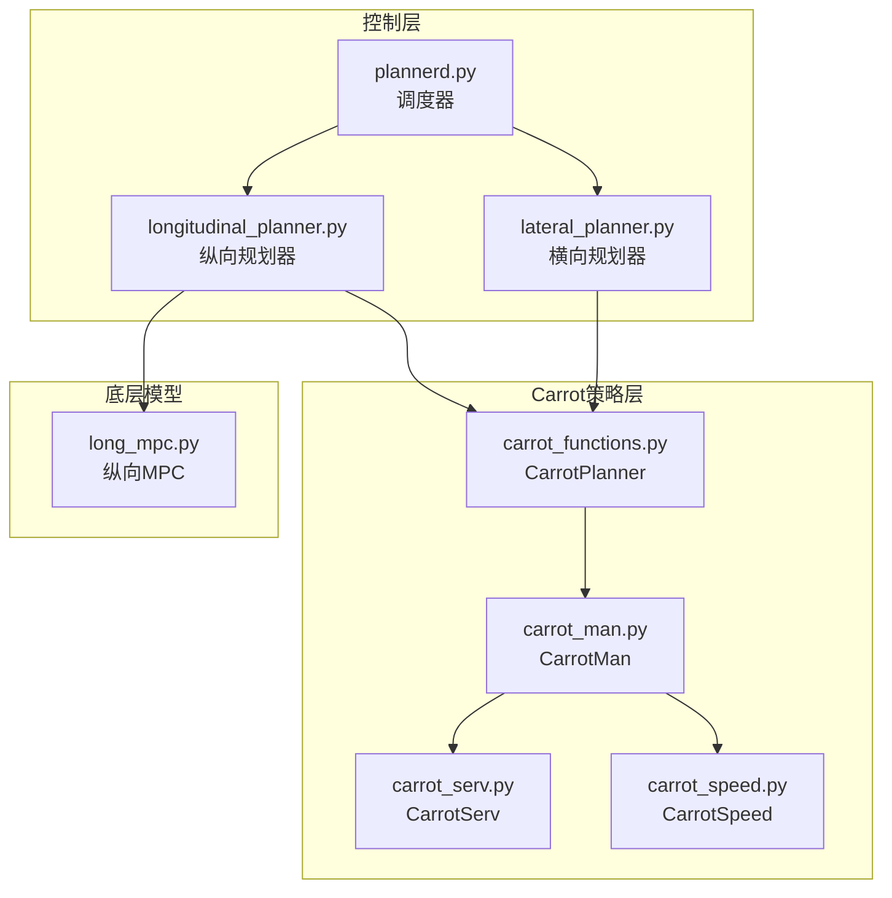
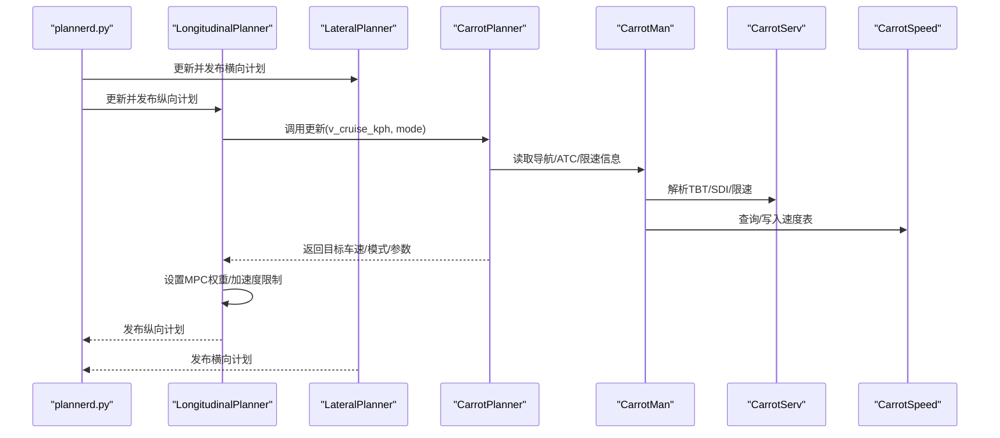
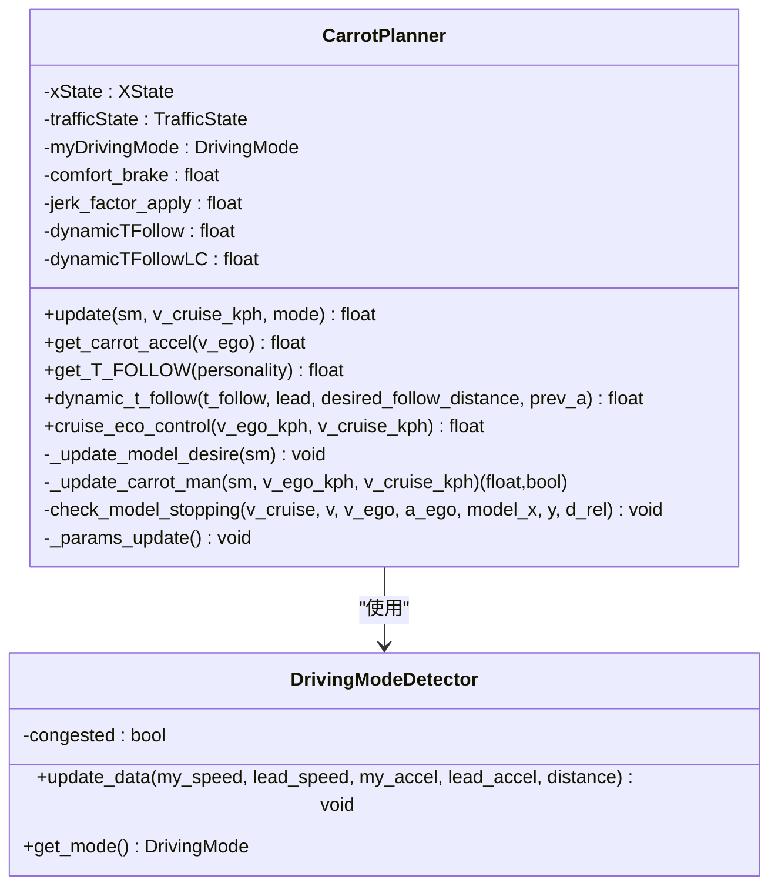
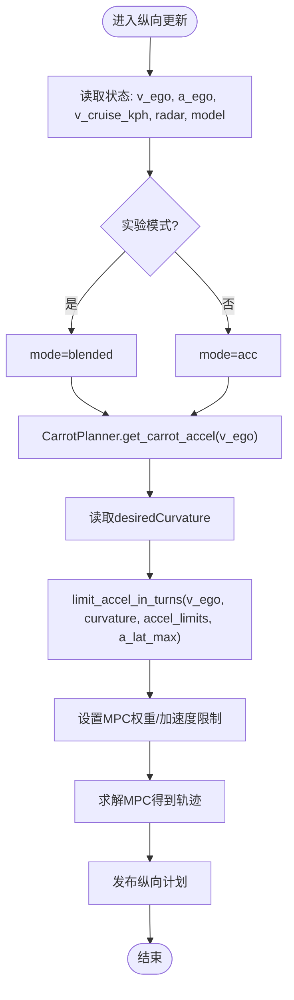
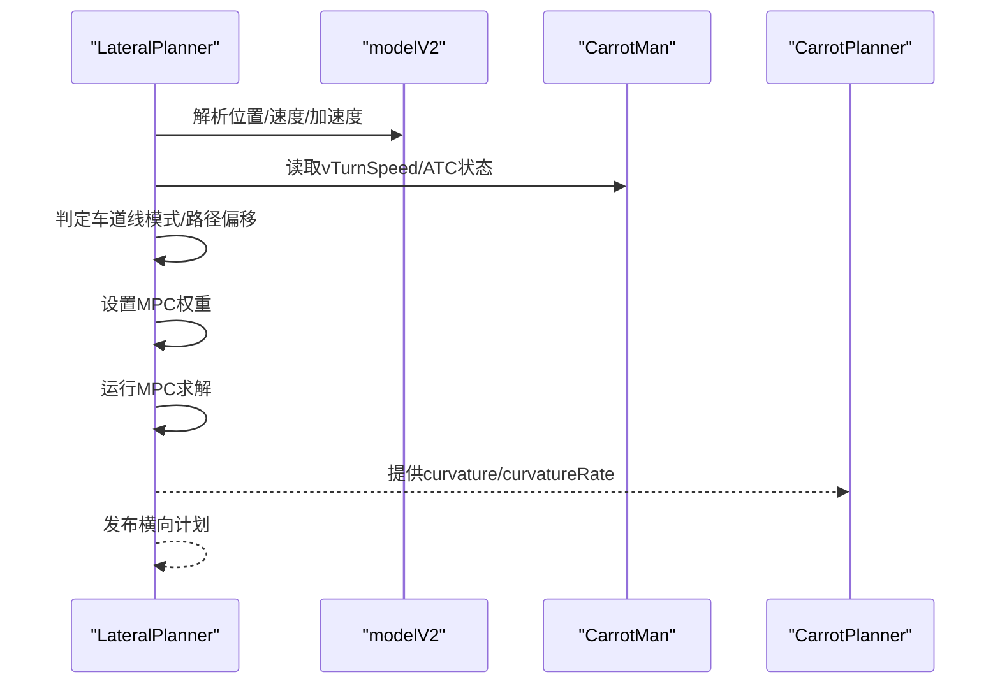
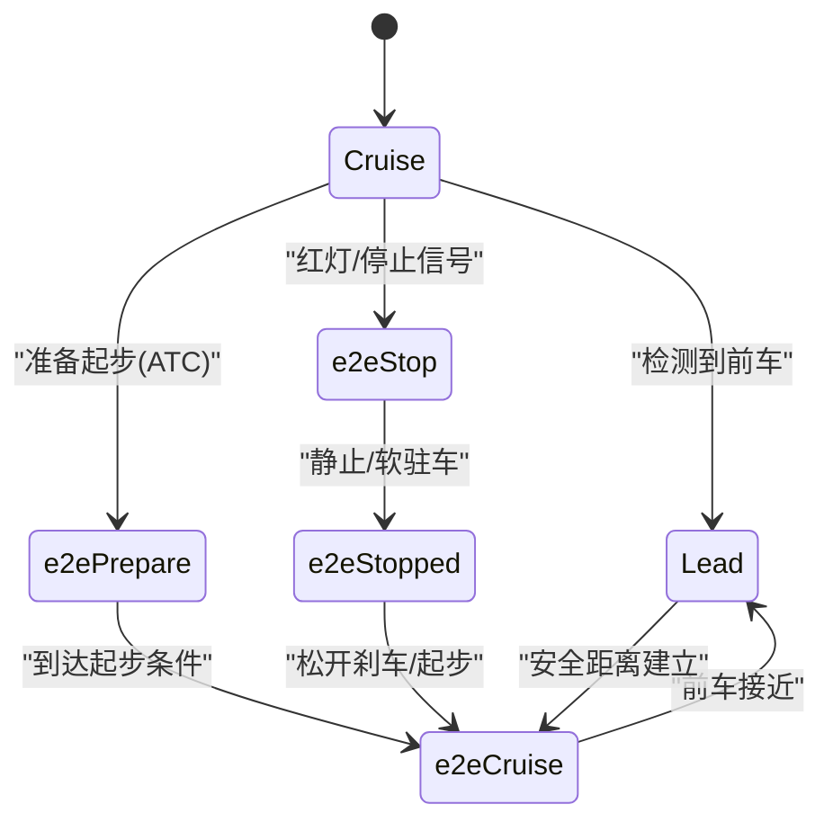
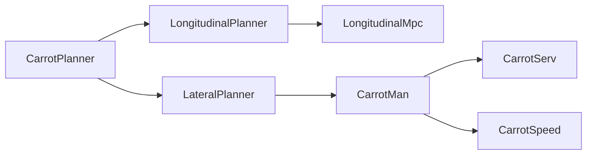

# 核心算法

<cite>
**本文引用的文件**
- [carrot_functions.py](file://selfdrive/carrot/carrot_functions.py)
- [carrot_man.py](file://selfdrive/carrot/carrot_man.py)
- [carrot_serv.py](file://selfdrive/carrot/carrot_serv.py)
- [carrot_speed.py](file://selfdrive/carrot/carrot_speed.py)
- [plannerd.py](file://selfdrive/controls/plannerd.py)
- [longitudinal_planner.py](file://selfdrive/controls/lib/longitudinal_planner.py)
- [lateral_planner.py](file://selfdrive/controls/lib/lateral_planner.py)
- [long_mpc.py](file://selfdrive/controls/lib/longitudinal_mpc_lib/long_mpc.py)
</cite>

## 目录
1. [简介](#简介)
2. [项目结构](#项目结构)
3. [核心组件](#核心组件)
4. [架构总览](#架构总览)
5. [详细组件分析](#详细组件分析)
6. [依赖关系分析](#依赖关系分析)
7. [性能考量](#性能考量)
8. [故障排查指南](#故障排查指南)
9. [结论](#结论)
10. [附录](#附录)

## 简介
本文件面向Carrot2-v9-ACC核心算法，聚焦CarrotPlanner类的实现与调用关系，系统阐述纵向控制（跟车距离、速度调节、ACC增强）、横向控制（车道保持辅助、转向控制策略）、状态机设计与驾驶模式切换，并结合真实代码路径给出参数、返回值与与其他组件的集成方式。文档兼顾初学者可读性与资深工程师的技术深度。

## 项目结构
Carrot2-v9-ACC将“规划器”分为纵向与横向两条主线：
- 纵向：由LongitudinalPlanner驱动，CarrotPlanner提供目标车速、跟车时间窗、舒适制动系数、驾驶模式因子等，参与约束权重与加速上限设定。
- 横向：由LateralPlanner负责轨迹与曲率生成，结合CarrotMan提供的导航指令、曲率限速、转向辅助等信息，输出期望曲率与曲率变化率。
- CarrotPlanner作为“策略中枢”，统一管理驾驶模式、交通信号识别、自适应跟车参数、ECO节能策略、ATC（自动转向控制）联动等。

图示来源
- [plannerd.py:13-44](file://selfdrive/controls/plannerd.py#L13-L44)
- [longitudinal_planner.py:132-283](file://selfdrive/controls/lib/longitudinal_planner.py#L132-L283)
- [lateral_planner.py:85-264](file://selfdrive/controls/lib/lateral_planner.py#L85-L264)
- [carrot_functions.py:49-521](file://selfdrive/carrot/carrot_functions.py#L49-L521)
- [carrot_man.py:204-476](file://selfdrive/carrot/carrot_man.py#L204-L476)
- [carrot_serv.py:83-237](file://selfdrive/carrot/carrot_serv.py#L83-L237)
- [carrot_speed.py:63-402](file://selfdrive/carrot/carrot_speed.py#L63-L402)
- [long_mpc.py:297-317](file://selfdrive/controls/lib/longitudinal_mpc_lib/long_mpc.py#L297-L317)

章节来源
- [plannerd.py:13-44](file://selfdrive/controls/plannerd.py#L13-L44)
- [longitudinal_planner.py:132-283](file://selfdrive/controls/lib/longitudinal_planner.py#L132-L283)
- [lateral_planner.py:85-264](file://selfdrive/controls/lib/lateral_planner.py#L85-L264)
- [carrot_functions.py:49-521](file://selfdrive/carrot/carrot_functions.py#L49-L521)
- [carrot_man.py:204-476](file://selfdrive/carrot/carrot_man.py#L204-L476)
- [carrot_serv.py:83-237](file://selfdrive/carrot/carrot_serv.py#L83-L237)
- [carrot_speed.py:63-402](file://selfdrive/carrot/carrot_speed.py#L63-L402)
- [long_mpc.py:297-317](file://selfdrive/controls/lib/longitudinal_mpc_lib/long_mpc.py#L297-L317)

## 核心组件
- CarrotPlanner：纵向策略中枢，负责驾驶模式检测、跟车时间窗动态调整、舒适制动系数、ECO节能控制、交通信号识别、软驻车与停止距离管理、ATC联动等。
- LongitudinalPlanner：纵向规划器，基于CarrotPlanner提供的目标车速与模式，设置MPC权重与加速度限制，计算纵向轨迹并输出加速度、速度与期望加加速度。
- LateralPlanner：横向规划器，基于模型预测与车道线/无车道线模式，生成期望轨迹、曲率与曲率变化率，支持ATC联动与路径偏移补偿。
- CarrotMan/CarrotServ/CarrotSpeed：导航与速度辅助子系统，提供TBT/SDI/限速信息、自动转向控制（ATC）目标速度、曲率限速、速度表查询与可视化等。

章节来源
- [carrot_functions.py:49-521](file://selfdrive/carrot/carrot_functions.py#L49-L521)
- [longitudinal_planner.py:132-283](file://selfdrive/controls/lib/longitudinal_planner.py#L132-L283)
- [lateral_planner.py:85-264](file://selfdrive/controls/lib/lateral_planner.py#L85-L264)
- [carrot_man.py:204-476](file://selfdrive/carrot/carrot_man.py#L204-L476)
- [carrot_serv.py:83-237](file://selfdrive/carrot/carrot_serv.py#L83-L237)
- [carrot_speed.py:63-402](file://selfdrive/carrot/carrot_speed.py#L63-L402)

## 架构总览
纵向与横向规划器通过plannerd统一调度，CarrotPlanner贯穿其中，作为策略输入与状态管理的核心节点。纵向MPC根据CarrotPlanner提供的模式与参数进行求解，横向MPC根据模型预测与CarrotMan提供的曲率限速进行求解。

图示来源
- [plannerd.py:30-44](file://selfdrive/controls/plannerd.py#L30-L44)
- [longitudinal_planner.py:132-283](file://selfdrive/controls/lib/longitudinal_planner.py#L132-L283)
- [lateral_planner.py:85-264](file://selfdrive/controls/lib/lateral_planner.py#L85-L264)
- [carrot_functions.py:346-521](file://selfdrive/carrot/carrot_functions.py#L346-L521)
- [carrot_man.py:342-476](file://selfdrive/carrot/carrot_man.py#L342-L476)
- [carrot_serv.py:201-237](file://selfdrive/carrot/carrot_serv.py#L201-L237)
- [carrot_speed.py:181-278](file://selfdrive/carrot/carrot_speed.py#L181-L278)

## 详细组件分析

### CarrotPlanner：纵向策略中枢
- 主要职责
  - 驾驶模式检测与切换：基于拥堵检测器与用户设置，自动或手动切换Eco/Safe/Normal/High模式，并应用对应安全系数。
  - 跟车策略：提供动态跟车时间窗（考虑前车加速度、相对距离、车道变更场景），并根据驾驶模式调整激进程度与急加加速度成本。
  - 交通信号识别：基于模型预测与视觉信号，识别红绿灯状态并触发起步/停车事件。
  - ECO节能控制：在满足速度差条件下，降低目标车速以提升燃油经济性。
  - 软驻车与停止距离管理：处理软驻车激活、用户自定义停止距离、实际停止距离衰减与虚拟停止距离。
  - ATC联动：读取CarrotMan提供的转向指令类型与距离，触发准备/执行阶段的速度限制。
- 关键接口与返回值
  - update(sm, v_cruise_kph, mode)：更新策略状态，返回经策略修正后的目标车速（km/h）。
  - get_carrot_accel(v_ego)：根据当前车速与驾驶模式，返回纵向最大加速度上限。
  - get_T_FOLLOW(personality)：根据驾驶个性返回基础跟车时间窗。
  - dynamic_t_follow(t_follow, lead, desired_follow_distance, prev_a)：在前车状态影响下动态调整跟车时间窗与急加加速度成本。
  - cruise_eco_control(v_ego_kph, v_cruise_kph)：ECO节能控制，返回修正后的目标车速。
  - _update_carrot_man(...)：整合CarrotMan提供的导航/ATC/限速信息，返回最终目标车速与ATC激活状态。
- 参数与配置
  - 通过Params读取：MyDrivingMode、MyDrivingModeAuto、TFollowGap1~4、DynamicTFollow、DynamicTFollowLC、CruiseMaxVals0~6、StopDistanceCarrot、JLeadFactor3、CruiseEcoControl、AutoNaviSpeedDecelRate、AChangeCostStarting、TrafficStopDistanceAdjust、TrafficLightDetectMode等。
- 状态机与模式切换
  - XState：cruise/lead/e2eCruise/e2eStop/e2ePrepare/e2eStopped，依据交通信号、前车状态、软驻车、ATC等条件在不同状态间切换。
  - TrafficState：off/red/green，用于控制起步/等待。
  - DrivingMode：Eco/Safe/Normal/High，影响舒适制动系数与最大加速度上限。

图示来源
- [carrot_functions.py:49-521](file://selfdrive/carrot/carrot_functions.py#L49-L521)
- [carrot_functions.py:524-542](file://selfdrive/carrot/carrot_functions.py#L524-L542)

章节来源
- [carrot_functions.py:49-521](file://selfdrive/carrot/carrot_functions.py#L49-L521)
- [carrot_functions.py:524-542](file://selfdrive/carrot/carrot_functions.py#L524-L542)

### 纵向控制算法：跟车距离、速度调节与ACC增强
- 跟车距离控制
  - 基础跟车时间窗：由get_T_FOLLOW(personality)根据驾驶个性返回，再通过dynamic_t_follow在前车加速度与相对距离影响下动态调整。
  - 软驻车与停止距离：当软驻车激活或存在用户自定义停止距离时，CarrotPlanner维护actual_stop_distance并在必要时引入fakeCruiseDistance以避免误加速。
- 速度调节
  - 目标车速：LongitudinalPlanner从CarrotPlanner获取v_cruise_kph并结合vCluRatio与PCM比例进行缩放。
  - 最大加速度：纵向MPC使用get_carrot_accel(v_ego)作为上限，并在转弯场景下根据desiredCurvature限制纵向加速度，避免侧翻风险。
- ACC增强机制
  - 急加加速度成本：根据prev_accel_constraint与jerk_factor_apply动态调整，降低频繁加加速度带来的不适。
  - 模式切换：当处于e2ePrepare时，LongitudinalPlanner强制使用blended模式，确保平滑过渡。
  - 模型抑制：当允许油门的概率较低时，纵向MPC会降低纵向加速度上限，避免误触发油门。

图示来源
- [longitudinal_planner.py:132-283](file://selfdrive/controls/lib/longitudinal_planner.py#L132-L283)
- [long_mpc.py:297-317](file://selfdrive/controls/lib/longitudinal_mpc_lib/long_mpc.py#L297-L317)
- [carrot_functions.py:186-198](file://selfdrive/carrot/carrot_functions.py#L186-L198)

章节来源
- [longitudinal_planner.py:132-283](file://selfdrive/controls/lib/longitudinal_planner.py#L132-L283)
- [long_mpc.py:297-317](file://selfdrive/controls/lib/longitudinal_mpc_lib/long_mpc.py#L297-L317)
- [carrot_functions.py:186-198](file://selfdrive/carrot/carrot_functions.py#L186-L198)

### 横向控制算法：车道保持辅助与转向控制策略
- 轨迹与曲率生成
  - LateralPlanner解析模型预测，生成路径点、航向角与角速度，并根据速度进行曲率归一化。
  - 支持车道线模式与无车道线模式，根据UseLaneLineSpeed阈值与模型状态切换。
- 转向控制策略
  - 车道保持：在车道线可用且速度达标时启用，路径偏移通过pathOffset补偿。
  - ATC联动：当CarrotMan提供ATC指令（如左/右转准备、直行等）时，LateralPlanner降低车道线权重，优先跟随导航指令。
  - MPC求解：设置路径、运动、加速度、加加速度与转向速率成本，求解期望曲率与曲率变化率。

图示来源
- [lateral_planner.py:85-264](file://selfdrive/controls/lib/lateral_planner.py#L85-L264)
- [carrot_man.py:342-476](file://selfdrive/carrot/carrot_man.py#L342-L476)

章节来源
- [lateral_planner.py:85-264](file://selfdrive/controls/lib/lateral_planner.py#L85-L264)
- [carrot_man.py:342-476](file://selfdrive/carrot/carrot_man.py#L342-L476)

### 状态机设计与驾驶模式切换
- XState状态机
  - cruise/lead/e2eCruise/e2eStop/e2ePrepare/e2eStopped：依据交通信号、前车状态、软驻车、ATC等条件在状态间切换。
  - 交通信号：当TrafficState变为green且非左转盲区、非强制红灯模式时，尝试起步；否则维持e2eStop并逐步衰减停止距离。
  - 前车：若检测到前车且距离过近，进入lead状态；否则回到e2eCruise。
  - 软驻车：gasPressed触发或接近停止距离时，进入e2eStopped；松开油门后恢复e2eCruise。
- DrivingMode自动切换
  - DrivingModeDetector根据前车距离、速度与加速度判断拥堵，Safe/Normal模式自动切换；用户也可通过MyDrivingMode手动指定。

图示来源
- [carrot_functions.py:420-498](file://selfdrive/carrot/carrot_functions.py#L420-L498)

章节来源
- [carrot_functions.py:420-498](file://selfdrive/carrot/carrot_functions.py#L420-L498)

## 依赖关系分析
- CarrotPlanner依赖Params读取配置，依赖Events上报事件，依赖MyMovingAverage滤波器处理信号。
- LongitudinalPlanner依赖CarrotPlanner提供的目标车速、模式与参数，依赖LongitudinalMpc进行轨迹求解。
- LateralPlanner依赖CarrotMan提供的导航指令与曲率限速，依赖LanePlanner与MPC求解横向轨迹。
- CarrotMan依赖CarrotServ解析导航/限速/信号，依赖CarrotSpeed进行速度表查询与可视化。

图示来源
- [carrot_functions.py:49-521](file://selfdrive/carrot/carrot_functions.py#L49-L521)
- [longitudinal_planner.py:132-283](file://selfdrive/controls/lib/longitudinal_planner.py#L132-L283)
- [lateral_planner.py:85-264](file://selfdrive/controls/lib/lateral_planner.py#L85-L264)
- [carrot_man.py:204-476](file://selfdrive/carrot/carrot_man.py#L204-L476)
- [carrot_serv.py:83-237](file://selfdrive/carrot/carrot_serv.py#L83-L237)
- [carrot_speed.py:63-402](file://selfdrive/carrot/carrot_speed.py#L63-L402)

章节来源
- [carrot_functions.py:49-521](file://selfdrive/carrot/carrot_functions.py#L49-L521)
- [longitudinal_planner.py:132-283](file://selfdrive/controls/lib/longitudinal_planner.py#L132-L283)
- [lateral_planner.py:85-264](file://selfdrive/controls/lib/lateral_planner.py#L85-L264)
- [carrot_man.py:204-476](file://selfdrive/carrot/carrot_man.py#L204-L476)
- [carrot_serv.py:83-237](file://selfdrive/carrot/carrot_serv.py#L83-L237)
- [carrot_speed.py:63-402](file://selfdrive/carrot/carrot_speed.py#L63-L402)

## 性能考量
- 实时性：plannerd以实时进程运行，LongitudinalPlanner/LateralPlanner均采用有限步长MPC，保证求解效率。
- 参数更新频率：CarrotPlanner每10帧读取一次Params，避免高频访问；部分参数按需更新，减少CPU开销。
- 滤波与平滑：使用移动平均滤波器处理停止距离与速度，降低噪声影响。
- 模型抑制：当允许油门概率低时，纵向MPC降低纵向加速度上限，避免误触发。

## 故障排查指南
- 纵向计划无效
  - 检查LongitudinalMpc求解状态与NaN标志，确认是否因模型异常导致重置。
  - 关注allowThrottle与forceSlowDecel标志，确认是否被外部逻辑限制。
- 横向计划无效
  - 检查LateralMpc求解状态与cost阈值，确认是否因路径/曲率异常导致失效。
  - 关注useLaneLineMode切换与CarrotMan提供的vTurnSpeed，确认ATC是否正确触发。
- 交通信号识别异常
  - 检查CarrotPlanner中的trafficState更新逻辑，确认模型预测与转向角度是否影响判定。
- 参数未生效
  - 确认Params键名与读取频率，例如TFollowGap系列、CruiseMaxVals系列、TrafficStopDistanceAdjust等。

章节来源
- [longitudinal_planner.py:213-217](file://selfdrive/controls/lib/longitudinal_planner.py#L213-L217)
- [lateral_planner.py:180-194](file://selfdrive/controls/lib/lateral_planner.py#L180-L194)
- [carrot_functions.py:414-427](file://selfdrive/carrot/carrot_functions.py#L414-L427)

## 结论
CarrotPlanner作为Carrot2-v9-ACC的核心策略模块，将驾驶模式、交通信号、导航指令与车辆动力学有机结合，通过纵向MPC与横向MPC实现平滑、安全、舒适的自动驾驶体验。其参数化设计与状态机切换机制为不同场景提供了灵活适配能力，适合进一步扩展至更复杂的交通与道路环境。

## 附录
- 关键参数清单（部分）
  - MyDrivingMode / MyDrivingModeAuto：驾驶模式与自动切换
  - TFollowGap1~4 / DynamicTFollow / DynamicTFollowLC：跟车时间窗与动态调整
  - CruiseMaxVals0~6：不同车速下的最大加速度上限
  - StopDistanceCarrot / TrafficStopDistanceAdjust：停止距离与调整
  - JLeadFactor3 / AChangeCostStarting：前车加速度影响与急加加速度成本
  - AutoNaviSpeedDecelRate / AutoNaviSpeedCtrlMode：导航限速控制参数
  - TrafficLightDetectMode：交通信号检测模式
- 返回值与字段
  - LongitudinalPlan：包含速度/加速度/加加速度轨迹、是否允许油门/刹车、事件列表、xState、trafficState、myDrivingMode等。
  - LateralPlan：包含路径点、曲率、曲率变化率、是否使用车道线等。

章节来源
- [longitudinal_planner.py:250-283](file://selfdrive/controls/lib/longitudinal_planner.py#L250-L283)
- [lateral_planner.py:197-264](file://selfdrive/controls/lib/lateral_planner.py#L197-L264)
- [carrot_functions.py:143-184](file://selfdrive/carrot/carrot_functions.py#L143-L184)