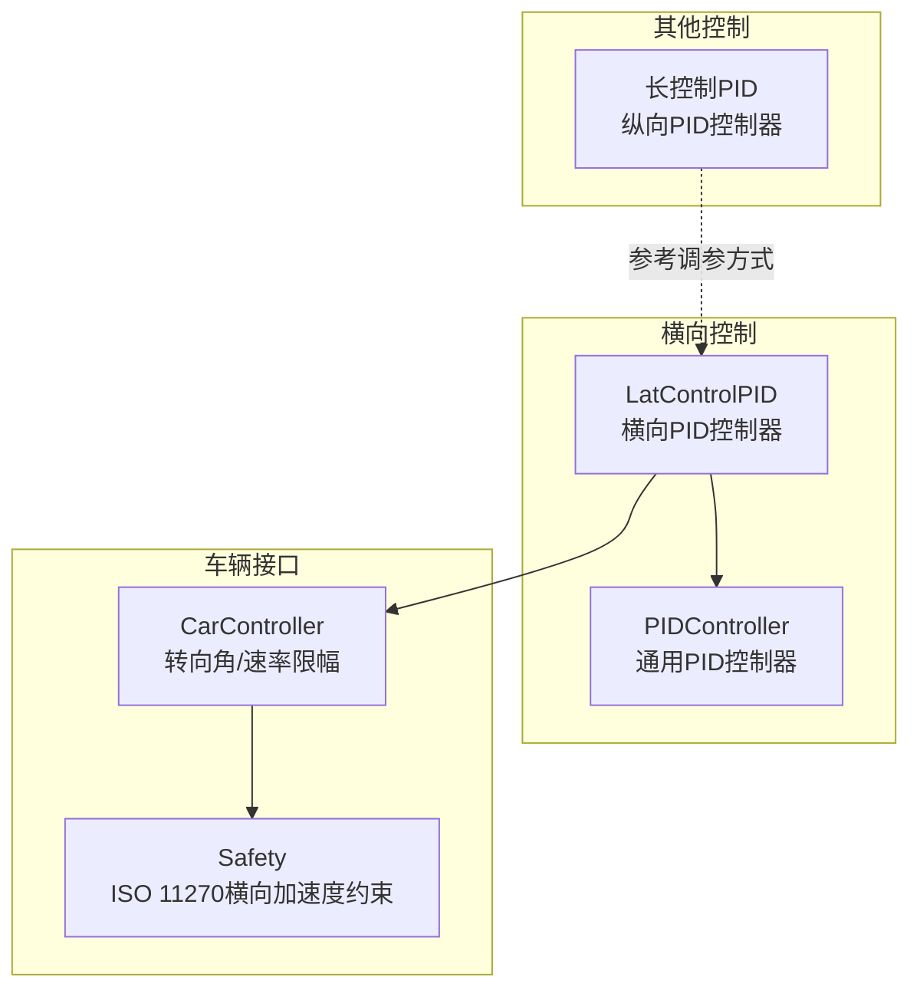
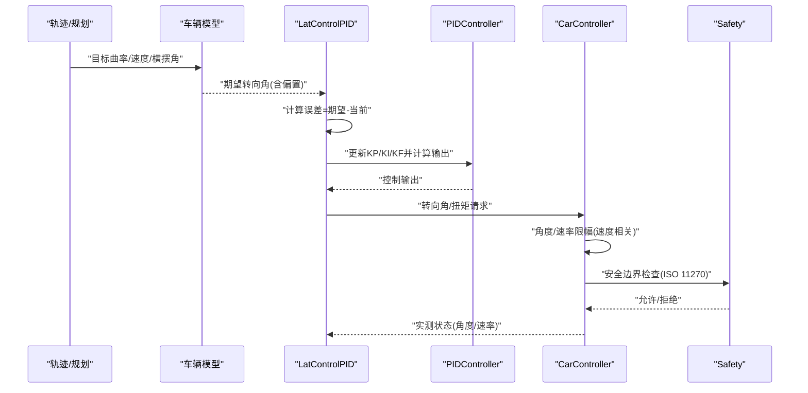
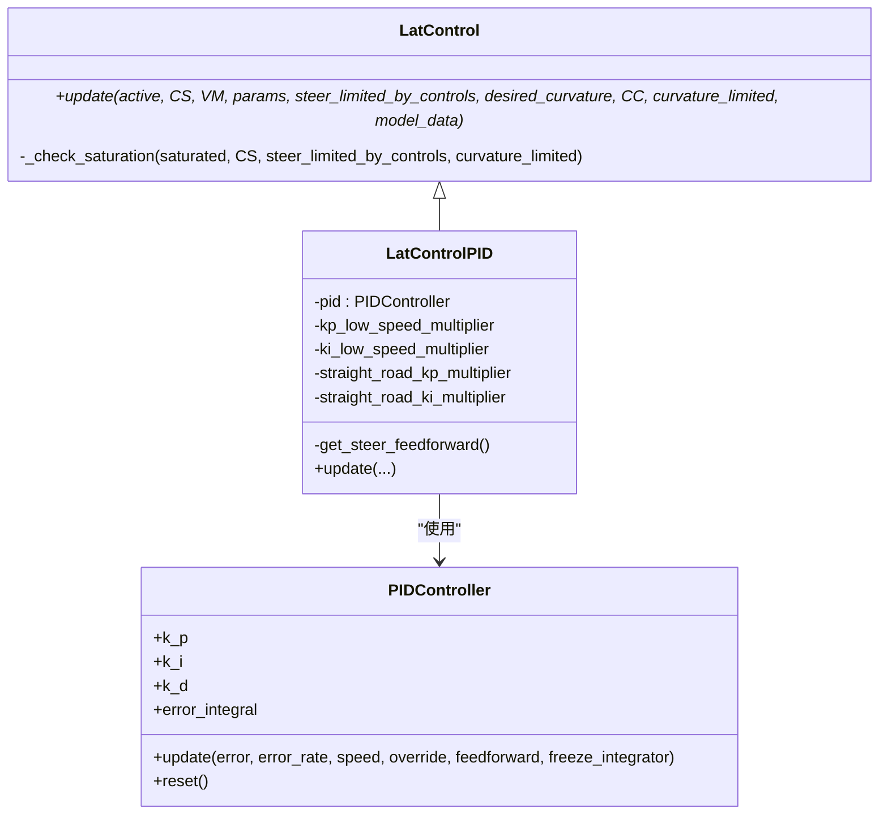
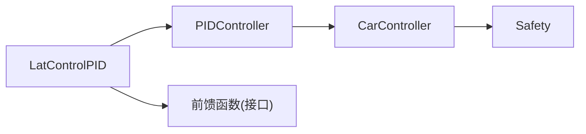

# PID控制策略

<cite>
**本文引用的文件**
- [latcontrol_pid.py](file://selfdrive/controls/lib/latcontrol_pid.py)
- [pid.py](file://common/pid.py)
- [latcontrol.py](file://selfdrive/controls/lib/latcontrol.py)
- [carcontroller.py（现代）](file://opendbc_repo/opendbc/car/hyundai/carcontroller.py)
- [carcontroller.py（BYD）](file://opendbc_repo/opendbc/car/byd.bak/carcontroller.py)
- [接口.py](file://opendbc_repo/opendbc/car/interfaces.py)
- [安全.h](file://opendbc_repo/opendbc/safety/safety.h)
- [长控制.py](file://selfdrive/controls/lib/longcontrol.py)
- [经度PID调参示例](file://selfdrive/controls/lib/latcontrol_torque.py)
</cite>

## 目录
1. [简介](#简介)
2. [项目结构](#项目结构)
3. [核心组件](#核心组件)
4. [架构总览](#架构总览)
5. [详细组件分析](#详细组件分析)
6. [依赖关系分析](#依赖关系分析)
7. [性能考量](#性能考量)
8. [故障排查指南](#故障排查指南)
9. [结论](#结论)
10. [附录](#附录)

## 简介
本文件面向横向控制中的PID控制策略，系统化阐述其数学原理、实现细节与工程实践。重点覆盖：
- 比例、积分、微分三环作用机制与防积分饱和策略
- 参数调优流程（KP、KI、KD），含速度相关的增益调度（低速/直线稳定）
- 微分先行思路与前馈增益KF的应用
- 转向角与转向率约束（最大转向角、转向角速率限制）
- 实时参数调整与性能优化示例
- 配置项、参数与返回值说明
- 与其他组件的集成关系与常见问题处理

## 项目结构
横向PID控制位于“selfdrive/controls/lib”目录下，核心类为横向控制器，底层PID控制器封装于“common/pid.py”。车辆侧对转向角与速率进行限幅与安全校验，位于“opendbc_repo/opendbc/car”系列文件中。

图示来源
- [latcontrol_pid.py:1-83](file://selfdrive/controls/lib/latcontrol_pid.py#L1-L83)
- [pid.py:1-71](file://common/pid.py#L1-L71)
- [carcontroller.py（现代）:199-225](file://opendbc_repo/opendbc/car/hyundai/carcontroller.py#L199-L225)
- [carcontroller.py（BYD）:187-219](file://opendbc_repo/opendbc/car/byd.bak/carcontroller.py#L187-L219)
- [安全.h:782-827](file://opendbc_repo/opendbc/safety/safety.h#L782-L827)
- [长控制.py:73-99](file://selfdrive/controls/lib/longcontrol.py#L73-L99)

章节来源
- [latcontrol_pid.py:1-83](file://selfdrive/controls/lib/latcontrol_pid.py#L1-L83)
- [pid.py:1-71](file://common/pid.py#L1-L71)

## 核心组件
- LatControlPID：横向PID控制器，负责计算期望转向角与误差，并通过PID生成输出扭矩/角度指令；内置速度与直线路段的增益自适应。
- PIDController：通用PID控制器，支持前馈（KF）、积分抗饱和裁剪、速度相关增益插值。
- 车辆接口限幅：对转向角与转向角速率进行实时限幅，结合速度曲线与方向变化进行“回正/解阻尼”处理。
- 安全约束：基于ISO 11270横向加速度限制，对曲率/角度进行边界约束。

章节来源
- [latcontrol_pid.py:8-83](file://selfdrive/controls/lib/latcontrol_pid.py#L8-L83)
- [pid.py:4-71](file://common/pid.py#L4-L71)
- [carcontroller.py（现代）:199-225](file://opendbc_repo/opendbc/car/hyundai/carcontroller.py#L199-L225)
- [carcontroller.py（BYD）:187-219](file://opendbc_repo/opendbc/car/byd.bak/carcontroller.py#L187-L219)
- [安全.h:782-827](file://opendbc_repo/opendbc/safety/safety.h#L782-L827)

## 架构总览
横向控制主流程：期望曲率→期望转向角→误差→PID→输出→转向角/扭矩限幅→安全校验→执行器。

图示来源
- [latcontrol_pid.py:31-83](file://selfdrive/controls/lib/latcontrol_pid.py#L31-L83)
- [pid.py:49-71](file://common/pid.py#L49-L71)
- [carcontroller.py（现代）:199-225](file://opendbc_repo/opendbc/car/hyundai/carcontroller.py#L199-L225)
- [安全.h:782-827](file://opendbc_repo/opendbc/safety/safety.h#L782-L827)

## 详细组件分析

### 数学原理与实现要点
- 比例（P）：与瞬时误差成正比，提供快速响应；在低速/直路场景适度降增益以抑制振荡。
- 积分（I）：累积误差消除静差；采用“积分裁剪”防止越界，同时在刹车/驾驶员干预时进行“解绑”。
- 微分（D）：抑制高频噪声与震荡；本实现未显式使用微分项，但保留接口。
- 前馈（KF）：基于期望转向角与车速的前馈补偿，提升稳态精度与抗扰能力。

章节来源
- [pid.py:49-71](file://common/pid.py#L49-L71)

### 速度相关的增益调度
- 低速场景：对KP、KI进行小幅衰减，降低低速振荡风险。
- 直线路段：进一步降低KP、KI，提升直行稳定性。
- 速度相关插值：根据当前车速对KP/KI进行插值，保证非线性工况下的平滑过渡。

章节来源
- [latcontrol_pid.py:17-26](file://selfdrive/controls/lib/latcontrol_pid.py#L17-L26)
- [latcontrol_pid.py:50-71](file://selfdrive/controls/lib/latcontrol_pid.py#L50-L71)

### 防积分饱和与解绑
- 积分裁剪：在不使用积分的情况下先求出P+D+F的控制量，再将积分裁剪到允许范围内，避免越限。
- 解绑（Override）：当检测到驾驶员干预或刹车时，按一定速率反向削减积分，快速释放累积误差。

章节来源
- [pid.py:56-66](file://common/pid.py#L56-L66)

### 微分先行策略
- 本实现未显式使用微分项，但保留了误差导数接口；若启用微分，应确保误差导数的滤波与限幅，避免噪声放大。

章节来源
- [pid.py:52-54](file://common/pid.py#L52-L54)

### 转向角与速率限制
- 最大转向角：由车辆参数限幅，最终输出被裁剪至[-最大角, +最大角]。
- 转向角速率限制：随车速插值，低速更严格；同向/反向切换时可引入“回正/解阻尼”系数，避免突变。
- BYD示例：存在动态速率限制变量与回正逻辑，结合转向比率乘数与角度偏置进行综合处理。

章节来源
- [carcontroller.py（现代）:199-225](file://opendbc_repo/opendbc/car/hyundai/carcontroller.py#L199-L225)
- [carcontroller.py（BYD）:187-219](file://opendbc_repo/opendbc/car/byd.bak/carcontroller.py#L187-L219)

### 安全约束（ISO 11270横向加速度）
- 对给定的曲率/角度进行边界约束，考虑最小/最大速度与道路坡度等影响，防止横向加速度越界。

章节来源
- [安全.h:782-827](file://opendbc_repo/opendbc/safety/safety.h#L782-L827)

### 实时参数调整与性能优化
- 纵向PID参数动态读取与更新：通过参数服务周期性读取并写入PID参数，体现“在线调参”的思路。
- 横向扭矩模式参数动态更新：通过参数服务切换自定义扭矩模式，实时更新KP/KI/KF/KD。

章节来源
- [长控制.py:73-99](file://selfdrive/controls/lib/longcontrol.py#L73-L99)
- [经度PID调参示例:145-165](file://selfdrive/controls/lib/latcontrol_torque.py#L145-L165)

### 类关系与数据流

图示来源
- [latcontrol.py:9-34](file://selfdrive/controls/lib/latcontrol.py#L9-L34)
- [latcontrol_pid.py:8-83](file://selfdrive/controls/lib/latcontrol_pid.py#L8-L83)
- [pid.py:4-71](file://common/pid.py#L4-L71)

## 依赖关系分析
- LatControlPID依赖通用PID控制器与车辆模型接口，输出供CarController与Safety使用。
- CarController对输出进行角度/速率限幅与回正处理，Safety进行ISO 11270横向加速度约束。
- 接口层提供默认前馈函数，便于不同平台统一处理。

图示来源
- [latcontrol_pid.py:4-15](file://selfdrive/controls/lib/latcontrol_pid.py#L4-L15)
- [接口.py:475-481](file://opendbc_repo/opendbc/car/interfaces.py#L475-L481)
- [carcontroller.py（现代）:199-225](file://opendbc_repo/opendbc/car/hyundai/carcontroller.py#L199-L225)
- [安全.h:782-827](file://opendbc_repo/opendbc/safety/safety.h#L782-L827)

章节来源
- [latcontrol_pid.py:1-83](file://selfdrive/controls/lib/latcontrol_pid.py#L1-L83)
- [接口.py:475-481](file://opendbc_repo/opendbc/car/interfaces.py#L475-L481)

## 性能考量
- 低速稳定性：通过降低KP/KI与直路衰减，显著减少低速振荡与余差。
- 速度相关插值：保证在宽速度范围内的平滑响应。
- 积分裁剪与解绑：避免积分饱和引发的超调与恢复缓慢。
- 角速率限幅：结合速度曲线与方向变化，提升人机协同与舒适性。
- 安全边界：在极限工况下仍满足ISO 11270横向加速度约束。

## 故障排查指南
- 症状：低速振荡/余差大
  - 排查：确认低速衰减与直路衰减是否生效；适当降低KP/KI；检查前馈是否合理。
  - 参考：[latcontrol_pid.py:17-26](file://selfdrive/controls/lib/latcontrol_pid.py#L17-L26), [latcontrol_pid.py:58-67](file://selfdrive/controls/lib/latcontrol_pid.py#L58-L67)
- 症状：急弯/高速时响应迟滞
  - 排查：检查KF前馈增益；评估速度相关插值是否过保守；确认CarController速率限幅是否过严。
  - 参考：[latcontrol_pid.py:48-74](file://selfdrive/controls/lib/latcontrol_pid.py#L48-L74), [carcontroller.py（现代）:199-225](file://opendbc_repo/opendbc/car/hyundai/carcontroller.py#L199-L225)
- 症状：刹车/驾驶员干预后积分不释放
  - 排查：确认override路径是否触发；检查i_unwind_rate设置。
  - 参考：[pid.py:56-58](file://common/pid.py#L56-L58)
- 症状：转向角/速率越界
  - 排查：核对最大角与速率限幅表；检查回正/解阻尼系数；确认Safety边界。
  - 参考：[carcontroller.py（BYD）:187-219](file://opendbc_repo/opendbc/car/byd.bak/carcontroller.py#L187-L219), [安全.h:782-827](file://opendbc_repo/opendbc/safety/safety.h#L782-L827)

章节来源
- [latcontrol_pid.py:17-26](file://selfdrive/controls/lib/latcontrol_pid.py#L17-L26)
- [latcontrol_pid.py:48-74](file://selfdrive/controls/lib/latcontrol_pid.py#L48-L74)
- [pid.py:56-58](file://common/pid.py#L56-L58)
- [carcontroller.py（现代）:199-225](file://opendbc_repo/opendbc/car/hyundai/carcontroller.py#L199-L225)
- [carcontroller.py（BYD）:187-219](file://opendbc_repo/opendbc/car/byd.bak/carcontroller.py#L187-L219)
- [安全.h:782-827](file://opendbc_repo/opendbc/safety/safety.h#L782-L827)

## 结论
该横向PID控制策略通过速度与几何自适应、前馈补偿与积分裁剪/解绑，实现了低速稳定、高速敏捷且满足安全约束的综合性能。结合CarController的转向角/速率限幅与Safety的ISO 11270边界，形成闭环可靠控制链路。建议在不同车型与场景下持续迭代KP/KI/KF与限幅曲线，以获得最佳体验与安全性平衡。

## 附录

### 参数与配置项说明
- 横向PID参数（来自车辆配置）
  - KP分段：[BP, KV]，按速度插值得到当前KP
  - KI分段：[BP, KV]，按速度插值得到当前KI
  - KF前馈：与期望转向角和车速相关的前馈增益
  - KD微分：当前未使用，保留接口
- 速度相关增益
  - 低速倍率：在低于阈值速度时对KP/KI进行衰减
  - 直路倍率：在接近直路时对KP/KI进行衰减
- 转向角/速率限幅
  - 最大转向角：由车辆参数决定
  - 速率限幅：随车速插值，支持同向/反向回正系数
- 安全约束
  - ISO 11270横向加速度上限，结合速度与坡度修正

章节来源
- [latcontrol_pid.py:12-14](file://selfdrive/controls/lib/latcontrol_pid.py#L12-L14)
- [latcontrol_pid.py:17-26](file://selfdrive/controls/lib/latcontrol_pid.py#L17-L26)
- [carcontroller.py（现代）:199-225](file://opendbc_repo/opendbc/car/hyundai/carcontroller.py#L199-L225)
- [carcontroller.py（BYD）:187-219](file://opendbc_repo/opendbc/car/byd.bak/carcontroller.py#L187-L219)
- [安全.h:782-827](file://opendbc_repo/opendbc/safety/safety.h#L782-L827)

### 返回值与日志字段
- 输出：期望转向角或等效控制输出
- 日志（LateralPIDState）
  - steeringAngleDeg：当前转向角
  - steeringRateDeg：当前转向角速率
  - steeringAngleDesiredDeg：期望转向角
  - angleError：误差
  - p/i/f：P/I/F三环分量
  - output：最终输出
  - saturated：是否饱和（受控于内部饱和计数与限幅）

章节来源
- [latcontrol_pid.py:31-83](file://selfdrive/controls/lib/latcontrol_pid.py#L31-L83)