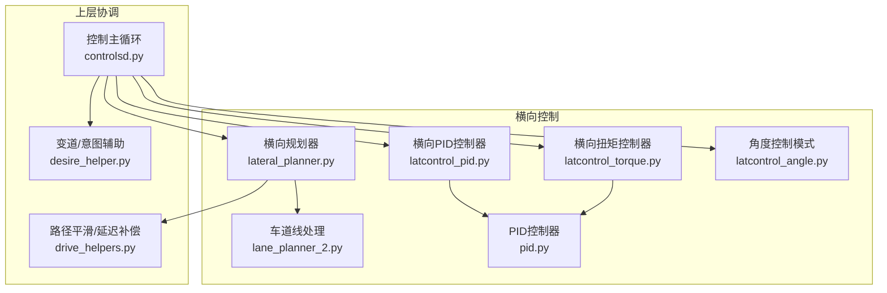
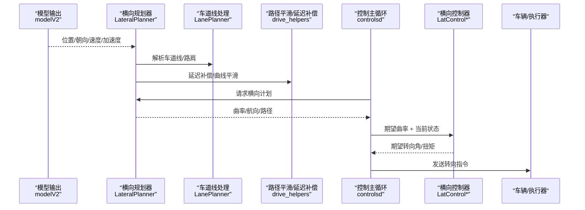
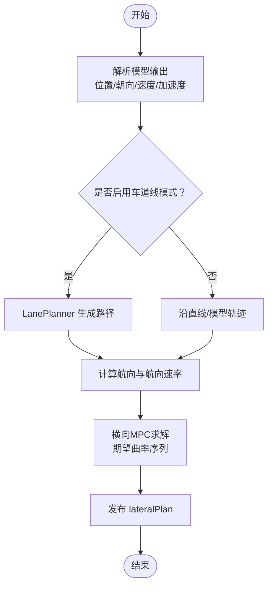
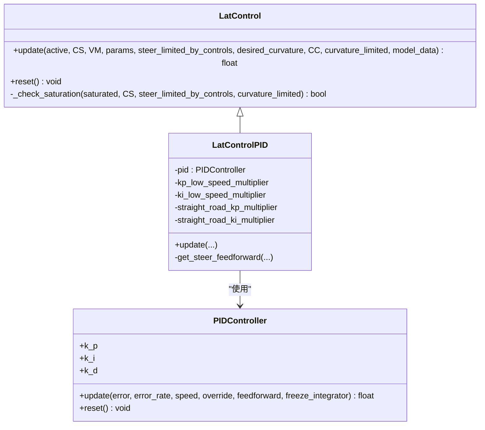
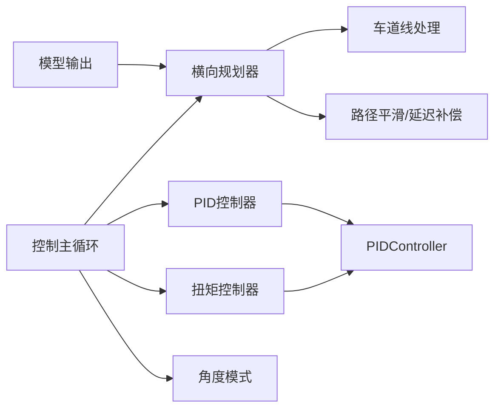

# 横向控制算法

<cite>
**本文引用的文件**
- [latcontrol_pid.py](file://selfdrive/controls/lib/latcontrol_pid.py)
- [latcontrol_torque.py](file://selfdrive/controls/lib/latcontrol_torque.py)
- [latcontrol_angle.py](file://selfdrive/controls/lib/latcontrol_angle.py)
- [latcontrol.py](file://selfdrive/controls/lib/latcontrol.py)
- [lateral_planner.py](file://selfdrive/controls/lib/lateral_planner.py)
- [lane_planner_2.py](file://selfdrive/controls/lib/lane_planner_2.py)
- [pid.py](file://common/pid.py)
- [controlsd.py](file://selfdrive/controls/controlsd.py)
- [drive_helpers.py](file://selfdrive/controls/lib/drive_helpers.py)
- [desire_helper.py](file://selfdrive/controls/lib/desire_helper.py)
</cite>

## 目录
1. [引言](#引言)
2. [项目结构](#项目结构)
3. [核心组件](#核心组件)
4. [架构总览](#架构总览)
5. [详细组件分析](#详细组件分析)
6. [依赖关系分析](#依赖关系分析)
7. [性能考量](#性能考量)
8. [故障排查指南](#故障排查指南)
9. [结论](#结论)
10. [附录：参数与配置](#附录参数与配置)

## 引言
本文件面向横向控制算法的技术与工程实现，聚焦于车道保持辅助与转向控制策略，系统性阐述横向规划器（车道线检测、轨迹规划、曲率/航向计算）、PID 控制器在横向控制中的应用（比例/积分/微分参数的调优与作用）、以及车道变更处理逻辑（变道请求检测、安全距离计算、变道执行策略）。文档同时提供来自实际代码库的示例路径，说明横向控制参数的实时调整与反馈机制，并记录关键配置项、参数与返回值，最后解释横向控制与其他系统组件的关系及常见问题的解决方案。

## 项目结构
横向控制相关代码主要分布在以下模块：
- 横向规划器：负责基于模型预测与车道线信息生成期望轨迹与曲率，输出给纵向控制器与横向控制器。
- 横向控制器：根据期望曲率与当前状态，通过不同控制策略（PID/扭矩/角度）生成转向指令。
- PID 控制器：通用的 PID 实现，支持速度相关增益插值与前馈。
- 车道线与路径处理：对模型输出的车道线/路肩进行融合、滤波与补偿，生成横向路径。
- 控制主循环：协调横向规划与控制，平滑曲线输入并限制曲率变化。

图示来源
- [lateral_planner.py:34-178](file://selfdrive/controls/lib/lateral_planner.py#L34-L178)
- [lane_planner_2.py:105-388](file://selfdrive/controls/lib/lane_planner_2.py#L105-L388)
- [latcontrol_pid.py:8-83](file://selfdrive/controls/lib/latcontrol_pid.py#L8-L83)
- [latcontrol_torque.py:73-335](file://selfdrive/controls/lib/latcontrol_torque.py#L73-L335)
- [latcontrol_angle.py:10-30](file://selfdrive/controls/lib/latcontrol_angle.py#L10-L30)
- [pid.py:4-71](file://common/pid.py#L4-L71)
- [controlsd.py:86-192](file://selfdrive/controls/controlsd.py#L86-L192)
- [drive_helpers.py:36-61](file://selfdrive/controls/lib/drive_helpers.py#L36-L61)
- [desire_helper.py:49-636](file://selfdrive/controls/lib/desire_helper.py#L49-L636)

章节来源
- [lateral_planner.py:34-178](file://selfdrive/controls/lib/lateral_planner.py#L34-L178)
- [lane_planner_2.py:105-388](file://selfdrive/controls/lib/lane_planner_2.py#L105-L388)
- [latcontrol_pid.py:8-83](file://selfdrive/controls/lib/latcontrol_pid.py#L8-L83)
- [latcontrol_torque.py:73-335](file://selfdrive/controls/lib/latcontrol_torque.py#L73-L335)
- [latcontrol_angle.py:10-30](file://selfdrive/controls/lib/latcontrol_angle.py#L10-L30)
- [pid.py:4-71](file://common/pid.py#L4-L71)
- [controlsd.py:86-192](file://selfdrive/controls/controlsd.py#L86-L192)
- [drive_helpers.py:36-61](file://selfdrive/controls/lib/drive_helpers.py#L36-L61)
- [desire_helper.py:49-636](file://selfdrive/controls/lib/desire_helper.py#L49-L636)

## 核心组件
- 横向规划器（LateralPlanner）
  - 输入：模型预测（位置、朝向、速度、加速度）、车辆状态、参数。
  - 输出：期望轨迹点、航向角与航向速率、曲率与曲率变化率、是否使用车道线等。
  - 关键流程：解析模型输出、根据车速与意图切换车道线模式、生成路径、计算航向与航向速率、运行横向 MPC 得到期望曲率序列。
- 车道线处理（LanePlanner）
  - 输入：模型提供的左右车道线与路肩、当前车速、期望曲率。
  - 输出：融合后的纵向路径、车道宽度估计、偏移补偿、自动居中PI控制。
  - 关键流程：概率与标准差修正、车道宽度估计、路径加权融合、曲线补偿与自动居中。
- 横向控制器（LatControl 抽象类与派生）
  - PID 控制器（LatControlPID）：基于期望曲率与当前转向角误差，结合速度相关增益与直路稳定性调整，输出期望转向角或扭矩。
  - 扭矩控制器（LatControlTorque）：基于期望/实际侧向加速度误差与摩擦补偿，结合NN前馈（可选），输出扭矩。
  - 角度模式（LatControlAngle）：直接将期望曲率映射为期望转向角，用于无闭环控制场景。
- PID 控制器（PIDController）
  - 支持速度相关增益插值、前馈、积分抗饱和、限幅与抑制积分风轮。
- 控制主循环（controlsd）
  - 协调横向规划与控制：读取横向规划结果，进行延迟补偿与平滑，限制曲率变化，选择具体横向控制器类型（PID/扭矩/角度）。

章节来源
- [lateral_planner.py:34-178](file://selfdrive/controls/lib/lateral_planner.py#L34-L178)
- [lane_planner_2.py:105-388](file://selfdrive/controls/lib/lane_planner_2.py#L105-L388)
- [latcontrol_pid.py:8-83](file://selfdrive/controls/lib/latcontrol_pid.py#L8-L83)
- [latcontrol_torque.py:73-335](file://selfdrive/controls/lib/latcontrol_torque.py#L73-L335)
- [latcontrol_angle.py:10-30](file://selfdrive/controls/lib/latcontrol_angle.py#L10-L30)
- [pid.py:4-71](file://common/pid.py#L4-L71)
- [controlsd.py:86-192](file://selfdrive/controls/controlsd.py#L86-L192)

## 架构总览
横向控制从“感知与预测”（模型）到“规划与控制”的端到端流程如下：

图示来源
- [lateral_planner.py:85-178](file://selfdrive/controls/lib/lateral_planner.py#L85-L178)
- [lane_planner_2.py:147-388](file://selfdrive/controls/lib/lane_planner_2.py#L147-L388)
- [drive_helpers.py:36-61](file://selfdrive/controls/lib/drive_helpers.py#L36-L61)
- [controlsd.py:164-192](file://selfdrive/controls/controlsd.py#L164-L192)
- [latcontrol_pid.py:31-83](file://selfdrive/controls/lib/latcontrol_pid.py#L31-L83)
- [latcontrol_torque.py:145-335](file://selfdrive/controls/lib/latcontrol_torque.py#L145-L335)
- [latcontrol_angle.py:15-30](file://selfdrive/controls/lib/latcontrol_angle.py#L15-L30)

## 详细组件分析

### 横向规划器（LateralPlanner）
- 功能要点
  - 解析模型输出（位置、朝向、速度、加速度），构建期望路径与航向。
  - 根据车速与意图（如车道变更）切换是否启用车道线模式。
  - 使用横向 MPC 设置权重并求解，得到期望曲率序列与曲率变化率。
  - 提供调试信息（路径点、航向、解有效性等）。
- 关键参数与配置
  - 权重：路径成本、运动成本、侧向加速度成本、侧向急动成本、转向速率成本。
  - 偏移：路径偏移（PathOffset）。
  - 车道线模式阈值：UseLaneLineSpeed、UseLaneLineCurveSpeed。
- 返回值
  - lateralPlan：dPathPoints、psis、distances、curvatures、curvatureRates、mpcSolutionValid、solverExecutionTime、useLaneLines 等。

图示来源
- [lateral_planner.py:85-178](file://selfdrive/controls/lib/lateral_planner.py#L85-L178)
- [lane_planner_2.py:147-388](file://selfdrive/controls/lib/lane_planner_2.py#L147-L388)

章节来源
- [lateral_planner.py:34-178](file://selfdrive/controls/lib/lateral_planner.py#L34-L178)
- [lane_planner_2.py:105-388](file://selfdrive/controls/lib/lane_planner_2.py#L105-L388)

### 车道线处理（LanePlanner）
- 功能要点
  - 对左右车道线与路肩进行概率与不确定性修正，估计当前车道宽度。
  - 在低速/直路/曲线场景下进行路径加权融合与补偿（曲线补偿、车道宽度补偿、自动居中PI）。
  - 根据车道变更意图关闭车道线影响，避免在变道过程中误纠偏。
- 关键参数与配置
  - 自动居中PI：Kp/Ki、最小速度、积分上限。
  - 曲线补偿：AdjustCurveOffset、vTurnSpeed。
  - 车道宽度与边缘判断阈值、概率衰减计数。
- 返回值
  - 融合后的路径与是否启用车道线模式标志。

章节来源
- [lane_planner_2.py:105-388](file://selfdrive/controls/lib/lane_planner_2.py#L105-L388)

### 横向控制器（LatControl 抽象类与派生）

#### PID 控制器（LatControlPID）
- 功能要点
  - 将期望曲率转换为期望转向角，计算误差后由 PID 控制器输出期望转向角。
  - 速度相关增益调整：低速降低 P/I；直路场景进一步降低 P/I。
  - 前馈：基于期望转向角与车速的前馈函数。
  - 饱和检测：结合转向角误差与限幅条件，防止过度饱和。
- 参数与配置
  - PID 增益：kpBP/kpV、kiBP/kiV、kf。
  - 低速增益倍率与阈值、直路增益倍率与阈值。
  - 前馈函数接口（由上下文注入）。
- 返回值
  - 输出转向角、期望转向角、PID 日志（p/i/f/output/saturated 等）。

图示来源
- [latcontrol.py:9-34](file://selfdrive/controls/lib/latcontrol.py#L9-L34)
- [latcontrol_pid.py:8-83](file://selfdrive/controls/lib/latcontrol_pid.py#L8-L83)
- [pid.py:4-71](file://common/pid.py#L4-L71)

章节来源
- [latcontrol_pid.py:8-83](file://selfdrive/controls/lib/latcontrol_pid.py#L8-L83)
- [pid.py:4-71](file://common/pid.py#L4-L71)

#### 扭矩控制器（LatControlTorque）
- 功能要点
  - 基于期望/实际侧向加速度误差与摩擦补偿，结合NN前馈（可选）输出扭矩。
  - 低速段引入低速因子以改善低速响应与抑制抖振。
  - 可选的NN前馈：利用未来/过去侧向加速度与滚动角信息预测摩擦与误差响应。
  - 饱和检测与积分冻结策略。
- 参数与配置
  - 扭矩参数：kp/ki/kf/kd、摩擦、侧向加速度因子/偏置、死区。
  - NN前馈参数：look-ahead 时间、历史帧长度、摩擦系数。
- 返回值
  - 输出扭矩、期望转向角、扭矩日志（p/i/d/f/actual/desired/saturated 等）。

章节来源
- [latcontrol_torque.py:73-335](file://selfdrive/controls/lib/latcontrol_torque.py#L73-L335)

#### 角度模式（LatControlAngle）
- 功能要点
  - 直接将期望曲率映射为期望转向角，不进行闭环控制。
  - 用于特定场景（如测试/降级）下的角度控制。
- 返回值
  - 输出转向角、期望转向角、饱和状态日志。

章节来源
- [latcontrol_angle.py:10-30](file://selfdrive/controls/lib/latcontrol_angle.py#L10-L30)

### PID 控制器（PIDController）
- 功能要点
  - 支持速度相关增益插值（k_p/k_i/k_d）。
  - 前馈增益（k_f）与误差抑制。
  - 积分抗饱和与风轮抑制。
- 返回值
  - 控制输出（限幅后）。

章节来源
- [pid.py:4-71](file://common/pid.py#L4-L71)

### 控制主循环（controlsd）
- 功能要点
  - 读取横向规划结果，进行延迟补偿与曲线平滑。
  - 根据是否启用车道线模式与车速，选择期望曲率来源（横向规划 vs 模型动作）。
  - 限制曲率变化，选择具体横向控制器类型（PID/扭矩/角度）。
- 关键参数与配置
  - LatSmoothSec、SteerActuatorDelay、UseLaneLineCurveSpeed。
- 返回值
  - desired_curvature、curvature_limited。

章节来源
- [controlsd.py:86-192](file://selfdrive/controls/controlsd.py#L86-L192)
- [drive_helpers.py:36-61](file://selfdrive/controls/lib/drive_helpers.py#L36-L61)

### 车道变更处理逻辑（DesireHelper）
- 功能要点
  - 基于车道线/路肩可用性、车道宽变化、盲点检测、驾驶员意图等，判定变道启动/完成阶段。
  - 在变道过程中动态调整车道线影响权重，避免误纠偏。
- 关键参数与配置
  - 车道可用触发阈值、盲点检测计数、变道延时等。

章节来源
- [desire_helper.py:49-636](file://selfdrive/controls/lib/desire_helper.py#L49-L636)

## 依赖关系分析
- 横向规划器依赖车道线处理与路径平滑模块，输出给控制主循环。
- 控制主循环根据配置选择具体横向控制器（PID/扭矩/角度）。
- 横向控制器依赖 PID 控制器与车辆模型（曲率与转向角映射）。
- 车道变更处理与横向规划协同，共同决定是否启用车道线模式与路径融合权重。

图示来源
- [lateral_planner.py:85-178](file://selfdrive/controls/lib/lateral_planner.py#L85-L178)
- [lane_planner_2.py:147-388](file://selfdrive/controls/lib/lane_planner_2.py#L147-L388)
- [controlsd.py:86-192](file://selfdrive/controls/controlsd.py#L86-L192)
- [latcontrol_pid.py:8-83](file://selfdrive/controls/lib/latcontrol_pid.py#L8-L83)
- [latcontrol_torque.py:73-335](file://selfdrive/controls/lib/latcontrol_torque.py#L73-L335)
- [latcontrol_angle.py:10-30](file://selfdrive/controls/lib/latcontrol_angle.py#L10-L30)
- [pid.py:4-71](file://common/pid.py#L4-L71)

章节来源
- [lateral_planner.py:34-178](file://selfdrive/controls/lib/lateral_planner.py#L34-L178)
- [lane_planner_2.py:105-388](file://selfdrive/controls/lib/lane_planner_2.py#L105-L388)
- [controlsd.py:86-192](file://selfdrive/controls/controlsd.py#L86-L192)
- [latcontrol_pid.py:8-83](file://selfdrive/controls/lib/latcontrol_pid.py#L8-L83)
- [latcontrol_torque.py:73-335](file://selfdrive/controls/lib/latcontrol_torque.py#L73-L335)
- [latcontrol_angle.py:10-30](file://selfdrive/controls/lib/latcontrol_angle.py#L10-L30)
- [pid.py:4-71](file://common/pid.py#L4-L71)

## 性能考量
- 低速稳定性
  - PID 低速增益衰减与直路增益衰减，减少低速振荡与方向盘抖动。
- 路况适应性
  - 速度相关增益插值与曲率阈值判别，提升直路与弯道的稳定性。
- 计算效率
  - 横向MPC权重与求解时间可控，保证实时性；NaN/不可行解时快速回退。
- 前馈与NN前馈
  - 前馈可显著降低跟踪误差；NN前馈在高阶动态下提供更鲁棒的摩擦与误差响应。

## 故障排查指南
- 横向控制饱和告警
  - 检查饱和计数逻辑与最小检测速度设置，确认是否被限幅或曲率限制。
  - 参考：[latcontrol.py:26-34](file://selfdrive/controls/lib/latcontrol.py#L26-L34)
- 曲率规划异常
  - 检查横向MPC解有效性与求解状态，必要时回退初始状态。
  - 参考：[lateral_planner.py:180-194](file://selfdrive/controls/lib/lateral_planner.py#L180-L194)
- 低速振荡/方向盘抖动
  - 降低低速增益倍率或提高直路增益衰减阈值。
  - 参考：[latcontrol_pid.py:17-26](file://selfdrive/controls/lib/latcontrol_pid.py#L17-L26)
- 变道过程偏移过大
  - 检查车道线概率与标准差修正、车道宽度估计与曲线补偿参数。
  - 参考：[lane_planner_2.py:191-227](file://selfdrive/controls/lib/lane_planner_2.py#L191-L227)
- 扭矩控制摩擦不足
  - 调整摩擦参数与NN前馈摩擦系数，确保低速段响应。
  - 参考：[latcontrol_torque.py:137-165](file://selfdrive/controls/lib/latcontrol_torque.py#L137-L165)

章节来源
- [latcontrol.py:26-34](file://selfdrive/controls/lib/latcontrol.py#L26-L34)
- [lateral_planner.py:180-194](file://selfdrive/controls/lib/lateral_planner.py#L180-L194)
- [latcontrol_pid.py:17-26](file://selfdrive/controls/lib/latcontrol_pid.py#L17-L26)
- [lane_planner_2.py:191-227](file://selfdrive/controls/lib/lane_planner_2.py#L191-L227)
- [latcontrol_torque.py:137-165](file://selfdrive/controls/lib/latcontrol_torque.py#L137-L165)

## 结论
该横向控制系统通过“模型预测 + 车道线融合 + 横向MPC + 多种控制策略（PID/扭矩/角度）”形成完整的闭环链路。横向规划器提供高质量期望轨迹与曲率，控制器在不同工况下自适应调整增益与前馈，结合饱和检测与解失效回退机制，确保稳定与安全。车道变更处理逻辑与路径平滑/延迟补偿进一步提升了复杂场景下的鲁棒性。

## 附录：参数与配置
- 横向规划器与路径
  - LatMpcPathCost/LatMpcMotionCost/LatMpcAccelCost/LatMpcJerkCost/LatMpcSteeringRateCost
  - PathOffset（路径偏移）
  - UseLaneLineSpeed（启用车道线模式的速度阈值）
  - UseLaneLineCurveSpeed（启用车道线模式的曲线速度阈值）
- PID 控制器
  - lateralTuning.pid.kpBP/kpV、kiBP/kiV、kf
  - 低速增益倍率与阈值、直路增益倍率与阈值
- 扭矩控制器
  - lateralTuning.torque.kp/ki/kf/kd、latAccelFactor/latAccelOffset/friction、steeringAngleDeadzoneDeg
  - LateralTorqueCustom、LateralTorqueAccelFactor、LateralTorqueFriction、LateralTorqueKpV、LateralTorqueKiV、LateralTorqueKf、LateralTorqueKd
- 角度模式
  - 角度饱和阈值（默认 2.5°）
- 路径平滑与延迟
  - LatSmoothSec、SteerActuatorDelay
- 车道线与自动居中
  - AutoLaneCenterEnabled/Kp/Ki、AdjustLaneOffset/AdjustCurveOffset、LaneCenterStrength
- 变道处理
  - 车道可用触发阈值、盲点检测计数、变道延时等

章节来源
- [lateral_planner.py:86-96](file://selfdrive/controls/lib/lateral_planner.py#L86-L96)
- [latcontrol_pid.py:12-26](file://selfdrive/controls/lib/latcontrol_pid.py#L12-L26)
- [latcontrol_torque.py:76-88](file://selfdrive/controls/lib/latcontrol_torque.py#L76-L88)
- [latcontrol_angle.py:7-7](file://selfdrive/controls/lib/latcontrol_angle.py#L7-L7)
- [controlsd.py:164-192](file://selfdrive/controls/controlsd.py#L164-L192)
- [lane_planner_2.py:47-103](file://selfdrive/controls/lib/lane_planner_2.py#L47-L103)
- [desire_helper.py:49-636](file://selfdrive/controls/lib/desire_helper.py#L49-L636)