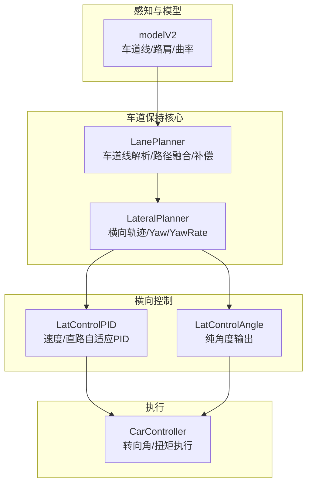
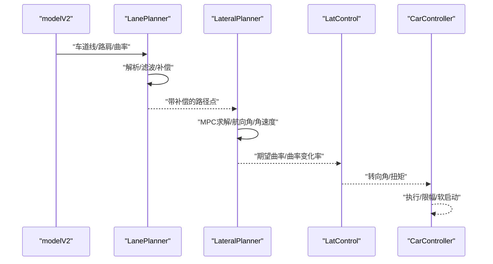
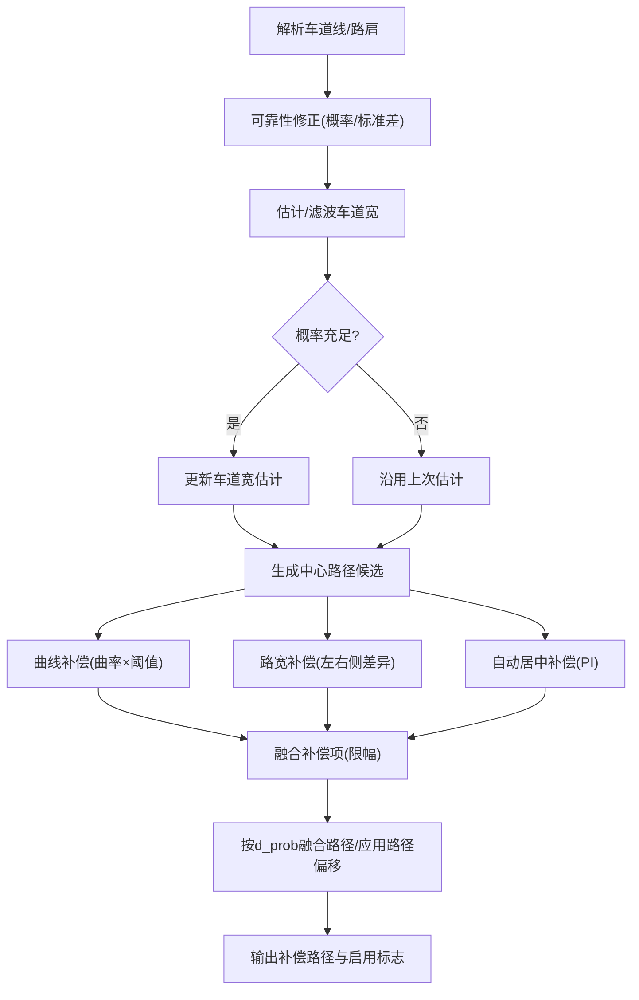
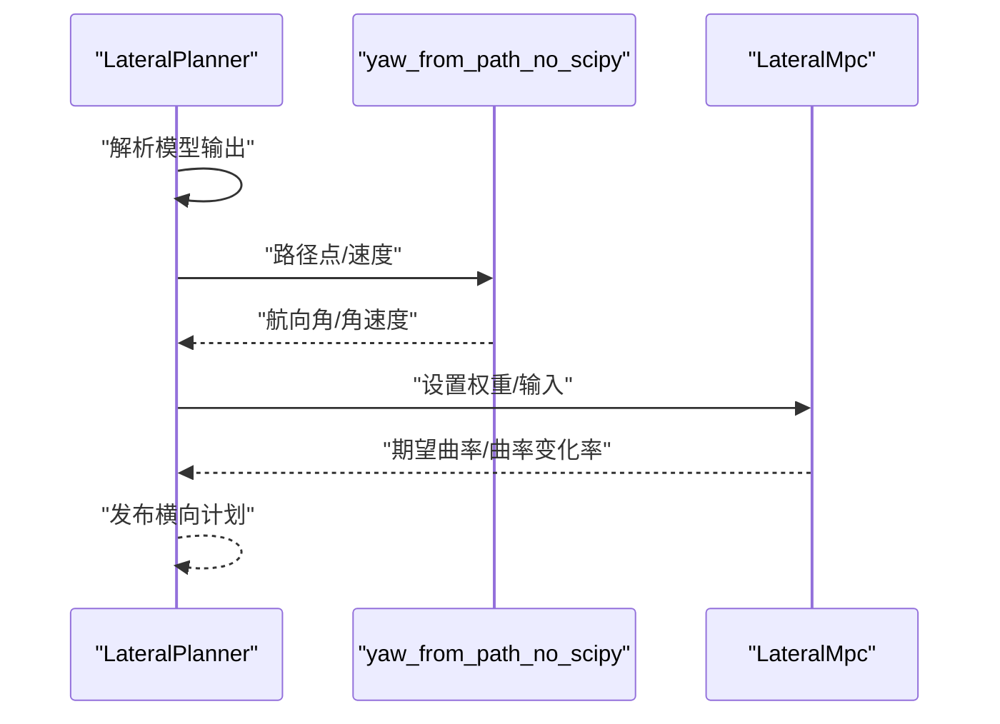
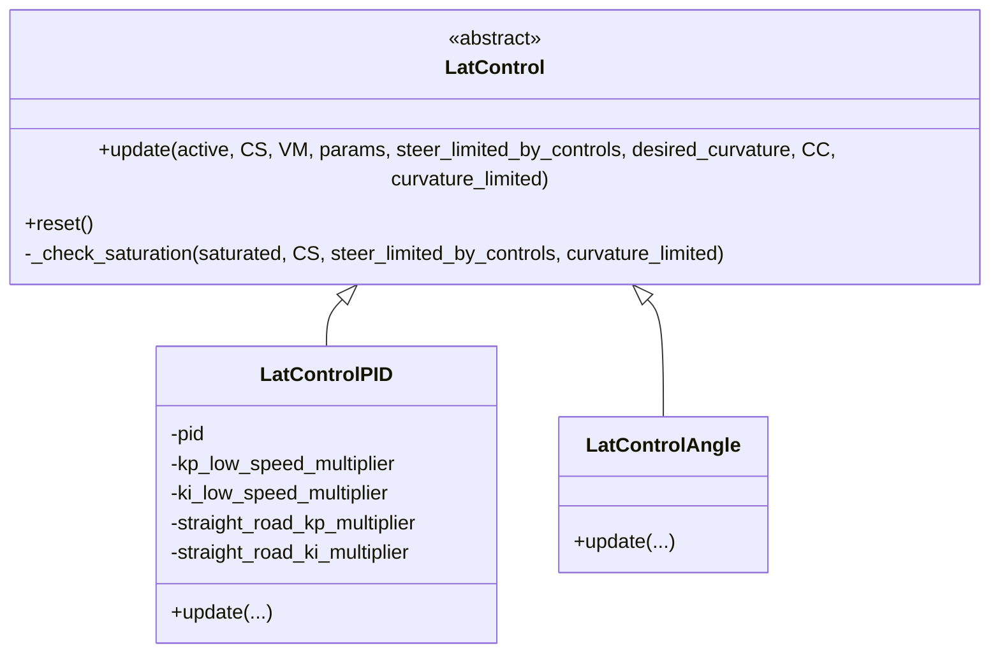
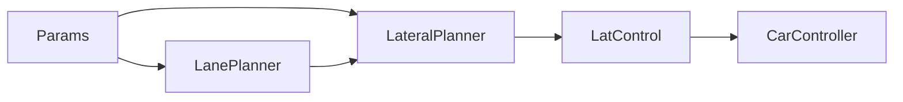

# 车道保持算法

<cite>
**本文引用的文件**
- [lane_planner_2.py](file://selfdrive/controls/lib/lane_planner_2.py)
- [lateral_planner.py](file://selfdrive/controls/lib/lateral_planner.py)
- [latcontrol_pid.py](file://selfdrive/controls/lib/latcontrol_pid.py)
- [latcontrol_angle.py](file://selfdrive/controls/lib/latcontrol_angle.py)
- [latcontrol.py](file://selfdrive/controls/lib/latcontrol.py)
- [params_reference.md](file://docs/params_reference.md)
- [set_car_params.py](file://selfdrive/debug/set_car_params.py)
- [carcontroller.py](file://opendbc_repo/opendbc/car/hyundai/carcontroller.py)
</cite>

## 目录
1. [简介](#简介)
2. [项目结构](#项目结构)
3. [核心组件](#核心组件)
4. [架构总览](#架构总览)
5. [详细组件分析](#详细组件分析)
6. [依赖关系分析](#依赖关系分析)
7. [性能考量](#性能考量)
8. [故障排查指南](#故障排查指南)
9. [结论](#结论)
10. [附录](#附录)

## 简介
本文件面向车道保持（Lane Keeping Assist, LKA）算法的技术文档，聚焦于车道线检测与跟踪、LanePlanner类工作机制、几何路径计算、横向控制策略（含低速/高速稳定性）、车道线偏移补偿（相机与路径偏移）、以及参数化调优与反馈机制。文档以代码库中的实际实现为依据，提供可操作的参数说明、流程图与排障建议。

## 项目结构
车道保持相关逻辑主要分布在以下模块：
- 车道线解析与路径生成：LanePlanner（车道线解析、路径融合、偏移补偿）
- 横向规划与轨迹生成：LateralPlanner（基于模型预测的横向轨迹、航向角与角速度）
- 横向控制策略：LatControl家族（PID/角度控制），用于将期望曲率转化为执行指令
- 参数与标定：参数读取与调试脚本
- 实际执行器接口：各品牌车控器对转向角/扭矩的处理

图表来源
- [lane_planner_2.py:105-427](file://selfdrive/controls/lib/lane_planner_2.py#L105-L427)
- [lateral_planner.py:34-338](file://selfdrive/controls/lib/lateral_planner.py#L34-L338)
- [latcontrol_pid.py:8-83](file://selfdrive/controls/lib/latcontrol_pid.py#L8-L83)
- [latcontrol_angle.py:10-31](file://selfdrive/controls/lib/latcontrol_angle.py#L10-L31)
- [carcontroller.py:227-264](file://opendbc_repo/opendbc/car/hyundai/carcontroller.py#L227-L264)

章节来源
- [lane_planner_2.py:105-427](file://selfdrive/controls/lib/lane_planner_2.py#L105-L427)
- [lateral_planner.py:34-338](file://selfdrive/controls/lib/lateral_planner.py#L34-L338)

## 核心组件
- LanePlanner：负责从模型输出解析左右车道线与路肩，估计车道宽，融合概率与不确定性，生成带补偿的纵向离散路径，并计算航向角与角速度。
- LateralPlanner：根据模型提供的位置、朝向、速度与加速度，构建横向MPC输入，求解期望曲率与曲率变化率，输出横向计划。
- LatControl家族：将期望曲率转换为执行级的转向角或扭矩，内置饱和检测与速度/直路自适应增益调节。
- 参数系统：通过Params读取运行时参数，支持在线调试与标定。

章节来源
- [lane_planner_2.py:105-147](file://selfdrive/controls/lib/lane_planner_2.py#L105-L147)
- [lateral_planner.py:34-78](file://selfdrive/controls/lib/lateral_planner.py#L34-L78)
- [latcontrol_pid.py:8-83](file://selfdrive/controls/lib/latcontrol_pid.py#L8-L83)
- [latcontrol_angle.py:10-31](file://selfdrive/controls/lib/latcontrol_angle.py#L10-L31)

## 架构总览
车道保持从感知模型接收车道线/路肩与曲率，LanePlanner进行几何融合与补偿，LateralPlanner生成轨迹与航向，LatControl将其映射到执行器，最终由CarController完成转向角/扭矩的物理执行。

图表来源
- [lane_planner_2.py:175-388](file://selfdrive/controls/lib/lane_planner_2.py#L175-L388)
- [lateral_planner.py:127-178](file://selfdrive/controls/lib/lateral_planner.py#L127-L178)
- [latcontrol_pid.py:31-83](file://selfdrive/controls/lib/latcontrol_pid.py#L31-L83)
- [carcontroller.py:227-264](file://opendbc_repo/opendbc/car/hyundai/carcontroller.py#L227-L264)

## 详细组件分析

### LanePlanner：车道线检测与几何路径生成
- 输入：模型输出的车道线、路肩、曲率、期望状态；车辆状态与速度。
- 关键流程：
  - 解析左右车道线与路肩，计算左右侧车道宽并滤波。
  - 基于概率与标准差修正左右车道线可靠性，避免过大间距或高不确定性的车道线参与。
  - 估计当前车道宽，融合两侧车道线生成中心路径候选；在概率充足时更新车道宽估计。
  - 偏移补偿：
    - 曲线补偿：根据测得曲率与曲线速度阈值生成补偿量，方向与曲率符号相反。
    - 路宽补偿：根据左右侧可用路宽差异与阈值，向更宽的一侧偏移。
    - 自动居中：AutoLaneCenterController基于PI控制与曲率动态增益，按置信度分档补偿。
  - 路径融合：在“全车道模式”下，按d_prob插值融合车道线路径与原始路径；同时考虑路径偏移参数。
  - 输出：补偿后的路径点与是否启用车道线模式标志。

图表来源
- [lane_planner_2.py:147-388](file://selfdrive/controls/lib/lane_planner_2.py#L147-L388)

章节来源
- [lane_planner_2.py:147-388](file://selfdrive/controls/lib/lane_planner_2.py#L147-L388)

### LateralPlanner：横向轨迹与航向计算
- 输入：模型位置/朝向/速度/加速度；当前车速与期望曲率。
- 关键流程：
  - 将模型输出转换为横向MPC输入（速度、横向位移、期望航向与角速度）。
  - 使用yaw_from_path_no_scipy从路径点计算航向角与角速度，低速时增大平滑窗口以抑制抖动。
  - 设置MPC权重，运行MPC求解期望曲率与曲率变化率。
  - 发布横向计划消息，包含轨迹点、曲率、曲率变化率等。

图表来源
- [lateral_planner.py:85-178](file://selfdrive/controls/lib/lateral_planner.py#L85-L178)
- [lateral_planner.py:278-337](file://selfdrive/controls/lib/lateral_planner.py#L278-L337)

章节来源
- [lateral_planner.py:85-178](file://selfdrive/controls/lib/lateral_planner.py#L85-L178)
- [lateral_planner.py:278-337](file://selfdrive/controls/lib/lateral_planner.py#L278-L337)

### 横向控制策略：LatControlPID 与 LatControlAngle
- LatControlPID：
  - 将期望曲率映射为期望转向角，加入角度偏置。
  - 速度相关增益调节：低速降低P/I增益，减少振荡；直路小曲率时进一步降低P/I增益，提升稳定性。
  - 前馈补偿：根据期望转向角与车速计算前馈。
  - 饱和检测：统计饱和计数，避免持续饱和触发。
- LatControlAngle：
  - 直接将期望曲率映射为期望转向角，加入角度偏置。
  - 提供饱和检测与最小速度检查。

图表来源
- [latcontrol.py:9-34](file://selfdrive/controls/lib/latcontrol.py#L9-L34)
- [latcontrol_pid.py:8-83](file://selfdrive/controls/lib/latcontrol_pid.py#L8-L83)
- [latcontrol_angle.py:10-31](file://selfdrive/controls/lib/latcontrol_angle.py#L10-L31)

章节来源
- [latcontrol_pid.py:31-83](file://selfdrive/controls/lib/latcontrol_pid.py#L31-L83)
- [latcontrol_angle.py:15-31](file://selfdrive/controls/lib/latcontrol_angle.py#L15-L31)
- [latcontrol.py:26-34](file://selfdrive/controls/lib/latcontrol.py#L26-L34)

### 低速/高速控制策略与稳定性保证
- 低速策略（≤6 m/s）：
  - 航向角计算采用更大平滑窗口，抑制高频抖动。
  - PID在低速时降低P/I增益，减少振荡风险。
- 直路稳定性：
  - 当期望曲率低于阈值时，进一步降低P/I增益，避免直路漂移。
- 转向角饱和保护：
  - 基于计数器与最小速度阈值判断饱和状态，防止持续饱和。

章节来源
- [lateral_planner.py:282-283](file://selfdrive/controls/lib/lateral_planner.py#L282-L283)
- [latcontrol_pid.py:58-66](file://selfdrive/controls/lib/latcontrol_pid.py#L58-L66)
- [latcontrol.py:26-34](file://selfdrive/controls/lib/latcontrol.py#L26-L34)

### 车道线偏移补偿机制
- 相机偏移校正：
  - LanePlanner中定义了相机偏移常量，默认为零（消除相机位置补偿）。
- 路径偏移参数调整：
  - PathOffset参数通过参数系统读取，作为全局路径Y轴偏移。
  - AdjustLaneOffset/AdjustCurveOffset用于自适应补偿，分别针对直线路段与弯道补偿。
  - LatMpcInputOffset用于时间输入偏移，影响路径插值前瞻。
- 自动居中补偿：
  - AutoLaneCenterController基于PI控制，按左右车道线置信度分档动态增益，结合曲率进行补偿。

章节来源
- [lane_planner_2.py:13-13](file://selfdrive/controls/lib/lane_planner_2.py#L13-L13)
- [lane_planner_2.py:244-246](file://selfdrive/controls/lib/lane_planner_2.py#L244-L246)
- [lateral_planner.py:63-65](file://selfdrive/controls/lib/lateral_planner.py#L63-L65)
- [lateral_planner.py:159-159](file://selfdrive/controls/lib/lateral_planner.py#L159-L159)
- [lane_planner_2.py:47-103](file://selfdrive/controls/lib/lane_planner_2.py#L47-L103)

### 参数与返回值
- 关键参数（通过Params读取）：
  - UseLaneLineSpeed：启用车道线模式的速度阈值。
  - PathOffset：路径Y轴偏移（百分制转小数）。
  - LatMpcPathCost/LatMpcMotionCost/LatMpcAccelCost/LatMpcJerkCost/LatMpcSteeringRateCost：MPC权重。
  - LatMpcInputOffset：时间输入偏移。
  - AdjustLaneOffset/AdjustCurveOffset：自适应补偿（百分制转小数）。
  - LaneCenterStrength：车道中心融合强度（百分制转小数）。
  - AutoLaneCenterEnabled/Kp/Ki：自动居中开关与增益。
- 返回值（横向计划）：
  - dPathPoints：横向轨迹点序列。
  - psis：航向角序列。
  - distances：纵向距离序列。
  - curvatures：期望曲率序列。
  - curvatureRates：曲率变化率序列。
  - mpcSolutionValid：MPC求解有效性。
  - solverExecutionTime：求解耗时。

章节来源
- [lateral_planner.py:88-96](file://selfdrive/controls/lib/lateral_planner.py#L88-L96)
- [lateral_planner.py:197-247](file://selfdrive/controls/lib/lateral_planner.py#L197-L247)
- [params_reference.md:101-112](file://docs/params_reference.md#L101-L112)

### 与其他组件的关系
- 与模型（modelV2）：LanePlanner直接消费车道线、路肩与曲率信息。
- 与横向MPC：LateralPlanner将路径、航向与角速度送入MPC，得到期望曲率。
- 与横向控制：LateralPlanner输出期望曲率，LatControl将其映射为执行指令。
- 与执行器（CarController）：执行转向角/扭矩，包含速率限制、软启动与故障规避。

章节来源
- [lateral_planner.py:106-118](file://selfdrive/controls/lib/lateral_planner.py#L106-L118)
- [lateral_planner.py:171-178](file://selfdrive/controls/lib/lateral_planner.py#L171-L178)
- [carcontroller.py:227-264](file://opendbc_repo/opendbc/car/hyundai/carcontroller.py#L227-L264)

## 依赖关系分析
- 组件耦合：
  - LateralPlanner强依赖LanePlanner的路径输出。
  - LatControl不直接依赖感知，仅依赖LateralPlanner输出的期望曲率。
- 外部依赖：
  - 参数系统（Params）贯穿LanePlanner与LateralPlanner。
  - CarController对转向角/扭矩进行物理层处理与限幅。

图表来源
- [lateral_planner.py:54-54](file://selfdrive/controls/lib/lateral_planner.py#L54-L54)
- [lane_planner_2.py:145-145](file://selfdrive/controls/lib/lane_planner_2.py#L145-L145)
- [latcontrol.py:9-18](file://selfdrive/controls/lib/latcontrol.py#L9-L18)

章节来源
- [lateral_planner.py:54-54](file://selfdrive/controls/lib/lateral_planner.py#L54-L54)
- [lane_planner_2.py:145-145](file://selfdrive/controls/lib/lane_planner_2.py#L145-L145)

## 性能考量
- 低速稳定性：增大航向角平滑窗口、降低PID增益，减少振荡。
- 直路稳定性：小曲率场景进一步降低增益，避免漂移。
- 路径融合：d_prob与滤波器确保在车道线可靠时才融合，避免误融合。
- 计算效率：MPC求解与参数读取频率控制，避免每帧重复昂贵操作。

## 故障排查指南
- 横向计划无效：
  - 检查MPC求解状态与成本，确认是否存在不可行解。
  - 关注日志中的警告与计数器清零条件。
- 转向角饱和：
  - 检查饱和计数器与最小速度阈值，确认是否因持续饱和触发。
  - 适当降低增益或增加前馈。
- 车道线模式切换异常：
  - 检查UseLaneLineSpeed阈值与速度判定逻辑。
  - 确认车道宽滤波与可靠性修正是否导致d_prob过低。
- 偏移补偿过大：
  - 调整AdjustLaneOffset/AdjustCurveOffset与LaneCenterStrength。
  - 检查AutoLaneCenterEnabled/Kp/Ki的分档逻辑与曲率增益。

章节来源
- [lateral_planner.py:180-194](file://selfdrive/controls/lib/lateral_planner.py#L180-L194)
- [latcontrol.py:26-34](file://selfdrive/controls/lib/latcontrol.py#L26-L34)
- [lane_planner_2.py:322-330](file://selfdrive/controls/lib/lane_planner_2.py#L322-L330)
- [latcontrol_pid.py:58-66](file://selfdrive/controls/lib/latcontrol_pid.py#L58-L66)

## 结论
该车道保持算法通过LanePlanner进行稳健的车道线解析与几何融合，结合LateralPlanner的MPC求解与LatControl的速度/直路自适应策略，在低速与高速场景下均实现了稳定与舒适的横向控制。参数化设计便于在线调试与标定，配合偏移补偿机制可有效应对相机与道路条件差异。

## 附录

### 参数与配置速查
- 读取参数方式与常用参数键名参见参数参考文档。
- 车辆参数持久化与调试脚本可用于快速写入/读取。

章节来源
- [params_reference.md:12-88](file://docs/params_reference.md#L12-L88)
- [set_car_params.py:9-23](file://selfdrive/debug/set_car_params.py#L9-L23)