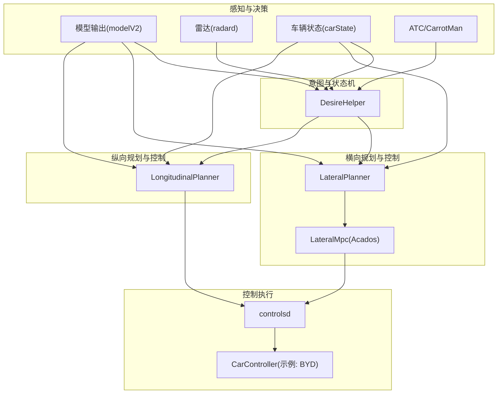
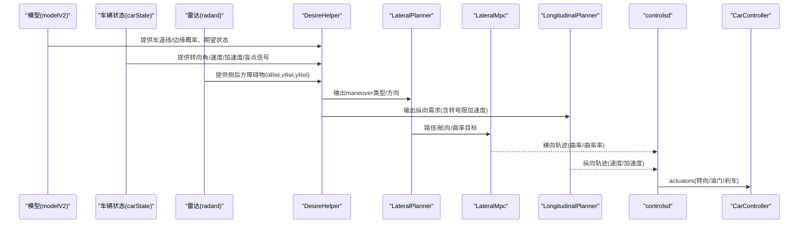
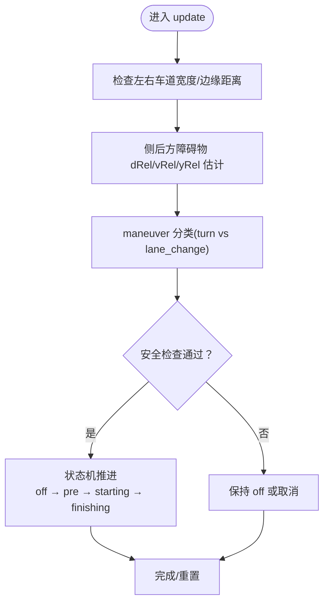
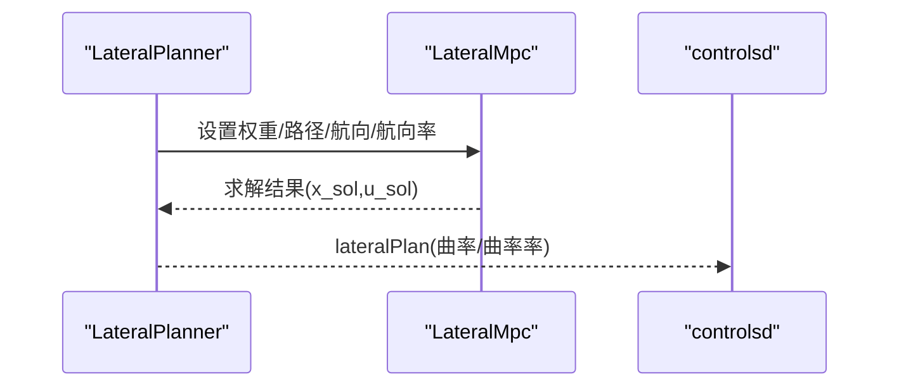
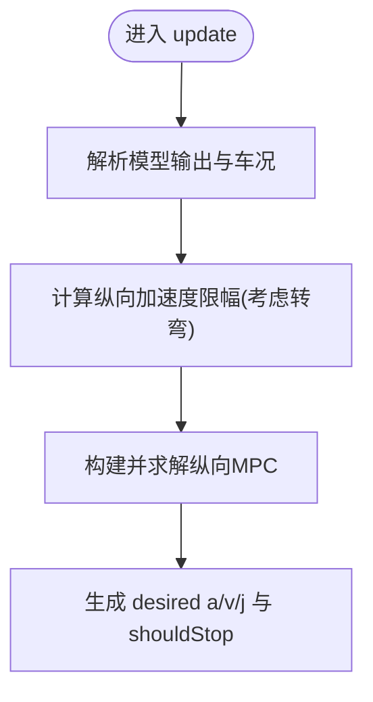
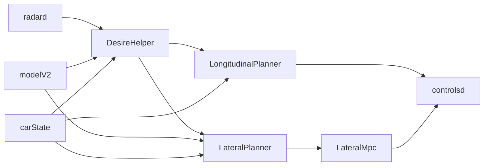

# 车道变更处理

<cite>
**本文引用的文件**
- [desire_helper.py](file://selfdrive/controls/lib/desire_helper.py)
- [lateral_planner.py](file://selfdrive/controls/lib/lateral_planner.py)
- [lat_mpc.py](file://selfdrive/controls/lib/lateral_mpc_lib/lat_mpc.py)
- [longitudinal_planner.py](file://selfdrive/controls/lib/longitudinal_planner.py)
- [controlsd.py](file://selfdrive/controls/controlsd.py)
- [drive_helpers.py](file://selfdrive/controls/lib/drive_helpers.py)
- [radard.py](file://selfdrive/controls/radard.py)
- [carcontroller.py](file://opendbc_repo/opendbc/car/byd.bak/carcontroller.py)
</cite>

## 目录
1. [简介](#简介)
2. [项目结构](#项目结构)
3. [核心组件](#核心组件)
4. [架构总览](#架构总览)
5. [详细组件分析](#详细组件分析)
6. [依赖分析](#依赖分析)
7. [性能考虑](#性能考虑)
8. [故障排查指南](#故障排查指南)
9. [结论](#结论)
10. [附录](#附录)

## 简介
本文件面向“车道变更处理”的算法与实现，围绕以下目标展开：
- 驾驶员意图识别与环境条件评估
- 安全检查流程（侧向距离、纵向安全距离、相对速度）
- 轨迹规划（变道曲线、速度 profile、时间窗口）
- 执行控制策略（转向角控制、纵向加速度/速度调节、路径跟踪）
- 状态机设计（准备、执行、完成）
- 参数化配置与动态调整
- 与雷达、模型、控制器等模块的集成关系
- 常见问题与解决方案

## 项目结构
车道变更处理涉及多模块协同：
- 意图与状态机：DesireHelper（识别驾驶员意图、ATC指令、分类 maneuver 类型、状态机推进）
- 横向规划与控制：LateralPlanner（基于模型路径与代价函数求解横向轨迹），LateralMpc（ACADOS求解器）
- 纵向规划与控制：LongitudinalPlanner（纵向轨迹与加速度限幅，考虑转弯时横向加速度对纵向加速度的约束）
- 控制执行：controlsd（横向/纵向计划融合，延迟补偿与平滑）
- 环境感知：radard（侧后方障碍物预测，提供 dRel/vRel/yRel 等）
- 辅助工具：drive_helpers（延迟补偿、曲率/航向关系等）

图表来源
- [desire_helper.py:420-663](file://selfdrive/controls/lib/desire_helper.py#L420-L663)
- [lateral_planner.py:85-196](file://selfdrive/controls/lib/lateral_planner.py#L85-L196)
- [lat_mpc.py:131-157](file://selfdrive/controls/lib/lateral_mpc_lib/lat_mpc.py#L131-L157)
- [longitudinal_planner.py:132-248](file://selfdrive/controls/lib/longitudinal_planner.py#L132-L248)
- [controlsd.py:164-192](file://selfdrive/controls/controlsd.py#L164-L192)
- [radard.py:45-77](file://selfdrive/controls/radard.py#L45-L77)
- [carcontroller.py:525-550](file://opendbc_repo/opendbc/car/byd.bak/carcontroller.py#L525-L550)

章节来源
- [desire_helper.py:420-663](file://selfdrive/controls/lib/desire_helper.py#L420-L663)
- [lateral_planner.py:85-196](file://selfdrive/controls/lib/lateral_planner.py#L85-L196)
- [lat_mpc.py:131-157](file://selfdrive/controls/lib/lateral_mpc_lib/lat_mpc.py#L131-L157)
- [longitudinal_planner.py:132-248](file://selfdrive/controls/lib/longitudinal_planner.py#L132-L248)
- [controlsd.py:164-192](file://selfdrive/controls/controlsd.py#L164-L192)
- [radard.py:45-77](file://selfdrive/controls/radard.py#L45-L77)
- [carcontroller.py:525-550](file://opendbc_repo/opendbc/car/byd.bak/carcontroller.py#L525-L550)

## 核心组件
- DesireHelper：负责驾驶员意图识别、ATC指令解析、maneuver 类型分类（turn/lane_change）、BSD/侧后方障碍物检测、车道可用性判定、状态机推进与 desire 输出。
- LateralPlanner/LateralMpc：基于模型路径与代价函数，求解横向轨迹（psi、curvature、curvatureRates），并输出给 controlsd。
- LongitudinalPlanner：纵向轨迹与加速度限幅，考虑转弯时横向加速度对纵向加速度的约束，结合雷达/模型输出生成 desired 加速度/速度。
- controlsd：横向/纵向计划融合、延迟补偿、平滑、曲率限幅，最终生成 actuators。
- radard：侧后方障碍物 dRel/vRel/yRel 预测，用于侧向安全检查。

章节来源
- [desire_helper.py:104-184](file://selfdrive/controls/lib/desire_helper.py#L104-L184)
- [lateral_planner.py:34-78](file://selfdrive/controls/lib/lateral_planner.py#L34-L78)
- [lat_mpc.py:131-157](file://selfdrive/controls/lib/lateral_mpc_lib/lat_mpc.py#L131-L157)
- [longitudinal_planner.py:85-111](file://selfdrive/controls/lib/longitudinal_planner.py#L85-L111)
- [controlsd.py:164-192](file://selfdrive/controls/controlsd.py#L164-L192)
- [radard.py:45-77](file://selfdrive/controls/radard.py#L45-L77)

## 架构总览
车道变更处理从“意图识别”开始，经“安全检查”，到“轨迹规划”，再到“控制执行”，最后回到“状态机推进”。关键数据流如下：

图表来源
- [desire_helper.py:420-663](file://selfdrive/controls/lib/desire_helper.py#L420-L663)
- [lateral_planner.py:85-196](file://selfdrive/controls/lib/lateral_planner.py#L85-L196)
- [lat_mpc.py:131-157](file://selfdrive/controls/lib/lateral_mpc_lib/lat_mpc.py#L131-L157)
- [longitudinal_planner.py:132-248](file://selfdrive/controls/lib/longitudinal_planner.py#L132-L248)
- [controlsd.py:164-192](file://selfdrive/controls/controlsd.py#L164-L192)

## 详细组件分析

### 组件A：DesireHelper（意图识别与状态机）
- 驾驶员意图识别
  - 驾驶员闪烁灯：左/右闪烁触发 desire_enabled，并可忽略特定设置。
  - ATC/CarrotMan：导航/分岔/汇合场景下生成 turn/left/right 指令，必要时覆盖驾驶员意图。
  - 模型期望状态：模型给出的 desireState 作为 turn 概率参考。
- 环境条件评估
  - 左/右侧车道宽度、到道路边缘距离、边缘是否出现（存在性计数与滞后稳定）。
  - 侧后方障碍物：根据 radar 的 dRel/vRel/yRel 估计未来相对位置，结合速度阈值判断是否遮挡。
- maneuver 类型分类
  - turn：低速/减速/车道缺失/边缘较远/模型/ATC倾向等综合打分。
  - lane_change：默认分类，若在执行中识别为 turn 条件满足则切换。
- 安全检查与触发
  - 车道可用性：车道宽度/边缘距离满足阈值；边缘出现且足够远。
  - BSD/扭矩：盲点检测计数；施加转向力矩；或满足自动车道变更触发条件。
  - 速度门槛：低于最小速度阈值禁止变道。
- 状态机推进
  - off → preLaneChange → laneChangeStarting → laneChangeFinishing → off
  - 转向取消：反向强转会强制取消当前 maneuver。
  - 时间上限：超过最大持续时间重置。
- 参数与动态调整
  - 配置项：LaneChangeNeedTorque、LaneChangeBsd、LaneChangeDelay、ModelTurnSpeedFactor 等。
  - 自动车道变更使能：在非最右侧时禁用，以避免越界。
  - 触发日志：desireLog 记录触发条件与判定依据，便于调试。

图表来源
- [desire_helper.py:420-663](file://selfdrive/controls/lib/desire_helper.py#L420-L663)

章节来源
- [desire_helper.py:193-208](file://selfdrive/controls/lib/desire_helper.py#L193-L208)
- [desire_helper.py:213-250](file://selfdrive/controls/lib/desire_helper.py#L213-L250)
- [desire_helper.py:278-339](file://selfdrive/controls/lib/desire_helper.py#L278-L339)
- [desire_helper.py:345-415](file://selfdrive/controls/lib/desire_helper.py#L345-L415)
- [desire_helper.py:454-510](file://selfdrive/controls/lib/desire_helper.py#L454-L510)
- [desire_helper.py:559-626](file://selfdrive/controls/lib/desire_helper.py#L559-L626)
- [desire_helper.py:638-663](file://selfdrive/controls/lib/desire_helper.py#L638-L663)

### 组件B：横向轨迹规划与控制（LateralPlanner/LateralMpc）
- 输入
  - 模型路径（position/velocity/orientation）与航向、航向率。
  - 当前曲率（来自 controlsState）与车速。
  - 配置参数：路径偏移、各 MPC 成本权重。
- 规划
  - 将路径离散化，计算 yaw/yaw_rate（含平滑与裁剪）。
  - 设置 LateralMpc 权重，运行求解器得到 psi、curvature、curvatureRates。
- 输出
  - lateralPlan：dPathPoints、psis、distances、curvatures、curvatureRates、mpc 解有效性等。
- 执行
  - controlsd 中对横向计划进行延迟补偿与平滑，再进行曲率限幅。

图表来源
- [lateral_planner.py:85-196](file://selfdrive/controls/lib/lateral_planner.py#L85-L196)
- [lat_mpc.py:131-157](file://selfdrive/controls/lib/lateral_mpc_lib/lat_mpc.py#L131-L157)
- [controlsd.py:164-192](file://selfdrive/controls/controlsd.py#L164-L192)

章节来源
- [lateral_planner.py:85-196](file://selfdrive/controls/lib/lateral_planner.py#L85-L196)
- [lat_mpc.py:131-157](file://selfdrive/controls/lib/lateral_mpc_lib/lat_mpc.py#L131-L157)
- [controlsd.py:164-192](file://selfdrive/controls/controlsd.py#L164-L192)

### 组件C：纵向轨迹规划与控制（LongitudinalPlanner）
- 输入
  - 模型预测（位置/速度/加速度/加加速度）。
  - 车辆状态（vEgo、aEgo、pitch）。
  - radar/模型输出的纵向需求。
- 规划
  - 在转弯场景下，根据横向加速度对纵向加速度进行限幅，避免“侧翻/失控”。
  - 结合 cruise/ACC/blend 模式，生成 desired 加速度/速度轨迹。
- 输出
  - longitudinalPlan：速度/加速度/加加速度、shouldStop、事件等。

图表来源
- [longitudinal_planner.py:132-248](file://selfdrive/controls/lib/longitudinal_planner.py#L132-L248)

章节来源
- [longitudinal_planner.py:57-84](file://selfdrive/controls/lib/longitudinal_planner.py#L57-L84)
- [longitudinal_planner.py:132-248](file://selfdrive/controls/lib/longitudinal_planner.py#L132-L248)

### 组件D：控制执行（controlsd 与 CarController）
- 横向
  - 对 lateralPlan 的曲率进行延迟补偿和平滑，再进行曲率限幅。
  - 与模型输出 desiredCurvature 融合，生成最终 desiredCurvature。
- 纵向
  - 与 longitudinalPlan 融合，考虑执行器延迟，生成 actuators。
- 示例：BYD 控制器中对加速度进行合理限幅与停车/起步状态机处理。

章节来源
- [controlsd.py:164-192](file://selfdrive/controls/controlsd.py#L164-L192)
- [carcontroller.py:525-550](file://opendbc_repo/opendbc/car/byd.bak/carcontroller.py#L525-L550)
- [carcontroller.py:883-907](file://opendbc_repo/opendbc/car/byd.bak/carcontroller.py#L883-L907)

### 组件E：侧向安全检查与雷达预测（radard）
- dRel/vRel/yRel 与未来位置估计（考虑雷达反应因子与横向因子）。
- 用于 DesireHelper 的侧后方障碍物遮挡判断与触发条件。

章节来源
- [radard.py:45-77](file://selfdrive/controls/radard.py#L45-L77)

## 依赖分析
- DesireHelper 依赖模型输出（车道线/边缘概率、期望状态）、车辆状态（转向角/速度/加速度/盲点）、雷达输出（侧后方障碍物）、ATC/CarrotMan 指令。
- LateralPlanner 依赖模型路径与航向、当前曲率、车速、参数；LateralMpc 依赖 ACADOS 求解器。
- LongitudinalPlanner 依赖模型预测、车况、雷达/模型纵向需求、转弯限加速度。
- controlsd 融合横向/纵向计划，考虑执行器延迟与平滑。

图表来源
- [desire_helper.py:420-663](file://selfdrive/controls/lib/desire_helper.py#L420-L663)
- [lateral_planner.py:85-196](file://selfdrive/controls/lib/lateral_planner.py#L85-L196)
- [lat_mpc.py:131-157](file://selfdrive/controls/lib/lateral_mpc_lib/lat_mpc.py#L131-L157)
- [longitudinal_planner.py:132-248](file://selfdrive/controls/lib/longitudinal_planner.py#L132-L248)
- [controlsd.py:164-192](file://selfdrive/controls/controlsd.py#L164-L192)
- [radard.py:45-77](file://selfdrive/controls/radard.py#L45-L77)

章节来源
- [desire_helper.py:420-663](file://selfdrive/controls/lib/desire_helper.py#L420-L663)
- [lateral_planner.py:85-196](file://selfdrive/controls/lib/lateral_planner.py#L85-L196)
- [lat_mpc.py:131-157](file://selfdrive/controls/lib/lateral_mpc_lib/lat_mpc.py#L131-L157)
- [longitudinal_planner.py:132-248](file://selfdrive/controls/lib/longitudinal_planner.py#L132-L248)
- [controlsd.py:164-192](file://selfdrive/controls/controlsd.py#L164-L192)
- [radard.py:45-77](file://selfdrive/controls/radard.py#L45-L77)

## 性能考虑
- 横向规划
  - LateralMpc 的求解成本与权重设置直接影响实时性与稳定性；需平衡路径跟踪、加速度、急转成本。
  - 路径平滑与 yaw/yaw_rate 裁剪有助于抑制高频噪声。
- 纵向规划
  - 转弯限加速度避免在高速急弯时过度纵向激励，提升安全性与舒适性。
  - 执行器延迟补偿与平滑可减少抖动与超调。
- 状态机与计数
  - 存在性计数与滞回逻辑降低传感器噪声影响，提高决策鲁棒性。

## 故障排查指南
- 变道不触发
  - 检查 DesireHelper 的 desireLog，确认车道可用性、边缘出现、触发条件是否满足。
  - 确认车速是否低于最小阈值，BSD 是否阻断，是否存在侧后方遮挡。
- 变道过程中取消
  - 检查是否反向强转导致取消；查看 DesireHelper 的 steering_pressed_cancel 分支。
- 横向轨迹不稳定
  - 检查 LateralMpc 的解有效性与成本；适当调整路径/运动/加速度/急转成本权重。
- 纵向加速度受限
  - 检查转弯限加速度是否生效；确认模型/雷达纵向需求与执行器延迟补偿。

章节来源
- [desire_helper.py:502-510](file://selfdrive/controls/lib/desire_helper.py#L502-L510)
- [desire_helper.py:638-663](file://selfdrive/controls/lib/desire_helper.py#L638-L663)
- [lateral_planner.py:180-195](file://selfdrive/controls/lib/lateral_planner.py#L180-L195)
- [longitudinal_planner.py:57-84](file://selfdrive/controls/lib/longitudinal_planner.py#L57-L84)

## 结论
该车道变更处理以 DesireHelper 为核心，结合模型与雷达信息进行意图识别与安全检查，通过 Lateral/Longitudinal Planner 生成轨迹并在 controlsd 中融合执行。状态机确保流程可控，参数化配置支持不同场景与车辆特性。通过横向/纵向的耦合约束与延迟补偿，系统在安全性与舒适性之间取得平衡。

## 附录

### 关键参数与配置项（节选）
- DesireHelper
  - LaneChangeNeedTorque：需要施加扭矩才允许变道（负值可完全屏蔽驾驶员意图）
  - LaneChangeBsd：BSD 行为策略（阻断/忽略）
  - LaneChangeDelay：预热/延时
  - ModelTurnSpeedFactor：模型预测的转向速度因子
- LateralPlanner/LateralMpc
  - LatMpcPathCost/LatMpcMotionCost/LatMpcAccelCost/LatMpcJerkCost/LatMpcSteeringRateCost：MPC 成本权重
  - PathOffset：路径偏移
- LongitudinalPlanner
  - 转弯限加速度：limit_accel_in_turns
  - LongActuatorDelay/VEgoStopping：纵向执行器延迟与停止阈值
- controlsd
  - LatSmoothSec/SteerActuatorDelay：横向平滑与执行器延迟
  - UseLaneLineCurveSpeed：启用车道线模式的速度阈值

章节来源
- [desire_helper.py:193-208](file://selfdrive/controls/lib/desire_helper.py#L193-L208)
- [lateral_planner.py:88-96](file://selfdrive/controls/lib/lateral_planner.py#L88-L96)
- [longitudinal_planner.py:223-225](file://selfdrive/controls/lib/longitudinal_planner.py#L223-L225)
- [controlsd.py:167-171](file://selfdrive/controls/controlsd.py#L167-L171)