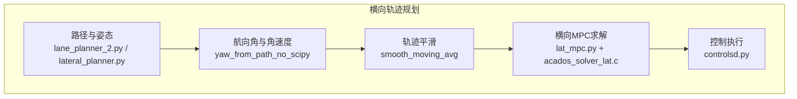
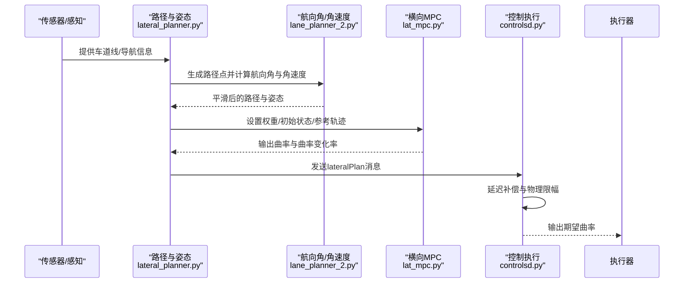
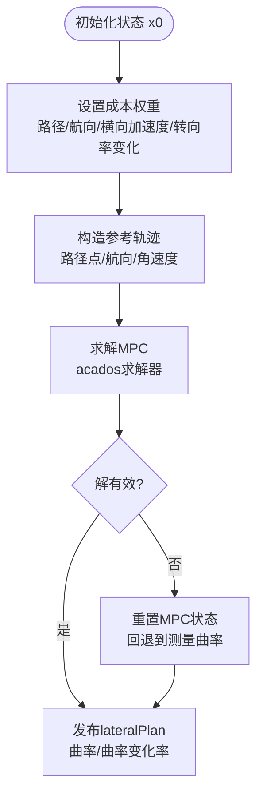
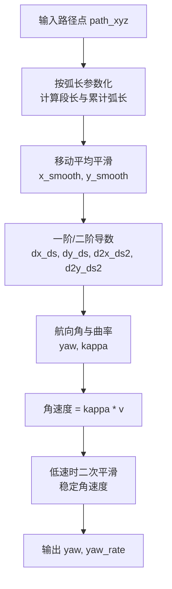
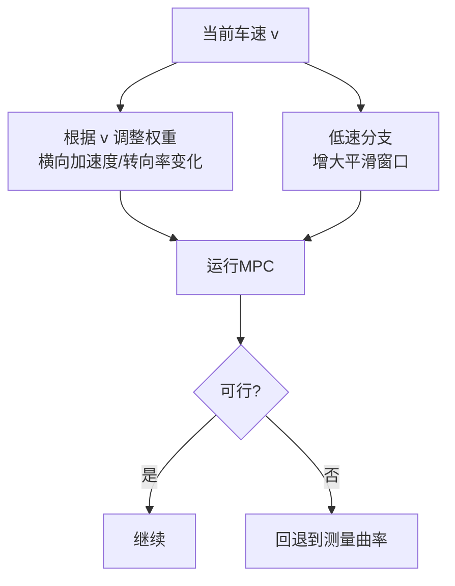
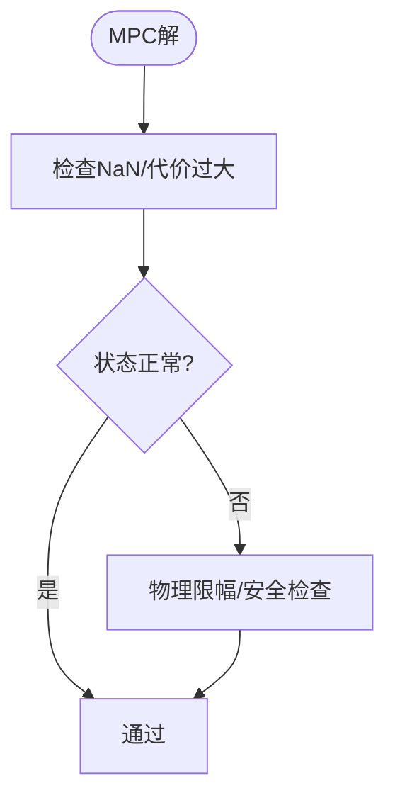
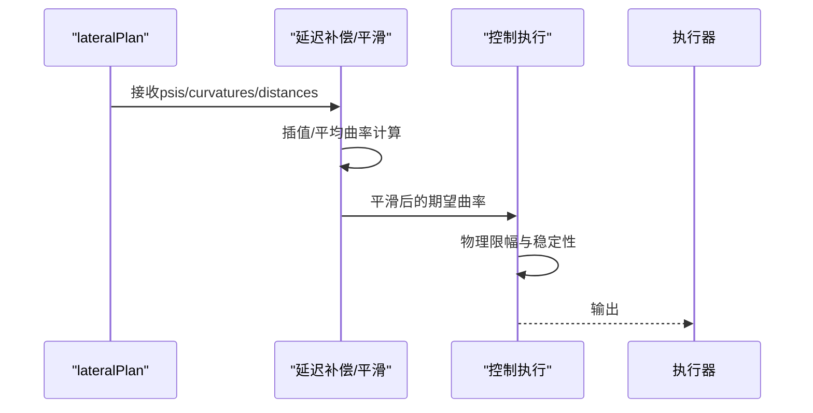
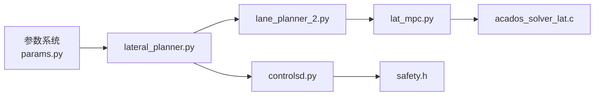

# 轨迹规划算法

<cite>
**本文引用的文件**
- [lateral_planner.py](file://selfdrive/controls/lib/lateral_planner.py)
- [lane_planner_2.py](file://selfdrive/controls/lib/lane_planner_2.py)
- [drive_helpers.py](file://selfdrive/controls/lib/drive_helpers.py)
- [lat_mpc.py](file://selfdrive/controls/lib/lateral_mpc_lib/lat_mpc.py)
- [acados_solver_lat.c](file://selfdrive/controls/lib/lateral_mpc_lib/c_generated_code/acados_solver_lat.c)
- [controlsd.py](file://selfdrive/controls/controlsd.py)
- [longitudinal_planner.py](file://selfdrive/controls/lib/longitudinal_planner.py)
- [long_mpc.py](file://selfdrive/controls/lib/longitudinal_mpc_lib/long_mpc.py)
- [acados_solver_long.c](file://selfdrive/controls/lib/longitudinal_mpc_lib/c_generated_code/acados_solver_long.c)
- [safety.h](file://opendbc_repo/opendbc/safety/safety.h)
- [params.py](file://common/params.py)
- [carrot_setting.py](file://selfdrive/carrot_setting.py)
</cite>

## 目录
1. [引言](#引言)
2. [项目结构](#项目结构)
3. [核心组件](#核心组件)
4. [架构总览](#架构总览)
5. [详细组件分析](#详细组件分析)
6. [依赖关系分析](#依赖关系分析)
7. [性能考量](#性能考量)
8. [故障排查指南](#故障排查指南)
9. [结论](#结论)
10. [附录](#附录)

## 引言
本算法文档聚焦于横向轨迹规划中的MPC（模型预测控制）实现，结合路径点插值、航向角与曲率计算、轨迹平滑、速度相关权重与稳定性保障、可行性检查与物理约束验证，并给出来自实际代码库的参数化调优与运行时调整流程。文档同时解释与纵向控制、感知与执行器的安全边界之间的关系。

## 项目结构
横向轨迹规划由“路径与姿态计算”“MPC求解”“控制执行”三部分协同完成：
- 路径与姿态：从车道线/导航路径生成离散路径点，计算航向角与角速度（基于曲率×速度），并进行平滑处理。
- MPC求解：以状态空间模型最小化加权成本，满足横向加速度/转向率等约束。
- 控制执行：将MPC输出的曲率与曲率变化率映射到执行器指令，考虑延迟与物理极限。

**图表来源**
- [lateral_planner.py:73-173](file://selfdrive/controls/lib/lateral_planner.py#L73-L173)
- [lane_planner_2.py:390-426](file://selfdrive/controls/lib/lane_planner_2.py#L390-L426)
- [lat_mpc.py:159-194](file://selfdrive/controls/lib/lateral_mpc_lib/lat_mpc.py#L159-L194)
- [acados_solver_lat.c:179-226](file://selfdrive/controls/lib/lateral_mpc_lib/c_generated_code/acados_solver_lat.c#L179-L226)
- [controlsd.py:164-192](file://selfdrive/controls/controlsd.py#L164-L192)

**章节来源**
- [lateral_planner.py:1-221](file://selfdrive/controls/lib/lateral_planner.py#L1-L221)
- [lane_planner_2.py:377-426](file://selfdrive/controls/lib/lane_planner_2.py#L377-L426)
- [lat_mpc.py:88-199](file://selfdrive/controls/lib/lateral_mpc_lib/lat_mpc.py#L88-L199)
- [acados_solver_lat.c:179-226](file://selfdrive/controls/lib/lateral_mpc_lib/c_generated_code/acados_solver_lat.c#L179-L226)
- [controlsd.py:164-192](file://selfdrive/controls/controlsd.py#L164-L192)

## 核心组件
- 路径与姿态模块：负责将车道线/导航路径转换为离散路径点，计算航向角与角速度，并进行平滑。
- 横向MPC模块：定义状态空间、成本函数与约束，求解最优曲率序列与曲率变化率。
- 控制执行模块：将MPC输出映射为期望曲率，考虑执行器延迟与物理极限，输出给转向执行器。
- 参数与配置：通过参数系统动态读取权重、延迟、偏置等，支持在线调整。

**章节来源**
- [lateral_planner.py:85-173](file://selfdrive/controls/lib/lateral_planner.py#L85-L173)
- [lane_planner_2.py:390-426](file://selfdrive/controls/lib/lane_planner_2.py#L390-L426)
- [lat_mpc.py:159-194](file://selfdrive/controls/lib/lateral_mpc_lib/lat_mpc.py#L159-L194)
- [controlsd.py:164-192](file://selfdrive/controls/controlsd.py#L164-L192)

## 架构总览
横向轨迹规划的端到端流程如下：

**图表来源**
- [lateral_planner.py:85-173](file://selfdrive/controls/lib/lateral_planner.py#L85-L173)
- [lane_planner_2.py:390-426](file://selfdrive/controls/lib/lane_planner_2.py#L390-L426)
- [lat_mpc.py:159-194](file://selfdrive/controls/lib/lateral_mpc_lib/lat_mpc.py#L159-L194)
- [controlsd.py:164-192](file://selfdrive/controls/controlsd.py#L164-L192)

## 详细组件分析

### 状态空间建模与MPC成本函数
- 状态变量：纵向位置、横向偏差、航向角、角速度（或等价的曲率变化率）。
- 输入变量：曲率变化率（即期望的角加速度）。
- 成本函数：最小化路径偏离、航向误差、横向加速度、转向率变化与输入变化，权重可随速度与场景调整。
- 约束条件：横向加速度与转向率幅值限制，确保物理可行。

**图表来源**
- [lat_mpc.py:159-194](file://selfdrive/controls/lib/lateral_mpc_lib/lat_mpc.py#L159-L194)
- [acados_solver_lat.c:179-226](file://selfdrive/controls/lib/lateral_mpc_lib/c_generated_code/acados_solver_lat.c#L179-L226)
- [lateral_planner.py:180-193](file://selfdrive/controls/lib/lateral_planner.py#L180-L193)

**章节来源**
- [lat_mpc.py:88-199](file://selfdrive/controls/lib/lateral_mpc_lib/lat_mpc.py#L88-L199)
- [lateral_planner.py:161-173](file://selfdrive/controls/lib/lateral_planner.py#L161-L173)

### 轨迹点生成：路径插值、航向角与曲率
- 路径插值：基于车道线/导航中心线生成离散路径点，必要时进行中心线补偿与自动居中。
- 航向角与角速度：对路径点进行移动平均平滑后，按弧长参数化计算一阶与二阶导数，得到航向角与曲率；角速度等于曲率乘以速度。
- 低速稳定：在低速时扩大平滑窗口并进一步平滑角速度，抑制高频抖动。

**图表来源**
- [lateral_planner.py:278-337](file://selfdrive/controls/lib/lateral_planner.py#L278-L337)
- [lane_planner_2.py:390-426](file://selfdrive/controls/lib/lane_planner_2.py#L390-L426)

**章节来源**
- [lateral_planner.py:278-337](file://selfdrive/controls/lib/lateral_planner.py#L278-L337)
- [lane_planner_2.py:377-426](file://selfdrive/controls/lib/lane_planner_2.py#L377-L426)

### 轨迹平滑：移动平均与样条插值
- 移动平均：对路径点坐标进行滑动平均，降低噪声与尖峰。
- 样条插值：在需要更平滑的中间态时使用样条插值（在其他模块中体现），此处主要强调移动平均用于航向角与曲率的稳健估计。

**章节来源**
- [lateral_planner.py:267-276](file://selfdrive/controls/lib/lateral_planner.py#L267-L276)
- [lateral_planner.py:302-304](file://selfdrive/controls/lib/lateral_planner.py#L302-L304)

### 速度相关的轨迹优化：权重调整与稳定性
- 权重随速度调整：横向MPC的成本权重可通过参数系统动态读取，结合速度平方项影响横向加速度成本。
- 低速稳定：在低速时增大平滑窗口与对角速度二次平滑，减少抖动。
- 解有效性判定：当MPC解不可行或代价过大时，计数累加并回退到基于测量曲率的策略。

**图表来源**
- [lateral_planner.py:161-173](file://selfdrive/controls/lib/lateral_planner.py#L161-L173)
- [lateral_planner.py:180-193](file://selfdrive/controls/lib/lateral_planner.py#L180-L193)

**章节来源**
- [lateral_planner.py:88-96](file://selfdrive/controls/lib/lateral_planner.py#L88-L96)
- [lateral_planner.py:171-173](file://selfdrive/controls/lib/lateral_planner.py#L171-L173)

### 轨迹可行性检查与物理约束
- 物理约束：横向加速度与转向率幅值限制，避免超出车辆能力。
- 安全边界：执行器扭矩/角速度命令需满足安全策略限制，防止异常与误动作。
- 解可行性：MPC求解状态与结果数值稳定性检查，失败时回退策略。

**图表来源**
- [lat_mpc.py:159-194](file://selfdrive/controls/lib/lateral_mpc_lib/lat_mpc.py#L159-L194)
- [safety.h:656-743](file://opendbc_repo/opendbc/safety/safety.h#L656-L743)

**章节来源**
- [lat_mpc.py:108-113](file://selfdrive/controls/lib/lateral_mpc_lib/lat_mpc.py#L108-L113)
- [safety.h:808-827](file://opendbc_repo/opendbc/safety/safety.h#L808-L827)

### 控制执行与延迟补偿
- 延迟补偿：基于期望曲率序列与延迟时间插值得到“未来期望曲率”，结合当前曲率与距离估算平均曲率，再线性化得到目标曲率。
- 平滑过渡：采用指数平滑将目标曲率平滑到期望曲率，避免突变。
- 物理限幅：根据车速与横摆角速率限制期望曲率变化，防止过弯打滑。

**图表来源**
- [controlsd.py:164-192](file://selfdrive/controls/controlsd.py#L164-L192)
- [drive_helpers.py:36-61](file://selfdrive/controls/lib/drive_helpers.py#L36-L61)

**章节来源**
- [controlsd.py:164-192](file://selfdrive/controls/controlsd.py#L164-L192)
- [drive_helpers.py:36-61](file://selfdrive/controls/lib/drive_helpers.py#L36-L61)

### 纵向-横向耦合与速度规划
- 横向MPC参考角速度由“曲率×速度”给出，速度规划直接影响横向稳定性。
- 纵向规划在转弯时对纵向加速度进行限制，避免侧翻或失控。
- 两者协同：横向MPC以速度为尺度缩放参考角速度，纵向MPC以横向约束为上限。

**章节来源**
- [longitudinal_planner.py:57-68](file://selfdrive/controls/lib/longitudinal_planner.py#L57-L68)
- [lateral_planner.py:320-322](file://selfdrive/controls/lib/lateral_planner.py#L320-L322)

## 依赖关系分析
横向轨迹规划的关键依赖链如下：

**图表来源**
- [params.py:1-19](file://common/params.py#L1-L19)
- [lateral_planner.py:88-96](file://selfdrive/controls/lib/lateral_planner.py#L88-L96)
- [lane_planner_2.py:390-426](file://selfdrive/controls/lib/lane_planner_2.py#L390-L426)
- [lat_mpc.py:159-194](file://selfdrive/controls/lib/lateral_mpc_lib/lat_mpc.py#L159-L194)
- [acados_solver_lat.c:179-226](file://selfdrive/controls/lib/lateral_mpc_lib/c_generated_code/acados_solver_lat.c#L179-L226)
- [controlsd.py:164-192](file://selfdrive/controls/controlsd.py#L164-L192)
- [safety.h:656-743](file://opendbc_repo/opendbc/safety/safety.h#L656-L743)

**章节来源**
- [lateral_planner.py:88-96](file://selfdrive/controls/lib/lateral_planner.py#L88-L96)
- [lat_mpc.py:159-194](file://selfdrive/controls/lib/lateral_mpc_lib/lat_mpc.py#L159-L194)

## 性能考量
- 计算效率：MPC求解采用HPIPM求解器，固定迭代次数与快速积分器，确保实时性。
- 代价函数设计：通过权重衰减与终端权重，平衡跟踪精度与输入变化，避免过度激进。
- 数值稳定性：对NaN/Inf进行防护，低速时加强平滑，减少高频噪声。
- 参数化调优：通过参数系统动态调整权重、延迟与偏置，支持在线优化。

**章节来源**
- [long_mpc.py:208-245](file://selfdrive/controls/lib/longitudinal_mpc_lib/long_mpc.py#L208-L245)
- [lat_mpc.py:159-194](file://selfdrive/controls/lib/lateral_mpc_lib/lat_mpc.py#L159-L194)
- [lateral_planner.py:278-337](file://selfdrive/controls/lib/lateral_planner.py#L278-L337)

## 故障排查指南
- 横向MPC解不可行
  - 现象：cost过大或出现NaN，日志警告。
  - 处理：回退到基于测量曲率的策略，检查路径质量与权重设置。
- 航向角/角速度异常
  - 现象：路径点过少、全为同一点、差分为零导致NaN/Inf。
  - 处理：确保路径长度足够、进行移动平均平滑、裁剪角速度幅值。
- 执行器限幅触发
  - 现象：期望曲率变化超过物理极限。
  - 处理：降低平滑时间常数、检查安全策略、校准车辆参数。

**章节来源**
- [lateral_planner.py:180-193](file://selfdrive/controls/lib/lateral_planner.py#L180-L193)
- [lane_planner_2.py:390-426](file://selfdrive/controls/lib/lane_planner_2.py#L390-L426)
- [safety.h:656-743](file://opendbc_repo/opendbc/safety/safety.h#L656-L743)

## 结论
该横向轨迹规划以MPC为核心，结合稳健的路径姿态估计、速度相关的权重调整与物理约束，实现了在复杂工况下的稳定与舒适控制。通过参数系统与求解器配置，可在保证实时性的前提下实现在线优化与鲁棒性提升。

## 附录

### 配置选项与参数
- 横向MPC权重
  - LatMpcPathCost：路径偏离权重
  - LatMpcMotionCost：航向误差权重
  - LatMpcAccelCost：横向加速度权重
  - LatMpcJerkCost：横向加加速度权重
  - LatMpcSteeringRateCost：转向率变化权重
- 延迟与偏置
  - LatSmoothSec：横向平滑时间常数（百分比换算）
  - SteerActuatorDelay：执行器延迟（百分比换算）
  - PathOffset：路径偏置补偿
- 场景切换
  - UseLaneLineCurveSpeed：启用车道线模式的速度阈值

**章节来源**
- [lateral_planner.py:88-96](file://selfdrive/controls/lib/lateral_planner.py#L88-L96)
- [controlsd.py:167-171](file://selfdrive/controls/controlsd.py#L167-L171)

### 返回值与消息
- lateralPlan
  - 字段：dPathPoints（横向路径）、psis（航向角）、distances（纵向距离）、curvatures（曲率）、curvatureRates（曲率变化率）
  - 用途：提供给控制执行模块进行延迟补偿与限幅

**章节来源**
- [lateral_planner.py:197-221](file://selfdrive/controls/lib/lateral_planner.py#L197-L221)

### 参数备份与读取
- 参数备份：将参数目录内容导出为JSON，便于离线分析与恢复。
- 参数读写：通过命令行工具读取/写入参数键值。

**章节来源**
- [carrot_setting.py:1-28](file://selfdrive/carrot_setting.py#L1-L28)
- [params.py:1-19](file://common/params.py#L1-L19)