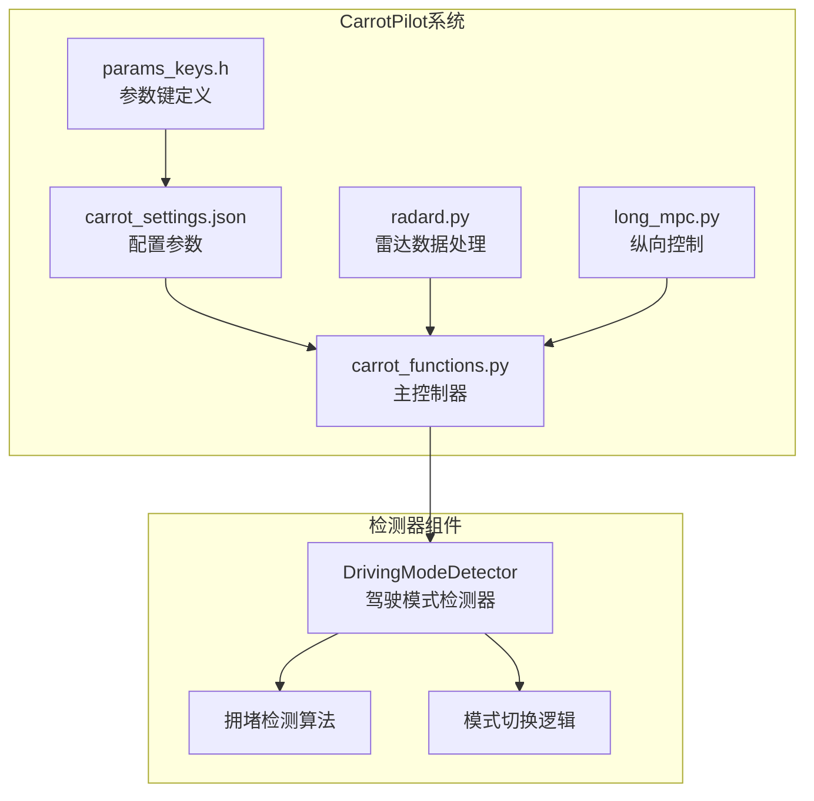
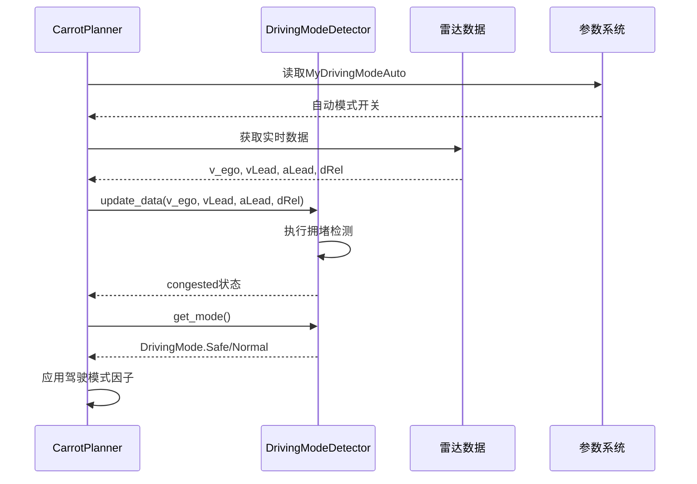
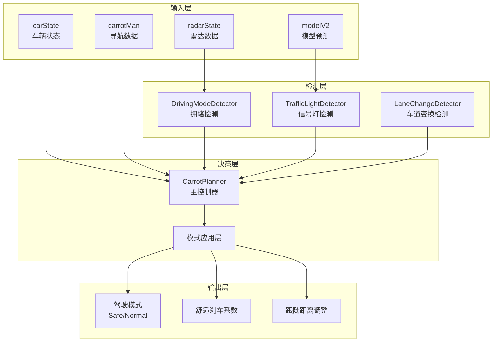
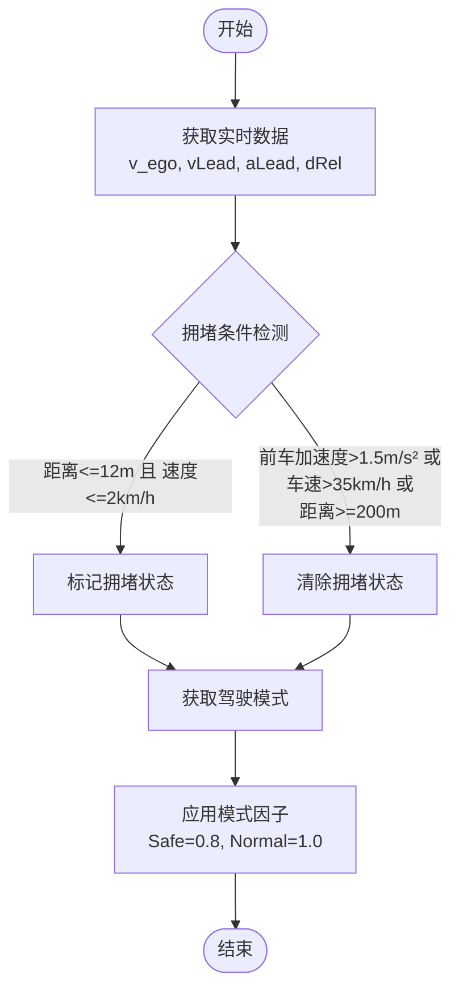
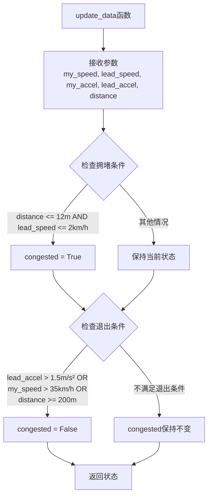
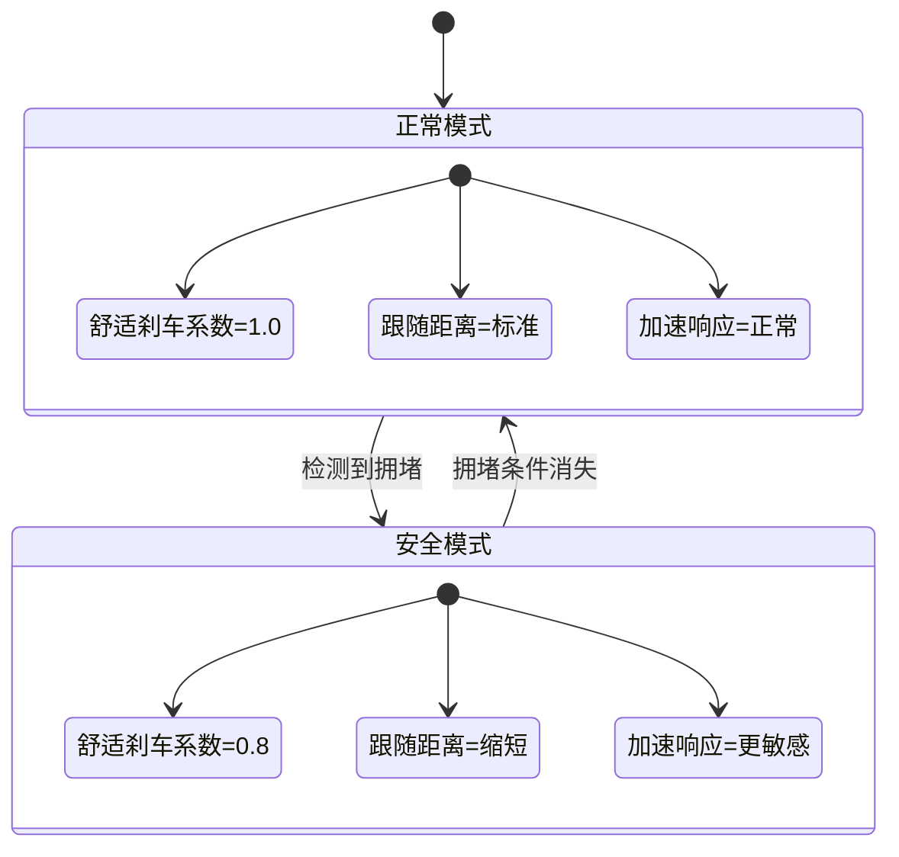
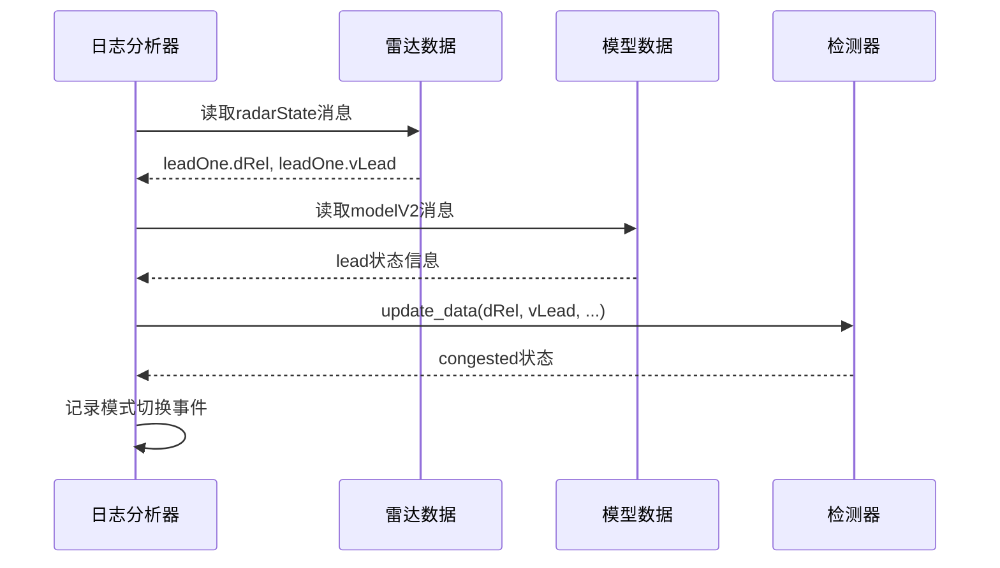
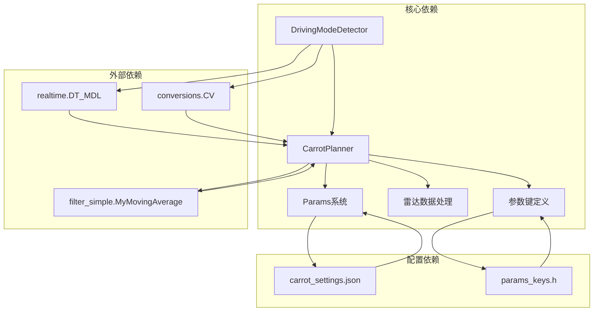

# 驾驶模式检测器

<cite>
**本文档引用的文件**
- [selfdrive/carrot/carrot_functions.py](file://selfdrive/carrot/carrot_functions.py)
- [selfdrive/carrot_settings.json](file://selfdrive/carrot_settings.json)
- [common/params_keys.h](file://common/params_keys.h)
- [selfdrive/controls/radard.py](file://selfdrive/controls/radard.py)
- [selfdrive/controls/lib/longitudinal_mpc_lib/long_mpc.py](file://selfdrive/controls/lib/longitudinal_mpc_lib/long_mpc.py)
- [verify_new_thresholds.py](file://verify_new_thresholds.py)
- [check_lead_data.py](file://check_lead_data.py)
- [find_acc_enabled_missed.py](file://find_acc_enabled_missed.py)
</cite>

## 目录
1. [简介](#简介)
2. [项目结构](#项目结构)
3. [核心组件](#核心组件)
4. [架构概览](#架构概览)
5. [详细组件分析](#详细组件分析)
6. [依赖关系分析](#依赖关系分析)
7. [性能考虑](#性能考虑)
8. [故障排除指南](#故障排除指南)
9. [结论](#结论)

## 简介

驾驶模式检测器（DrivingModeDetector）是CarrotPilot系统中的一个关键组件，负责根据实时交通状况自动切换驾驶模式。该系统能够智能地在安全模式（Safe）和正常模式（Normal）之间进行切换，以确保驾驶的安全性和舒适性。

该检测器通过分析前车距离、速度和加速度等关键参数，结合车辆自身的行驶状态，动态判断当前是否处于拥堵状态。当检测到前车距离过近且相对速度较低时，系统会自动切换到安全模式；当检测到前车加速或距离足够大时，系统会切换回正常模式。

## 项目结构

CarrotPilot系统的驾驶模式检测器主要分布在以下文件中：

**图表来源**
- [selfdrive/carrot/carrot_functions.py:524-543](file://selfdrive/carrot/carrot_functions.py#L524-L543)
- [selfdrive/carrot_settings.json:1606-1629](file://selfdrive/carrot_settings.json#L1606-L1629)

**章节来源**
- [selfdrive/carrot/carrot_functions.py:1-543](file://selfdrive/carrot/carrot_functions.py#L1-L543)
- [selfdrive/carrot_settings.json:1606-1629](file://selfdrive/carrot_settings.json#L1606-L1629)

## 核心组件

### DrivingModeDetector类

DrivingModeDetector是系统的核心组件，负责实现拥堵检测和模式切换逻辑。该类包含以下关键特性：

#### 主要属性
- `congested`: 布尔值，表示当前是否处于拥堵状态
- `speed_threshold`: 速度阈值（km/h），默认2 km/h
- `accel_threshold`: 加速度阈值（m/s²），默认1.5 m/s²  
- `distance_threshold`: 距离阈值（m），默认12 m
- `lead_speed_exit_threshold`: 前车速度退出阈值（km/h），默认35 km/h

#### 核心方法
- `update_data()`: 更新实时数据并执行拥堵检测
- `get_mode()`: 返回当前驾驶模式

**章节来源**
- [selfdrive/carrot/carrot_functions.py:524-543](file://selfdrive/carrot/carrot_functions.py#L524-L543)

### CarrotPlanner集成

CarrotPlanner类集成了DrivingModeDetector，实现了自动模式切换功能：

**图表来源**
- [selfdrive/carrot/carrot_functions.py:143-156](file://selfdrive/carrot/carrot_functions.py#L143-L156)
- [selfdrive/carrot/carrot_functions.py:377-386](file://selfdrive/carrot/carrot_functions.py#L377-L386)

**章节来源**
- [selfdrive/carrot/carrot_functions.py:49-100](file://selfdrive/carrot/carrot_functions.py#L49-L100)
- [selfdrive/carrot/carrot_functions.py:346-400](file://selfdrive/carrot/carrot_functions.py#L346-L400)

## 架构概览

### 整体架构设计

**图表来源**
- [selfdrive/carrot/carrot_functions.py:346-420](file://selfdrive/carrot/carrot_functions.py#L346-L420)
- [selfdrive/controls/radard.py:269-319](file://selfdrive/controls/radard.py#L269-L319)

### 数据流处理

系统采用多传感器融合的数据处理流程：

**图表来源**
- [selfdrive/carrot/carrot_functions.py:532-542](file://selfdrive/carrot/carrot_functions.py#L532-L542)

**章节来源**
- [selfdrive/carrot/carrot_functions.py:377-386](file://selfdrive/carrot/carrot_functions.py#L377-L386)
- [selfdrive/carrot/carrot_functions.py:524-543](file://selfdrive/carrot/carrot_functions.py#L524-L543)

## 详细组件分析

### 拥堵检测算法

拥堵检测算法是DrivingModeDetector的核心，采用多条件综合判断：

#### 检测条件

1. **拥堵条件**（进入拥堵状态）
   - 前车距离 ≤ 12米
   - 前车速度 ≤ 2 km/h
   - 同时满足以上两个条件时，标记为拥堵状态

2. **非拥堵条件**（退出拥堵状态）
   - 前车加速度 > 1.5 m/s²
   - 或车辆自身速度 > 35 km/h  
   - 或前车距离 ≥ 200 米

#### 算法实现

**图表来源**
- [selfdrive/carrot/carrot_functions.py:532-539](file://selfdrive/carrot/carrot_functions.py#L532-L539)

**章节来源**
- [selfdrive/carrot/carrot_functions.py:524-543](file://selfdrive/carrot/carrot_functions.py#L524-L543)

### 驾驶模式自动切换机制

#### 模式切换逻辑

**图表来源**
- [selfdrive/carrot/carrot_functions.py:370-376](file://selfdrive/carrot/carrot_functions.py#L370-L376)
- [selfdrive/carrot/carrot_functions.py:541-542](file://selfdrive/carrot/carrot_functions.py#L541-L542)

#### 切换触发条件

1. **进入安全模式**：
   - 前车距离 ≤ 12米
   - 前车速度 ≤ 2 km/h
   - 检测到连续拥堵状态

2. **退出安全模式**：
   - 前车加速度 > 1.5 m/s²
   - 或车辆自身速度 > 35 km/h
   - 或前车距离 ≥ 200 米

**章节来源**
- [selfdrive/carrot/carrot_functions.py:377-386](file://selfdrive/carrot/carrot_functions.py#L377-L386)
- [selfdrive/carrot/carrot_functions.py:532-542](file://selfdrive/carrot/carrot_functions.py#L532-L542)

### 阈值参数详解

#### 速度阈值参数

| 参数名称 | 默认值 | 单位 | 作用 | 调优建议 |
|---------|--------|------|------|----------|
| speed_threshold | 2 | km/h | 判断前车是否静止的阈值 | 低速城市路况：1-3 km/h 高速公路：3-5 km/h |
| lead_speed_exit_threshold | 35 | km/h | 退出拥堵状态的速度阈值 | 城市：25-35 km/h 高速：40-50 km/h |

#### 加速度阈值参数

| 参数名称 | 默认值 | 单位 | 作用 | 调优建议 |
|---------|--------|------|------|----------|
| accel_threshold | 1.5 | m/s² | 判断前车是否加速的阈值 | 城市拥堵：1.0-2.0 m/s² 高速：2.0-3.0 m/s² |

#### 距离阈值参数

| 参数名称 | 默认值 | 单位 | 作用 | 调优建议 |
|---------|--------|------|------|----------|
| distance_threshold | 12 | m | 判断前车是否过近的阈值 | 城市：8-15 m 高速：15-25 m |
| 距离上限 | 200 | m | 退出拥堵状态的距离阈值 | 一般设为200m即可 |

**章节来源**
- [selfdrive/carrot/carrot_functions.py:526-530](file://selfdrive/carrot/carrot_functions.py#L526-L530)
- [selfdrive/carrot_settings.json:1606-1629](file://selfdrive/carrot_settings.json#L1606-L1629)

### 实时数据处理示例

系统提供了多种方式来验证和调试驾驶模式检测器：

#### 数据采集示例

**图表来源**
- [check_lead_data.py:55-109](file://check_lead_data.py#L55-L109)
- [find_acc_enabled_missed.py:67-114](file://find_acc_enabled_missed.py#L67-L114)

**章节来源**
- [check_lead_data.py:55-109](file://check_lead_data.py#L55-L109)
- [find_acc_enabled_missed.py:67-114](file://find_acc_enabled_missed.py#L67-L114)

## 依赖关系分析

### 组件依赖关系

**图表来源**
- [selfdrive/carrot/carrot_functions.py:1-12](file://selfdrive/carrot/carrot_functions.py#L1-L12)
- [common/params_keys.h:162-190](file://common/params_keys.h#L162-L190)

### 参数配置关系

系统通过参数键定义实现灵活的配置管理：

| 参数组 | 参数名称 | 类型 | 默认值 | 作用域 |
|--------|----------|------|--------|--------|
| ACCEL | MyDrivingMode | 整数 | 3 | 驾驶模式设置 |
| ACCEL | MyDrivingModeAuto | 整数 | 0 | 自动模式开关 |
| SPEED | TrafficLightDetectMode | 整数 | 2 | 信号灯检测模式 |
| LONG | ComfortBrake | 浮点数 | 2.4 | 舒适刹车系数 |

**章节来源**
- [common/params_keys.h:162-190](file://common/params_keys.h#L162-L190)
- [selfdrive/carrot_settings.json:1606-1641](file://selfdrive/carrot_settings.json#L1606-L1641)

## 性能考虑

### 实时性要求

驾驶模式检测器需要在实时环境中运行，对性能有严格要求：

1. **处理频率**：每20帧（约0.4秒）更新一次
2. **计算复杂度**：O(1) 时间复杂度，仅进行简单的数值比较
3. **内存占用**：仅维护少量状态变量，内存开销极小

### 优化策略

1. **阈值调优**：根据不同的驾驶环境调整阈值参数
2. **状态缓存**：避免重复计算相同的状态
3. **条件简化**：使用高效的条件判断语句

## 故障排除指南

### 常见问题及解决方案

#### 问题1：模式切换过于频繁
**症状**：驾驶模式在Safe和Normal之间频繁切换
**可能原因**：
- 阈值设置过于敏感
- 传感器数据噪声较大
- 驾驶环境变化剧烈

**解决方案**：
1. 提高distance_threshold至15-20米
2. 降低accel_threshold至1.0-1.2 m/s²
3. 增加检测周期至0.6秒

#### 问题2：无法检测到拥堵状态
**症状**：即使在严重拥堵中也不切换到Safe模式
**可能原因**：
- distance_threshold设置过大
- speed_threshold设置过高
- lead_speed_exit_threshold设置过低

**解决方案**：
1. 降低distance_threshold至8-12米
2. 将speed_threshold降至1-2 km/h
3. 提高lead_speed_exit_threshold至40-50 km/h

#### 问题3：误触发安全模式
**症状**：在正常行驶中意外切换到Safe模式
**可能原因**：
- 前车突然减速但距离较远
- 传感器数据异常
- 阈值设置不当

**解决方案**：
1. 增加distance_threshold至15-25米
2. 提高lead_speed_exit_threshold至35-45 km/h
3. 添加数据滤波处理

**章节来源**
- [verify_new_thresholds.py:1-101](file://verify_new_thresholds.py#L1-L101)

### 调试工具使用

系统提供了多种调试工具来帮助分析问题：

1. **check_lead_data.py**：分析前车数据变化
2. **find_acc_enabled_missed.py**：查找ACC启用事件
3. **verify_new_thresholds.py**：验证新阈值效果

这些工具可以帮助开发者理解系统行为并进行参数调优。

## 结论

驾驶模式检测器通过简单而有效的拥堵检测算法，实现了智能的驾驶模式自动切换功能。其设计具有以下特点：

1. **算法简洁**：仅使用四个关键阈值参数，易于理解和调优
2. **实时性强**：O(1)复杂度，适合实时应用
3. **可配置性**：通过参数系统支持灵活的阈值调整
4. **鲁棒性好**：对传感器噪声具有一定容忍度

该系统为CarrotPilot提供了重要的安全保障，在保证驾驶舒适性的同时，确保了行车安全。通过合理的参数调优和持续的测试验证，可以进一步提升系统的性能和可靠性。