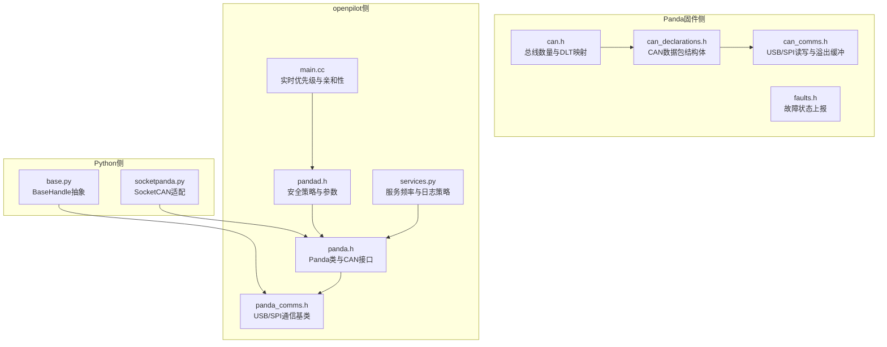
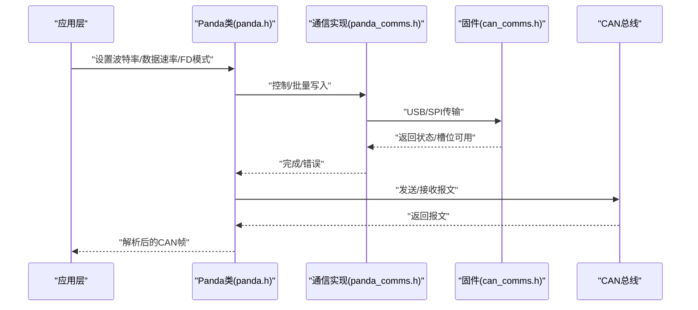
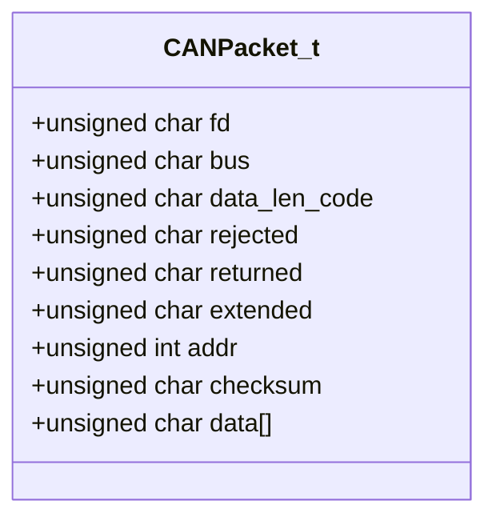
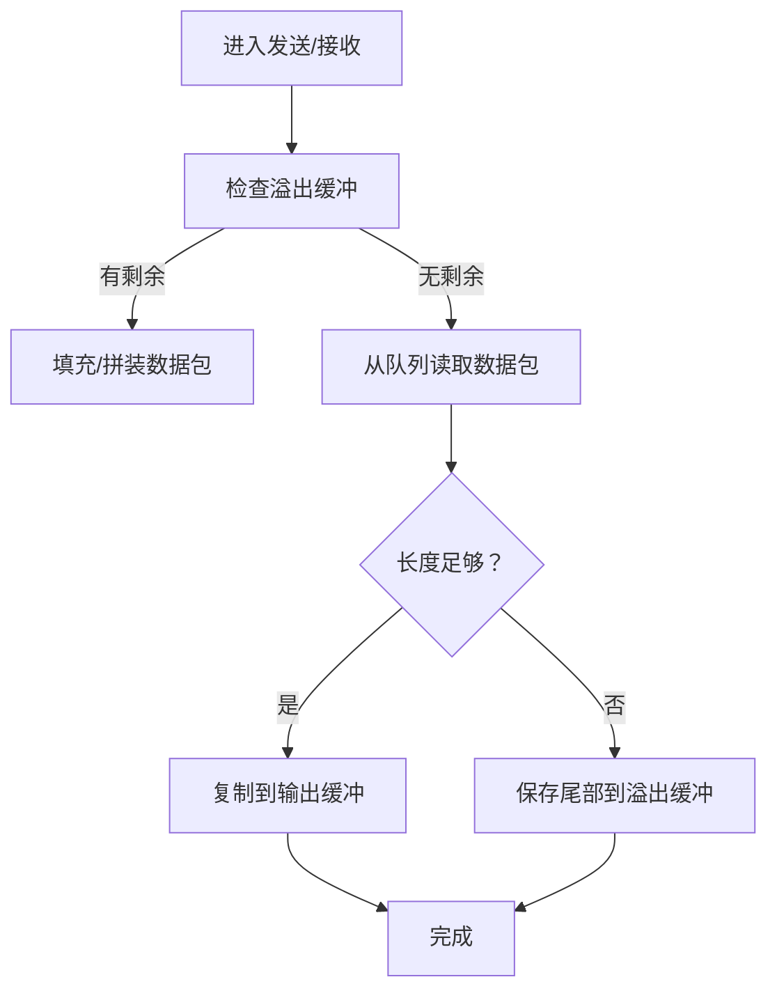
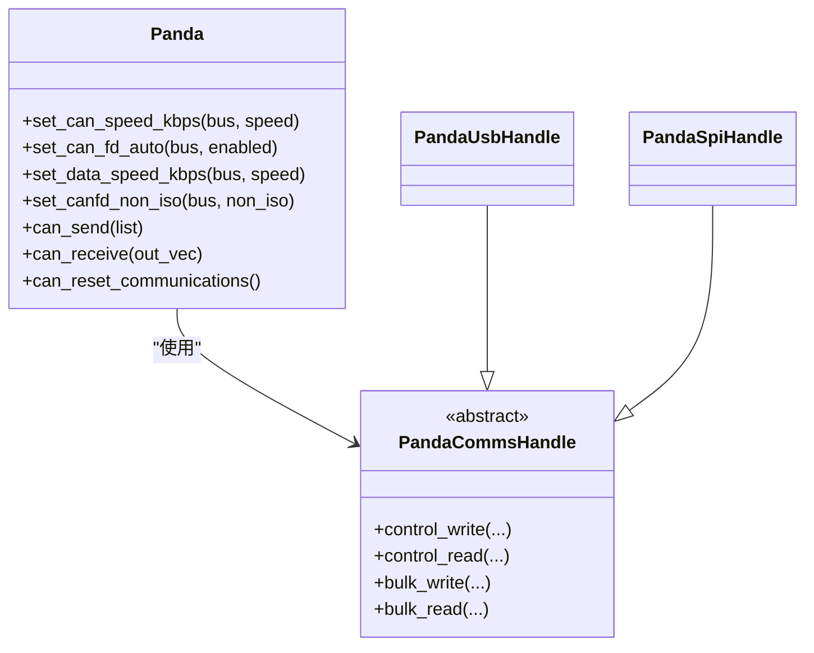
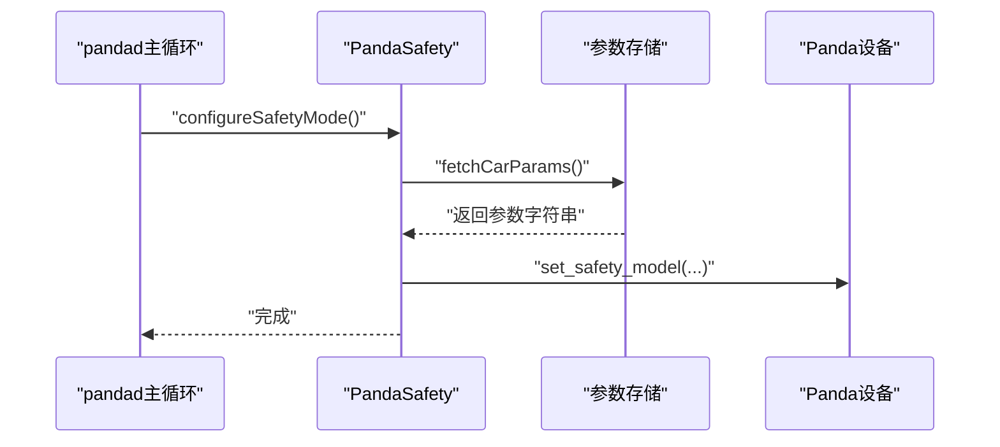
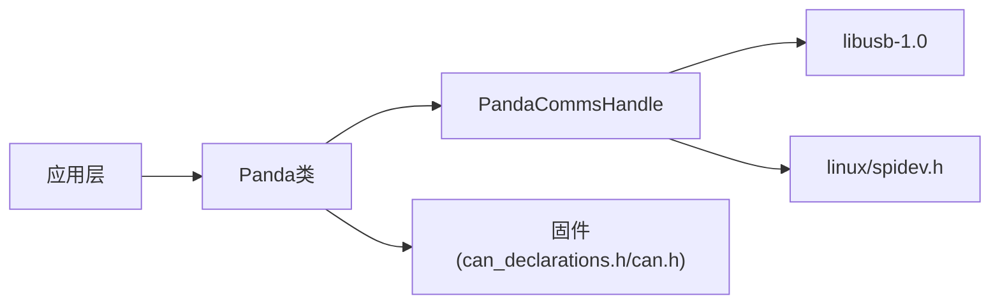

# CAN总线通信

<cite>
**本文引用的文件**
- [panda/board/can.h](file://panda/board/can.h)
- [panda/board/can_declarations.h](file://panda/board/can_declarations.h)
- [panda/board/can_comms.h](file://panda/board/can_comms.h)
- [panda/board/faults.h](file://panda/board/faults.h)
- [panda/python/base.py](file://panda/python/base.py)
- [panda/python/socketpanda.py](file://panda/python/socketpanda.py)
- [selfdrive/pandad/panda.h](file://selfdrive/pandad/panda.h)
- [selfdrive/pandad/panda_comms.h](file://selfdrive/pandad/panda_comms.h)
- [selfdrive/pandad/pandad.h](file://selfdrive/pandad/pandad.h)
- [selfdrive/pandad/main.cc](file://selfdrive/pandad/main.cc)
- [cereal/services.py](file://cereal/services.py)
</cite>

## 目录
1. [简介](#简介)
2. [项目结构](#项目结构)
3. [核心组件](#核心组件)
4. [架构总览](#架构总览)
5. [详细组件分析](#详细组件分析)
6. [依赖分析](#依赖分析)
7. [性能考量](#性能考量)
8. [故障排查指南](#故障排查指南)
9. [结论](#结论)
10. [附录](#附录)

## 简介
本文件面向CAN总线通信模块，聚焦于Panda设备的CAN控制器实现与openpilot系统集成。内容覆盖标准CAN与FD-CAN两种模式、消息收发机制（含仲裁丢失与错误帧处理）、配置项（波特率、过滤器、中断）、openpilot中的消息队列与实时性保障，并提供来自仓库的真实代码路径示例，帮助开发者快速理解并正确使用CAN接口。

## 项目结构
围绕CAN通信的关键目录与文件如下：
- Panda固件侧：定义CAN数据包格式、读写事务与缓冲区管理
- Python侧：USB/SPI/SocketCAN抽象与通信句柄
- openpilot侧：pandad守护进程、Panda类封装、安全策略与实时调度

**图表来源**
- [panda/board/can.h:1-8](file://panda/board/can.h#L1-L8)
- [panda/board/can_declarations.h:1-30](file://panda/board/can_declarations.h#L1-L30)
- [panda/board/can_comms.h:1-123](file://panda/board/can_comms.h#L1-L123)
- [panda/board/faults.h:1-26](file://panda/board/faults.h#L1-L26)
- [panda/python/base.py:1-62](file://panda/python/base.py#L1-L62)
- [panda/python/socketpanda.py:1-95](file://panda/python/socketpanda.py#L1-L95)
- [selfdrive/pandad/panda.h:1-100](file://selfdrive/pandad/panda.h#L1-L100)
- [selfdrive/pandad/panda_comms.h:1-94](file://selfdrive/pandad/panda_comms.h#L1-L94)
- [selfdrive/pandad/pandad.h:1-28](file://selfdrive/pandad/pandad.h#L1-L28)
- [selfdrive/pandad/main.cc:1-23](file://selfdrive/pandad/main.cc#L1-L23)
- [cereal/services.py:1-133](file://cereal/services.py#L1-L133)

**章节来源**
- [panda/board/can.h:1-8](file://panda/board/can.h#L1-L8)
- [panda/board/can_declarations.h:1-30](file://panda/board/can_declarations.h#L1-L30)
- [panda/board/can_comms.h:1-123](file://panda/board/can_comms.h#L1-L123)
- [panda/board/faults.h:1-26](file://panda/board/faults.h#L1-L26)
- [panda/python/base.py:1-62](file://panda/python/base.py#L1-L62)
- [panda/python/socketpanda.py:1-95](file://panda/python/socketpanda.py#L1-L95)
- [selfdrive/pandad/panda.h:1-100](file://selfdrive/pandad/panda.h#L1-L100)
- [selfdrive/pandad/panda_comms.h:1-94](file://selfdrive/pandad/panda_comms.h#L1-L94)
- [selfdrive/pandad/pandad.h:1-28](file://selfdrive/pandad/pandad.h#L1-L28)
- [selfdrive/pandad/main.cc:1-23](file://selfdrive/pandad/main.cc#L1-L23)
- [cereal/services.py:1-133](file://cereal/services.py#L1-L133)

## 核心组件
- CAN数据包与总线常量
  - 总线数量、BUS数与DLT长度映射在固件侧定义，用于标准CAN与FD-CAN的数据长度编码。
  - 参考路径：[panda/board/can.h:1-8](file://panda/board/can.h#L1-L8)
- CAN数据包结构体
  - 定义了包含扩展ID、数据长度码、数据字段在内的打包结构体；不同MCU平台区分FD与非FD最大数据长度。
  - 参考路径：[panda/board/can_declarations.h:1-30](file://panda/board/can_declarations.h#L1-L30)
- 通信读写与溢出缓冲
  - USB/SPI批量传输中，按固定头部大小与数据长度拼装/拆解CAN数据包；支持跨传输的溢出缓冲与复用。
  - 参考路径：[panda/board/can_comms.h:1-123](file://panda/board/can_comms.h#L1-L123)
- 故障状态
  - 提供临时/永久故障标记与恢复逻辑，便于上层监控与保护。
  - 参考路径：[panda/board/faults.h:1-26](file://panda/board/faults.h#L1-L26)
- Python通信抽象
  - 定义通用控制/批量读写接口与USB/SPI句柄；SocketCAN适配器提供与Linux SocketCAN的互通。
  - 参考路径：[panda/python/base.py:1-62](file://panda/python/base.py#L1-L62)，[panda/python/socketpanda.py:1-95](file://panda/python/socketpanda.py#L1-L95)
- openpilot侧Panda类
  - 封装波特率设置、FD自动切换、数据速率、非ISO模式、发送/接收、复位等接口。
  - 参考路径：[selfdrive/pandad/panda.h:1-100](file://selfdrive/pandad/panda.h#L1-L100)
- 通信基类与USB/SPI实现
  - 抽象通信接口与具体USB/SPI实现，提供锁与重试、ACK等待、缓冲区管理。
  - 参考路径：[selfdrive/pandad/panda_comms.h:1-94](file://selfdrive/pandad/panda_comms.h#L1-L94)
- 安全策略与参数
  - 从参数存储加载车辆参数，动态配置安全模型与多路复用模式。
  - 参考路径：[selfdrive/pandad/pandad.h:1-28](file://selfdrive/pandad/pandad.h#L1-L28)
- 实时性与调度
  - 在非PC环境下设置实时优先级与CPU亲和性，确保pandad线程稳定运行。
  - 参考路径：[selfdrive/pandad/main.cc:1-23](file://selfdrive/pandad/main.cc#L1-L23)
- 服务频率与日志策略
  - 定义CAN服务的频率与日志衰减策略，影响消息队列压力与带宽占用。
  - 参考路径：[cereal/services.py:1-133](file://cereal/services.py#L1-L133)

**章节来源**
- [panda/board/can.h:1-8](file://panda/board/can.h#L1-L8)
- [panda/board/can_declarations.h:1-30](file://panda/board/can_declarations.h#L1-L30)
- [panda/board/can_comms.h:1-123](file://panda/board/can_comms.h#L1-L123)
- [panda/board/faults.h:1-26](file://panda/board/faults.h#L1-L26)
- [panda/python/base.py:1-62](file://panda/python/base.py#L1-L62)
- [panda/python/socketpanda.py:1-95](file://panda/python/socketpanda.py#L1-L95)
- [selfdrive/pandad/panda.h:1-100](file://selfdrive/pandad/panda.h#L1-L100)
- [selfdrive/pandad/panda_comms.h:1-94](file://selfdrive/pandad/panda_comms.h#L1-L94)
- [selfdrive/pandad/pandad.h:1-28](file://selfdrive/pandad/pandad.h#L1-L28)
- [selfdrive/pandad/main.cc:1-23](file://selfdrive/pandad/main.cc#L1-L23)
- [cereal/services.py:1-133](file://cereal/services.py#L1-L133)

## 架构总览
下图展示了从应用到硬件的CAN通信链路，以及openpilot中pandad如何协调安全策略与实时调度：

**图表来源**
- [selfdrive/pandad/panda.h:60-98](file://selfdrive/pandad/panda.h#L60-L98)
- [selfdrive/pandad/panda_comms.h:20-94](file://selfdrive/pandad/panda_comms.h#L20-L94)
- [panda/board/can_comms.h:23-123](file://panda/board/can_comms.h#L23-L123)

## 详细组件分析

### 组件A：CAN数据包与FD-CAN支持
- 数据包结构
  - 包含扩展ID、数据长度码、BUS号、FD标志、校验等字段，支持标准与FD两种模式。
  - 参考路径：[panda/board/can_declarations.h:15-30](file://panda/board/can_declarations.h#L15-L30)
- 总线与长度映射
  - 固定总线数量与DLT到字节长度映射，用于计算数据段长度。
  - 参考路径：[panda/board/can.h:1-8](file://panda/board/can.h#L1-L8)
- FD-CAN能力
  - 不同MCU平台定义最大数据长度差异，FD模式下可达64字节。
  - 参考路径：[panda/board/can_declarations.h:8-13](file://panda/board/can_declarations.h#L8-L13)

**图表来源**
- [panda/board/can_declarations.h:15-30](file://panda/board/can_declarations.h#L15-L30)

**章节来源**
- [panda/board/can_declarations.h:1-30](file://panda/board/can_declarations.h#L1-L30)
- [panda/board/can.h:1-8](file://panda/board/can.h#L1-L8)

### 组件B：发送与接收流程（含溢出缓冲）
- 发送流程
  - 批量组装CAN数据包，若不足一包则暂存至溢出缓冲；完成后调用发送函数并刷新槽位。
  - 参考路径：[panda/board/can_comms.h:58-105](file://panda/board/can_comms.h#L58-L105)
- 接收流程
  - 从环形队列取出数据包，按头部+数据长度复制；若剩余不足则放入溢出缓冲以供下次读取。
  - 参考路径：[panda/board/can_comms.h:23-54](file://panda/board/can_comms.h#L23-L54)
- 复位与恢复
  - 连接开始时重置溢出缓冲；当槽位可用时恢复USB/SPI传输。
  - 参考路径：[panda/board/can_comms.h:107-122](file://panda/board/can_comms.h#L107-L122)

**图表来源**
- [panda/board/can_comms.h:23-105](file://panda/board/can_comms.h#L23-L105)

**章节来源**
- [panda/board/can_comms.h:1-123](file://panda/board/can_comms.h#L1-L123)

### 组件C：openpilot侧Panda类与配置
- 关键接口
  - 设置波特率、FD自动切换、数据速率、非ISO模式、发送/接收、复位通信。
  - 参考路径：[selfdrive/pandad/panda.h:81-87](file://selfdrive/pandad/panda.h#L81-L87)
- 数据结构
  - CAN头部与帧结构体，包含BUS号、扩展ID、长度码、返回/拒绝标志等。
  - 参考路径：[selfdrive/pandad/panda.h:28-43](file://selfdrive/pandad/panda.h#L28-L43)
- 通信封装
  - 通过USB/SPI句柄进行控制/批量传输，支持锁与超时。
  - 参考路径：[selfdrive/pandad/panda_comms.h:20-94](file://selfdrive/pandad/panda_comms.h#L20-L94)

**图表来源**
- [selfdrive/pandad/panda.h:46-99](file://selfdrive/pandad/panda.h#L46-L99)
- [selfdrive/pandad/panda_comms.h:20-94](file://selfdrive/pandad/panda_comms.h#L20-L94)

**章节来源**
- [selfdrive/pandad/panda.h:1-100](file://selfdrive/pandad/panda.h#L1-L100)
- [selfdrive/pandad/panda_comms.h:1-94](file://selfdrive/pandad/panda_comms.h#L1-L94)

### 组件D：安全策略与实时性
- 安全策略
  - 从参数存储加载车辆参数，动态配置安全模型与多路复用模式，避免误操作。
  - 参考路径：[selfdrive/pandad/pandad.h:11-27](file://selfdrive/pandad/pandad.h#L11-L27)
- 实时性
  - 非PC环境设置实时优先级与CPU亲和性，降低抖动。
  - 参考路径：[selfdrive/pandad/main.cc:11-17](file://selfdrive/pandad/main.cc#L11-L17)

**图表来源**
- [selfdrive/pandad/pandad.h:11-27](file://selfdrive/pandad/pandad.h#L11-L27)
- [selfdrive/pandad/panda.h:64-66](file://selfdrive/pandad/panda.h#L64-L66)

**章节来源**
- [selfdrive/pandad/pandad.h:1-28](file://selfdrive/pandad/pandad.h#L1-L28)
- [selfdrive/pandad/main.cc:1-23](file://selfdrive/pandad/main.cc#L1-L23)

### 组件E：与openpilot的消息队列与日志
- 服务频率
  - CAN服务频率与日志衰减策略由services.py定义，影响消息队列压力与带宽占用。
  - 参考路径：[cereal/services.py:26-26](file://cereal/services.py#L26-L26)
- 日志策略
  - decimation参数控制日志采样频率，避免过载。
  - 参考路径：[cereal/services.py:104-133](file://cereal/services.py#L104-L133)

**章节来源**
- [cereal/services.py:1-133](file://cereal/services.py#L1-L133)

## 依赖分析
- 组件耦合
  - Panda类依赖通信实现（USB/SPI），通信实现依赖底层libusb/spidev。
  - 固件侧的can_comms.h依赖can_declarations.h与can.h提供的常量与结构体。
- 外部依赖
  - Linux SocketCAN（通过socketpanda.py）与libusb-1.0、linux/spidev头文件。
- 循环依赖
  - 未发现直接循环依赖；各层职责清晰（应用层/Panda类/通信实现/固件）。

**图表来源**
- [selfdrive/pandad/panda.h:46-99](file://selfdrive/pandad/panda.h#L46-L99)
- [selfdrive/pandad/panda_comms.h:13-13](file://selfdrive/pandad/panda_comms.h#L13-L13)
- [panda/board/can_declarations.h:1-30](file://panda/board/can_declarations.h#L1-L30)
- [panda/board/can.h:1-8](file://panda/board/can.h#L1-L8)

**章节来源**
- [selfdrive/pandad/panda.h:1-100](file://selfdrive/pandad/panda.h#L1-L100)
- [selfdrive/pandad/panda_comms.h:1-94](file://selfdrive/pandad/panda_comms.h#L1-L94)
- [panda/board/can_declarations.h:1-30](file://panda/board/can_declarations.h#L1-L30)
- [panda/board/can.h:1-8](file://panda/board/can.h#L1-L8)

## 性能考量
- 批量传输与槽位管理
  - 固件侧根据最小空闲槽位阈值决定是否恢复USB/SPI传输，避免拥塞。
  - 参考路径：[panda/board/can_comms.h:115-122](file://panda/board/can_comms.h#L115-L122)
- 缓冲区与溢出处理
  - 读写均采用溢出缓冲，减少跨传输碎片化，提升吞吐稳定性。
  - 参考路径：[panda/board/can_comms.h:21-21](file://panda/board/can_comms.h#L21-L21), [panda/board/can_comms.h:56-56](file://panda/board/can_comms.h#L56-L56)
- 实时调度
  - 在非PC平台设置实时优先级与CPU亲和性，降低中断与上下文切换开销。
  - 参考路径：[selfdrive/pandad/main.cc:11-17](file://selfdrive/pandad/main.cc#L11-L17)
- 服务频率与日志衰减
  - 合理设置CAN服务频率与decimation，平衡观测需求与系统负载。
  - 参考路径：[cereal/services.py:26-26](file://cereal/services.py#L26-L26), [cereal/services.py:120-125](file://cereal/services.py#L120-L125)

**章节来源**
- [panda/board/can_comms.h:115-122](file://panda/board/can_comms.h#L115-L122)
- [selfdrive/pandad/main.cc:11-17](file://selfdrive/pandad/main.cc#L11-L17)
- [cereal/services.py:26, 120-125](file://cereal/services.py#L26,L120-L125)

## 故障排查指南
- 故障状态与恢复
  - 使用故障发生/恢复接口标记与清除故障，区分永久与临时故障。
  - 参考路径：[panda/board/faults.h:6-25](file://panda/board/faults.h#L6-L25)
- 通信异常定位
  - 检查USB/SPI句柄的错误码与重试逻辑，确认连接状态与健康度。
  - 参考路径：[selfdrive/pandad/panda_comms.h:54-55](file://selfdrive/pandad/panda_comms.h#L54-L55), [selfdrive/pandad/panda_comms.h:84-92](file://selfdrive/pandad/panda_comms.h#L84-L92)
- 消息丢失与缓冲溢出
  - SocketCAN侧可检测接收队列溢出标志，结合缓冲区大小调整策略。
  - 参考路径：[panda/python/socketpanda.py:30-44](file://panda/python/socketpanda.py#L30-L44)
- 安全策略生效验证
  - 确认安全模型已根据车辆参数正确配置，避免误发命令。
  - 参考路径：[selfdrive/pandad/pandad.h:14-19](file://selfdrive/pandad/pandad.h#L14-L19)

**章节来源**
- [panda/board/faults.h:1-26](file://panda/board/faults.h#L1-L26)
- [selfdrive/pandad/panda_comms.h:54-55](file://selfdrive/pandad/panda_comms.h#L54-L55)
- [selfdrive/pandad/panda_comms.h:84-92](file://selfdrive/pandad/panda_comms.h#L84-L92)
- [panda/python/socketpanda.py:30-44](file://panda/python/socketpanda.py#L30-L44)
- [selfdrive/pandad/pandad.h:14-19](file://selfdrive/pandad/pandad.h#L14-L19)

## 结论
本文件基于仓库源码梳理了Panda设备的CAN控制器实现与openpilot集成路径，覆盖标准CAN与FD-CAN、消息收发与溢出缓冲、配置项与实时性保障，并提供了可追溯的代码路径。建议在实际部署中结合服务频率、缓冲区与槽位策略，配合安全模型与故障监控，确保通信稳定与系统安全。

## 附录
- 配置参数速览（来自代码）
  - 波特率设置：见 [selfdrive/pandad/panda.h:81-81](file://selfdrive/pandad/panda.h#L81-L81)
  - FD自动切换：见 [selfdrive/pandad/panda.h:82-82](file://selfdrive/pandad/panda.h#L82-L82)
  - 数据速率设置：见 [selfdrive/pandad/panda.h:83-83](file://selfdrive/pandad/panda.h#L83-L83)
  - 非ISO模式：见 [selfdrive/pandad/panda.h:84-84](file://selfdrive/pandad/panda.h#L84-L84)
  - 发送/接收接口：见 [selfdrive/pandad/panda.h:85-86](file://selfdrive/pandad/panda.h#L85-L86)
  - 通信复位：见 [selfdrive/pandad/panda.h:87-87](file://selfdrive/pandad/panda.h#L87-L87)
- 错误码与故障
  - 故障发生/恢复接口：见 [panda/board/faults.h:6-25](file://panda/board/faults.h#L6-L25)
- 性能指标参考
  - 批量传输阈值与槽位恢复：见 [panda/board/can_comms.h:115-122](file://panda/board/can_comms.h#L115-L122)
  - 服务频率与日志衰减：见 [cereal/services.py](file://cereal/services.py#L26,L120-L125)