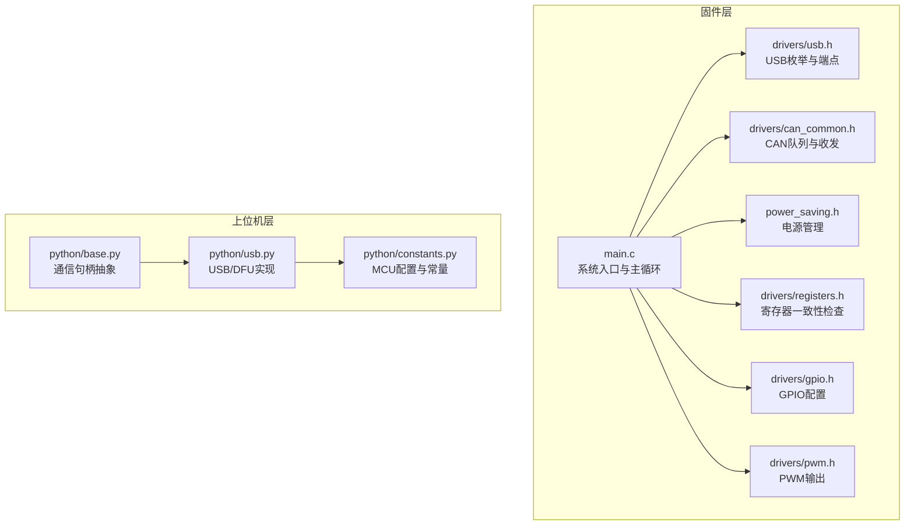
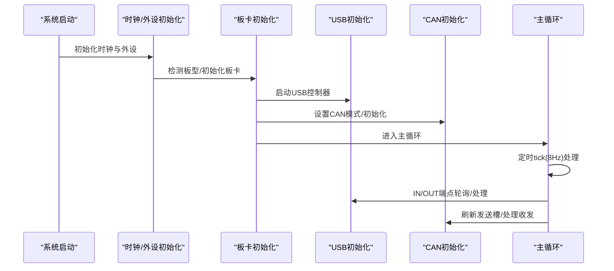
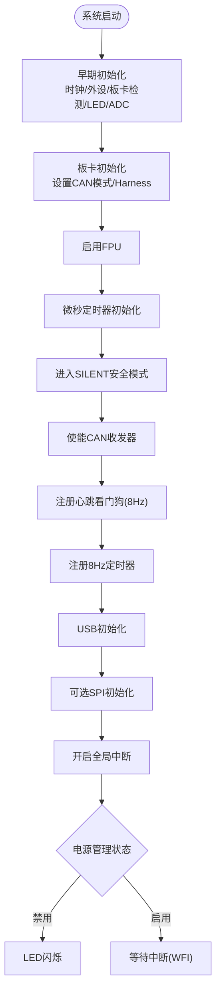
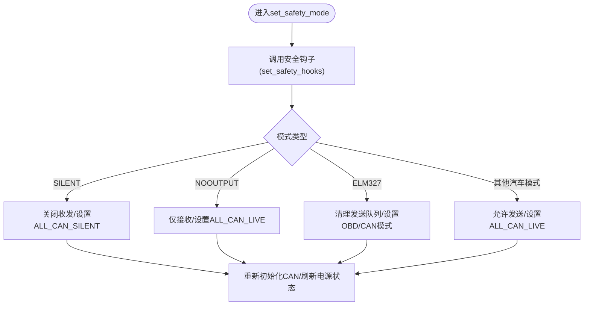
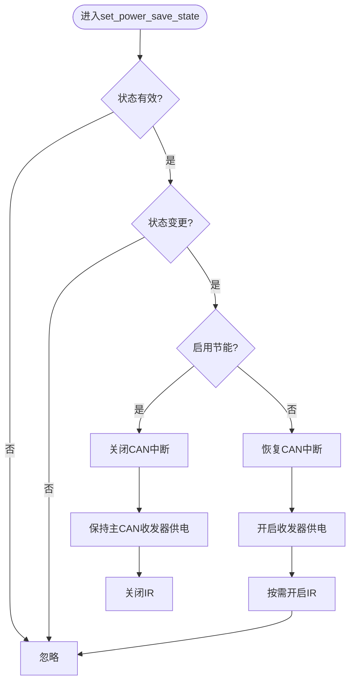
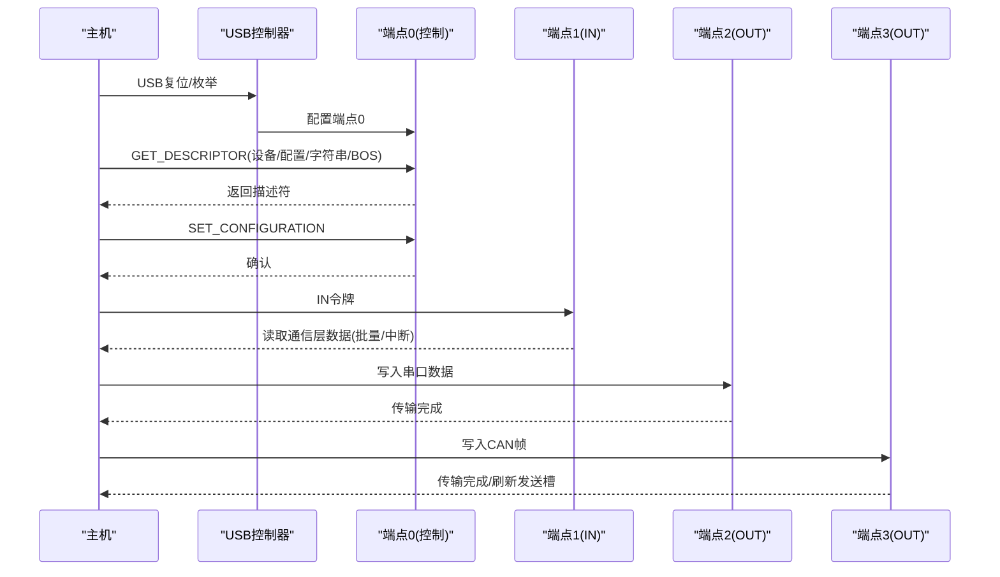
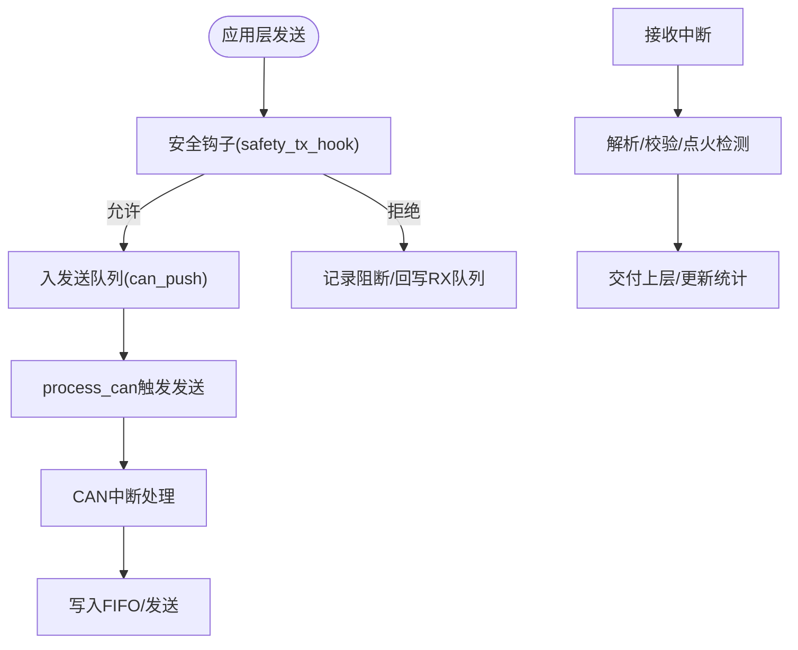
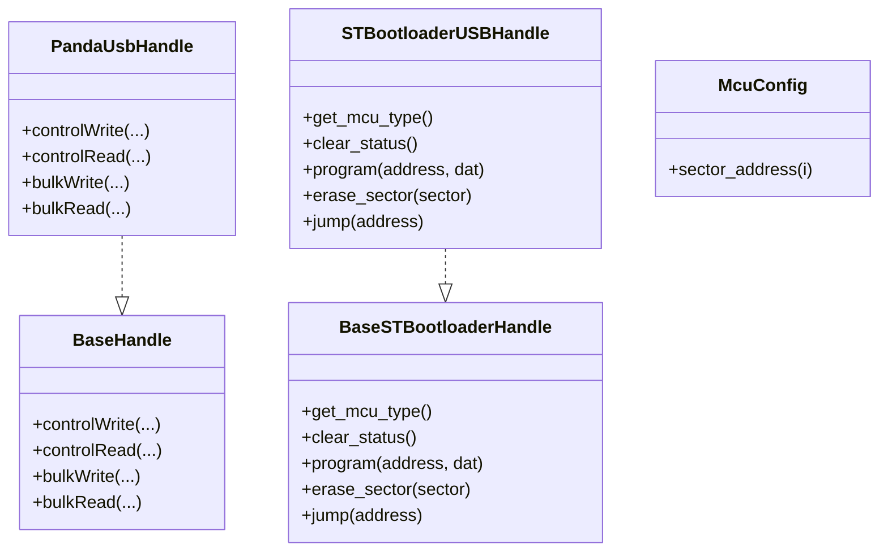
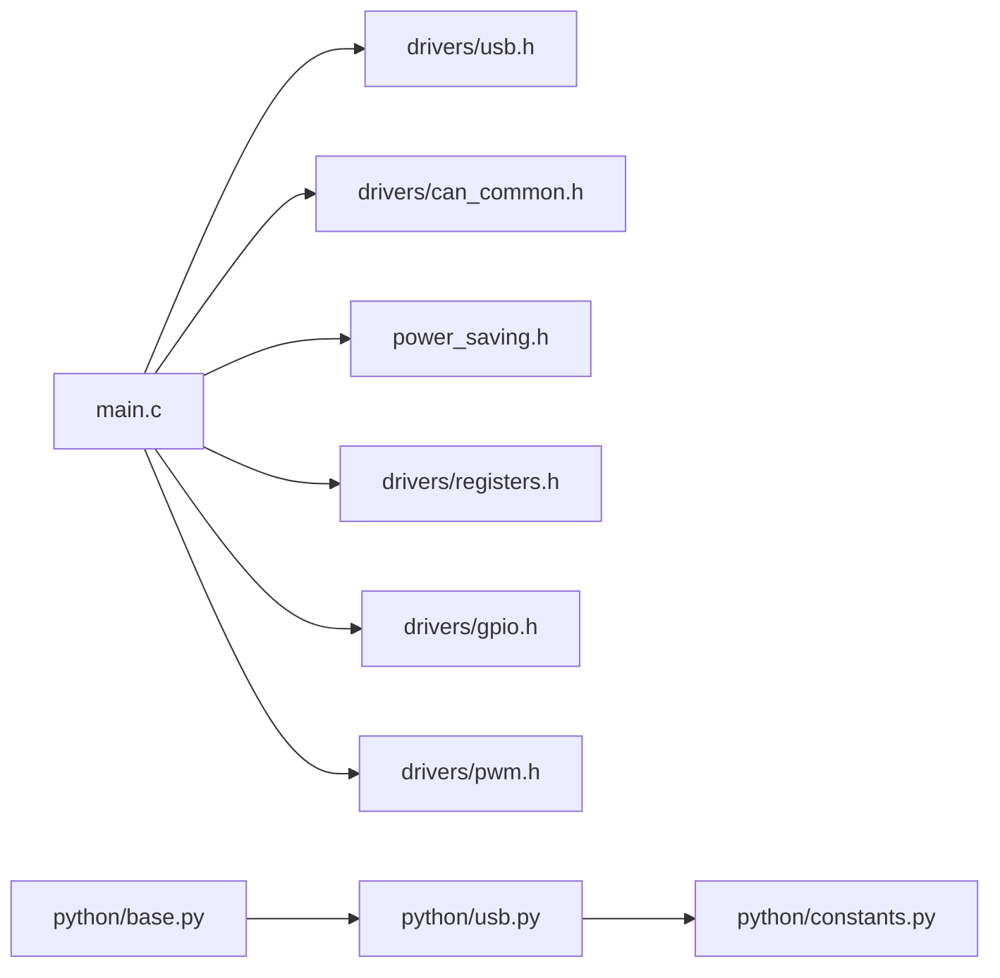

# Panda设备接口

<cite>
**本文引用的文件**
- [panda/board/main.c](file://panda/board/main.c)
- [panda/board/config.h](file://panda/board/config.h)
- [panda/board/drivers/usb.h](file://panda/board/drivers/usb.h)
- [panda/board/drivers/can_common.h](file://panda/board/drivers/can_common.h)
- [panda/board/drivers/gpio.h](file://panda/board/drivers/gpio.h)
- [panda/board/drivers/pwm.h](file://panda/board/drivers/pwm.h)
- [panda/board/drivers/registers.h](file://panda/board/drivers/registers.h)
- [panda/board/power_saving.h](file://panda/board/power_saving.h)
- [panda/python/base.py](file://panda/python/base.py)
- [panda/python/usb.py](file://panda/python/usb.py)
- [panda/python/constants.py](file://panda/python/constants.py)
</cite>

## 目录
1. [引言](#引言)
2. [项目结构](#项目结构)
3. [核心组件](#核心组件)
4. [架构总览](#架构总览)
5. [详细组件分析](#详细组件分析)
6. [依赖关系分析](#依赖关系分析)
7. [性能考量](#性能考量)
8. [故障排查指南](#故障排查指南)
9. [结论](#结论)
10. [附录](#附录)

## 引言
本文件面向Panda设备的硬件接口与固件开发，系统化阐述启动流程、硬件初始化、系统配置、安全模式管理（SILENT、NOOUTPUT、ALLOUTPUT、ELM327）、电源管理模式与功耗控制、USB接口实现（设备枚举、端点配置、数据传输）、GPIO/PWM/ADC等外设使用方法，并结合实际代码路径给出初始化、状态查询与配置修改的参考位置。同时覆盖与上位机的通信协议与数据格式、固件升级（DFU）流程、调试与故障排除方法。

## 项目结构
Panda固件位于panda/board目录，采用分层组织：顶层入口main.c负责系统初始化与主循环；drivers目录提供USB、CAN、GPIO、PWM、寄存器检查等底层驱动；power_saving.h提供电源管理；python目录提供上位机侧通信抽象与DFU实现。

图表来源
- [panda/board/main.c:296-409](file://panda/board/main.c#L296-L409)
- [panda/board/drivers/usb.h:125-511](file://panda/board/drivers/usb.h#L125-L511)
- [panda/board/drivers/can_common.h:140-148](file://panda/board/drivers/can_common.h#L140-L148)
- [panda/board/power_saving.h:16-52](file://panda/board/power_saving.h#L16-L52)
- [panda/python/base.py:7-31](file://panda/python/base.py#L7-L31)
- [panda/python/usb.py:6-23](file://panda/python/usb.py#L6-L23)
- [panda/python/constants.py:10-63](file://panda/python/constants.py#L10-L63)

章节来源
- [panda/board/main.c:296-409](file://panda/board/main.c#L296-L409)
- [panda/board/config.h:18-33](file://panda/board/config.h#L18-L33)

## 核心组件
- 系统入口与主循环：完成时钟、外设、板卡检测、LED、ADC、风扇、看门狗、定时器初始化，进入主循环并按需睡眠。
- USB子系统：实现设备描述符、字符串描述符、BOS/WinUSB扩展、端点配置（EP1-BULK或INT、EP2-BULK、EP3-BULK），以及IN/OUT中断处理与批量读写。
- CAN子系统：多队列缓冲、总线映射、方向翻转、校验与发送钩子、异常点火信号解析。
- 外设驱动：GPIO模式/上下拉/开漏配置、PWM输出、寄存器一致性检查。
- 电源管理：在节能模式下关闭CAN中断、降低功耗，同时保持主CAN收发器供电以支持点火检测。
- 上位机通信：基于libusb的控制/批量传输，DFU编程流程。

章节来源
- [panda/board/main.c:296-409](file://panda/board/main.c#L296-L409)
- [panda/board/drivers/usb.h:125-511](file://panda/board/drivers/usb.h#L125-L511)
- [panda/board/drivers/can_common.h:140-148](file://panda/board/drivers/can_common.h#L140-L148)
- [panda/board/drivers/gpio.h:18-65](file://panda/board/drivers/gpio.h#L18-L65)
- [panda/board/drivers/pwm.h:5-36](file://panda/board/drivers/pwm.h#L5-L36)
- [panda/board/drivers/registers.h:13-44](file://panda/board/drivers/registers.h#L13-L44)
- [panda/board/power_saving.h:16-52](file://panda/board/power_saving.h#L16-L52)
- [panda/python/base.py:13-31](file://panda/python/base.py#L13-L31)
- [panda/python/usb.py:13-23](file://panda/python/usb.py#L13-L23)
- [panda/python/constants.py:10-63](file://panda/python/constants.py#L10-L63)

## 架构总览
Panda固件采用“主循环+中断驱动”的实时架构。主循环负责心跳、蜂鸣器、风扇、点火检测、安全模式切换与电源管理；USB与CAN通过中断驱动数据收发；GPIO/PWM用于外部控制与指示；寄存器一致性检查保障硬件状态稳定。

图表来源
- [panda/board/main.c:348-350](file://panda/board/main.c#L348-L350)
- [panda/board/main.c:355-367](file://panda/board/main.c#L355-L367)
- [panda/board/main.c:340-344](file://panda/board/main.c#L340-L344)

## 详细组件分析

### 启动流程与系统初始化
- 早期初始化：设置中断向量表、禁用中断、时钟与外设初始化、板卡类型检测、LED与ADC初始化。
- 板卡初始化：调用当前板卡init函数，设置CAN模式，若具备插线盒则初始化Harness。
- FPU启用：为浮点运算能力做准备。
- 微秒定时器：用于精确延时与时间戳。
- 安全模式默认值：进入SILENT模式，使能CAN收发器。
- 看门狗与定时器：注册心跳看门狗与8Hz定时器。
- USB初始化：在启用中断前进行，避免枚举失败。
- SPI可选：根据ENABLE_SPI宏与板卡能力选择性初始化。
- 主循环：根据电源管理状态决定LED闪烁或WFI低功耗。

图表来源
- [panda/board/main.c:296-409](file://panda/board/main.c#L296-L409)

章节来源
- [panda/board/main.c:296-409](file://panda/board/main.c#L296-L409)

### 安全模式管理（SILENT/NOOUTPUT/ALLOUTPUT/ELM327）
- 模式切换入口：set_safety_mode根据传入模式参数调用安全钩子，并重置阻断计数。
- 模式行为差异：
  - SILENT：关闭所有CAN中断与收发，仅保留点火检测。
  - NOOUTPUT：允许接收但不发送，CAN静默为“仅总线在线”。
  - ELM327：清除待发队列，根据参数选择OBD双线模式或普通模式，清零心跳丢失标志。
  - 其他汽车安全模式：允许发送，清零心跳丢失标志。
- 心跳丢失处理：若长时间无心跳且处于汽车安全模式，自动切换至SILENT并进入电源节省模式，同时关闭IR与风扇策略性功率输出。

图表来源
- [panda/board/main.c:64-119](file://panda/board/main.c#L64-L119)

章节来源
- [panda/board/main.c:64-119](file://panda/board/main.c#L64-L119)

### 电源管理模式与功耗控制
- 功能开关：set_power_save_state在有效状态间切换，记录当前状态。
- 关闭CAN中断：在启用节能时关闭对应CAN中断，减少唤醒源。
- 收发器控制：保持主CAN收发器供电以维持点火检测，其余在节能时关闭。
- IR与风扇：进入节能时关闭IR；风扇按SoM GPIO状态策略性调节。
- 退出节能：恢复CAN中断与收发器供电，必要时开启IR。

图表来源
- [panda/board/power_saving.h:16-52](file://panda/board/power_saving.h#L16-L52)

章节来源
- [panda/board/power_saving.h:16-52](file://panda/board/power_saving.h#L16-L52)

### USB接口实现（枚举、端点、传输）
- 设备描述符与限定描述符：VID/PID由编译期宏定义，设备描述符包含最大速度、类/子类/协议、厂商/产品/序列号等。
- 字符串描述符：语言ID、厂商名、产品名、配置名、WCID扩展（WinUSB 1.0/2.0）。
- BOS平台能力：WebUSB与Microsoft OS 2.0平台能力描述符。
- 接口与端点：
  - 接口0，Alt Setting 0：EP1(BULK)读CAN、EP2(BULK)写串口、EP3(BULK)写CAN。
  - 接口0，Alt Setting 1：EP1(INT)读CAN、EP2(BULK)写串口、EP3(BULK)写CAN。
- 控制请求处理：SET_CONFIGURATION、SET_ADDRESS、GET_DESCRIPTOR、SET_INTERFACE、MSFT扩展请求。
- 批量传输：
  - IN EP1：根据Alt Setting选择BULK或INT，从通信层读取数据并写入FIFO。
  - OUT EP2/EP3：分别写入串口与CAN发送队列，完成后刷新发送槽可用性。
- 中断处理：RX FIFO、Setup、IN/OUT端点中断，统一在usb_irqhandler中分派处理。

图表来源
- [panda/board/drivers/usb.h:125-511](file://panda/board/drivers/usb.h#L125-L511)
- [panda/board/drivers/usb.h:517-799](file://panda/board/drivers/usb.h#L517-L799)

章节来源
- [panda/board/drivers/usb.h:125-511](file://panda/board/drivers/usb.h#L125-L511)
- [panda/board/drivers/usb.h:517-799](file://panda/board/drivers/usb.h#L517-L799)

### CAN子系统（队列、收发、校验、方向）
- 缓冲区与队列：定义RX/TX队列大小，区分ITCM/DTCM内存布局；提供push/pop/empty/clear等原子操作。
- 总线配置：bus_config数组映射物理CAN通道到逻辑总线编号，支持转发规则与CANFD参数。
- 方向翻转：根据Harness状态交换bus与can_num映射，实现正反装兼容。
- 发送流程：安全钩子校验后入队，process_can触发发送；阻断时回写RX队列并更新校验。
- 校验：计算与验证消息校验和，确保完整性。
- 点火检测：针对特定品牌/地址的消息解析，更新ignition_can与计数器。

图表来源
- [panda/board/drivers/can_common.h:238-254](file://panda/board/drivers/can_common.h#L238-L254)
- [panda/board/drivers/can_common.h:140-148](file://panda/board/drivers/can_common.h#L140-L148)
- [panda/board/drivers/can_common.h:163-212](file://panda/board/drivers/can_common.h#L163-L212)

章节来源
- [panda/board/drivers/can_common.h:14-18](file://panda/board/drivers/can_common.h#L14-L18)
- [panda/board/drivers/can_common.h:20-43](file://panda/board/drivers/can_common.h#L20-L43)
- [panda/board/drivers/can_common.h:238-254](file://panda/board/drivers/can_common.h#L238-L254)
- [panda/board/drivers/can_common.h:163-212](file://panda/board/drivers/can_common.h#L163-L212)

### GPIO/PWM/ADC使用
- GPIO：
  - 模式设置：输入/输出/复用/模拟。
  - 输出类型：推挽/开漏。
  - 上下拉：无/上拉/下拉。
  - 输入读取与内部上拉检测。
- PWM：
  - 初始化：设置计数周期与通道模式，使能输出。
  - 调参：按百分比设置占空比。
- ADC：
  - 在main.c中初始化ADC，用于系统监控与传感器采集（具体通道与配置由板级实现）。

章节来源
- [panda/board/drivers/gpio.h:18-65](file://panda/board/drivers/gpio.h#L18-L65)
- [panda/board/drivers/pwm.h:5-36](file://panda/board/drivers/pwm.h#L5-L36)
- [panda/board/main.c:311-311](file://panda/board/main.c#L311-L311)

### 寄存器一致性检查与中断处理
- 寄存器检查：
  - register_set维护寄存器映射与掩码，定期check_registers比对期望值与实际值，发现偏差上报并触发故障。
- 中断处理：
  - tick_handler按8Hz节拍执行：蜂鸣器、风扇、Harness、看门狗、声音提示、bootkick、心跳计数、电源管理、寄存器检查等。
  - USB中断：RX FIFO、Setup、IN/OUT端点完成中断，统一处理控制/批量事务。

章节来源
- [panda/board/drivers/registers.h:13-44](file://panda/board/drivers/registers.h#L13-L44)
- [panda/board/drivers/registers.h:47-61](file://panda/board/drivers/registers.h#L47-L61)
- [panda/board/main.c:146-294](file://panda/board/main.c#L146-L294)
- [panda/board/drivers/usb.h:517-799](file://panda/board/drivers/usb.h#L517-L799)

### 与上位机通信协议与数据格式
- 通信抽象：BaseHandle定义controlWrite/controlRead/bulkWrite/bulkRead接口，便于替换不同后端（USB/网络）。
- USB后端：PandaUsbHandle直接透传libusb控制与批量操作。
- DFU升级：STBootloaderUSBHandle封装DFU协议，支持擦除扇区、写入块、设置地址指针、跳转等。
- 常量与MCU配置：McuConfig定义F4/H7的扇区、块大小、UID地址、应用/Bootstub地址等，用于识别与编程。

图表来源
- [panda/python/base.py:7-31](file://panda/python/base.py#L7-L31)
- [panda/python/usb.py:6-23](file://panda/python/usb.py#L6-L23)
- [panda/python/usb.py:27-99](file://panda/python/usb.py#L27-L99)
- [panda/python/constants.py:10-63](file://panda/python/constants.py#L10-L63)

章节来源
- [panda/python/base.py:7-31](file://panda/python/base.py#L7-L31)
- [panda/python/usb.py:6-23](file://panda/python/usb.py#L6-L23)
- [panda/python/usb.py:27-99](file://panda/python/usb.py#L27-L99)
- [panda/python/constants.py:10-63](file://panda/python/constants.py#L10-L63)

### 固件升级（DFU）与调试
- DFU流程要点：
  - 获取状态循环直到就绪。
  - 清理状态/中止异常状态。
  - 设置地址指针（Address Pointer）。
  - 分块写入（Block），补齐填充字节。
  - 最后一次下载空包触发执行。
- 调试：
  - 串口回显：debug_ring_callback将收到字符原样返回，支持“z”进入DFU、“x”复位。
  - USB调试：DEBUG_USB宏开启数据包日志。
  - 故障调试：DEBUG_FAULTS宏启用故障LED闪烁与错误打印。

章节来源
- [panda/board/main.c:40-59](file://panda/board/main.c#L40-L59)
- [panda/board/drivers/usb.h:28-50](file://panda/board/drivers/usb.h#L28-L50)
- [panda/python/usb.py:48-99](file://panda/python/usb.py#L48-L99)

## 依赖关系分析
- 组件耦合：
  - main.c依赖各drivers模块与board配置，形成强中心控制。
  - USB与CAN通过中断驱动，彼此独立但共享系统时钟与FIFO资源。
  - 电源管理与CAN中断存在显式互斥关系。
- 外部依赖：
  - Python侧依赖libusb进行USB通信与DFU。
  - MCU配置由constants.py集中管理，避免硬编码。

图表来源
- [panda/board/main.c:296-409](file://panda/board/main.c#L296-L409)
- [panda/board/drivers/usb.h:125-511](file://panda/board/drivers/usb.h#L125-L511)
- [panda/board/drivers/can_common.h:140-148](file://panda/board/drivers/can_common.h#L140-L148)
- [panda/board/power_saving.h:16-52](file://panda/board/power_saving.h#L16-L52)
- [panda/board/drivers/registers.h:13-44](file://panda/board/drivers/registers.h#L13-L44)
- [panda/board/drivers/gpio.h:18-65](file://panda/board/drivers/gpio.h#L18-L65)
- [panda/board/drivers/pwm.h:5-36](file://panda/board/drivers/pwm.h#L5-L36)
- [panda/python/base.py:7-31](file://panda/python/base.py#L7-L31)
- [panda/python/usb.py:6-23](file://panda/python/usb.py#L6-L23)
- [panda/python/constants.py:10-63](file://panda/python/constants.py#L10-L63)

## 性能考量
- 中断优先级与时序：8Hz定时器与USB/Can中断需平衡，避免抖动与丢包。
- FIFO与队列：合理设置USB最大包与批量传输上限，避免频繁NACK与溢出。
- 电源管理：在保证功能的前提下关闭非关键中断与收发器，降低静态功耗。
- 寄存器检查：定期检查带来额外开销，建议在DEBUG模式下启用。

## 故障排查指南
- USB无法枚举/断连：
  - 确认USB初始化在全局中断开启前完成。
  - 检查端点配置与FIFO分配是否正确。
  - 开启DEBUG_USB观察Setup/RX数据。
- 数据丢失/延迟：
  - 检查USB OUT3发送槽刷新逻辑，确认NACK状态与缓冲区空间。
  - 校验CAN发送队列是否溢出，关注tx_buffer_overflow计数。
- 安全模式异常：
  - 心跳丢失导致自动降级至SILENT，检查上位机心跳频率与丢失阈值。
  - ELM327模式下需清理发送队列并正确设置CAN模式。
- 寄存器漂移：
  - 启用DEBUG_FAULTS，定位register_set映射冲突与不一致寄存器。
- 电源管理问题：
  - 节能模式下CAN中断被关闭，确认业务需求与唤醒策略。

章节来源
- [panda/board/drivers/usb.h:517-799](file://panda/board/drivers/usb.h#L517-L799)
- [panda/board/drivers/can_common.h:238-254](file://panda/board/drivers/can_common.h#L238-L254)
- [panda/board/main.c:236-271](file://panda/board/main.c#L236-L271)
- [panda/board/drivers/registers.h:47-61](file://panda/board/drivers/registers.h#L47-L61)
- [panda/board/power_saving.h:16-52](file://panda/board/power_saving.h#L16-L52)

## 结论
Panda固件以清晰的分层架构实现了从系统启动到USB/CAN通信、安全模式与电源管理的完整链路。通过寄存器一致性检查与严格的中断处理，确保了实时性与可靠性。上位机侧通过libusb与DFU协议提供了便捷的升级与调试能力。遵循本文档的初始化步骤、配置方法与排障建议，可高效完成Panda设备的集成与维护。

## 附录
- 关键初始化参考路径
  - [系统入口与初始化:296-409](file://panda/board/main.c#L296-L409)
  - [USB设备描述符与端点配置:125-511](file://panda/board/drivers/usb.h#L125-L511)
  - [CAN队列与发送钩子:238-254](file://panda/board/drivers/can_common.h#L238-L254)
  - [GPIO/PWM寄存器操作:18-65](file://panda/board/drivers/gpio.h#L18-L65)
  - [PWM占空比设置:38-56](file://panda/board/drivers/pwm.h#L38-L56)
  - [寄存器一致性检查:13-44](file://panda/board/drivers/registers.h#L13-L44)
  - [电源管理状态切换:16-52](file://panda/board/power_saving.h#L16-L52)
  - [上位机通信抽象:7-31](file://panda/python/base.py#L7-L31)
  - [USB/DFU实现:6-23](file://panda/python/usb.py#L6-L23)
  - [MCU配置常量:10-63](file://panda/python/constants.py#L10-L63)