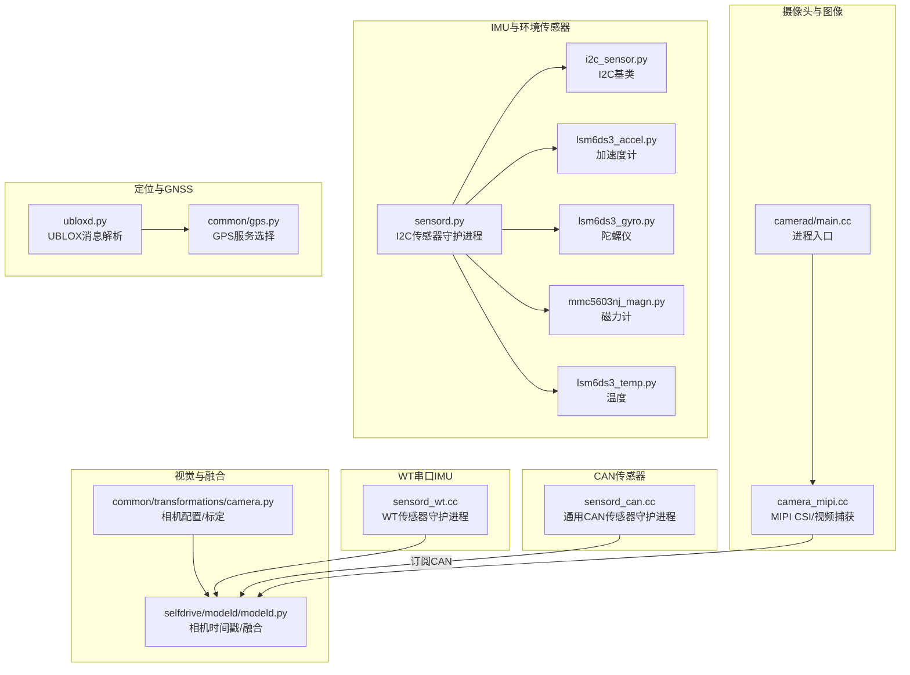
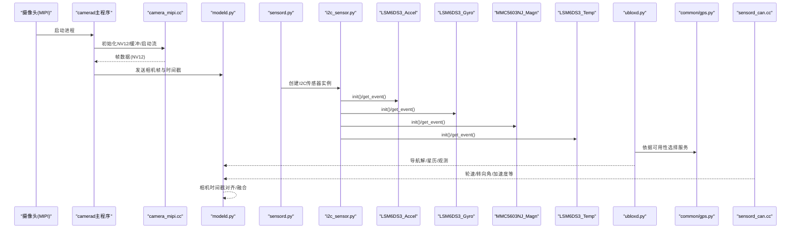
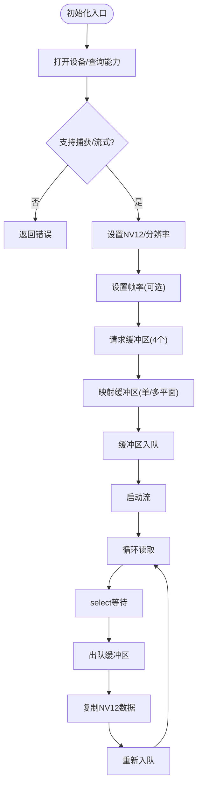
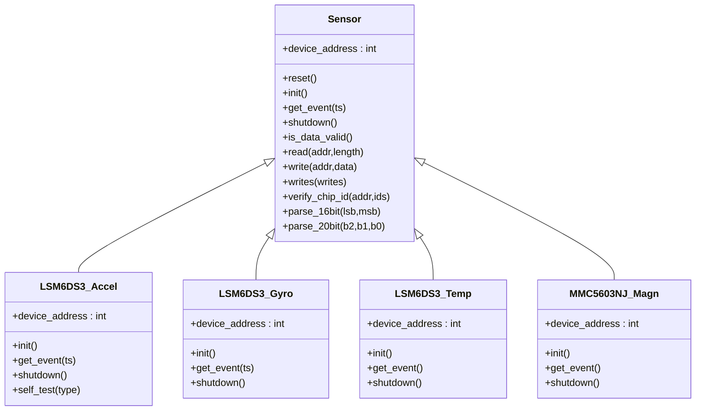
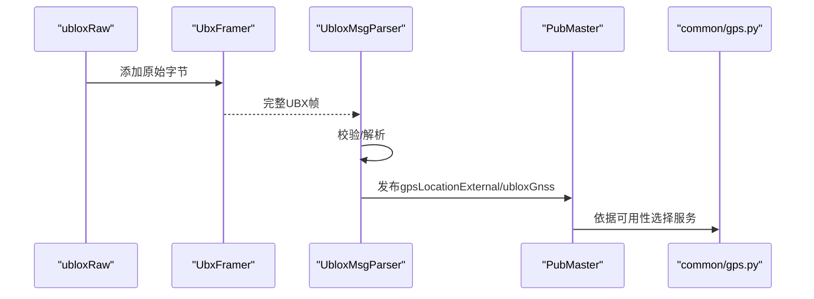
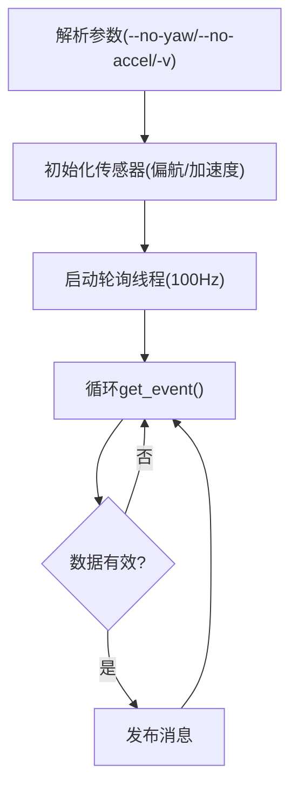
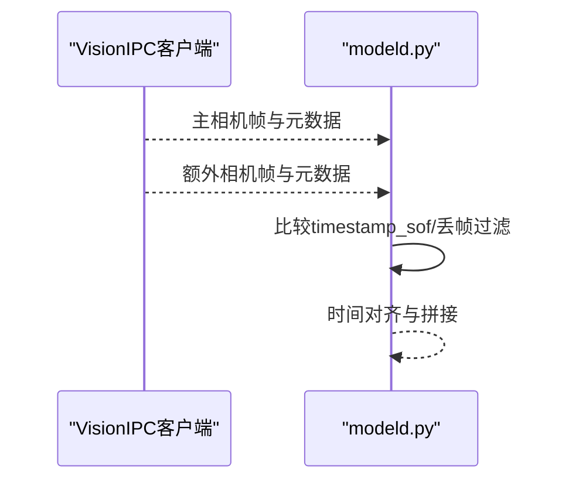
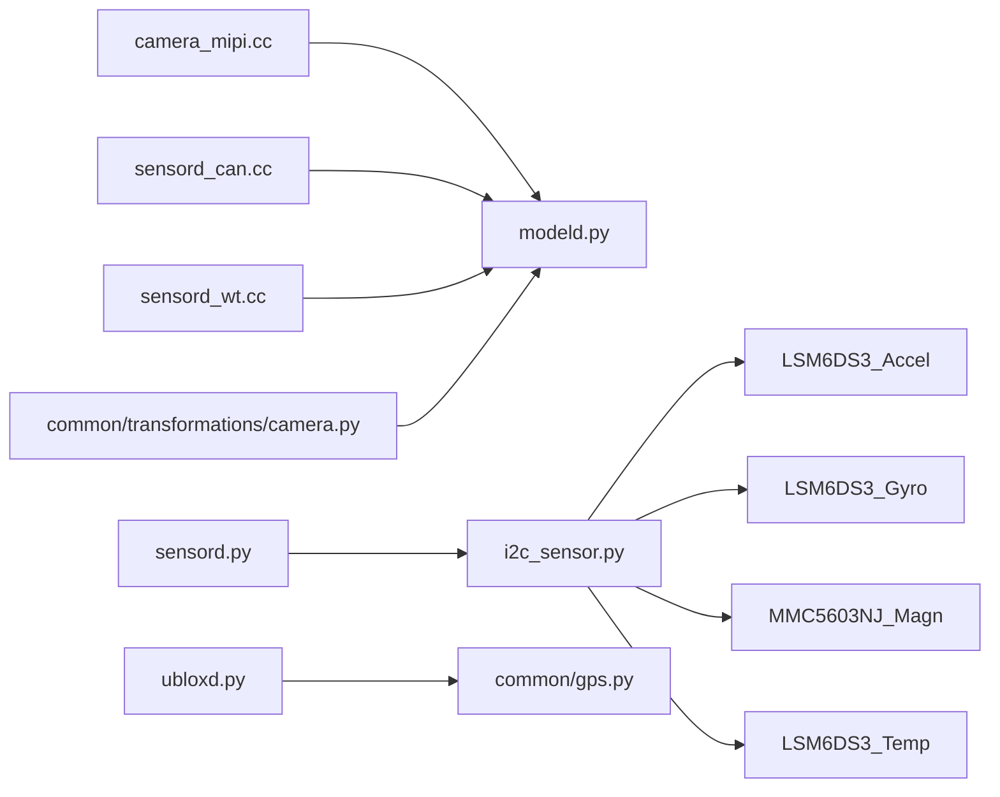

# 传感器集成

<cite>
**本文引用的文件**
- [system/camerad/main.cc](file://system/camerad/main.cc)
- [system/camerad/cameras/mipi/camera_mipi.cc](file://system/camerad/cameras/mipi/camera_mipi.cc)
- [system/sensord/sensord.py](file://system/sensord/sensord.py)
- [system/sensord/sensors/i2c_sensor.py](file://system/sensord/sensors/i2c_sensor.py)
- [system/sensord/sensors/lsm6ds3_accel.py](file://system/sensord/sensors/lsm6ds3_accel.py)
- [system/sensord/sensors/lsm6ds3_gyro.py](file://system/sensord/sensors/lsm6ds3_gyro.py)
- [system/sensord/sensors/lsm6ds3_temp.py](file://system/sensord/sensors/lsm6ds3_temp.py)
- [system/sensord/sensors/mmc5603nj_magn.py](file://system/sensord/sensors/mmc5603nj_magn.py)
- [system/ubloxd/ubloxd.py](file://system/ubloxd/ubloxd.py)
- [system/sensord_can/sensord_can.cc](file://system/sensord_can/sensord_can.cc)
- [system/sensord_wt/sensord_wt.cc](file://system/sensord_wt/sensord_wt.cc)
- [common/transformations/camera.py](file://common/transformations/camera.py)
- [common/gps.py](file://common/gps.py)
- [final_enhanced_byd_han_with_ref.dbc](file://final_enhanced_byd_han_with_ref.dbc)
- [000000a0_0994738059_enhanced_analysis_dbc.dbc](file://000000a0_0994738059_enhanced_analysis_dbc.dbc)
- [selfdrive/modeld/modeld.py](file://selfdrive/modeld/modeld.py)
</cite>

## 目录
1. [简介](#简介)
2. [项目结构](#项目结构)
3. [核心组件](#核心组件)
4. [架构总览](#架构总览)
5. [详细组件分析](#详细组件分析)
6. [依赖分析](#依赖分析)
7. [性能考虑](#性能考虑)
8. [故障排查指南](#故障排查指南)
9. [结论](#结论)
10. [附录](#附录)

## 简介
本文件面向“传感器集成模块”的硬件与软件接口，围绕以下目标展开：摄像头（MIPI CSI）与图像传感器驱动、IMU（加速度计/陀螺仪/磁力计）配置与数据处理、GPS/北斗定位（UBLOX）与高精度GNSS数据链路、CAN总线传感器解析（轮速、转向角、制动压力等）、以及温度/湿度等环境传感器的接入。文档提供从初始化、数据读取、校准到多源数据融合与时间同步的全链路说明，并结合仓库中的真实代码片段路径，帮助读者快速定位实现细节。

## 项目结构
本仓库中与传感器相关的关键目录与文件如下：
- 摄像头与MIPI CSI：system/camerad 及其子目录
- IMU传感器：system/sensord 及其子目录
- UBLOX GNSS：system/ubloxd
- CAN传感器解析：system/sensord_can
- WT（串口）IMU：system/sensord_wt
- 相机标定与坐标系：common/transformations
- GPS服务选择逻辑：common/gps.py
- DBC定义（CAN信号）：多个 .dbc 文件
- 视觉模型与相机时间戳：selfdrive/modeld/modeld.py

图表来源
- [system/camerad/main.cc:1-16](file://system/camerad/main.cc#L1-L16)
- [system/camerad/cameras/mipi/camera_mipi.cc:44-238](file://system/camerad/cameras/mipi/camera_mipi.cc#L44-L238)
- [system/sensord/sensord.py:92-151](file://system/sensord/sensord.py#L92-L151)
- [system/sensord/sensors/i2c_sensor.py:1-78](file://system/sensord/sensors/i2c_sensor.py#L1-L78)
- [system/ubloxd/ubloxd.py:495-520](file://system/ubloxd/ubloxd.py#L495-L520)
- [system/sensord_can/sensord_can.cc:95-161](file://system/sensord_can/sensord_can.cc#L95-L161)
- [system/sensord_wt/sensord_wt.cc:118-227](file://system/sensord_wt/sensord_wt.cc#L118-L227)
- [common/transformations/camera.py:49-72](file://common/transformations/camera.py#L49-L72)
- [common/gps.py:4-8](file://common/gps.py#L4-L8)
- [selfdrive/modeld/modeld.py:252-274](file://selfdrive/modeld/modeld.py#L252-L274)

章节来源
- [system/camerad/main.cc:1-16](file://system/camerad/main.cc#L1-L16)
- [system/camerad/cameras/mipi/camera_mipi.cc:44-238](file://system/camerad/cameras/mipi/camera_mipi.cc#L44-L238)
- [system/sensord/sensord.py:92-151](file://system/sensord/sensord.py#L92-L151)
- [system/ubloxd/ubloxd.py:495-520](file://system/ubloxd/ubloxd.py#L495-L520)
- [system/sensord_can/sensord_can.cc:95-161](file://system/sensord_can/sensord_can.cc#L95-L161)
- [system/sensord_wt/sensord_wt.cc:118-227](file://system/sensord_wt/sensord_wt.cc#L118-L227)
- [common/transformations/camera.py:49-72](file://common/transformations/camera.py#L49-L72)
- [common/gps.py:4-8](file://common/gps.py#L4-L8)
- [selfdrive/modeld/modeld.py:252-274](file://selfdrive/modeld/modeld.py#L252-L274)

## 核心组件
- 摄像头与MIPI CSI：通过V4L2接口设置NV12格式、请求缓冲区、启动流，按帧出队NV12数据供后续处理。
- IMU传感器（I2C）：基于统一Sensor基类，分别实现加速度计、陀螺仪、磁力计与温度传感器的初始化、中断/轮询采集、自检与关机流程。
- UBLOX GNSS：解析UBX帧、生成导航解与星历/观测报告，发布到消息总线。
- CAN传感器：从车辆CAN总线解析轮速、转向角、加速度等高频信号，按固定频率发布。
- WT串口IMU：PC端串口协议（JY61），按需启用加速度、角速度、磁力计与温度。
- 相机标定与坐标系：设备相机配置、焦距与内参，支撑视觉模型输入拼接与时间戳对齐。
- GPS服务选择：根据硬件可用性自动切换外部GPS服务。

章节来源
- [system/camerad/cameras/mipi/camera_mipi.cc:44-238](file://system/camerad/cameras/mipi/camera_mipi.cc#L44-L238)
- [system/sensord/sensord.py:92-151](file://system/sensord/sensord.py#L92-L151)
- [system/sensord/sensors/i2c_sensor.py:1-78](file://system/sensord/sensors/i2c_sensor.py#L1-L78)
- [system/ubloxd/ubloxd.py:116-194](file://system/ubloxd/ubloxd.py#L116-L194)
- [system/sensord_can/sensord_can.cc:95-161](file://system/sensord_can/sensord_can.cc#L95-L161)
- [system/sensord_wt/sensord_wt.cc:118-227](file://system/sensord_wt/sensord_wt.cc#L118-L227)
- [common/transformations/camera.py:49-72](file://common/transformations/camera.py#L49-L72)
- [common/gps.py:4-8](file://common/gps.py#L4-L8)

## 架构总览
下图展示了从传感器到消息总线与视觉模型的端到端数据通路：

图表来源
- [system/camerad/main.cc:8-15](file://system/camerad/main.cc#L8-L15)
- [system/camerad/cameras/mipi/camera_mipi.cc:240-263](file://system/camerad/cameras/mipi/camera_mipi.cc#L240-L263)
- [system/sensord/sensord.py:92-151](file://system/sensord/sensord.py#L92-L151)
- [system/ubloxd/ubloxd.py:495-520](file://system/ubloxd/ubloxd.py#L495-L520)
- [common/gps.py:4-8](file://common/gps.py#L4-L8)
- [system/sensord_can/sensord_can.cc:95-161](file://system/sensord_can/sensord_can.cc#L95-L161)
- [selfdrive/modeld/modeld.py:328-358](file://selfdrive/modeld/modeld.py#L328-L358)

## 详细组件分析

### 摄像头与MIPI CSI接口
- 设备打开与能力检查：打开设备节点，查询V4L2能力，判断是否支持视频捕获与流式I/O。
- 格式与帧率设置：设置NV12像素格式与目标分辨率；尝试设置期望帧率，失败则回退默认。
- 缓冲区管理：请求4个缓冲区，按单平面或多平面映射至内存；将缓冲区入队并启动流。
- 帧读取：select等待，出队缓冲区复制NV12数据，再重新入队。

图表来源
- [system/camerad/cameras/mipi/camera_mipi.cc:44-238](file://system/camerad/cameras/mipi/camera_mipi.cc#L44-L238)
- [system/camerad/cameras/mipi/camera_mipi.cc:265-375](file://system/camerad/cameras/mipi/camera_mipi.cc#L265-L375)

章节来源
- [system/camerad/cameras/mipi/camera_mipi.cc:44-238](file://system/camerad/cameras/mipi/camera_mipi.cc#L44-L238)
- [system/camerad/cameras/mipi/camera_mipi.cc:240-263](file://system/camerad/cameras/mipi/camera_mipi.cc#L240-L263)
- [system/camerad/cameras/mipi/camera_mipi.cc:265-375](file://system/camerad/cameras/mipi/camera_mipi.cc#L265-L375)
- [system/camerad/main.cc:8-15](file://system/camerad/main.cc#L8-L15)

### IMU传感器（LSM6DS3 + MMC5603NJ）
- I2C基类：提供SMBus访问、寄存器读写、16/20位解析、芯片ID校验与延时辅助。
- 加速度计初始化：验证芯片ID，执行自检（可选），配置ODR与中断引脚，使能数据就绪脉冲。
- 陀螺仪初始化：与加速度计共享中断引脚，按状态寄存器确认数据就绪后再读取。
- 磁力计（仅特定设备）：在tizi设备上启用，作为额外的磁场参考。
- 温度传感器：非中断型，采用轮询方式发布。

图表来源
- [system/sensord/sensors/i2c_sensor.py:1-78](file://system/sensord/sensors/i2c_sensor.py#L1-L78)
- [system/sensord/sensors/lsm6ds3_accel.py:30-88](file://system/sensord/sensors/lsm6ds3_accel.py#L30-L88)
- [system/sensord/sensors/lsm6ds3_gyro.py](file://system/sensord/sensors/lsm6ds3_gyro.py)
- [system/sensord/sensors/lsm6ds3_temp.py](file://system/sensord/sensors/lsm6ds3_temp.py)
- [system/sensord/sensors/mmc5603nj_magn.py](file://system/sensord/sensors/mmc5603nj_magn.py)

章节来源
- [system/sensord/sensord.py:92-151](file://system/sensord/sensord.py#L92-L151)
- [system/sensord/sensors/i2c_sensor.py:1-78](file://system/sensord/sensors/i2c_sensor.py#L1-L78)
- [system/sensord/sensors/lsm6ds3_accel.py:34-98](file://system/sensord/sensors/lsm6ds3_accel.py#L34-L98)

### UBLOX GNSS与高精度定位
- UBLOX消息解析：实现帧组装、校验、消息分发，支持NAV-PVT、RXM-SFRBX、RXM-RAWX、MON-HW/HW2等。
- 导航解生成：将NAV-PVT转换为gpsLocationExternal消息，包含经纬度、海拔、速度、方位、精度与UTC时间戳。
- 星历与观测：缓存子帧/字符串，拼装GPS/GLONASS星历与测量报告，供后续定位模块使用。
- 服务选择：根据硬件可用性选择外部GPS服务。

图表来源
- [system/ubloxd/ubloxd.py:44-81](file://system/ubloxd/ubloxd.py#L44-L81)
- [system/ubloxd/ubloxd.py:116-194](file://system/ubloxd/ubloxd.py#L116-L194)
- [system/ubloxd/ubloxd.py:495-520](file://system/ubloxd/ubloxd.py#L495-L520)
- [common/gps.py:4-8](file://common/gps.py#L4-L8)

章节来源
- [system/ubloxd/ubloxd.py:116-194](file://system/ubloxd/ubloxd.py#L116-L194)
- [system/ubloxd/ubloxd.py:415-447](file://system/ubloxd/ubloxd.py#L415-L447)
- [system/ubloxd/ubloxd.py:449-462](file://system/ubloxd/ubloxd.py#L449-L462)
- [system/ubloxd/ubloxd.py:464-492](file://system/ubloxd/ubloxd.py#L464-L492)
- [common/gps.py:4-8](file://common/gps.py#L4-L8)

### CAN总线传感器解析（轮速、转向角、制动压力等）
- 通用CAN传感器守护进程：支持偏航率与加速度传感器的可选启用，按100Hz轮询发布。
- 传感器初始化：根据配置创建传感器实例并调用init，失败则记录错误并清理。
- 数据发布：通过消息总线以服务名发布，供上层模块订阅。

图表来源
- [system/sensord_can/sensord_can.cc:42-75](file://system/sensord_can/sensord_can.cc#L42-L75)
- [system/sensord_can/sensord_can.cc:95-161](file://system/sensord_can/sensord_can.cc#L95-L161)

章节来源
- [system/sensord_can/sensord_can.cc:95-161](file://system/sensord_can/sensord_can.cc#L95-L161)

### WT串口IMU（PC环境）
- 串口协议：JY61（PC仅支持串口协议），支持设备路径与波特率配置。
- 传感器启用：可按需启用加速度、角速度、磁力计与温度。
- 轮询发布：按各自服务频率轮询读取并发布。

章节来源
- [system/sensord_wt/sensord_wt.cc:118-227](file://system/sensord_wt/sensord_wt.cc#L118-L227)

### 环境传感器（温度/湿度/光照/雨量）
- DBC定义：环境传感器消息包含左右太阳辐照度、雨量传感器值、硬件故障标志与环境温度。
- 采集策略：可通过CAN或I2C（取决于具体平台）接入，发布到消息总线供融合使用。

章节来源
- [final_enhanced_byd_han_with_ref.dbc:436-443](file://final_enhanced_byd_han_with_ref.dbc#L436-L443)
- [final_enhanced_byd_han_with_ref.dbc:437-444](file://final_enhanced_byd_han_with_ref.dbc#L437-L444)

### 轮速/转向角/制动压力等CAN信号（DBC分析）
- 高频传感器数据：包含轮速、转向角、加速度等，采样频率在200Hz以上。
- 低频状态更新：包含状态标志、常量字段与周期性字段。
- 信号字段：明确位宽、因子、偏置、范围与单位，便于解析与标定。

章节来源
- [000000a0_0994738059_enhanced_analysis_dbc.dbc:59-119](file://000000a0_0994738059_enhanced_analysis_dbc.dbc#L59-L119)

### 相机标定与时间同步
- 设备相机配置：不同设备与传感器组合下的焦距与内参，支撑视图变换与模型输入。
- 视觉模型时间戳：modeld从VisionIPC客户端获取帧元数据（frame_id、timestamp_sof、timestamp_eof），并与额外相机流进行时间对齐，避免丢帧导致的错位。

图表来源
- [common/transformations/camera.py:49-72](file://common/transformations/camera.py#L49-L72)
- [selfdrive/modeld/modeld.py:328-358](file://selfdrive/modeld/modeld.py#L328-L358)
- [selfdrive/modeld/modeld.py:252-274](file://selfdrive/modeld/modeld.py#L252-L274)

章节来源
- [common/transformations/camera.py:49-72](file://common/transformations/camera.py#L49-L72)
- [selfdrive/modeld/modeld.py:328-358](file://selfdrive/modeld/modeld.py#L328-L358)
- [selfdrive/modeld/modeld.py:252-274](file://selfdrive/modeld/modeld.py#L252-L274)

## 依赖分析
- 摄像头：依赖V4L2与内核驱动，输出NV12帧；与modeld通过VisionIPC对接。
- IMU：依赖I2C总线与GPIO中断（加速度计/陀螺仪共享INT1），发布SensorEventData。
- UBLOX：依赖ubloxRaw输入，解析UBX帧并发布导航与星历消息。
- CAN：依赖车辆CAN总线，解析DBC定义的信号，发布轮速/转向角/加速度等。
- WT：依赖串口与JY61协议，发布IMU数据。
- 相机标定：依赖DEVICE_CAMERAS与相机内参，支撑模型输入拼接。

图表来源
- [system/camerad/cameras/mipi/camera_mipi.cc:44-238](file://system/camerad/cameras/mipi/camera_mipi.cc#L44-L238)
- [system/sensord/sensord.py:92-151](file://system/sensord/sensord.py#L92-L151)
- [system/ubloxd/ubloxd.py:495-520](file://system/ubloxd/ubloxd.py#L495-L520)
- [system/sensord_can/sensord_can.cc:95-161](file://system/sensord_can/sensord_can.cc#L95-L161)
- [system/sensord_wt/sensord_wt.cc:118-227](file://system/sensord_wt/sensord_wt.cc#L118-L227)
- [common/transformations/camera.py:49-72](file://common/transformations/camera.py#L49-L72)
- [common/gps.py:4-8](file://common/gps.py#L4-L8)
- [selfdrive/modeld/modeld.py:252-274](file://selfdrive/modeld/modeld.py#L252-L274)

## 性能考虑
- 实时性：sensord与sensord_can通过实时进程配置与优先级提升，确保传感器数据及时发布。
- 中断与轮询：IMU加速度计/陀螺仪使用中断触发，降低CPU占用；温度等非关键传感器采用轮询。
- 缓冲与内存：MIPI CSI使用MMAP或USERPTR缓冲区，减少拷贝；modeld对帧进行丢帧过滤与时间对齐，避免视觉模型抖动。
- 日志与调试：提供详细日志与可选调试输出，便于定位问题。

## 故障排查指南
- 摄像头无帧/黑屏
  - 检查设备路径与V4L2能力；确认NV12格式设置与缓冲区申请成功；查看select超时与出队/入队流程。
  - 参考：[system/camerad/cameras/mipi/camera_mipi.cc:265-375](file://system/camerad/cameras/mipi/camera_mipi.cc#L265-L375)
- IMU数据无效/不更新
  - 确认中断引脚配置与IRQ亲和性；检查数据就绪状态寄存器；必要时启用轮询模式。
  - 参考：[system/sensord/sensord.py:24-75](file://system/sensord/sensord.py#L24-L75)
- UBLOX解析失败
  - 校验帧头与校验和；确认消息类型与负载长度；检查ephemeris缓存完整性。
  - 参考：[system/ubloxd/ubloxd.py:44-81](file://system/ubloxd/ubloxd.py#L44-L81)
- CAN信号缺失
  - 检查DBC定义与信号位宽/因子；确认CAN总线连接与速率；验证传感器守护进程初始化。
  - 参考：[system/sensord_can/sensord_can.cc:95-161](file://system/sensord_can/sensord_can.cc#L95-L161)
- 时间不同步/丢帧
  - 检查VisionIPC元数据与丢帧滤波；确保主/副相机时间戳对齐窗口。
  - 参考：[selfdrive/modeld/modeld.py:328-358](file://selfdrive/modeld/modeld.py#L328-L358)

章节来源
- [system/camerad/cameras/mipi/camera_mipi.cc:265-375](file://system/camerad/cameras/mipi/camera_mipi.cc#L265-L375)
- [system/sensord/sensord.py:24-75](file://system/sensord/sensord.py#L24-L75)
- [system/ubloxd/ubloxd.py:44-81](file://system/ubloxd/ubloxd.py#L44-L81)
- [system/sensord_can/sensord_can.cc:95-161](file://system/sensord_can/sensord_can.cc#L95-L161)
- [selfdrive/modeld/modeld.py:328-358](file://selfdrive/modeld/modeld.py#L328-L358)

## 结论
本仓库提供了完整的多传感器接入框架：从MIPI CSI摄像头到I2C/串口IMU、UBLOX GNSS、CAN总线信号，再到视觉模型的时间同步与融合。通过统一的消息总线与服务命名，实现了高实时性与可维护性的传感器数据流水线。建议在部署时重点关注中断配置、缓冲区管理与时间戳对齐，以获得稳定可靠的多源融合效果。

## 附录
- 配置参数与采样频率（示例）
  - 摄像头：NV12、分辨率由设备配置决定；帧率在初始化时设置，失败回退默认。
  - IMU：加速度计/陀螺仪ODR与FS在初始化中配置；温度传感器轮询。
  - UBLOX：NAV-PVT、RXM-SFRBX、RXM-RAWX等消息按UBX规范解析。
  - CAN：轮询频率100Hz；偏航/加速度可按需禁用。
  - WT：串口JY61协议，按需启用各传感器通道。
- 数据格式
  - 摄像头：NV12（Y+UV平面）。
  - IMU：SensorEventData，含加速度、角速度、温度与状态。
  - UBLOX：导航解、星历、观测报告与硬件状态。
  - CAN：DBC定义的信号字节布局与标定量纲。
- 多传感器融合与时间同步
  - modeld基于VisionIPC元数据进行时间戳对齐与丢帧过滤，保证视觉模型输入稳定。