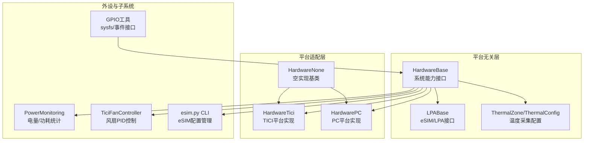
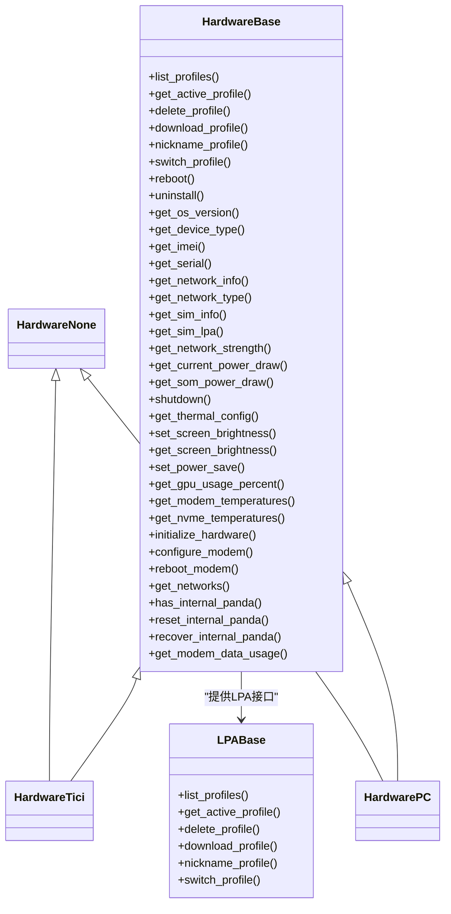
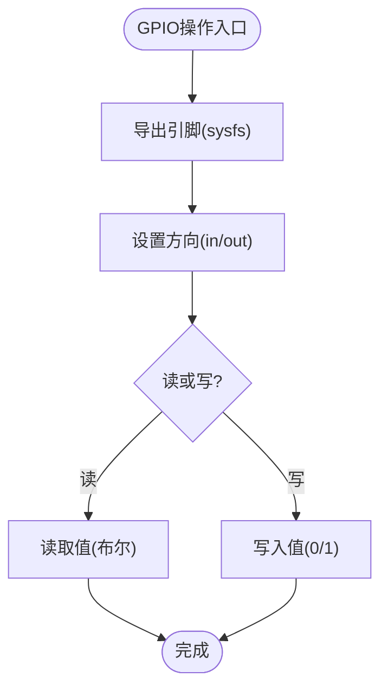
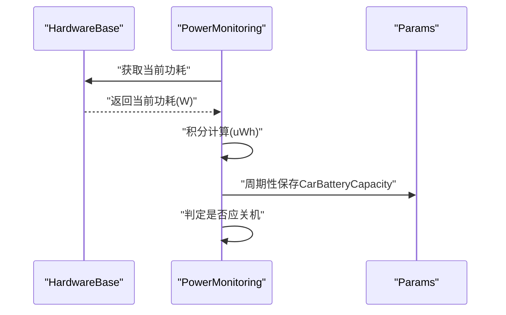
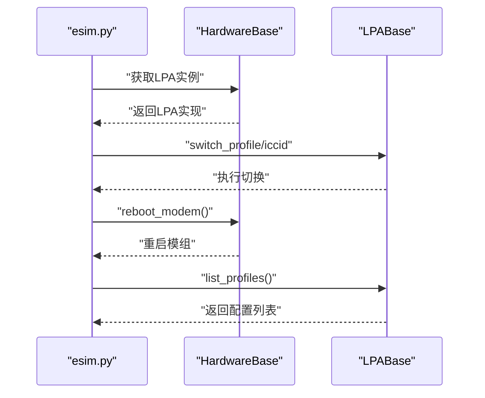
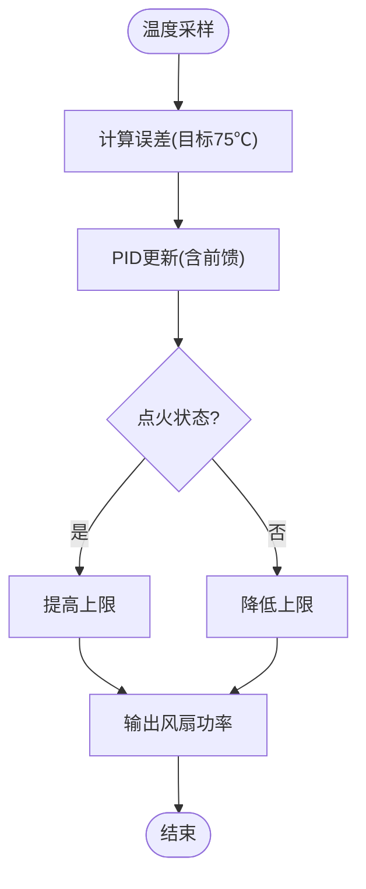
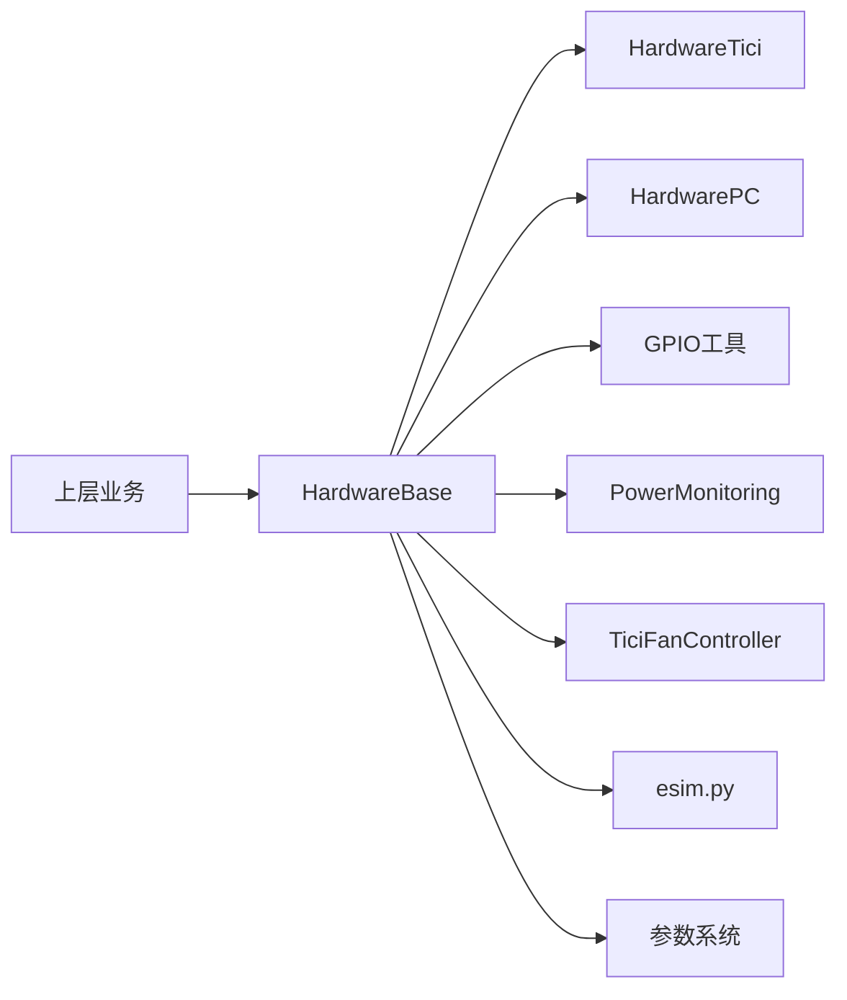

# 硬件抽象层

<cite>
**本文引用的文件**
- [system/hardware/base.py](file://system/hardware/base.py)
- [system/hardware/base.h](file://system/hardware/base.h)
- [system/hardware/hw.py](file://system/hardware/hw.py)
- [system/hardware/hw.h](file://system/hardware/hw.h)
- [system/hardware/tici/hardware.h](file://system/hardware/tici/hardware.h)
- [system/hardware/pc/hardware.h](file://system/hardware/pc/hardware.h)
- [system/hardware/__init__.py](file://system/hardware/__init__.py)
- [common/gpio.py](file://common/gpio.py)
- [system/hardware/power_monitoring.py](file://system/hardware/power_monitoring.py)
- [system/hardware/esim.py](file://system/hardware/esim.py)
- [system/hardware/fan_controller.py](file://system/hardware/fan_controller.py)
- [common/params_keys.h](file://common/params_keys.h)
</cite>

## 目录
1. [简介](#简介)
2. [项目结构](#项目结构)
3. [核心组件](#核心组件)
4. [架构总览](#架构总览)
5. [详细组件分析](#详细组件分析)
6. [依赖分析](#依赖分析)
7. [性能考虑](#性能考虑)
8. [故障排查指南](#故障排查指南)
9. [结论](#结论)
10. [附录](#附录)

## 简介
本文件面向硬件抽象层（Hardware Abstraction Layer, HAL），系统性阐述其设计理念与实现架构，覆盖平台无关的硬件接口定义、多平台支持（TICI 设备、PC 平台）、通用外设抽象（GPIO、I2C/SPI 等）、参数管理与配置持久化、网络接口抽象（以太网/WiFi/蜂窝）、电源管理与功耗优化，并提供来自实际代码库的使用模式与扩展方法，帮助开发者在不同硬件平台上进行跨平台移植与兼容性处理。

## 项目结构
硬件抽象层主要由以下层次构成：
- 平台无关接口与基类：定义统一的硬件能力接口与数据模型，确保上层逻辑不依赖具体平台。
- 平台适配层：针对不同硬件平台（如 TICI、PC）提供具体实现。
- 外设与子系统：GPIO、电源监控、风扇控制、eSIM 管理等。
- 参数系统：参数键定义与持久化策略，支撑配置与状态保存。

图表来源
- [system/hardware/base.py:73-238](file://system/hardware/base.py#L73-L238)
- [system/hardware/tici/hardware.h:14-120](file://system/hardware/tici/hardware.h#L14-L120)
- [system/hardware/pc/hardware.h:7-24](file://system/hardware/pc/hardware.h#L7-L24)
- [system/hardware/base.h:10-43](file://system/hardware/base.h#L10-L43)
- [common/gpio.py:1-89](file://common/gpio.py#L1-L89)
- [system/hardware/power_monitoring.py:21-130](file://system/hardware/power_monitoring.py#L21-L130)
- [system/hardware/fan_controller.py:9-39](file://system/hardware/fan_controller.py#L9-L39)
- [system/hardware/esim.py:1-46](file://system/hardware/esim.py#L1-L46)

章节来源
- [system/hardware/base.py:1-238](file://system/hardware/base.py#L1-L238)
- [system/hardware/base.h:1-43](file://system/hardware/base.h#L1-L43)
- [system/hardware/hw.py:1-66](file://system/hardware/hw.py#L1-L66)
- [system/hardware/hw.h:1-59](file://system/hardware/hw.h#L1-L59)
- [system/hardware/tici/hardware.h:1-120](file://system/hardware/tici/hardware.h#L1-L120)
- [system/hardware/pc/hardware.h:1-24](file://system/hardware/pc/hardware.h#L1-L24)
- [system/hardware/__init__.py:1-17](file://system/hardware/__init__.py#L1-L17)

## 核心组件
- 平台无关接口与数据模型
  - HardwareBase：定义系统能力接口（重启、卸载、版本/序列号、网络信息、电源/亮度、热区读取、模组数据使用等）。
  - LPABase：定义 eSIM/LPA 接口（列出/切换/下载/删除/备注）。
  - ThermalZone/ThermalConfig：封装 /sys 下 thermal_zone 的读取与聚合。
- 平台适配层
  - HardwareTici：TICI 设备实现，读取电压/电流、屏幕背光/IR、设备类型、引导信息等。
  - HardwarePC：PC 实现，提供渲染环境变量配置等。
  - HardwareNone：空实现基类，供 C++ 层选择具体平台实现。
- 外设与子系统
  - GPIO 工具：sysfs 导出/方向设置/读写，以及基于 gpiochip 的事件接口。
  - 电源监控：基于低通滤波与积分计算的电量/功耗估算与关机判断。
  - 风扇控制：基于 PID 的温度闭环控制。
  - eSIM 管理：命令行工具对 eSIM 配置进行增删改查与切换。

章节来源
- [system/hardware/base.py:73-238](file://system/hardware/base.py#L73-L238)
- [system/hardware/base.h:10-43](file://system/hardware/base.h#L10-L43)
- [system/hardware/tici/hardware.h:14-120](file://system/hardware/tici/hardware.h#L14-L120)
- [system/hardware/pc/hardware.h:7-24](file://system/hardware/pc/hardware.h#L7-L24)
- [common/gpio.py:1-89](file://common/gpio.py#L1-L89)
- [system/hardware/power_monitoring.py:21-130](file://system/hardware/power_monitoring.py#L21-L130)
- [system/hardware/fan_controller.py:9-39](file://system/hardware/fan_controller.py#L9-L39)
- [system/hardware/esim.py:1-46](file://system/hardware/esim.py#L1-L46)

## 架构总览
硬件抽象层采用“平台无关接口 + 平台特定实现”的分层设计。Python 层通过 HardwareBase 提供统一能力；C++ 层通过宏选择具体平台实现（TICI 或 PC）。路径与持久化根目录在 Python/C++ 双侧分别定义，保证跨语言一致性。

图表来源
- [system/hardware/base.py:73-238](file://system/hardware/base.py#L73-L238)
- [system/hardware/tici/hardware.h:14-120](file://system/hardware/tici/hardware.h#L14-L120)
- [system/hardware/pc/hardware.h:7-24](file://system/hardware/pc/hardware.h#L7-L24)
- [system/hardware/base.h:10-43](file://system/hardware/base.h#L10-L43)

## 详细组件分析

### 平台无关接口与数据模型
- HardwareBase
  - 统一定义系统能力接口，便于上层业务不依赖具体平台。
  - 提供默认实现（如网络计费类型推断、带宽限制占位、GPU 使用率占位等），降低平台差异带来的影响。
- LPABase
  - eSIM/LPA 抽象，屏蔽底层调用细节。
- ThermalZone/ThermalConfig
  - 封装 thermal_zone 读取，支持 CPU/GPU/DSP/PMIC/内存/进/排/壳等多区域温度采集。

章节来源
- [system/hardware/base.py:73-238](file://system/hardware/base.py#L73-L238)

### 平台适配层
- C++ 层选择
  - 通过宏在编译期选择 TICI 或 PC 实现，简化运行时分支。
  - 提供路径与环境变量的统一管理（日志根、参数根、下载缓存、共享内存路径等）。
- Python 层选择
  - 通过 /TICI 与 /AGNOS 文件存在性判断平台，实例化对应硬件对象。

章节来源
- [system/hardware/hw.h:8-14](file://system/hardware/hw.h#L8-L14)
- [system/hardware/hw.h:16-59](file://system/hardware/hw.h#L16-L59)
- [system/hardware/hw.py:1-66](file://system/hardware/hw.py#L1-L66)
- [system/hardware/__init__.py:1-17](file://system/hardware/__init__.py#L1-L17)

### GPIO 抽象与通用外设接口
- sysfs GPIO
  - 支持导出、方向设置、读写，异常安全处理。
- gpiochip 事件接口
  - 基于 ioctl 获取事件 FD，支持边沿触发的事件监听。
- 扩展建议
  - I2C/SPI 可参考 GPIO 的 sysfs/事件模式，抽象出统一的设备树节点访问与中断绑定流程，便于在不同平台复用。

图表来源
- [common/gpio.py:6-28](file://common/gpio.py#L6-L28)

章节来源
- [common/gpio.py:1-89](file://common/gpio.py#L1-L89)

### 电源管理与功耗优化
- 电量/功耗估算
  - 低通滤波平滑电池电压，结合时间积分估算耗电量与剩余容量。
  - 在点火状态下按充电速率回充，非点火状态下按硬件测量功率积分放电。
- 关机策略
  - 基于离线时长、最低电压阈值、容量清零、用户开关与强制关机标志综合判定。
- 参数持久化
  - 关键参数键（如电池容量、最大离线时间、禁用关机等）在头文件中集中定义，确保跨模块一致。

图表来源
- [system/hardware/power_monitoring.py:40-130](file://system/hardware/power_monitoring.py#L40-L130)
- [common/params_keys.h:20-30](file://common/params_keys.h#L20-L30)

章节来源
- [system/hardware/power_monitoring.py:1-130](file://system/hardware/power_monitoring.py#L1-L130)
- [common/params_keys.h:1-310](file://common/params_keys.h#L1-L310)

### 网络接口抽象与 eSIM 管理
- 网络抽象
  - HardwareBase 提供网络类型、强度、计费属性、可用网络列表等统一接口，屏蔽底层实现差异。
- eSIM 管理
  - 通过命令行工具对 eSIM 配置进行增删改查与切换，调用 LPA 接口并可触发模组重启。

图表来源
- [system/hardware/esim.py:1-46](file://system/hardware/esim.py#L1-L46)
- [system/hardware/base.py:73-96](file://system/hardware/base.py#L73-L96)

章节来源
- [system/hardware/esim.py:1-46](file://system/hardware/esim.py#L1-L46)
- [system/hardware/base.py:73-96](file://system/hardware/base.py#L73-L96)

### 风扇控制与热管理
- 温度闭环控制
  - 基于 PID 控制器，根据点火状态调整上下限与前馈，实现稳定散热。
- 热区读取
  - 通过 ThermalConfig 聚合多热区温度，驱动风扇策略。

图表来源
- [system/hardware/fan_controller.py:15-39](file://system/hardware/fan_controller.py#L15-L39)

章节来源
- [system/hardware/fan_controller.py:1-39](file://system/hardware/fan_controller.py#L1-L39)

### 参数管理与配置持久化
- 参数键定义
  - 在头文件中集中声明参数键及其属性（持久化、清理时机等），避免散落定义导致的不一致。
- 持久化根目录
  - Python/C++ 分别提供路径解析，PC 与非 PC 场景下指向不同根目录，保证行为一致。

章节来源
- [common/params_keys.h:1-310](file://common/params_keys.h#L1-L310)
- [system/hardware/hw.py:9-66](file://system/hardware/hw.py#L9-L66)
- [system/hardware/hw.h:16-59](file://system/hardware/hw.h#L16-L59)

### 平台特定配置与兼容性处理
- TICI 平台
  - 读取设备型号、序列号、引导版本、分区哈希等初始化信息；支持 IR 亮度调节与显示背光控制。
- PC 平台
  - 提供渲染环境变量配置，适配桌面环境。
- 路径与环境
  - 通过环境变量与平台特性组合，决定日志、参数、缓存、共享内存等位置。

章节来源
- [system/hardware/tici/hardware.h:20-108](file://system/hardware/tici/hardware.h#L20-L108)
- [system/hardware/pc/hardware.h:16-22](file://system/hardware/pc/hardware.h#L16-L22)
- [system/hardware/hw.py:9-66](file://system/hardware/hw.py#L9-L66)
- [system/hardware/hw.h:16-59](file://system/hardware/hw.h#L16-L59)

## 依赖分析
- 组件耦合
  - 上层业务仅依赖 HardwareBase/LPABase，平台差异被隔离在适配层。
  - GPIO、电源监控、风扇控制、eSIM 管理作为子系统依附于硬件接口。
- 外部依赖
  - GPIO 依赖 sysfs 与内核中断；电源监控依赖硬件功耗测量；风扇控制依赖实时采样与 PID 库。
- 循环依赖
  - 未发现直接循环依赖；路径与参数系统通过公共常量与环境变量解耦。

图表来源
- [system/hardware/base.py:73-238](file://system/hardware/base.py#L73-L238)
- [system/hardware/tici/hardware.h:14-120](file://system/hardware/tici/hardware.h#L14-L120)
- [system/hardware/pc/hardware.h:7-24](file://system/hardware/pc/hardware.h#L7-L24)
- [common/gpio.py:1-89](file://common/gpio.py#L1-L89)
- [system/hardware/power_monitoring.py:21-130](file://system/hardware/power_monitoring.py#L21-L130)
- [system/hardware/fan_controller.py:9-39](file://system/hardware/fan_controller.py#L9-L39)
- [system/hardware/esim.py:1-46](file://system/hardware/esim.py#L1-L46)

## 性能考虑
- GPIO 访问
  - sysfs 读写为阻塞 I/O，建议批量读取与缓存，减少频繁打开/关闭文件描述符。
- 事件接口
  - gpiochip 事件接口适合高频率中断场景，注意事件队列与处理线程的吞吐匹配。
- 电源监控
  - 积分计算与低通滤波参数需平衡响应速度与噪声抑制；周期性保存参数避免频繁写入。
- 风扇控制
  - PID 参数需随平台与负载特性校准；点火状态切换时及时重置控制器，避免积分饱和。

## 故障排查指南
- GPIO 无法导出/读写
  - 检查权限与引脚是否已被占用；确认 sysfs 节点存在；查看异常打印定位失败原因。
- 电源监控异常
  - 核对硬件功耗测量返回值；检查积分时间与负功率保护逻辑；确认参数持久化是否成功。
- eSIM 切换无效
  - 确认 LPA 返回状态；执行模组重启后等待短暂冷却再查询；检查网络类型与计费属性。
- 风扇不转或噪音大
  - 检查温度采样是否异常；核对 PID 参数与上下限；确认点火状态变化是否触发控制器重置。

章节来源
- [common/gpio.py:6-28](file://common/gpio.py#L6-L28)
- [system/hardware/power_monitoring.py:88-101](file://system/hardware/power_monitoring.py#L88-L101)
- [system/hardware/esim.py:18-46](file://system/hardware/esim.py#L18-L46)
- [system/hardware/fan_controller.py:23-37](file://system/hardware/fan_controller.py#L23-L37)

## 结论
硬件抽象层通过平台无关接口与平台特定实现的清晰分离，实现了跨平台的一致体验与可维护性。GPIO、电源监控、风扇控制、eSIM 管理等子系统均以统一接口接入，配合参数系统的集中管理与持久化策略，满足从 TICI 到 PC 的广泛部署需求。未来可在 I2C/SPI 抽象、热插拔与动态重配置方面进一步完善，提升可移植性与稳定性。

## 附录
- 平台选择与路径
  - C++ 层通过宏在编译期选择实现；Python 层通过文件存在性判断。
- 参数键清单
  - 关键参数键（如 CarBatteryCapacity、DisablePowerDown、ForcePowerDown、GsmApn 等）集中定义，便于跨模块维护。

章节来源
- [system/hardware/hw.h:8-14](file://system/hardware/hw.h#L8-L14)
- [system/hardware/__init__.py:8-17](file://system/hardware/__init__.py#L8-L17)
- [common/params_keys.h:20-60](file://common/params_keys.h#L20-L60)