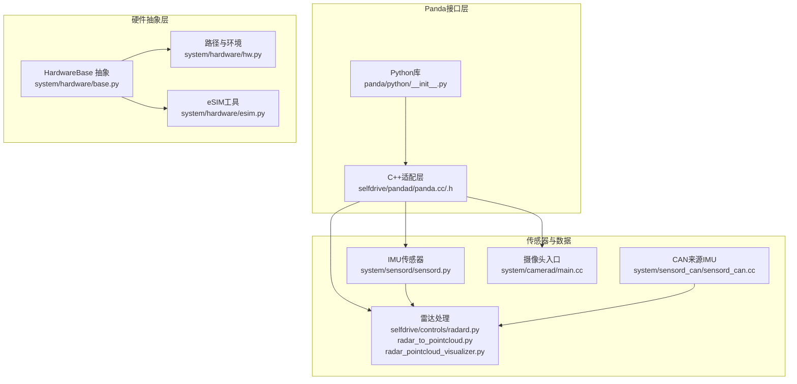
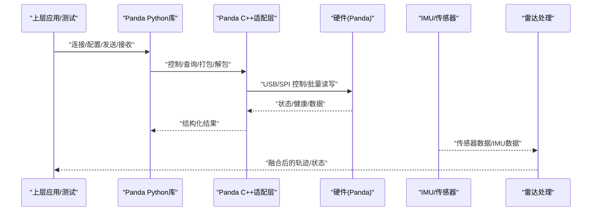
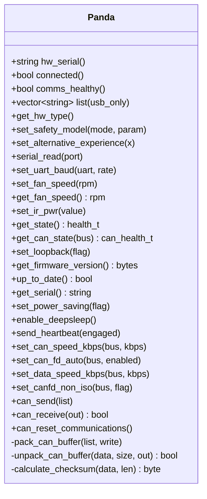
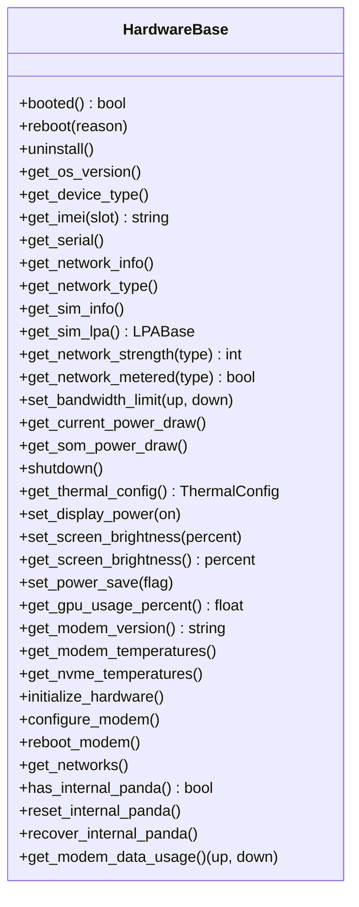
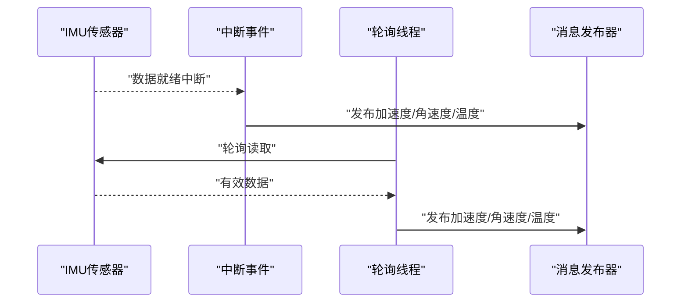
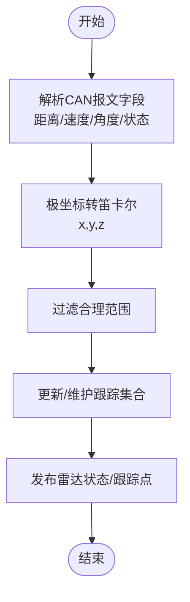
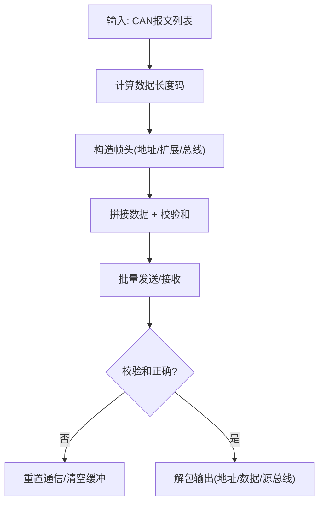
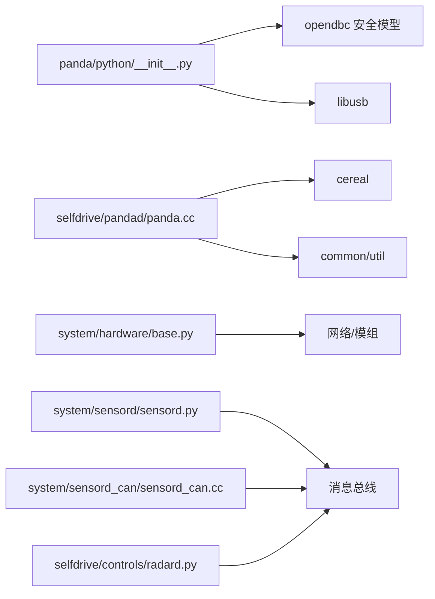

# 硬件接口

<cite>
**本文引用的文件**
- [panda/README.md](file://panda/README.md)
- [panda/python/__init__.py](file://panda/python/__init__.py)
- [selfdrive/pandad/panda.h](file://selfdrive/pandad/panda.h)
- [selfdrive/pandad/panda.cc](file://selfdrive/pandad/panda.cc)
- [system/hardware/base.py](file://system/hardware/base.py)
- [system/hardware/hw.py](file://system/hardware/hw.py)
- [system/hardware/esim.py](file://system/hardware/esim.py)
- [system/sensord/sensord.py](file://system/sensord/sensord.py)
- [system/sensord_can/sensord_can.cc](file://system/sensord_can/sensord_can.cc)
- [system/camerad/main.cc](file://system/camerad/main.cc)
- [selfdrive/controls/radard.py](file://selfdrive/controls/radard.py)
- [radar_to_pointcloud.py](file://radar_to_pointcloud.py)
- [radar_pointcloud_visualizer.py](file://radar_pointcloud_visualizer.py)
- [final_enhanced_byd_han.dbc](file://final_enhanced_byd_han.dbc)
- [deep_signal_analysis.py](file://deep_signal_analysis.py)
</cite>

## 目录
1. [简介](#简介)
2. [项目结构](#项目结构)
3. [核心组件](#核心组件)
4. [架构总览](#架构总览)
5. [详细组件分析](#详细组件分析)
6. [依赖分析](#依赖分析)
7. [性能考虑](#性能考虑)
8. [故障排查指南](#故障排查指南)
9. [结论](#结论)
10. [附录](#附录)

## 简介
本文件面向硬件接口模块，聚焦于Panda设备接口、CAN协议实现、传感器（摄像头、雷达、IMU）数据集成与处理、以及硬件抽象层（HAL）的设计与实现。文档以代码库为依据，提供接口定义、调用关系、数据流、错误处理与性能特性，并给出与上层软件系统的集成方式、常见问题与解决方案，兼顾初学者与资深开发者的阅读需求。

## 项目结构
围绕硬件接口的关键目录与文件如下：
- Panda用户态Python库：提供CAN收发、健康状态查询、安全模式设置等接口
- Panda C++守护进程适配层：封装USB/SPI通信、打包/解包CAN帧、与上层服务交互
- 硬件抽象层：统一设备能力、网络、电源、热管理等接口
- 传感器子系统：IMU（加速度/角速度/磁力计）、CAN来源的IMU数据采集、摄像头主程序入口
- 雷达数据处理：雷达点云解析、可视化与跟踪融合

**图示来源**
- [panda/python/__init__.py:105-800](file://panda/python/__init__.py#L105-L800)
- [selfdrive/pandad/panda.cc:1-313](file://selfdrive/pandad/panda.cc#L1-L313)
- [system/hardware/base.py:99-238](file://system/hardware/base.py#L99-L238)
- [system/sensord/sensord.py:1-151](file://system/sensord/sensord.py#L1-L151)
- [system/sensord_can/sensord_can.cc:1-186](file://system/sensord_can/sensord_can.cc#L1-L186)
- [system/camerad/main.cc:1-16](file://system/camerad/main.cc#L1-L16)
- [selfdrive/controls/radard.py:386-454](file://selfdrive/controls/radard.py#L386-L454)
- [radar_to_pointcloud.py:51-103](file://radar_to_pointcloud.py#L51-L103)
- [radar_pointcloud_visualizer.py:92-118](file://radar_pointcloud_visualizer.py#L92-L118)

**章节来源**
- [panda/README.md:1-107](file://panda/README.md#L1-L107)
- [panda/python/__init__.py:105-800](file://panda/python/__init__.py#L105-L800)
- [selfdrive/pandad/panda.h:46-100](file://selfdrive/pandad/panda.h#L46-L100)
- [selfdrive/pandad/panda.cc:1-313](file://selfdrive/pandad/panda.cc#L1-L313)
- [system/hardware/base.py:99-238](file://system/hardware/base.py#L99-L238)
- [system/hardware/hw.py:1-66](file://system/hardware/hw.py#L1-L66)
- [system/hardware/esim.py:1-46](file://system/hardware/esim.py#L1-L46)
- [system/sensord/sensord.py:1-151](file://system/sensord/sensord.py#L1-L151)
- [system/sensord_can/sensord_can.cc:1-186](file://system/sensord_can/sensord_can.cc#L1-L186)
- [system/camerad/main.cc:1-16](file://system/camerad/main.cc#L1-L16)
- [selfdrive/controls/radard.py:386-454](file://selfdrive/controls/radard.py#L386-L454)
- [radar_to_pointcloud.py:51-103](file://radar_to_pointcloud.py#L51-L103)
- [radar_pointcloud_visualizer.py:92-118](file://radar_pointcloud_visualizer.py#L92-L118)

## 核心组件
- Panda Python库：提供连接、版本/签名查询、健康状态、CAN发送/接收、安全模式设置、波特率配置、SPI/USB连接选择等
- Panda C++适配层：封装底层通信、打包/解包CAN帧、心跳、电源与散热控制、固件版本校验
- 硬件抽象层：统一设备能力、网络、SIM卡/eSIM、功耗、温度、存储路径等接口
- 传感器子系统：IMU（加速度/角速度/磁力计）与CAN来源IMU数据采集；摄像头主程序入口
- 雷达数据处理：从CAN解析目标距离/速度/角度并转笛卡尔坐标，融合视觉与雷达跟踪

**章节来源**
- [panda/python/__init__.py:105-800](file://panda/python/__init__.py#L105-L800)
- [selfdrive/pandad/panda.cc:1-313](file://selfdrive/pandad/panda.cc#L1-L313)
- [system/hardware/base.py:99-238](file://system/hardware/base.py#L99-L238)
- [system/sensord/sensord.py:1-151](file://system/sensord/sensord.py#L1-L151)
- [system/sensord_can/sensord_can.cc:1-186](file://system/sensord_can/sensord_can.cc#L1-L186)
- [selfdrive/controls/radard.py:386-454](file://selfdrive/controls/radard.py#L386-L454)

## 架构总览
下图展示Panda在系统中的位置与数据通路：Python库用于上层应用与测试，C++适配层在自驱动进程中与硬件通信，传感器与摄像头通过消息总线与Panda协同工作。

**图示来源**
- [panda/python/__init__.py:105-800](file://panda/python/__init__.py#L105-L800)
- [selfdrive/pandad/panda.cc:1-313](file://selfdrive/pandad/panda.cc#L1-L313)
- [system/sensord/sensord.py:1-151](file://system/sensord/sensord.py#L1-L151)
- [selfdrive/controls/radard.py:386-454](file://selfdrive/controls/radard.py#L386-L454)

## 详细组件分析

### Panda 设备接口（Python）
- 连接与发现：支持USB/SPI自动探测，列出可用设备，按序列号选择
- CAN接口：发送/接收、批量发送、清空队列、复位通信；支持CANFD与数据速率配置
- 健康与状态：读取健康包、CAN健康包、版本/签名、硬件类型、串口读取
- 安全与配置：设置安全模式、替代体验、功率保存、回环、波特率、CANFD参数
- 固件管理：检查更新、刷写、恢复流程

关键接口与行为要点
- 发送/接收：使用批量端点进行高效传输，内部做分片与超时控制
- 健康状态：包含总线状态、错误计数、风扇转速、中断频率等
- 安全模型：通过安全模式枚举与参数控制，确保车辆安全边界
- 版本一致性：库与固件版本校验，防止不匹配导致的异常

**章节来源**
- [panda/python/__init__.py:105-800](file://panda/python/__init__.py#L105-L800)

### Panda 设备接口（C++）
- 通信封装：统一控制/批量读写接口，支持USB/SPI句柄
- CAN帧打包/解包：定义头结构、长度编码、校验和计算与溢出缓冲处理
- 设备能力：获取硬件类型、固件签名、序列号、心跳、散热/IR控制
- 配置接口：波特率、CANFD、数据速率、回环、功率保存、深睡眠

**图示来源**
- [selfdrive/pandad/panda.h:46-100](file://selfdrive/pandad/panda.h#L46-L100)
- [selfdrive/pandad/panda.cc:1-313](file://selfdrive/pandad/panda.cc#L1-L313)

**章节来源**
- [selfdrive/pandad/panda.h:46-100](file://selfdrive/pandad/panda.h#L46-L100)
- [selfdrive/pandad/panda.cc:1-313](file://selfdrive/pandad/panda.cc#L1-L313)

### 硬件抽象层（HAL）
- 统一接口：设备能力、网络、SIM/eSIM、功耗、温度、存储路径、显示亮度等
- 设备生命周期：重启、关机、初始化、带宽限制、GPU使用率、NVMe温度等
- SIM管理：列表、切换、删除、下载、重命名，支持不同后端（QMI/AT）

**图示来源**
- [system/hardware/base.py:99-238](file://system/hardware/base.py#L99-L238)

**章节来源**
- [system/hardware/base.py:99-238](file://system/hardware/base.py#L99-L238)
- [system/hardware/hw.py:1-66](file://system/hardware/hw.py#L1-L66)
- [system/hardware/esim.py:1-46](file://system/hardware/esim.py#L1-L46)

### 传感器集成（IMU/CAN IMU）
- I2C IMU：加速度、角速度、温度、磁力计（部分设备），中断与轮询双模式
- CAN来源IMU：从CAN报文解析偏航率与加速度，多线程轮询发布消息
- 数据发布：通过消息总线发布到上层系统

**图示来源**
- [system/sensord/sensord.py:24-91](file://system/sensord/sensord.py#L24-L91)
- [system/sensord_can/sensord_can.cc:77-93](file://system/sensord_can/sensord_can.cc#L77-L93)

**章节来源**
- [system/sensord/sensord.py:1-151](file://system/sensord/sensord.py#L1-L151)
- [system/sensord_can/sensord_can.cc:1-186](file://system/sensord_can/sensord_can.cc#L1-L186)

### 摄像头主程序入口
- 设置CPU亲和性，进入摄像头线程主循环
- 与系统隔离策略配合，保证实时性

**章节来源**
- [system/camerad/main.cc:1-16](file://system/camerad/main.cc#L1-L16)

### 雷达数据处理与融合
- CAN雷达解析：从CAN报文解析距离、速度、角度、状态，转换为笛卡尔坐标
- 跟踪与状态：维护跟踪集合、发布雷达状态与跟踪点
- 可视化：提取雷达状态与跟踪点，限定合理范围

**图示来源**
- [radar_to_pointcloud.py:51-103](file://radar_to_pointcloud.py#L51-L103)
- [selfdrive/controls/radard.py:411-454](file://selfdrive/controls/radard.py#L411-L454)
- [radar_pointcloud_visualizer.py:92-118](file://radar_pointcloud_visualizer.py#L92-L118)

**章节来源**
- [selfdrive/controls/radard.py:386-454](file://selfdrive/controls/radard.py#L386-L454)
- [radar_to_pointcloud.py:51-103](file://radar_to_pointcloud.py#L51-L103)
- [radar_pointcloud_visualizer.py:92-118](file://radar_pointcloud_visualizer.py#L92-L118)

### CAN 协议实现与 DBC 集成
- CAN 帧格式：地址、扩展帧标志、数据长度码、总线号、校验和
- 打包/解包：长度编码映射、校验和验证、溢出缓冲处理
- DBC 信号增强：基于统计与功能推断生成增强的DBC定义，标注信号含义与缩放

**图示来源**
- [selfdrive/pandad/panda.cc:179-230](file://selfdrive/pandad/panda.cc#L179-L230)
- [selfdrive/pandad/panda.cc:264-304](file://selfdrive/pandad/panda.cc#L264-L304)
- [panda/python/__init__.py:35-88](file://panda/python/__init__.py#L35-L88)

**章节来源**
- [panda/python/__init__.py:35-88](file://panda/python/__init__.py#L35-L88)
- [selfdrive/pandad/panda.cc:179-230](file://selfdrive/pandad/panda.cc#L179-L230)
- [selfdrive/pandad/panda.cc:264-304](file://selfdrive/pandad/panda.cc#L264-L304)
- [final_enhanced_byd_han.dbc:503-536](file://final_enhanced_byd_han.dbc#L503-L536)
- [deep_signal_analysis.py:299-401](file://deep_signal_analysis.py#L299-L401)

## 依赖分析
- Panda Python库依赖USB库与opendbc安全模型枚举
- C++适配层依赖cereal消息、日志与util库
- 硬件抽象层为各平台提供统一接口，SIM/eSIM管理依赖具体后端
- 传感器与雷达依赖消息总线与实时调度

**图示来源**
- [panda/python/__init__.py:1-25](file://panda/python/__init__.py#L1-L25)
- [selfdrive/pandad/panda.cc:9-13](file://selfdrive/pandad/panda.cc#L9-L13)
- [system/hardware/base.py:1-10](file://system/hardware/base.py#L1-L10)
- [system/sensord/sensord.py:1-15](file://system/sensord/sensord.py#L1-L15)
- [system/sensord_can/sensord_can.cc:1-18](file://system/sensord_can/sensord_can.cc#L1-L18)
- [selfdrive/controls/radard.py:1-10](file://selfdrive/controls/radard.py#L1-L10)

**章节来源**
- [panda/python/__init__.py:1-25](file://panda/python/__init__.py#L1-L25)
- [selfdrive/pandad/panda.cc:9-13](file://selfdrive/pandad/panda.cc#L9-L13)
- [system/hardware/base.py:1-10](file://system/hardware/base.py#L1-L10)
- [system/sensord/sensord.py:1-15](file://system/sensord/sensord.py#L1-L15)
- [system/sensord_can/sensord_can.cc:1-18](file://system/sensord_can/sensord_can.cc#L1-L18)
- [selfdrive/controls/radard.py:1-10](file://selfdrive/controls/radard.py#L1-L10)

## 性能考虑
- 批量发送与分片：Python侧将多帧打包为不超过阈值的块，减少USB往返次数
- 接收溢出缓冲：累积批量读取数据，按帧头长度逐步解包，避免丢帧
- 校验与重置：校验失败时主动复位通信，保障后续稳定性
- 实时性：传感器与摄像头设置CPU亲和性与优先级，降低抖动
- CANFD与数据速率：根据场景动态配置，平衡带宽与兼容性

[本节为通用性能讨论，无需“章节来源”]

## 故障排查指南
- 连接失败
  - 确认USB/SPI连接状态与序列号匹配
  - 检查udev规则与权限（Linux）
- 版本不一致
  - Python库与固件版本校验失败需重新刷写
- CAN通信异常
  - 查看CAN健康包错误计数与总线状态
  - 校验和失败会触发通信复位
- 传感器无输出
  - 检查中断引脚与轮询线程是否正常
  - 确认I2C总线与设备地址
- 雷达数据异常
  - 检查CAN报文范围与极坐标转换逻辑
  - 过滤不合理范围的目标点

**章节来源**
- [panda/python/__init__.py:544-624](file://panda/python/__init__.py#L544-L624)
- [selfdrive/pandad/panda.cc:264-304](file://selfdrive/pandad/panda.cc#L264-L304)
- [system/sensord/sensord.py:24-91](file://system/sensord/sensord.py#L24-L91)
- [radar_to_pointcloud.py:51-103](file://radar_to_pointcloud.py#L51-L103)

## 结论
本硬件接口模块以Panda为核心，结合Python与C++适配层实现CAN通信与设备控制，通过HAL抽象统一硬件能力，配合IMU/CAN IMU与摄像头/雷达数据处理，形成完整的感知与执行链路。DBC增强与信号分析提升了CAN信号可读性与可维护性。建议在生产环境中严格遵循版本一致性、错误处理与实时性要求，确保系统稳定与安全。

[本节为总结，无需“章节来源”]

## 附录

### 接口与参数参考（摘要）
- 连接与发现
  - 列表/选择：列出可用设备、按序列号选择
  - 重连/超时：自动等待与重试
- CAN配置
  - 波特率、数据速率、CANFD开关、非ISO模式
  - 回环、总线清空、通信复位
- 健康与状态
  - 健康包字段：电压、电流、错误计数、风扇转速、中断频率
  - CAN健康包字段：总线状态、错误码、计数器、速率
- 安全与控制
  - 安全模式枚举与参数
  - 替代体验、功率保存、心跳、散热/IR控制
- 传感器与雷达
  - IMU：加速度、角速度、温度、磁力计（部分设备）
  - CAN来源IMU：偏航率/加速度解析与发布
  - 雷达：距离/速度/角度解析、笛卡尔坐标转换、跟踪与状态发布

**章节来源**
- [panda/python/__init__.py:105-800](file://panda/python/__init__.py#L105-L800)
- [selfdrive/pandad/panda.cc:1-313](file://selfdrive/pandad/panda.cc#L1-L313)
- [system/sensord/sensord.py:1-151](file://system/sensord/sensord.py#L1-L151)
- [system/sensord_can/sensord_can.cc:1-186](file://system/sensord_can/sensord_can.cc#L1-L186)
- [selfdrive/controls/radard.py:386-454](file://selfdrive/controls/radard.py#L386-L454)
- [radar_to_pointcloud.py:51-103](file://radar_to_pointcloud.py#L51-L103)