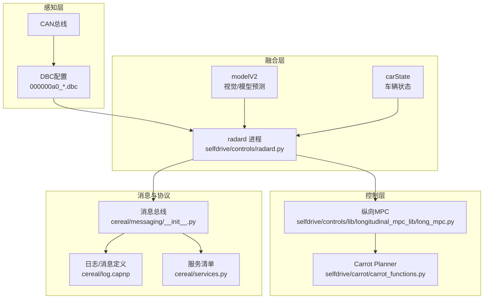
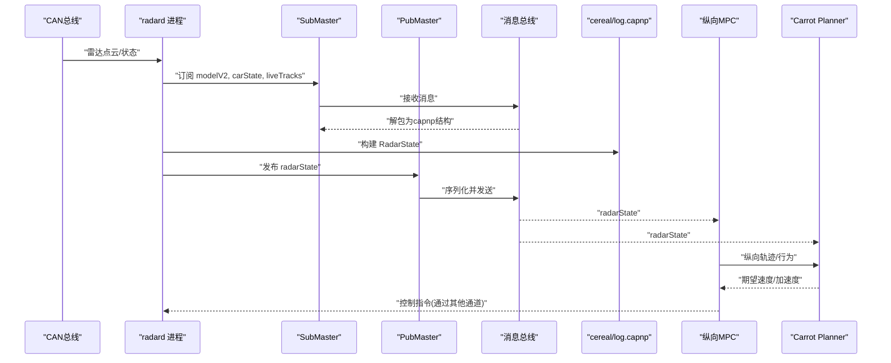
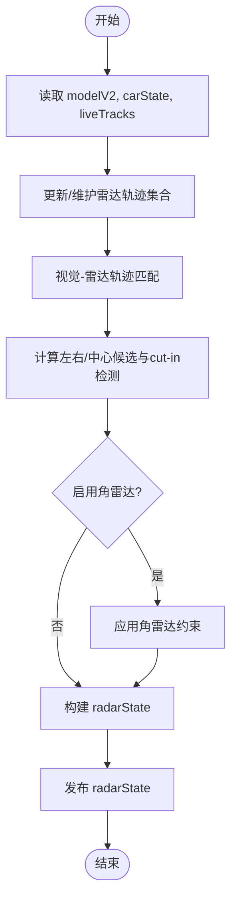
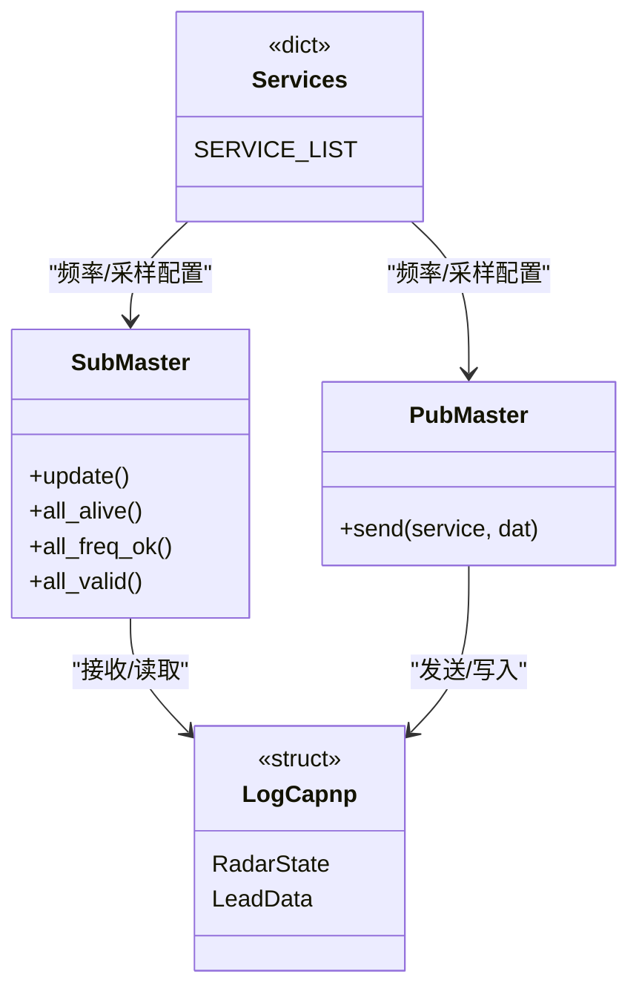
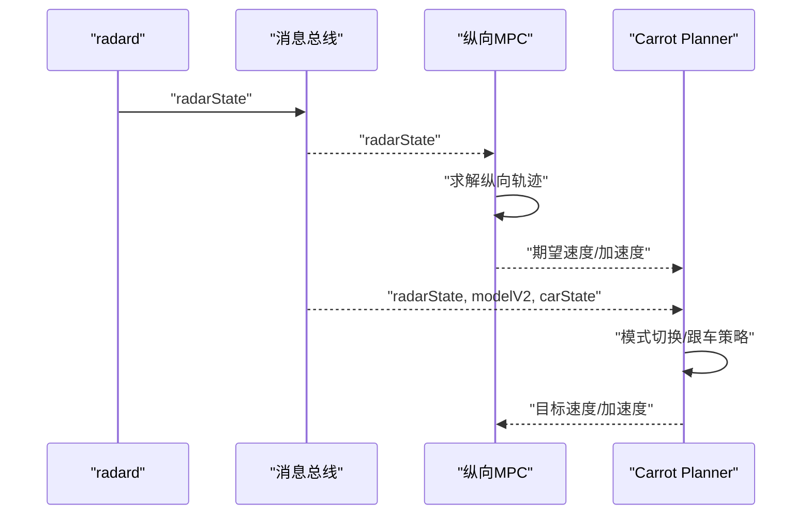
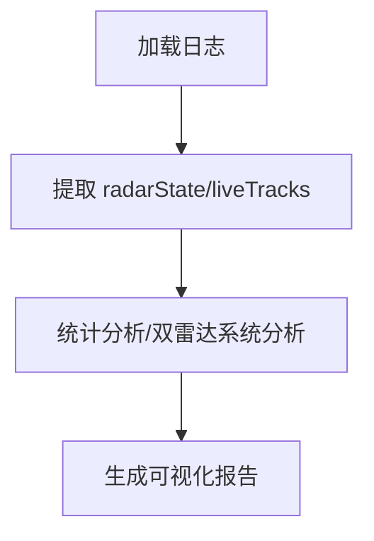
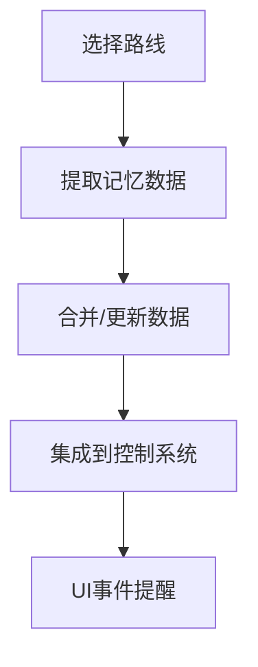
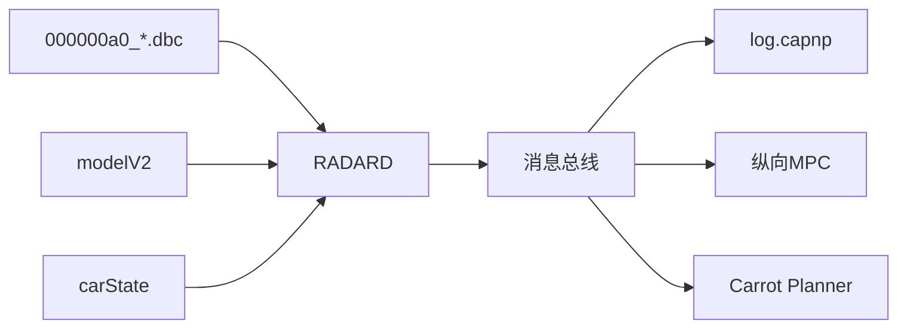

# 数据流分析

<cite>
**本文引用的文件**
- [selfdrive/controls/radard.py](file://selfdrive/controls/radard.py)
- [cereal/log.capnp](file://cereal/log.capnp)
- [cereal/services.py](file://cereal/services.py)
- [cereal/messaging/__init__.py](file://cereal/messaging/__init__.py)
- [selfdrive/carrot/carrot_functions.py](file://selfdrive/carrot/carrot_functions.py)
- [selfdrive/controls/lib/longitudinal_mpc_lib/long_mpc.py](file://selfdrive/controls/lib/longitudinal_mpc_lib/long_mpc.py)
- [tools/radar_pointcloud_visualizer.py](file://radar_pointcloud_visualizer.py)
- [tools/radar_to_pointcloud.py](file://radar_to_pointcloud.py)
- [000000a0_0994738059_enhanced_analysis_dbc.dbc](file://000000a0_0994738059_enhanced_analysis_dbc.dbc)
- [memory_cruise_extractor.py](file://memory_cruise_extractor.py)
- [memory_cruise.md](file://记忆巡航技术方案_0000007e.md)
</cite>

## 目录
1. [引言](#引言)
2. [项目结构](#项目结构)
3. [核心组件](#核心组件)
4. [架构总览](#架构总览)
5. [详细组件分析](#详细组件分析)
6. [依赖关系分析](#依赖关系分析)
7. [性能考虑](#性能考虑)
8. [故障排查指南](#故障排查指南)
9. [结论](#结论)
10. [附录](#附录)

## 引言
本文件面向Carrot2-v9-ACC数据流分析，聚焦从传感器数据输入到控制指令输出的完整链路，重点覆盖以下方面：
- cereal消息协议在系统中的应用：消息定义、序列化与反序列化、服务发布/订阅模型
- 关键数据结构的流转：radarState、modelV2、carState等消息的处理与转换
- 数据缓存策略与实时性保障机制
- 数据验证与异常处理流程
- 数据流监控与调试工具使用
- 性能瓶颈与优化策略

## 项目结构
本项目采用模块化分层架构，核心数据流由“感知-融合-规划-控制”多进程协作完成。雷达数据经radard进程融合为radarState，再由纵向控制器与横向控制器消费，最终生成控制指令。

图表来源
- [selfdrive/controls/radard.py:697-722](file://selfdrive/controls/radard.py#L697-L722)
- [cereal/messaging/__init__.py:138-236](file://cereal/messaging/__init__.py#L138-L236)
- [cereal/log.capnp:759-796](file://cereal/log.capnp#L759-L796)
- [cereal/services.py:12-106](file://cereal/services.py#L12-L106)
- [selfdrive/controls/lib/longitudinal_mpc_lib/long_mpc.py:235-245](file://selfdrive/controls/lib/longitudinal_mpc_lib/long_mpc.py#L235-L245)
- [selfdrive/carrot/carrot_functions.py:49-522](file://selfdrive/carrot/carrot_functions.py#L49-L522)
- [000000a0_0994738059_enhanced_analysis_dbc.dbc:119-179](file://000000a0_0994738059_enhanced_analysis_dbc.dbc#L119-L179)

章节来源
- [selfdrive/controls/radard.py:697-722](file://selfdrive/controls/radard.py#L697-L722)
- [cereal/messaging/__init__.py:138-236](file://cereal/messaging/__init__.py#L138-L236)
- [cereal/log.capnp:759-796](file://cereal/log.capnp#L759-L796)
- [cereal/services.py:12-106](file://cereal/services.py#L12-L106)
- [selfdrive/controls/lib/longitudinal_mpc_lib/long_mpc.py:235-245](file://selfdrive/controls/lib/longitudinal_mpc_lib/long_mpc.py#L235-L245)
- [selfdrive/carrot/carrot_functions.py:49-522](file://selfdrive/carrot/carrot_functions.py#L49-L522)
- [000000a0_0994738059_enhanced_analysis_dbc.dbc:119-179](file://000000a0_0994738059_enhanced_analysis_dbc.dbc#L119-L179)

## 核心组件
- radard：负责将雷达点云与视觉模型融合，生成radarState消息，供纵向/横向控制器使用
- cereal消息系统：提供SubMaster/PubMaster、消息构造/反序列化、频率校验等能力
- modelV2与carState：分别提供轨迹预测、速度/加速度估计与车辆当前状态
- 纵向MPC与Carrot Planner：基于radarState与模型预测进行纵向行为决策与轨迹生成
- DBC配置：定义CAN消息格式与字段语义，支撑雷达数据解析与车辆控制指令下发

章节来源
- [selfdrive/controls/radard.py:386-722](file://selfdrive/controls/radard.py#L386-L722)
- [cereal/messaging/__init__.py:138-236](file://cereal/messaging/__init__.py#L138-L236)
- [cereal/log.capnp:759-796](file://cereal/log.capnp#L759-L796)
- [selfdrive/controls/lib/longitudinal_mpc_lib/long_mpc.py:235-245](file://selfdrive/controls/lib/longitudinal_mpc_lib/long_mpc.py#L235-L245)
- [selfdrive/carrot/carrot_functions.py:49-522](file://selfdrive/carrot/carrot_functions.py#L49-L522)
- [000000a0_0994738059_enhanced_analysis_dbc.dbc:119-179](file://000000a0_0994738059_enhanced_analysis_dbc.dbc#L119-L179)

## 架构总览
下图展示了从传感器输入到控制输出的关键数据流路径，以及cereal消息协议在其中的角色。

图表来源
- [selfdrive/controls/radard.py:411-482](file://selfdrive/controls/radard.py#L411-L482)
- [cereal/messaging/__init__.py:138-236](file://cereal/messaging/__init__.py#L138-L236)
- [cereal/log.capnp:759-796](file://cereal/log.capnp#L759-L796)
- [selfdrive/controls/lib/longitudinal_mpc_lib/long_mpc.py:235-245](file://selfdrive/controls/lib/longitudinal_mpc_lib/long_mpc.py#L235-L245)
- [selfdrive/carrot/carrot_functions.py:49-522](file://selfdrive/carrot/carrot_functions.py#L49-L522)

## 详细组件分析

### 组件A：radard（雷达融合与radarState生成）
- 输入：modelV2（视觉/模型预测）、carState（车辆状态）、liveTracks（雷达点云）
- 处理：匹配视觉目标与雷达轨迹，计算dRel/yRel/vRel/aLead等；根据参数选择是否启用角雷达/反应因子；生成leadOne/leadTwo及左右/中心候选队列
- 输出：radarState（包含LeadData数组与时间戳）

图表来源
- [selfdrive/controls/radard.py:411-694](file://selfdrive/controls/radard.py#L411-L694)

章节来源
- [selfdrive/controls/radard.py:386-722](file://selfdrive/controls/radard.py#L386-L722)

### 组件B：cereal消息协议与服务
- 消息定义：RadarState/LeadData等结构体在log.capnp中定义
- 序列化/反序列化：new_message用于构造消息，to_bytes/recv_sock等完成序列化与接收
- 服务管理：services.py定义各服务的频率、是否记录、采样倍数等
- 实时性保障：SubMaster支持poll/conflate、频率跟踪、alive/freq_ok/valid检查

图表来源
- [cereal/messaging/__init__.py:138-236](file://cereal/messaging/__init__.py#L138-L236)
- [cereal/log.capnp:759-796](file://cereal/log.capnp#L759-L796)
- [cereal/services.py:12-106](file://cereal/services.py#L12-L106)

章节来源
- [cereal/messaging/__init__.py:25-94](file://cereal/messaging/__init__.py#L25-L94)
- [cereal/services.py:12-106](file://cereal/services.py#L12-L106)
- [cereal/log.capnp:759-796](file://cereal/log.capnp#L759-L796)

### 组件C：纵向MPC与Carrot Planner
- 纵向MPC：基于Acados求解器，设置QP/积分器参数，生成速度轨迹
- Carrot Planner：结合radarState、modelV2、carState，动态切换驾驶模式（经济/安全/正常/高速），生成期望速度与停止距离

图表来源
- [selfdrive/controls/lib/longitudinal_mpc_lib/long_mpc.py:235-245](file://selfdrive/controls/lib/longitudinal_mpc_lib/long_mpc.py#L235-L245)
- [selfdrive/carrot/carrot_functions.py:49-522](file://selfdrive/carrot/carrot_functions.py#L49-L522)

章节来源
- [selfdrive/controls/lib/longitudinal_mpc_lib/long_mpc.py:235-245](file://selfdrive/controls/lib/longitudinal_mpc_lib/long_mpc.py#L235-L245)
- [selfdrive/carrot/carrot_functions.py:49-522](file://selfdrive/carrot/carrot_functions.py#L49-L522)

### 组件D：数据可视化与分析工具
- radar_to_pointcloud.py：从日志中抽取雷达点云与radarState，便于离线分析
- radar_pointcloud_visualizer.py：对雷达目标进行双雷达系统分析、距离/速度/角度统计、雷达位置分析

图表来源
- [tools/radar_to_pointcloud.py:72-103](file://radar_to_pointcloud.py#L72-L103)
- [tools/radar_pointcloud_visualizer.py:407-447](file://radar_pointcloud_visualizer.py#L407-L447)

章节来源
- [tools/radar_to_pointcloud.py:72-103](file://radar_to_pointcloud.py#L72-L103)
- [tools/radar_pointcloud_visualizer.py:407-447](file://radar_pointcloud_visualizer.py#L407-L447)

### 组件E：记忆巡航（离线数据驱动）
- memory_cruise_extractor.py：从日志中提取路线记忆数据
- 记忆巡航技术方案：基于历史数据提供速度建议、事件提醒，与ACC协同工作

图表来源
- [memory_cruise_extractor.py](file://memory_cruise_extractor.py)
- [记忆巡航技术方案_0000007e.md:476-533](file://记忆巡航技术方案_0000007e.md#L476-L533)

章节来源
- [memory_cruise_extractor.py](file://memory_cruise_extractor.py)
- [记忆巡航技术方案_0000007e.md:476-533](file://记忆巡航技术方案_0000007e.md#L476-L533)

## 依赖关系分析
- radard依赖cereal消息系统进行订阅/发布，依赖modelV2与carState进行融合决策
- 纵向MPC与Carrot Planner依赖radarState进行行为决策
- DBC配置决定CAN消息解析与控制指令生成

图表来源
- [selfdrive/controls/radard.py:411-482](file://selfdrive/controls/radard.py#L411-L482)
- [cereal/messaging/__init__.py:138-236](file://cereal/messaging/__init__.py#L138-L236)
- [cereal/log.capnp:759-796](file://cereal/log.capnp#L759-L796)
- [selfdrive/controls/lib/longitudinal_mpc_lib/long_mpc.py:235-245](file://selfdrive/controls/lib/longitudinal_mpc_lib/long_mpc.py#L235-L245)
- [selfdrive/carrot/carrot_functions.py:49-522](file://selfdrive/carrot/carrot_functions.py#L49-L522)
- [000000a0_0994738059_enhanced_analysis_dbc.dbc:119-179](file://000000a0_0994738059_enhanced_analysis_dbc.dbc#L119-L179)

章节来源
- [selfdrive/controls/radard.py:411-482](file://selfdrive/controls/radard.py#L411-L482)
- [cereal/messaging/__init__.py:138-236](file://cereal/messaging/__init__.py#L138-L236)
- [cereal/log.capnp:759-796](file://cereal/log.capnp#L759-L796)
- [selfdrive/controls/lib/longitudinal_mpc_lib/long_mpc.py:235-245](file://selfdrive/controls/lib/longitudinal_mpc_lib/long_mpc.py#L235-L245)
- [selfdrive/carrot/carrot_functions.py:49-522](file://selfdrive/carrot/carrot_functions.py#L49-L522)
- [000000a0_0994738059_enhanced_analysis_dbc.dbc:119-179](file://000000a0_0994738059_enhanced_analysis_dbc.dbc#L119-L179)

## 性能考虑
- 实时性保障
  - SubMaster使用poll/conflate策略，确保高频服务（如radarState、modelV2）及时更新
  - FrequencyTracker对服务频率进行滑动窗口评估，避免因抖动误判
- 缓存与延迟
  - v_ego历史队列用于平滑与延迟补偿，减少瞬态噪声影响
  - radarState包含mdMonoTime与carStateMonoTime，便于跨源时间对齐
- 计算复杂度
  - radar融合中轨迹匹配与概率评分在每帧执行，需关注轨迹数量与阈值设置
  - 纵向MPC迭代次数与求解器类型影响端到端延迟，需在精度与实时性间平衡

章节来源
- [selfdrive/controls/radard.py:386-482](file://selfdrive/controls/radard.py#L386-L482)
- [cereal/messaging/__init__.py:95-136](file://cereal/messaging/__init__.py#L95-L136)

## 故障排查指南
- 消息存活与频率检查
  - 使用SubMaster的all_alive/all_freq_ok/all_valid判断服务健康状况
  - 若radarState长期不可用，检查radard进程、DBC配置与CAN链路
- radarState内容核验
  - 检查LeadData字段（dRel/yRel/vRel/aLead等）是否合理
  - 对比radar与vision来源，确认匹配逻辑与阈值设置
- 日志分析与可视化
  - 使用radar_to_pointcloud.py/radar_pointcloud_visualizer.py进行离线分析
  - 关注双雷达系统的目标分布、最大探测距离与角度统计
- 记忆巡航数据质量
  - 确认提取脚本运行成功，检查JSON输出完整性
  - 结合技术方案文档核对集成步骤与安全限制

章节来源
- [cereal/messaging/__init__.py:225-235](file://cereal/messaging/__init__.py#L225-L235)
- [tools/radar_to_pointcloud.py:72-103](file://radar_to_pointcloud.py#L72-L103)
- [tools/radar_pointcloud_visualizer.py:407-447](file://radar_pointcloud_visualizer.py#L407-L447)
- [记忆巡航技术方案_0000007e.md:476-533](file://记忆巡航技术方案_0000007e.md#L476-L533)

## 结论
本架构通过cereal消息协议实现跨进程解耦，radard将雷达与视觉信息融合为统一的radarState，纵向MPC与Carrot Planner在此基础上完成安全高效的纵向控制。通过服务频率管理、实时性保障与可视化工具，系统在保证稳定性的同时具备良好的可维护性与可观测性。后续可在轨迹匹配算法、MPC求解参数与记忆巡航数据质量方面持续优化。

## 附录
- DBC配置要点：关注消息频率、字节范围与趋势，辅助雷达解析与控制指令生成
- 参数与策略：EnableRadarTracks、EnableCornerRadar、RadarLatFactor、RadarReactionFactor等参数对融合结果与安全性有直接影响

章节来源
- [000000a0_0994738059_enhanced_analysis_dbc.dbc:119-179](file://000000a0_0994738059_enhanced_analysis_dbc.dbc#L119-L179)
- [selfdrive/controls/radard.py:415-419](file://selfdrive/controls/radard.py#L415-L419)