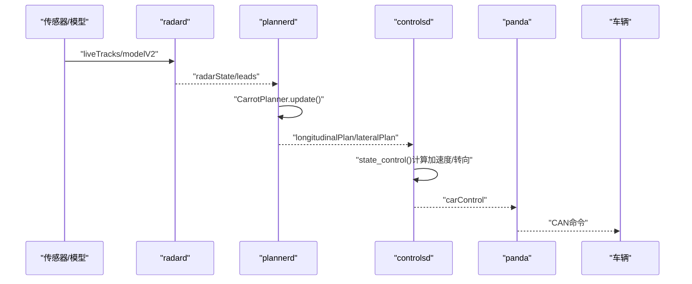
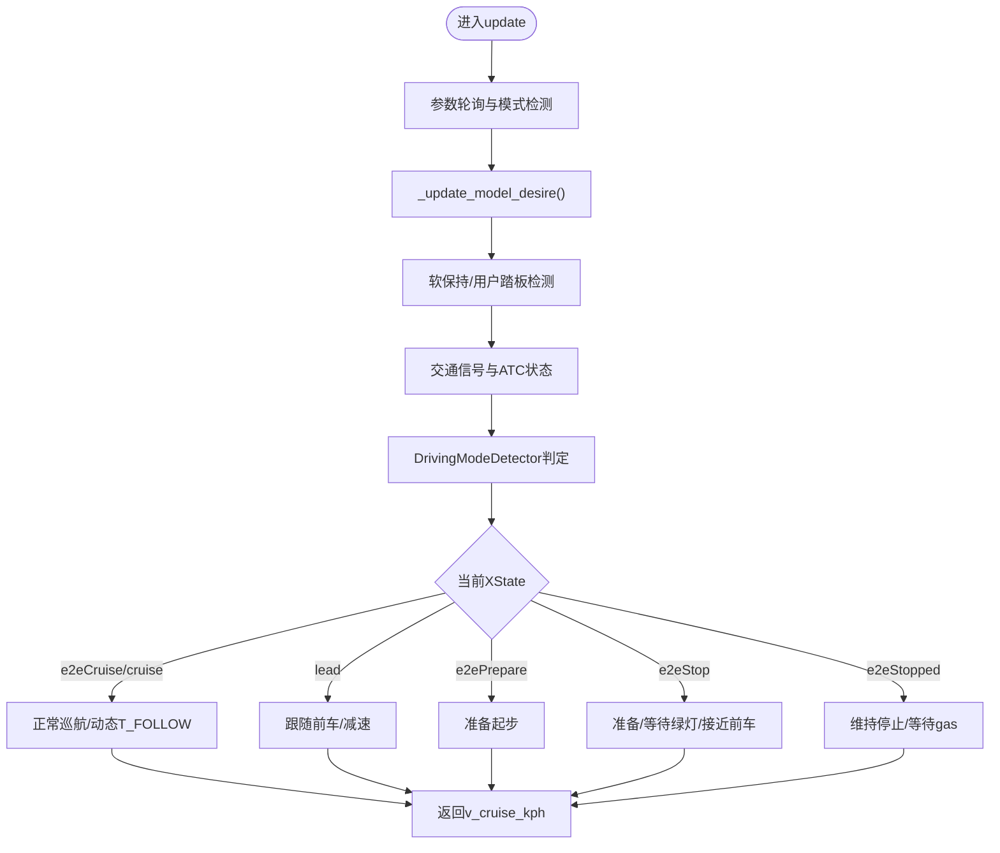
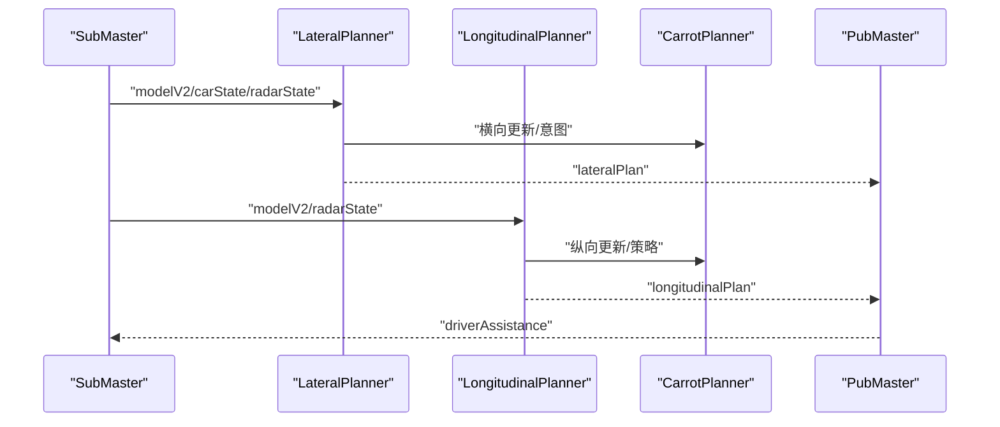
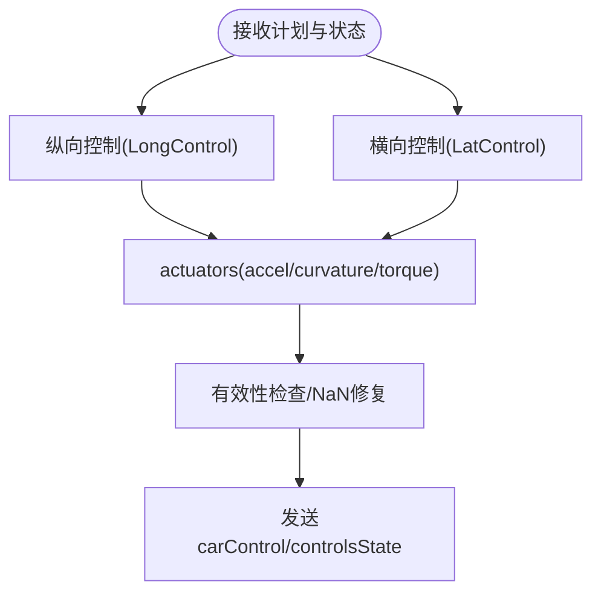
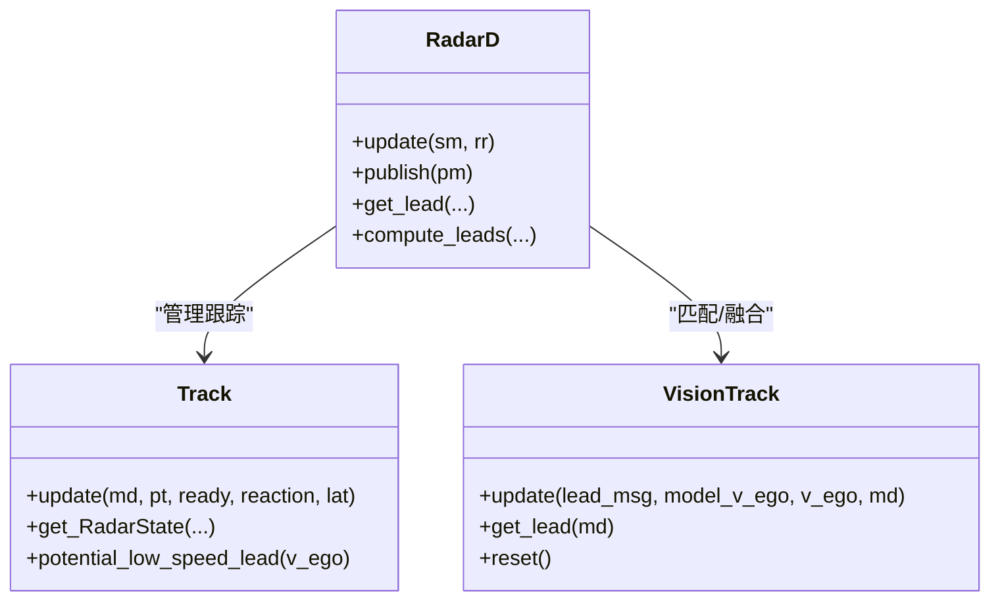
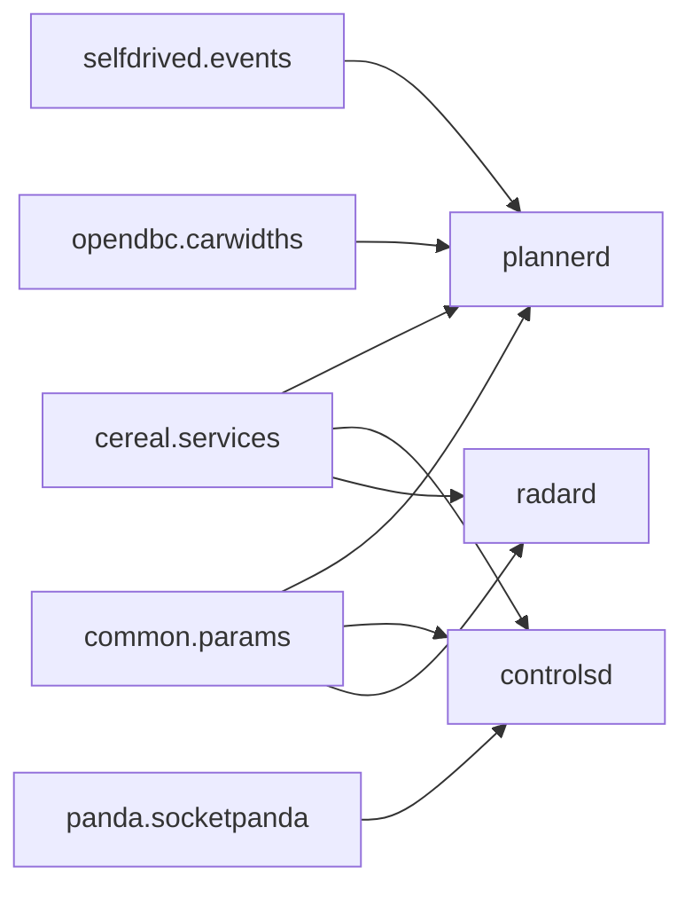

# 整体架构设计

<cite>
**本文引用的文件**
- [README.md](file://README.md)
- [docs/INTEGRATION.md](file://docs/INTEGRATION.md)
- [docs/SAFETY.md](file://docs/SAFETY.md)
- [docs/contributing/roadmap.md](file://docs/contributing/roadmap.md)
- [selfdrive/controls/plannerd.py](file://selfdrive/controls/plannerd.py)
- [selfdrive/controls/controlsd.py](file://selfdrive/controls/controlsd.py)
- [selfdrive/controls/radard.py](file://selfdrive/controls/radard.py)
- [selfdrive/carrot/carrot_functions.py](file://selfdrive/carrot/carrot_functions.py)
- [cereal/services.py](file://cereal/services.py)
- [opendbc_repo/opendbc/car/carwidths.py](file://opendbc_repo/opendbc/car/carwidths.py)
- [panda/python/socketpanda.py](file://panda/python/socketpanda.py)
</cite>

## 目录
1. [引言](#引言)
2. [项目结构](#项目结构)
3. [核心组件](#核心组件)
4. [架构总览](#架构总览)
5. [详细组件分析](#详细组件分析)
6. [依赖分析](#依赖分析)
7. [性能考虑](#性能考虑)
8. [故障排查指南](#故障排查指南)
9. [结论](#结论)
10. [附录](#附录)

## 引言
本文件面向Carrot2-v9-ACC的整体架构设计，聚焦于模块化、事件驱动与分层架构的协同：以CarrotPlanner为核心控制器，结合plannerd（纵向/横向规划）、controlsd（执行器控制）、radard（雷达融合）等模块，形成从传感器输入到控制输出的闭环链路；并与openpilot生态中的cereal消息系统、opendbc数据库、panda CAN接口紧密协作，确保安全、可扩展与可维护性。

## 项目结构
仓库采用“功能域+分层”的组织方式：
- selfdrive：自动驾驶核心进程与算法（controls、modeld、locationd、navd 等）
- common：通用工具库（参数、过滤、转换、实时调度等）
- cereal/msgq：跨进程消息与序列化（Cap'n Proto）
- opendbc：车辆DBC数据库与接口抽象
- panda：硬件安全与CAN通信栈
- docs：文档与规范
- tools：分析与验证工具集

```mermaid
graph TB
subgraph "应用层"
UI["UI/CarrotMan<br/>用户界面与参数"]
end
subgraph "控制层"
PLANNER["plannerd<br/>纵向/横向规划"]
CONTROL["controlsd<br/>执行器控制"]
RADAR["radard<br/>雷达融合"]
end
subgraph "感知与定位"
MODEL["modeld<br/>视觉模型输出"]
LOC["locationd<br/>定位/姿态"]
end
subgraph "系统服务"
CEREAL["cereal<br/>消息/服务"]
PARAMS["参数服务"]
end
subgraph "硬件接口"
PANDA["panda<br/>CAN安全/通信"]
ODB["opendbc<br/>DBC/车辆接口"]
end
UI --> PLANNER
MODEL --> PLANNER
RADAR --> PLANNER
PLANNER --> CONTROL
CONTROL --> PANDA
PANDA --> ODB
CEREAL <- --> PLANNER
CEREAL <- --> CONTROL
CEREAL <- --> RADAR
PARAMS <- --> PLANNER
PARAMS <- --> CONTROL
PARAMS <- --> RADAR
```

图表来源
- [selfdrive/controls/plannerd.py:13-48](file://selfdrive/controls/plannerd.py#L13-L48)
- [selfdrive/controls/controlsd.py:38-93](file://selfdrive/controls/controlsd.py#L38-L93)
- [selfdrive/controls/radard.py:386-482](file://selfdrive/controls/radard.py#L386-L482)
- [cereal/services.py](file://cereal/services.py)
- [opendbc_repo/opendbc/car/carwidths.py](file://opendbc_repo/opendbc/car/carwidths.py)

章节来源
- [README.md:1-144](file://README.md#L1-L144)
- [docs/INTEGRATION.md:1-12](file://docs/INTEGRATION.md#L1-L12)

## 核心组件
- CarrotPlanner（Carrot2-v9-ACC核心控制器）
  - 职责：基于驾驶模式、交通信号与模型意图，生成目标车速与跟车策略；管理e2e状态机（准备/巡航/停车/跟随），并产出舒适制动与动态跟车距离。
  - 关键点：状态机枚举XState、交通信号检测TrafficState、动态T_FOLLOW与加加速度约束、自适应eco/safe/high模式因子。
- plannerd（纵向/横向规划协调器）
  - 职责：订阅CarState/ModelV2/RadarState等，调用LongitudinalPlanner与LateralPlanner，并通过CarrotPlanner进行策略融合，发布纵向计划与辅助信息。
- controlsd（执行器控制）
  - 职责：根据纵向/横向计划与车辆动力学模型，计算加速度与转向指令，处理驾驶员接管与安全限制，向车辆发送CarControl。
- radard（雷达融合）
  - 职责：融合摄像头与雷达轨迹，匹配最佳前车目标，输出leadOne/leadTwo及左右侧候选，支持角雷达补盲与cut-in检测。

章节来源
- [selfdrive/carrot/carrot_functions.py:49-543](file://selfdrive/carrot/carrot_functions.py#L49-L543)
- [selfdrive/controls/plannerd.py:13-48](file://selfdrive/controls/plannerd.py#L13-L48)
- [selfdrive/controls/controlsd.py:38-210](file://selfdrive/controls/controlsd.py#L38-L210)
- [selfdrive/controls/radard.py:386-694](file://selfdrive/controls/radard.py#L386-L694)

## 架构总览
Carrot2-v9-ACC采用“事件驱动 + 分层架构”：
- 事件驱动：plannerd按帧更新，依据模型/雷达/状态变化触发规划与控制；controlsd以固定速率循环，响应计划与事件。
- 分层架构：感知层（radard/modeld/locationd）、控制层（plannerd/controlsd）、执行层（panda/DBC）与消息层（cereal）解耦协作。
- 安全边界：panda安全模型与openpilot安全规范（ISO26262）贯穿执行层，确保急刹、急转等极限工况下的可预测性。



图表来源
- [selfdrive/controls/radard.py:411-482](file://selfdrive/controls/radard.py#L411-L482)
- [selfdrive/controls/plannerd.py:30-44](file://selfdrive/controls/plannerd.py#L30-L44)
- [selfdrive/controls/controlsd.py:94-210](file://selfdrive/controls/controlsd.py#L94-L210)

## 详细组件分析

### CarrotPlanner（状态机与控制策略）
- 状态机（XState）：cruise/e2eCruise/e2eStop/e2ePrepare/e2eStopped/lead，依据交通信号、模型意图与用户输入切换。
- 动态参数：基于DrivingMode（Eco/Safe/Normal/High）与mySafeFactor、动态T_FOLLOW、comfortBrake等，实现自适应跟车。
- 事件与HUD：通过Events与hudControl字段向UI反馈状态（如绿灯起步、红灯减速、ATC引导距离）。
- 与plannerd协作：plannerd在每次模型帧到达时调用CarrotPlanner，将其输出融入纵向/横向计划。



图表来源
- [selfdrive/carrot/carrot_functions.py:346-521](file://selfdrive/carrot/carrot_functions.py#L346-L521)

章节来源
- [selfdrive/carrot/carrot_functions.py:49-543](file://selfdrive/carrot/carrot_functions.py#L49-L543)

### plannerd（规划协调器）
- 订阅：carState、carControl、controlsState、liveParameters、radarState、modelV2、selfdriveState、carrotMan。
- 发布：longitudinalPlan、driverAssistance、lateralPlan。
- 协作：先更新LateralPlanner与LongitudinalPlanner，再由CarrotPlanner参与策略融合，最后LDW告警封装为driverAssistance消息。



图表来源
- [selfdrive/controls/plannerd.py:25-44](file://selfdrive/controls/plannerd.py#L25-L44)

章节来源
- [selfdrive/controls/plannerd.py:13-48](file://selfdrive/controls/plannerd.py#L13-L48)

### controlsd（执行器控制）
- 输入：longitudinalPlan、lateralPlan、modelV2、radarState、selfdriveState、liveCalibration等。
- 处理：纵向PID/加加速度约束，横向曲率平滑与延迟补偿，结合车辆模型与扭矩参数。
- 输出：carControl（含加速度、曲率、转向角、HUD信息），controlsState（控制状态回传）。



图表来源
- [selfdrive/controls/controlsd.py:94-210](file://selfdrive/controls/controlsd.py#L94-L210)
- [selfdrive/controls/controlsd.py:246-359](file://selfdrive/controls/controlsd.py#L246-L359)

章节来源
- [selfdrive/controls/controlsd.py:38-378](file://selfdrive/controls/controlsd.py#L38-L378)

### radard（雷达融合）
- 输入：liveTracks、modelV2、carState。
- 处理：Track/VisionTrack匹配，低速优先、概率阈值、cut-in检测、角雷达补盲。
- 输出：radarState（leadOne/leadTwo、左右候选、FCW标记）。



图表来源
- [selfdrive/controls/radard.py:386-694](file://selfdrive/controls/radard.py#L386-L694)

章节来源
- [selfdrive/controls/radard.py:31-694](file://selfdrive/controls/radard.py#L31-L694)

## 依赖分析
- 消息系统（cereal）
  - plannerd/controlsd/radard均使用SubMaster/PubMaster进行跨进程通信，消息类型在services.py中声明。
- 车辆接口（opendbc）
  - 通过CarParams与DBC配置抽象车辆特性（如宽度、延迟等），plannerd在启动时读取CarParams。
- 硬件安全（panda）
  - 执行层通过panda安全模型与CAN通信，确保急刹/急转等极限工况下的安全边界。
- 参数与事件
  - CarrotPlanner与controlsd均依赖参数服务（Params）与事件系统（Events）进行运行期调整与告警。



图表来源
- [cereal/services.py](file://cereal/services.py)
- [selfdrive/controls/plannerd.py:18-18](file://selfdrive/controls/plannerd.py#L18-L18)
- [opendbc_repo/opendbc/car/carwidths.py](file://opendbc_repo/opendbc/car/carwidths.py)

章节来源
- [selfdrive/controls/plannerd.py:13-28](file://selfdrive/controls/plannerd.py#L13-L28)
- [selfdrive/controls/controlsd.py:39-45](file://selfdrive/controls/controlsd.py#L39-L45)
- [selfdrive/controls/radard.py:404-420](file://selfdrive/controls/radard.py#L404-L420)

## 性能考虑
- 实时性保障
  - 各进程通过Priority与config_realtime_process设置实时优先级，plannerd/controlsd/radard均在固定速率下运行。
- 数据流节拍
  - plannerd按modelV2帧驱动，controlsd以100Hz循环，radard根据liveTracks与模型更新频率动态处理。
- 参数轮询与滤波
  - CarrotPlanner对参数按帧轮询并使用移动平均滤波，降低抖动与瞬态影响。
- 融合策略
  - radar与vision在概率与几何上做多假设匹配，兼顾鲁棒性与精度。

## 故障排查指南
- 消息缺失/超时
  - 检查cereal消息订阅是否正确（plannerd/controlsd/radard的SubMaster列表），确认services.py中消息名一致。
- 控制异常
  - 观察controlsState与carControl的有效位，确认NaN/Inf修复逻辑是否触发；检查纵向/横向控制状态与限幅。
- 雷达/模型不一致
  - 核对radard的enable_radar_tracks、enable_corner_radar、RadarReactionFactor等参数；检查modelV2的laneLine与leadsV3可用性。
- 安全与事件
  - 关注Events事件与panda安全码，必要时启用安全测试与日志采集。

章节来源
- [selfdrive/controls/controlsd.py:200-209](file://selfdrive/controls/controlsd.py#L200-L209)
- [selfdrive/controls/radard.py:415-420](file://selfdrive/controls/radard.py#L415-L420)

## 结论
Carrot2-v9-ACC以CarrotPlanner为核心，构建了“状态机+自适应参数+事件驱动”的纵向控制策略，并与plannerd、controlsd、radard形成清晰的分层与事件驱动协作关系。通过cereal消息系统、opendbc数据库与panda安全模型，系统实现了从传感器输入到CAN执行的安全闭环，满足openpilot的安全与可扩展要求。

## 附录
- 安全与合规
  - 参考openpilot安全文档与ISO26262实践，panda安全模型与测试流程是执行层的关键保障。
- 生态集成
  - 在支持的车型中，openpilot ACC替换原厂ACC，同时保留多项原厂功能（如FCW、AEB、盲区等）。

章节来源
- [docs/SAFETY.md:1-37](file://docs/SAFETY.md#L1-L37)
- [docs/INTEGRATION.md:1-12](file://docs/INTEGRATION.md#L1-L12)
- [docs/contributing/roadmap.md:10-32](file://docs/contributing/roadmap.md#L10-L32)