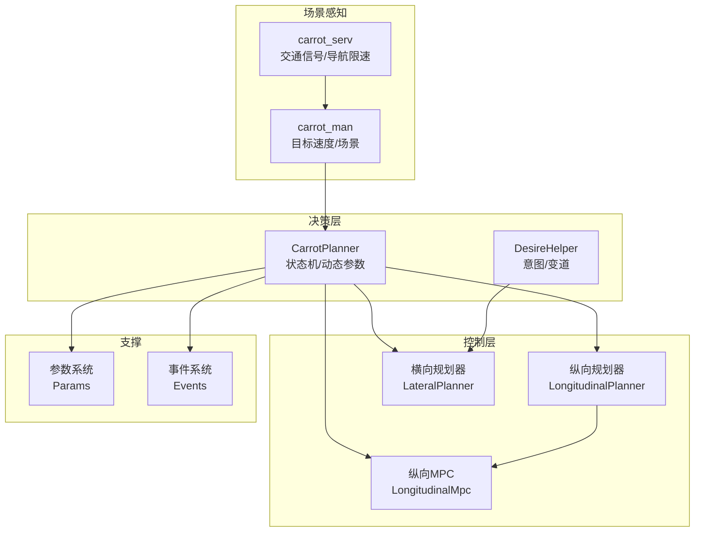
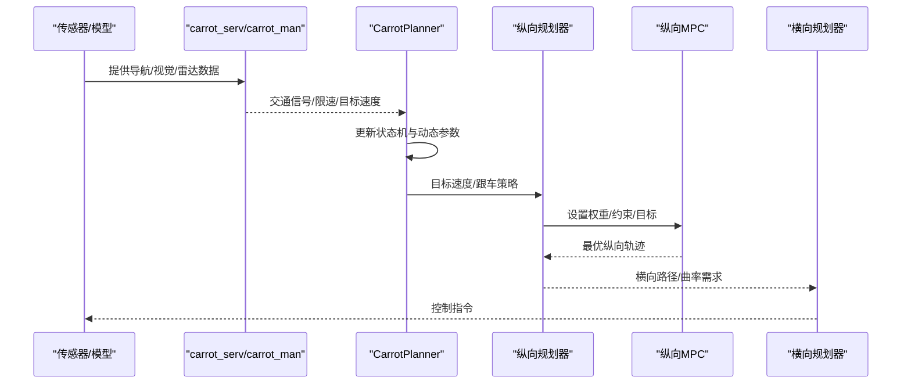
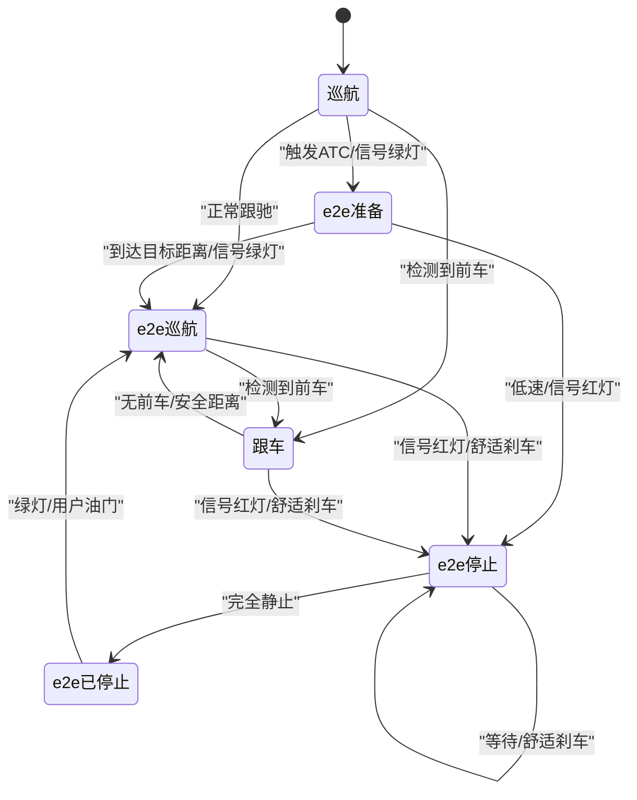
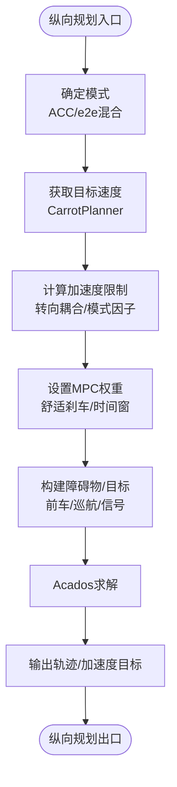
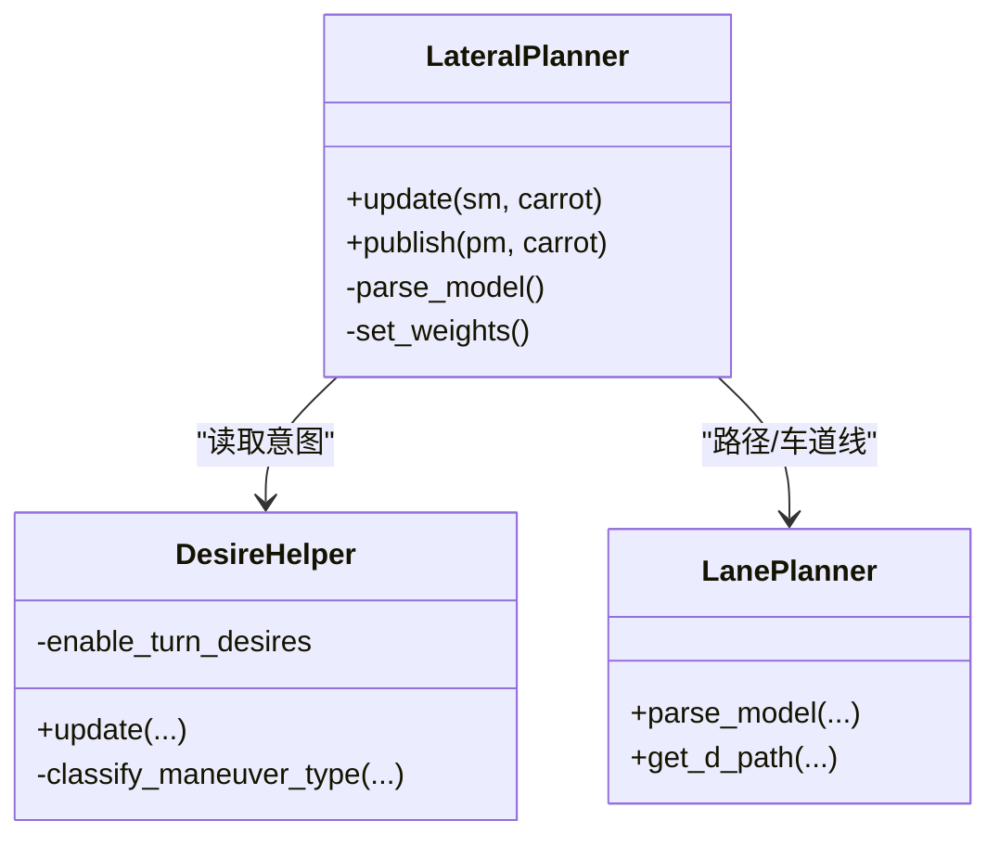
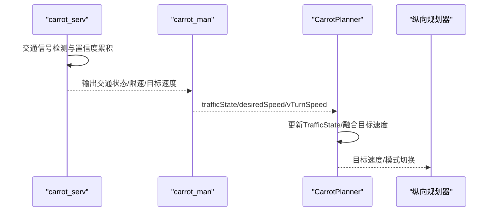
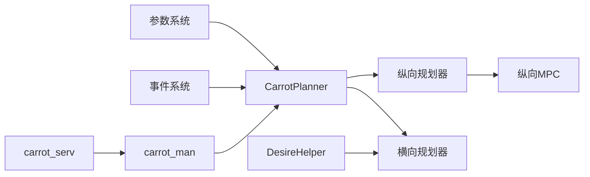

# 核心算法架构

<cite>
**本文引用的文件**
- [carrot_functions.py](file://selfdrive/carrot/carrot_functions.py)
- [longitudinal_planner.py](file://selfdrive/controls/lib/longitudinal_planner.py)
- [lateral_planner.py](file://selfdrive/controls/lib/lateral_planner.py)
- [long_mpc.py](file://selfdrive/controls/lib/longitudinal_mpc_lib/long_mpc.py)
- [carrot_serv.py](file://selfdrive/carrot/carrot_serv.py)
- [desire_helper.py](file://selfdrive/controls/lib/desire_helper.py)
- [carrot_man.py](file://selfdrive/carrot/carrot_man.py)
- [longcontrol.py](file://selfdrive/controls/lib/longcontrol.py)
- [carrot_setting.py](file://selfdrive/carrot_setting.py)
- [carrot_set.py](file://selfdrive/carrot_set.py)
- [params.py](file://common/params.py)
- [events.py](file://selfdrive/selfdrived/events.py)
</cite>

## 目录
1. [简介](#简介)
2. [项目结构](#项目结构)
3. [核心组件](#核心组件)
4. [架构总览](#架构总览)
5. [详细组件分析](#详细组件分析)
6. [依赖关系分析](#依赖关系分析)
7. [性能考虑](#性能考虑)
8. [故障排查指南](#故障排查指南)
9. [结论](#结论)
10. [附录](#附录)

## 简介
本文件面向Carrot2-v9-ACC核心算法架构，围绕CarrotPlanner类进行深度解析，涵盖其状态机设计（XState与DrivingMode）、状态转换逻辑（从cruise到e2eCruise、e2eStop等）、纵向/横向控制与交通信号识别的分层结构、动态参数调节机制（驾驶模式因子与车速限制）、实时性要求与性能优化策略，并提供算法流程图、状态转换图与关键算法伪代码路径及参数配置与调试方法。

## 项目结构
Carrot2-v9-ACC的核心算法主要分布在以下模块：
- 控制层：纵向规划器、横向规划器、纵向MPC求解器
- 决策层：CarrotPlanner（状态机与动态参数）
- 场景感知：carrot_serv（交通信号、导航限速、弯道限速）、carrot_man（目标速度与场景信息）
- 参数与事件：参数存储、事件系统
- 辅助模块：DesireHelper（意图与变道决策）

**图表来源**
- [carrot_functions.py:49-521](file://selfdrive/carrot/carrot_functions.py#L49-L521)
- [longitudinal_planner.py:85-284](file://selfdrive/controls/lib/longitudinal_planner.py#L85-L284)
- [lateral_planner.py:34-264](file://selfdrive/controls/lib/lateral_planner.py#L34-L264)
- [long_mpc.py:235-536](file://selfdrive/controls/lib/longitudinal_mpc_lib/long_mpc.py#L235-L536)
- [carrot_serv.py:83-800](file://selfdrive/carrot/carrot_serv.py#L83-L800)
- [desire_helper.py:104-662](file://selfdrive/controls/lib/desire_helper.py#L104-L662)

**章节来源**
- [carrot_functions.py:1-543](file://selfdrive/carrot/carrot_functions.py#L1-L543)
- [longitudinal_planner.py:1-284](file://selfdrive/controls/lib/longitudinal_planner.py#L1-L284)
- [lateral_planner.py:1-338](file://selfdrive/controls/lib/lateral_planner.py#L1-L338)
- [long_mpc.py:1-536](file://selfdrive/controls/lib/longitudinal_mpc_lib/long_mpc.py#L1-L536)
- [carrot_serv.py:1-800](file://selfdrive/carrot/carrot_serv.py#L1-L800)
- [desire_helper.py:1-662](file://selfdrive/controls/lib/desire_helper.py#L1-L662)

## 核心组件
- CarrotPlanner：负责状态机（XState）、驾驶模式（DrivingMode）、交通信号识别（TrafficState）、动态参数调节（动态跟车距离、舒适刹车、驾驶模式因子）与目标速度融合。
- LongitudinalPlanner：整合CarrotPlanner输出，生成纵向轨迹与加速度目标，驱动纵向MPC求解。
- LongitudinalMpc：基于Acados的MPC求解器，计算纵向最优轨迹，支持ACC与e2e混合模式。
- LateralPlanner：基于模型预测与路径规划，生成横向轨迹与曲率目标。
- carrot_serv：提供交通信号状态、导航限速、弯道限速等场景信息。
- DesireHelper：处理意图与变道决策，影响横向规划与车道线使用策略。

**章节来源**
- [carrot_functions.py:49-521](file://selfdrive/carrot/carrot_functions.py#L49-L521)
- [longitudinal_planner.py:85-284](file://selfdrive/controls/lib/longitudinal_planner.py#L85-L284)
- [long_mpc.py:235-536](file://selfdrive/controls/lib/longitudinal_mpc_lib/long_mpc.py#L235-L536)
- [lateral_planner.py:34-264](file://selfdrive/controls/lib/lateral_planner.py#L34-L264)
- [carrot_serv.py:83-800](file://selfdrive/carrot/carrot_serv.py#L83-L800)
- [desire_helper.py:104-662](file://selfdrive/controls/lib/desire_helper.py#L104-L662)

## 架构总览
Carrot2-v9-ACC采用“场景感知-决策-控制”的分层架构：
- 场景感知层：carrot_serv与carrot_man提供交通信号、导航限速、弯道限速等输入。
- 决策层：CarrotPlanner根据场景与驾驶模式更新状态机与动态参数。
- 控制层：LongitudinalPlanner/LateralPlanner分别生成纵向/横向控制指令，由纵向MPC保证轨迹可行性与安全性。

**图表来源**
- [carrot_functions.py:346-521](file://selfdrive/carrot/carrot_functions.py#L346-L521)
- [longitudinal_planner.py:132-284](file://selfdrive/controls/lib/longitudinal_planner.py#L132-L284)
- [long_mpc.py:364-536](file://selfdrive/controls/lib/longitudinal_mpc_lib/long_mpc.py#L364-L536)
- [lateral_planner.py:85-264](file://selfdrive/controls/lib/lateral_planner.py#L85-L264)
- [carrot_serv.py:268-318](file://selfdrive/carrot/carrot_serv.py#L268-L318)

## 详细组件分析

### CarrotPlanner：状态机与动态参数
- 状态机（XState）：lead/cruise/e2eCruise/e2eStop/e2ePrepare/e2eStopped，用于描述纵向控制模式与过渡。
- 驾驶模式（DrivingMode）：Eco/Safe/Normal/High，影响舒适刹车与加速上限。
- 交通信号识别（TrafficState）：off/red/green，结合carrot_man与模型预测判断。
- 动态参数：
  - 动态跟车距离：基于前车加速度与期望距离的微调。
  - 舒适刹车系数：随驾驶模式与车速调整。
  - 驾驶模式因子：不同模式下对最大加速度与舒适刹车的缩放。
  - 目标速度融合：结合导航限速、弯道限速、ATC等来源。

**图表来源**
- [carrot_functions.py:424-484](file://selfdrive/carrot/carrot_functions.py#L424-L484)

**章节来源**
- [carrot_functions.py:15-44](file://selfdrive/carrot/carrot_functions.py#L15-L44)
- [carrot_functions.py:143-185](file://selfdrive/carrot/carrot_functions.py#L143-L185)
- [carrot_functions.py:186-240](file://selfdrive/carrot/carrot_functions.py#L186-L240)
- [carrot_functions.py:247-288](file://selfdrive/carrot/carrot_functions.py#L247-L288)
- [carrot_functions.py:346-521](file://selfdrive/carrot/carrot_functions.py#L346-L521)

### 纵向控制：LongitudinalPlanner与LongitudinalMPC
- LongitudinalPlanner：
  - 依据CarrotPlanner的目标速度与模式（ACC/e2e混合）生成纵向轨迹。
  - 限制加速范围，考虑转向时的纵向加速度耦合。
  - 与纵向MPC交互，设置权重、约束与目标。
- LongitudinalMpc（Acados OCP）：
  - 以加速度/加加速度为控制量，构建非线性LS成本函数。
  - 支持ACC模式（基于前车/巡航障碍物）与e2e混合模式（基于模型轨迹）。
  - 动态调整舒适刹车、停止距离与跟车时间窗。

**图表来源**
- [longitudinal_planner.py:132-284](file://selfdrive/controls/lib/longitudinal_planner.py#L132-L284)
- [long_mpc.py:364-536](file://selfdrive/controls/lib/longitudinal_mpc_lib/long_mpc.py#L364-L536)

**章节来源**
- [longitudinal_planner.py:85-284](file://selfdrive/controls/lib/longitudinal_planner.py#L85-L284)
- [long_mpc.py:235-536](file://selfdrive/controls/lib/longitudinal_mpc_lib/long_mpc.py#L235-L536)

### 横向控制：LateralPlanner与路径规划
- LateralPlanner：
  - 解析模型预测路径，计算航向角与曲率。
  - 根据车道线与速度选择是否启用车道线模式。
  - 结合DesireHelper的意图（变道/转弯）调整路径与权重。
- DesireHelper：
  - 分类当前操作类型（直行/转弯/变道）。
  - 基于速度、加速度、转向角与车道可用性评分，决定意图状态。

**图表来源**
- [lateral_planner.py:34-264](file://selfdrive/controls/lib/lateral_planner.py#L34-L264)
- [desire_helper.py:104-662](file://selfdrive/controls/lib/desire_helper.py#L104-L662)

**章节来源**
- [lateral_planner.py:34-264](file://selfdrive/controls/lib/lateral_planner.py#L34-L264)
- [desire_helper.py:104-662](file://selfdrive/controls/lib/desire_helper.py#L104-L662)

### 交通信号识别与目标速度融合
- carrot_serv：
  - 通过检测算法输出交通信号状态（红/绿/左转）与置信度队列。
  - 计算导航限速、弯道限速、ATC目标速度等。
- CarrotPlanner：
  - 读取carrot_serv输出，更新TrafficState并触发状态转换。
  - 将多源目标速度（导航/弯道/ATC）融合为最终目标速度。

**图表来源**
- [carrot_serv.py:268-318](file://selfdrive/carrot/carrot_serv.py#L268-L318)
- [carrot_functions.py:290-323](file://selfdrive/carrot/carrot_functions.py#L290-L323)
- [carrot_functions.py:388-394](file://selfdrive/carrot/carrot_functions.py#L388-L394)

**章节来源**
- [carrot_serv.py:83-800](file://selfdrive/carrot/carrot_serv.py#L83-L800)
- [carrot_functions.py:290-323](file://selfdrive/carrot/carrot_functions.py#L290-L323)

### 动态参数调节机制
- 驾驶模式因子：
  - Eco/Safe/High模式对最大加速度与舒适刹车进行缩放。
- 车速限制：
  - 导航限速、弯道限速、SDI限速、减速带等动态叠加。
- 动态跟车距离：
  - 基于前车加速度与期望距离微调，避免过度跟车或追尾风险。
- 纵向个性（Personality）：
  - 更激进/更舒缓的纵向行为通过jerk_factor与时间窗调整。

**章节来源**
- [carrot_functions.py:143-185](file://selfdrive/carrot/carrot_functions.py#L143-L185)
- [carrot_functions.py:186-240](file://selfdrive/carrot/carrot_functions.py#L186-L240)
- [long_mpc.py:297-310](file://selfdrive/controls/lib/longitudinal_mpc_lib/long_mpc.py#L297-L310)

## 依赖关系分析
- CarrotPlanner依赖参数系统（Params）与事件系统（Events），并读取carrot_serv/carrot_man提供的场景信息。
- LongitudinalPlanner依赖CarrotPlanner输出的目标速度与模式，并驱动LongitudinalMpc求解。
- LateralPlanner依赖DesireHelper的意图信息与模型预测路径。
- carrot_serv与carrot_man之间存在强耦合的数据交换，确保交通信号与导航限速的及时同步。

**图表来源**
- [carrot_functions.py:51-93](file://selfdrive/carrot/carrot_functions.py#L51-L93)
- [longitudinal_planner.py:110-111](file://selfdrive/controls/lib/longitudinal_planner.py#L110-L111)
- [lateral_planner.py:54-56](file://selfdrive/controls/lib/lateral_planner.py#L54-L56)
- [carrot_serv.py:83-200](file://selfdrive/carrot/carrot_serv.py#L83-L200)

**章节来源**
- [carrot_functions.py:51-142](file://selfdrive/carrot/carrot_functions.py#L51-L142)
- [longitudinal_planner.py:110-111](file://selfdrive/controls/lib/longitudinal_planner.py#L110-L111)
- [lateral_planner.py:54-56](file://selfdrive/controls/lib/lateral_planner.py#L54-L56)
- [carrot_serv.py:83-200](file://selfdrive/carrot/carrot_serv.py#L83-L200)

## 性能考虑
- 实时性保障：
  - LongitudinalMpc使用HPIPM求解器，限定迭代次数与求解时间，确保固定时延。
  - LateralPlanner采用滑动窗口平滑与低通滤波，减少高频噪声带来的计算负担。
- 参数更新节流：
  - CarrotPlanner按帧率更新参数，避免频繁IO与计算开销。
- 解决器重置与收敛：
  - 当MPC不可行或解异常时进行重置与降级策略，保证系统鲁棒性。

**章节来源**
- [long_mpc.py:214-232](file://selfdrive/controls/lib/longitudinal_mpc_lib/long_mpc.py#L214-L232)
- [long_mpc.py:522-530](file://selfdrive/controls/lib/longitudinal_mpc_lib/long_mpc.py#L522-L530)
- [lateral_planner.py:180-195](file://selfdrive/controls/lib/lateral_planner.py#L180-L195)

## 故障排查指南
- 纵向控制异常：
  - 检查CarrotPlanner的状态机转换条件与TrafficState判定。
  - 关注Comfort Brake与动态跟车距离的参数设置。
- 横向控制异常：
  - 检查DesireHelper的意图分类与车道线可用性。
  - 确认LateralPlanner的路径偏移与速度阈值设置。
- 参数与事件：
  - 通过Params读取关键参数（如MyDrivingMode、TrafficLightDetectMode等）。
  - 使用Events记录状态变化与触发事件，便于日志分析。

**章节来源**
- [carrot_functions.py:424-484](file://selfdrive/carrot/carrot_functions.py#L424-L484)
- [lateral_planner.py:180-195](file://selfdrive/controls/lib/lateral_planner.py#L180-L195)
- [params.py:1-200](file://common/params.py#L1-L200)
- [events.py:1-200](file://selfdrive/selfdrived/events.py#L1-L200)

## 结论
Carrot2-v9-ACC通过CarrotPlanner统一调度纵向与横向控制，结合场景感知与动态参数调节，实现了在复杂交通环境下的安全与舒适驾驶体验。其状态机设计清晰、模块职责明确、参数化程度高，便于在不同驾驶模式与场景下进行优化与扩展。

## 附录

### 算法流程与伪代码路径
- 状态机更新（CarrotPlanner.update）：[carrot_functions.py:346-521](file://selfdrive/carrot/carrot_functions.py#L346-L521)
- 动态跟车距离（CarrotPlanner.dynamic_t_follow）：[carrot_functions.py:225-240](file://selfdrive/carrot/carrot_functions.py#L225-L240)
- 交通信号识别（CarrotPlanner.check_model_stopping）：[carrot_functions.py:247-288](file://selfdrive/carrot/carrot_functions.py#L247-L288)
- 纵向规划（LongitudinalPlanner.update）：[longitudinal_planner.py:132-207](file://selfdrive/controls/lib/longitudinal_planner.py#L132-L207)
- 纵向MPC求解（LongitudinalMpc.update）：[long_mpc.py:364-473](file://selfdrive/controls/lib/longitudinal_mpc_lib/long_mpc.py#L364-L473)
- 横向路径生成（LateralPlanner.update）：[lateral_planner.py:85-178](file://selfdrive/controls/lib/lateral_planner.py#L85-L178)
- 意图分类（DesireHelper）：[desire_helper.py:370-391](file://selfdrive/controls/lib/desire_helper.py#L370-L391)

### 参数配置与调试方法
- 驾驶模式与因子：
  - MyDrivingMode、MyDrivingModeAuto、MyHighModeFactor、MySafeModeFactor、MyEcoModeFactor
  - 路径参考：[carrot_functions.py:93-100](file://selfdrive/carrot/carrot_functions.py#L93-L100)
- 交通信号检测：
  - TrafficLightDetectMode、TrafficStopDistanceAdjust
  - 路径参考：[carrot_functions.py:160-182](file://selfdrive/carrot/carrot_functions.py#L160-L182)
- 动态跟车与舒适刹车：
  - DynamicTFollow、DynamicTFollowLC、CruiseMaxVals0-6、AutoNaviSpeedDecelRate
  - 路径参考：[carrot_functions.py:166-182](file://selfdrive/carrot/carrot_functions.py#L166-L182)
- 纵向MPC权重与时间窗：
  - AChangeCost、AChangeCostStarting、JLeadFactor3、T_FOLLOW个性
  - 路径参考：[long_mpc.py:297-310](file://selfdrive/controls/lib/longitudinal_mpc_lib/long_mpc.py#L297-L310)
- 横向MPC权重：
  - LatMpcPathCost、LatMpcMotionCost、LatMpcAccelCost、LatMpcJerkCost、LatMpcSteeringRateCost
  - 路径参考：[lateral_planner.py:92-96](file://selfdrive/controls/lib/lateral_planner.py#L92-L96)
- 调试与可视化：
  - 使用Params读取参数，Events记录事件，日志分析工具定位状态转换与参数变化。
  - 路径参考：[params.py:1-200](file://common/params.py#L1-L200)，[events.py:1-200](file://selfdrive/selfdrived/events.py#L1-L200)