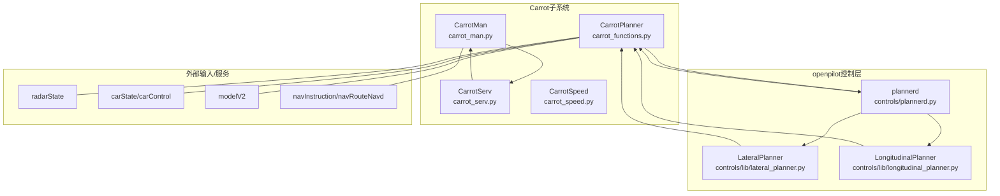
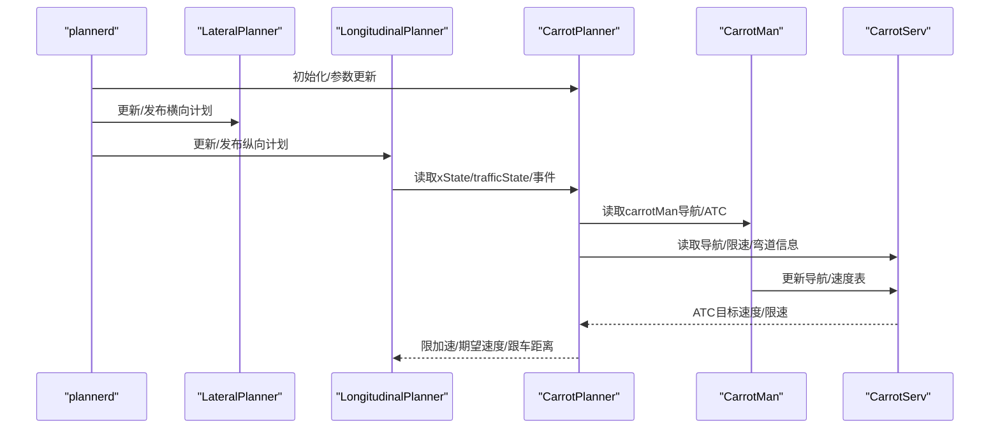
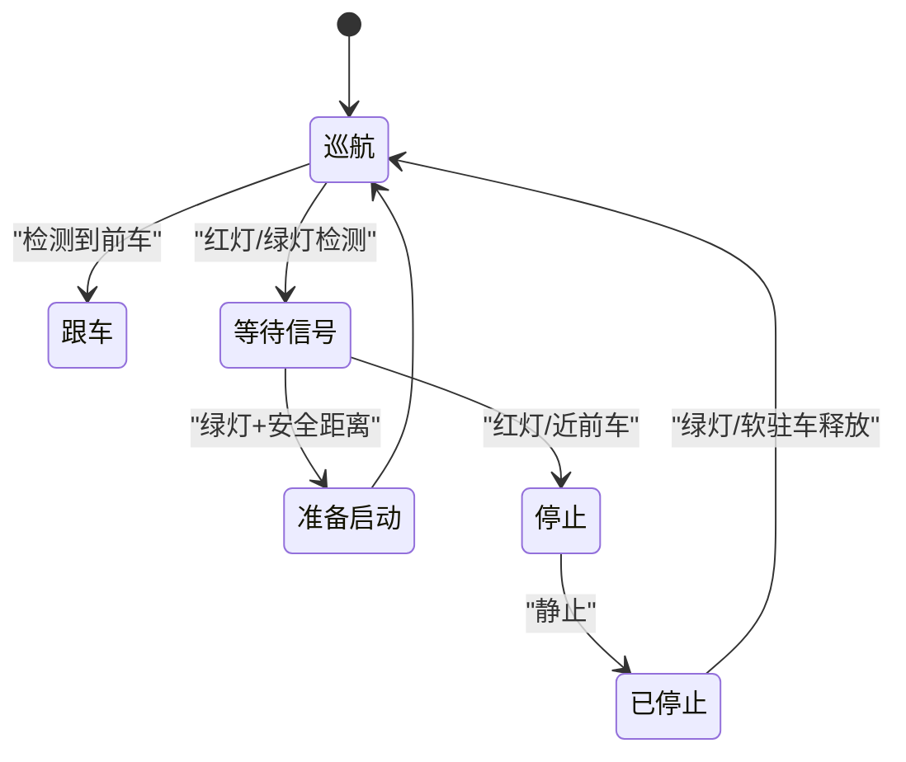
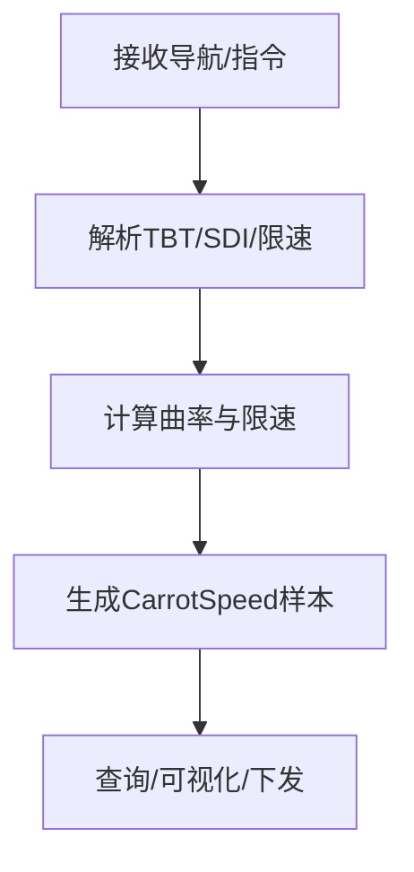
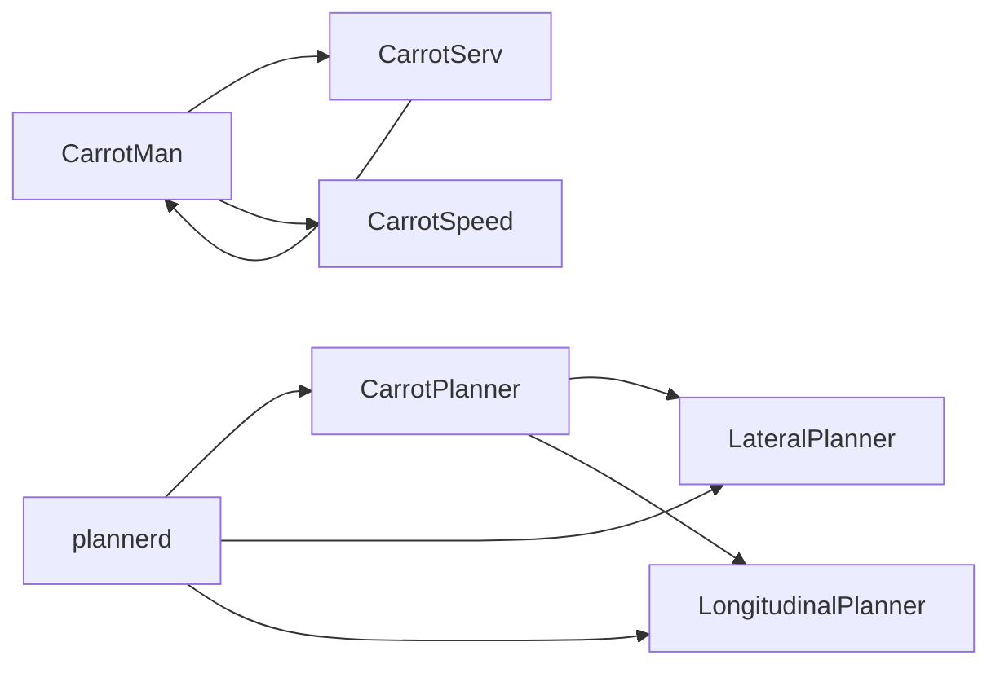
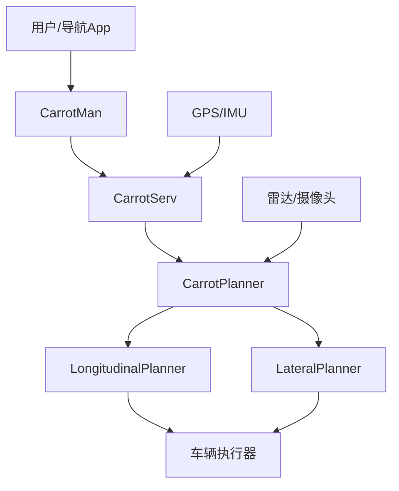

# 系统架构

<cite>
**本文引用的文件**
- [carrot_functions.py](file://selfdrive/carrot/carrot_functions.py)
- [carrot_man.py](file://selfdrive/carrot/carrot_man.py)
- [carrot_serv.py](file://selfdrive/carrot/carrot_serv.py)
- [carrot_speed.py](file://selfdrive/carrot/carrot_speed.py)
- [plannerd.py](file://selfdrive/controls/plannerd.py)
- [lateral_planner.py](file://selfdrive/controls/lib/lateral_planner.py)
- [longitudinal_planner.py](file://selfdrive/controls/lib/longitudinal_planner.py)
- [carrot_settings.json](file://selfdrive/carrot_settings.json)
- [README.md](file://README.md)
- [uv.lock](file://uv.lock)
</cite>

## 目录
1. [引言](#引言)
2. [项目结构](#项目结构)
3. [核心组件](#核心组件)
4. [架构总览](#架构总览)
5. [详细组件分析](#详细组件分析)
6. [依赖分析](#依赖分析)
7. [性能考量](#性能考量)
8. [故障排查指南](#故障排查指南)
9. [结论](#结论)
10. [附录](#附录)

## 引言
本架构文档聚焦于Carrot2-v9-ACC系统，面向CarrotPlanner核心算法与openpilot集成路径，系统性阐述高层设计、架构模式、系统边界、组件交互、数据流、控制策略、参数化配置、安全与监控、可扩展性与部署拓扑等。文档同时给出系统上下文图与组件分解图，帮助读者快速理解与落地。

## 项目结构
Carrot2-v9-ACC位于openpilot生态中，围绕“纵向规划器（CarrotPlanner）+导航与自适应转速（CarrotMan/CarrotServ）+速度表（CarrotSpeed）”构建闭环，通过plannerd统一调度，与openpilot的纵向/横向规划器协同工作。

图表来源
- [carrot_functions.py:49-543](file://selfdrive/carrot/carrot_functions.py#L49-L543)
- [carrot_man.py:204-800](file://selfdrive/carrot/carrot_man.py#L204-L800)
- [carrot_serv.py:83-800](file://selfdrive/carrot/carrot_serv.py#L83-L800)
- [carrot_speed.py:63-402](file://selfdrive/carrot/carrot_speed.py#L63-L402)
- [plannerd.py:13-48](file://selfdrive/controls/plannerd.py#L13-L48)
- [lateral_planner.py:34-221](file://selfdrive/controls/lib/lateral_planner.py#L34-L221)
- [longitudinal_planner.py:162-283](file://selfdrive/controls/lib/longitudinal_planner.py#L162-L283)

章节来源
- [carrot_functions.py:49-543](file://selfdrive/carrot/carrot_functions.py#L49-L543)
- [carrot_man.py:204-800](file://selfdrive/carrot/carrot_man.py#L204-L800)
- [carrot_serv.py:83-800](file://selfdrive/carrot/carrot_serv.py#L83-L800)
- [carrot_speed.py:63-402](file://selfdrive/carrot/carrot_speed.py#L63-L402)
- [plannerd.py:13-48](file://selfdrive/controls/plannerd.py#L13-L48)
- [lateral_planner.py:34-221](file://selfdrive/controls/lib/lateral_planner.py#L34-L221)
- [longitudinal_planner.py:162-283](file://selfdrive/controls/lib/longitudinal_planner.py#L162-L283)

## 核心组件
- CarrotPlanner：纵向控制状态机与策略核心，负责交通信号/模型感知、驾驶模式、跟车距离与加速度限制、ATC联动等。
- CarrotMan：导航与自适应转速（ATC）的前端服务，负责广播/接收导航指令、处理TBT/SDI、维护CarrotSpeed表、与CarrotServ协调。
- CarrotServ：导航与自适应转速（ATC）的后端服务，负责TBT/SDI解析、GPS/航向估计、弯道/限速/区间测速融合、ATC目标速度计算。
- CarrotSpeed：基于Params的地理网格速度表（JSON+gzip），支持查询/写入/可视化，用于导航速度下发与调试。
- plannerd：控制调度器，订阅openpilot关键状态，驱动Lateral/Longitudinal Planner，并注入CarrotPlanner结果。

章节来源
- [carrot_functions.py:49-543](file://selfdrive/carrot/carrot_functions.py#L49-L543)
- [carrot_man.py:204-800](file://selfdrive/carrot/carrot_man.py#L204-L800)
- [carrot_serv.py:83-800](file://selfdrive/carrot/carrot_serv.py#L83-L800)
- [carrot_speed.py:63-402](file://selfdrive/carrot/carrot_speed.py#L63-L402)
- [plannerd.py:13-48](file://selfdrive/controls/plannerd.py#L13-L48)

## 架构总览
Carrot2-v9-ACC采用“纵向规划器（CarrotPlanner）+导航/ATC（CarrotMan/CarrotServ）+速度表（CarrotSpeed）”的解耦架构，通过plannerd与openpilot纵向/横向规划器对接，形成“视觉/雷达感知 + 导航/信号 + 地理速度表”的多源融合纵向控制闭环。

图表来源
- [plannerd.py:13-48](file://selfdrive/controls/plannerd.py#L13-L48)
- [lateral_planner.py:85-221](file://selfdrive/controls/lib/lateral_planner.py#L85-L221)
- [longitudinal_planner.py:162-283](file://selfdrive/controls/lib/longitudinal_planner.py#L162-L283)
- [carrot_functions.py:346-521](file://selfdrive/carrot/carrot_functions.py#L346-L521)
- [carrot_man.py:320-478](file://selfdrive/carrot/carrot_man.py#L320-L478)
- [carrot_serv.py:238-796](file://selfdrive/carrot/carrot_serv.py#L238-L796)

## 详细组件分析

### CarrotPlanner：纵向状态机与控制策略
- 状态机（XState）：cruise/e2eCruise/e2eStop/e2ePrepare/e2eStopped/lead，依据软驻车、交通信号、前车距离、模型感知等切换。
- 交通信号与模型感知：通过模型V2位置/速度/侧偏与雷达距离，判定红/绿/停止，结合转向角抑制。
- 驾驶模式（DrivingMode）：Eco/Safe/Normal/High，影响舒适刹车与加速度上限。
- 跟车策略：动态t_follow，结合前车加速度、期望跟车距离、车道变更状态，动态调整跟车时间窗与急率因子。
- ATC联动：读取carrotMan的atcType/turn信息，触发准备/执行阶段，参与目标速度融合。
- 参数化：分段加速度上限、跟车时间窗、舒适刹车、ECO控制、导航限速融合等，均来自Params与carrot_settings.json。

图表来源
- [carrot_functions.py:49-543](file://selfdrive/carrot/carrot_functions.py#L49-L543)

章节来源
- [carrot_functions.py:49-543](file://selfdrive/carrot/carrot_functions.py#L49-L543)

### CarrotMan：导航与ATC前端
- 导航广播/接收：周期性广播Carrot2版本、状态、位置等；接收CarrotServ指令（TBT/SDI/限速/弯道）。
- 速度表服务：维护CarrotSpeed表，提供查询/可视化，支持gas/brake触发的invalidate。
- 路径与曲率：基于Shapely对导航轨迹重采样，计算曲率与限速，反向传播加速度限制。
- 多语言导航描述：根据语言参数映射SDI/TBT描述文本。
- 网络接口：动态获取活跃网络接口与广播地址，支持UDP广播与远程连接。

图表来源
- [carrot_man.py:320-581](file://selfdrive/carrot/carrot_man.py#L320-L581)
- [carrot_serv.py:336-796](file://selfdrive/carrot/carrot_serv.py#L336-L796)
- [carrot_speed.py:181-317](file://selfdrive/carrot/carrot_speed.py#L181-L317)

章节来源
- [carrot_man.py:204-800](file://selfdrive/carrot/carrot_man.py#L204-L800)
- [carrot_serv.py:83-800](file://selfdrive/carrot/carrot_serv.py#L83-L800)
- [carrot_speed.py:63-402](file://selfdrive/carrot/carrot_speed.py#L63-L402)

### CarrotServ：导航与ATC后端
- TBT/SDI解析：将导航指令映射为导航类型/修饰词/转向信息，计算下一转信息与距离。
- GPS/航向估计：融合设备/GPS/导航源，估计当前位置与航向，补偿延迟与漂移。
- ATC目标速度：基于距离/限速/弯道/区间测速，计算ATC目标速度与激活条件。
- 多语言描述：根据语言参数返回对应描述文本。
- 参数化：自动导航速度控制模式、安全系数、减速率、弯道下限等。

章节来源
- [carrot_serv.py:83-800](file://selfdrive/carrot/carrot_serv.py#L83-L800)

### CarrotSpeed：地理网格速度表
- 存储格式：JSON+gzip，8方向桶，1e-4°网格，支持查询/写入/可视化。
- 写入策略：正向加速记录平均，负向减速强制覆盖，支持邻域老化阈值。
- 查询策略：当前/邻域/左右桶组合，支持lookahead距离查询。
- 可视化：导出周围网格速度点，供UI/调试使用。

章节来源
- [carrot_speed.py:63-402](file://selfdrive/carrot/carrot_speed.py#L63-L402)

### plannerd与openpilot集成
- 订阅：carState/carControl/controlsState/liveParameters/radarState/modelV2/selfdriveState/carrotMan。
- 发布：longitudinalPlan/driverAssistance/lateralPlan。
- 协作：LateralPlanner读取CarrotMan的vTurnSpeed与ATC状态；LongitudinalPlanner读取CarrotPlanner的xState/trafficState/事件与限加速。

章节来源
- [plannerd.py:13-48](file://selfdrive/controls/plannerd.py#L13-L48)
- [lateral_planner.py:85-221](file://selfdrive/controls/lib/lateral_planner.py#L85-L221)
- [longitudinal_planner.py:162-283](file://selfdrive/controls/lib/longitudinal_planner.py#L162-L283)

## 依赖分析
- Python运行时与第三方库：见uv.lock中的openpilot依赖清单（如numpy、pyzmq、requests、websocket-client等）。
- openpilot内部模块：cereal、common（params、realtime、conversions）、controls（planners、desire_helper）。
- 地理/几何工具：Shapely（可选，用于路径重采样与曲率计算）。
- 网络通信：ZMQ/UDP广播，Params内存共享（/dev/shm/params）。

图表来源
- [carrot_functions.py:49-543](file://selfdrive/carrot/carrot_functions.py#L49-L543)
- [carrot_man.py:204-800](file://selfdrive/carrot/carrot_man.py#L204-L800)
- [carrot_serv.py:83-800](file://selfdrive/carrot/carrot_serv.py#L83-L800)
- [carrot_speed.py:63-402](file://selfdrive/carrot/carrot_speed.py#L63-L402)
- [plannerd.py:13-48](file://selfdrive/controls/plannerd.py#L13-L48)

章节来源
- [uv.lock:1246-1285](file://uv.lock#L1246-L1285)

## 性能考量
- 实时性：plannerd配置实时优先级，CarrotPlanner参数按帧节拍更新，避免高频参数读取。
- 计算复杂度：CarrotSpeed查询为O(1)网格+邻域查找，路径曲率计算与反向传播加速度限制为线性复杂度。
- 缓存与滤波：移动平均滤波（MyMovingAverage）降低噪声，Params内存共享减少磁盘IO。
- 网络开销：CarrotMan广播频率20Hz，避免频繁网络抖动影响。

## 故障排查指南
- 红绿灯误判：检查trafficLightDetectMode与模型感知（modelV2位置/速度），确认转向角抑制逻辑。
- ATC不生效：检查carrotMan与carrotServ的TBT/SDI解析、GPS航向估计、ATC激活计数。
- 速度表异常：检查CarrotSpeed表是否启用gzip、格式版本、邻域老化阈值、invalidate触发条件。
- 参数未生效：确认carrot_settings.json项与Params键名一致，plannerd重启后参数加载流程。

章节来源
- [carrot_functions.py:247-521](file://selfdrive/carrot/carrot_functions.py#L247-L521)
- [carrot_man.py:320-581](file://selfdrive/carrot/carrot_man.py#L320-L581)
- [carrot_serv.py:336-796](file://selfdrive/carrot/carrot_serv.py#L336-L796)
- [carrot_settings.json:1-800](file://selfdrive/carrot_settings.json#L1-L800)

## 结论
Carrot2-v9-ACC通过CarrotPlanner与CarrotMan/CarrotServ的协作，实现了“模型感知+导航/信号+地理速度表”的多源融合纵向控制闭环。其状态机设计与参数化策略确保了在不同驾驶模式与场景下的安全与舒适性，同时与openpilot控制层无缝集成，具备良好的可扩展性与可维护性。

## 附录

### 系统上下文图（概念）

[此图为概念示意，不直接映射具体代码文件]

### 技术栈与版本兼容性
- Python生态：详见uv.lock中的依赖清单。
- openpilot版本：与openpilot主仓库版本保持兼容，遵循其发布分支策略。
- 第三方库：numpy、pyzmq、requests、websocket-client、Shapely（可选）等。

章节来源
- [uv.lock:1246-1285](file://uv.lock#L1246-L1285)
- [README.md:89-96](file://README.md#L89-L96)

### 安全与合规
- 法律声明：依据韩国《汽车管理法》修订案，软件仅供研究/实验/模拟使用，安装或实际道路使用可能违法。
- 安全标准：遵循ISO 26262指南，panda硬件安全固件与测试体系保障。

章节来源
- [README.md:1-25](file://README.md#L1-L25)