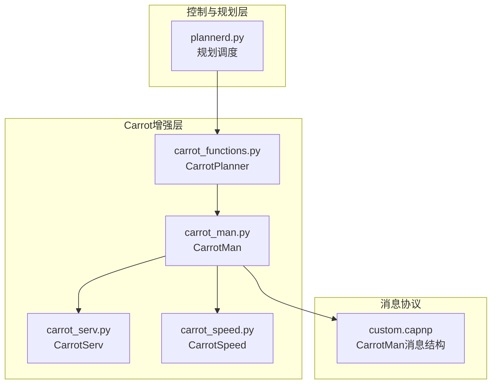
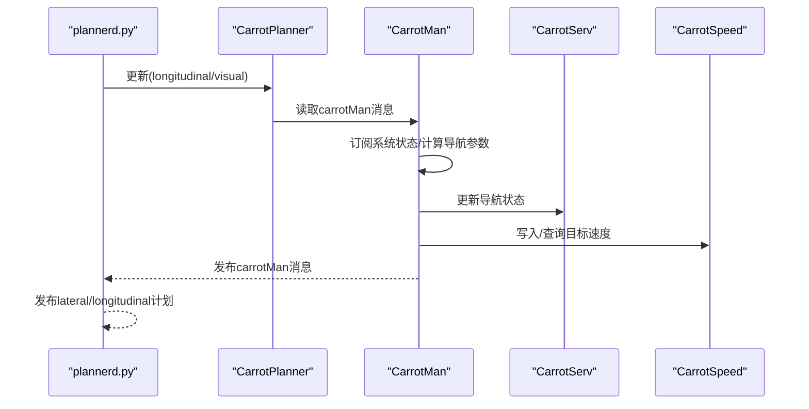
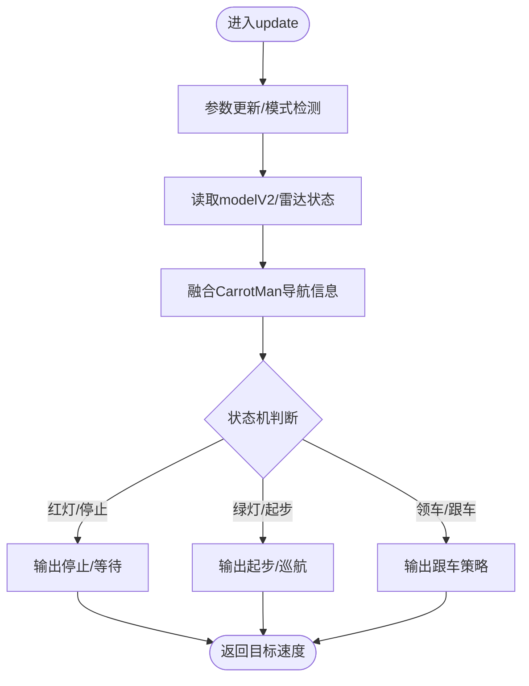
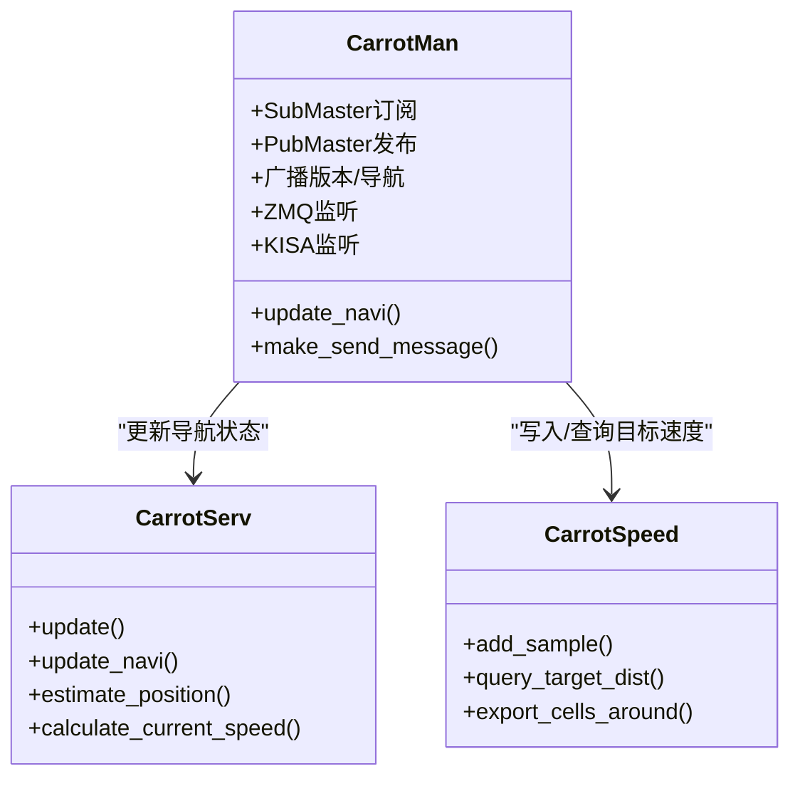
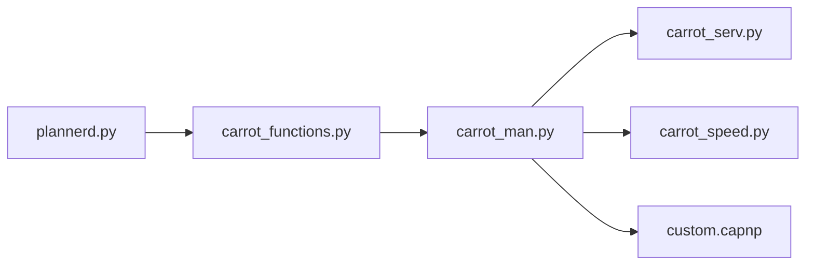
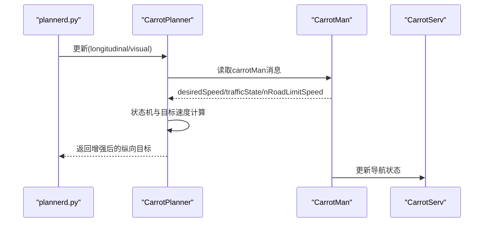
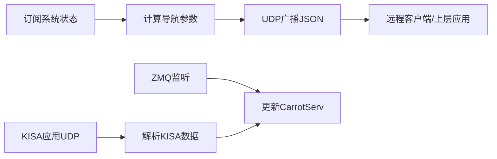
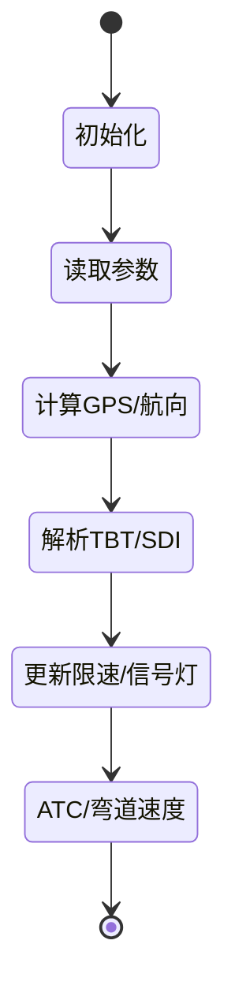

# 组件交互关系

<cite>
**本文引用的文件**
- [plannerd.py](file://selfdrive/controls/plannerd.py)
- [carrot_functions.py](file://selfdrive/carrot/carrot_functions.py)
- [carrot_man.py](file://selfdrive/carrot/carrot_man.py)
- [carrot_serv.py](file://selfdrive/carrot/carrot_serv.py)
- [carrot_speed.py](file://selfdrive/carrot/carrot_speed.py)
- [custom.capnp](file://cereal/custom.capnp)
- [AGENTS.md](file://AGENTS.md)
- [原车acc增强系统设计.md](file://原车acc增强系统设计.md)
- [check_carrot_man.py](file://check_carrot_man.py)
- [test_car_interfaces.py](file://selfdrive/car/tests/test_car_interfaces.py)
</cite>

## 目录
1. [简介](#简介)
2. [项目结构](#项目结构)
3. [核心组件](#核心组件)
4. [架构总览](#架构总览)
5. [详细组件分析](#详细组件分析)
6. [依赖关系分析](#依赖关系分析)
7. [性能考量](#性能考量)
8. [故障排查指南](#故障排查指南)
9. [结论](#结论)
10. [附录](#附录)

## 简介
本文件面向Carrot2-v9-ACC增强系统的“组件交互关系”，聚焦CarrotPlanner、CarrotMan与CarrotServ三大核心组件的协作方式与通信机制。文档从消息传递协议、参数与事件通知、异步通信与状态同步、生命周期与错误处理、接口规范与集成测试等方面进行系统化梳理，并辅以多种可视化图示，帮助开发者与测试人员快速理解并高效集成。

## 项目结构
Carrot2-v9-ACC相关代码主要位于以下路径：
- 自动驾驶控制与规划：selfdrive/controls/plannerd.py
- Carrot增强逻辑：selfdrive/carrot/carrot_functions.py、carrot_man.py、carrot_serv.py、carrot_speed.py
- 消息协议定义：cereal/custom.capnp
- 文档与测试：AGENTS.md、原车acc增强系统设计.md、check_carrot_man.py、selfdrive/car/tests/test_car_interfaces.py

图表来源
- [plannerd.py:13-47](file://selfdrive/controls/plannerd.py#L13-L47)
- [carrot_functions.py:49-543](file://selfdrive/carrot/carrot_functions.py#L49-L543)
- [carrot_man.py:204-800](file://selfdrive/carrot/carrot_man.py#L204-L800)
- [carrot_serv.py:83-800](file://selfdrive/carrot/carrot_serv.py#L83-L800)
- [carrot_speed.py:63-402](file://selfdrive/carrot/carrot_speed.py#L63-L402)
- [custom.capnp:14-48](file://cereal/custom.capnp#L14-L48)

章节来源
- [plannerd.py:13-47](file://selfdrive/controls/plannerd.py#L13-L47)
- [carrot_functions.py:49-543](file://selfdrive/carrot/carrot_functions.py#L49-L543)
- [carrot_man.py:204-800](file://selfdrive/carrot/carrot_man.py#L204-L800)
- [carrot_serv.py:83-800](file://selfdrive/carrot/carrot_serv.py#L83-L800)
- [carrot_speed.py:63-402](file://selfdrive/carrot/carrot_speed.py#L63-L402)
- [custom.capnp:14-48](file://cereal/custom.capnp#L14-L48)

## 核心组件
- CarrotPlanner（Carrot增强规划器）
  - 负责根据视觉模型、雷达状态与CarrotMan提供的导航/限速/信号灯信息，计算目标纵向速度、跟车距离与驾驶模式状态（XState）。
  - 对接plannerd，参与纵向与横向规划的更新与发布。
- CarrotMan（Carrot导航与状态广播）
  - 订阅多源状态（carState、radarState、modelV2、selfdriveState、carControl等），同时作为Carrot导航数据的聚合者与广播者。
  - 通过UDP广播与ZMQ监听，向CarrotServ与上层应用提供CarrotMan消息（含desiredSpeed、trafficState、nRoadLimitSpeed等）。
- CarrotServ（Carrot导航服务）
  - 解析CarrotMan消息，维护导航状态（限速、信号灯、弯道、目的地等），并提供导航辅助能力（如ATC、弯道速度、SDI等）。
  - 与CarrotSpeed协同，提供目标速度查询与可视化。
- CarrotSpeed（速度表）
  - 基于Params的内存表格，按经纬度网格与航向方向存储/查询目标速度，支持邻域查询与可视化导出。

章节来源
- [carrot_functions.py:49-543](file://selfdrive/carrot/carrot_functions.py#L49-L543)
- [carrot_man.py:204-800](file://selfdrive/carrot/carrot_man.py#L204-L800)
- [carrot_serv.py:83-800](file://selfdrive/carrot/carrot_serv.py#L83-L800)
- [carrot_speed.py:63-402](file://selfdrive/carrot/carrot_speed.py#L63-L402)

## 架构总览
Carrot2-v9-ACC采用“事件驱动 + 消息总线”的异步架构：
- plannerd周期性拉取模型与状态，调用CarrotPlanner更新纵向策略，并将结果发布给lateralPlan、longitudinalPlan、driverAssistance。
- CarrotMan作为导航数据中枢，持续订阅系统状态并通过UDP广播与ZMQ通道对外提供CarrotMan消息。
- CarrotServ消费CarrotMan消息，维护导航状态并提供导航辅助能力。
- CarrotSpeed提供目标速度查询与可视化，供CarrotServ与CarrotMan使用。

图表来源
- [plannerd.py:30-44](file://selfdrive/controls/plannerd.py#L30-L44)
- [carrot_functions.py:346-521](file://selfdrive/carrot/carrot_functions.py#L346-L521)
- [carrot_man.py:320-407](file://selfdrive/carrot/carrot_man.py#L320-L407)
- [carrot_serv.py:647-722](file://selfdrive/carrot/carrot_serv.py#L647-L722)
- [carrot_speed.py:248-278](file://selfdrive/carrot/carrot_speed.py#L248-L278)

## 详细组件分析

### CarrotPlanner（Carrot增强规划器）
- 角色定位
  - 在plannerd中被调用，负责纵向策略的Carrot增强：结合视觉模型、雷达状态、CarrotMan导航信息与驾驶模式，输出目标纵向速度与跟车距离。
- 关键流程
  - 参数更新：周期性读取Params，动态调整驾驶模式、跟车时间窗、舒适制动等。
  - 模型意图：从modelV2提取车道变更意图，用于动态调整跟随策略。
  - CarrotMan融合：读取carrotMan的desiredSpeed、trafficState、nRoadLimitSpeed等，与自车状态比较，得到最终纵向目标。
  - 状态机：维护XState（巡航/停止/准备/领车等），依据交通信号、前车与用户输入切换。
- 输出
  - 返回经Carrot增强后的纵向目标速度（kph），供plannerd发布longitudinalPlan。

图表来源
- [carrot_functions.py:346-521](file://selfdrive/carrot/carrot_functions.py#L346-L521)

章节来源
- [carrot_functions.py:49-543](file://selfdrive/carrot/carrot_functions.py#L49-L543)
- [plannerd.py:30-44](file://selfdrive/controls/plannerd.py#L30-L44)

### CarrotMan（Carrot导航与状态广播）
- 角色定位
  - 导航数据聚合与广播中心：订阅系统状态，计算导航参数，通过UDP广播与ZMQ通道对外发布CarrotMan消息。
- 关键职责
  - 状态订阅：deviceState、carState、controlsState、radarState、longitudinalPlan、modelV2、selfdriveState、carControl、navRouteNavd、GPS服务、navInstruction。
  - 导航计算：基于GPS与导航数据，计算弯道速度、限速、信号灯状态、目的地信息等。
  - 广播与监听：UDP广播版本信息与导航状态；ZMQ监听来自CarrotServ的请求；KISA应用UDP监听。
  - 与CarrotServ协作：通过update/update_navi等方法，将导航状态写入CarrotServ。
- 消息格式
  - 使用custom.capnp定义的CarrotMan结构，包含activeCarrot、nRoadLimitSpeed、xSpdType/xSpdLimit/xSpdDist、xTurnInfo/xFollow、atcType、desiredSpeed、trafficState、naviPaths等字段。

图表来源
- [carrot_man.py:204-800](file://selfdrive/carrot/carrot_man.py#L204-L800)
- [carrot_serv.py:83-800](file://selfdrive/carrot/carrot_serv.py#L83-L800)
- [carrot_speed.py:63-402](file://selfdrive/carrot/carrot_speed.py#L63-L402)
- [custom.capnp:14-48](file://cereal/custom.capnp#L14-L48)

章节来源
- [carrot_man.py:204-800](file://selfdrive/carrot/carrot_man.py#L204-L800)
- [carrot_serv.py:83-800](file://selfdrive/carrot/carrot_serv.py#L83-L800)
- [carrot_speed.py:63-402](file://selfdrive/carrot/carrot_speed.py#L63-L402)
- [custom.capnp:14-48](file://cereal/custom.capnp#L14-L48)

### CarrotServ（Carrot导航服务）
- 角色定位
  - 导航状态维护与辅助：解析CarrotMan消息，维护限速、信号灯、弯道、目的地等状态，并提供导航辅助能力（如ATC、弯道速度、SDI等）。
- 关键职责
  - 参数更新：从Params读取导航控制参数（如自动限速、弯道控制、安全系数等）。
  - 导航状态：解析TBT（To-Be-Turn）与SDI（区间测速/摄像头）信息，计算限速与距离。
  - GPS融合：结合手机GPS与车载GPS，估计当前位置与航向，处理延迟与漂移。
  - ATC与弯道：根据弯道类型与距离，计算建议速度与触发时机。
- 与CarrotSpeed协作
  - 通过CarrotSpeed查询目标速度，或在需要时写入速度样本。

章节来源
- [carrot_serv.py:83-800](file://selfdrive/carrot/carrot_serv.py#L83-L800)
- [carrot_speed.py:63-402](file://selfdrive/carrot/carrot_speed.py#L63-L402)

### CarrotSpeed（速度表）
- 角色定位
  - 基于Params的内存速度表，按经纬度网格与航向方向存储/查询目标速度，支持邻域查询与可视化导出。
- 关键能力
  - 网格量化：按1e-4度对经纬度量化，形成网格单元。
  - 航向桶：将360度分为8个方向桶，按航向存储速度。
  - 查询与可视化：支持按当前位置与航向查询目标速度，导出周围网格点用于可视化。
  - 增量更新：支持正负速度的差异化更新策略，保证加速与紧急减速的优先级。

章节来源
- [carrot_speed.py:63-402](file://selfdrive/carrot/carrot_speed.py#L63-L402)

## 依赖关系分析
- 组件耦合与内聚
  - CarrotPlanner与plannerd之间通过函数调用耦合，内聚于纵向策略计算。
  - CarrotMan与CarrotServ之间通过消息（CarrotMan）耦合，内聚于导航状态管理。
  - CarrotMan与CarrotSpeed之间通过共享Params与查询接口耦合，内聚于速度表操作。
- 外部依赖
  - 消息总线：cereal.messaging（SubMaster/PubMaster）用于跨进程消息收发。
  - 协议定义：custom.capnp定义CarrotMan消息结构。
  - 参数系统：openpilot.common.params用于读写Params，支撑运行时配置。

图表来源
- [plannerd.py:25-44](file://selfdrive/controls/plannerd.py#L25-L44)
- [carrot_functions.py:346-521](file://selfdrive/carrot/carrot_functions.py#L346-L521)
- [carrot_man.py:210-225](file://selfdrive/carrot/carrot_man.py#L210-L225)
- [carrot_serv.py:83-200](file://selfdrive/carrot/carrot_serv.py#L83-L200)
- [carrot_speed.py:63-100](file://selfdrive/carrot/carrot_speed.py#L63-L100)
- [custom.capnp:14-48](file://cereal/custom.capnp#L14-L48)

章节来源
- [plannerd.py:25-44](file://selfdrive/controls/plannerd.py#L25-L44)
- [carrot_functions.py:346-521](file://selfdrive/carrot/carrot_functions.py#L346-L521)
- [carrot_man.py:210-225](file://selfdrive/carrot/carrot_man.py#L210-L225)
- [carrot_serv.py:83-200](file://selfdrive/carrot/carrot_serv.py#L83-L200)
- [carrot_speed.py:63-100](file://selfdrive/carrot/carrot_speed.py#L63-L100)
- [custom.capnp:14-48](file://cereal/custom.capnp#L14-L48)

## 性能考量
- 周期性与频率
  - CarrotMan广播频率约20Hz，确保导航状态的实时性。
  - CarrotPlanner在plannerd中随modelV2更新，通常更高频，需注意参数读取与滤波开销。
- 异步与解耦
  - 通过消息总线与ZMQ/UDP实现异步通信，降低组件间阻塞。
- 缓存与查询
  - CarrotSpeed采用网格与桶结构，查询复杂度低；邻域查询与可视化导出需控制批量大小，避免高频写入。
- 网络与广播
  - CarrotMan使用UDP广播与ZMQ监听，需关注网络拥塞与丢包重试策略。

## 故障排查指南
- 检查carrotMan输出
  - 使用脚本遍历日志，提取carrotMan关键字段（如xState、desiredSpeed、tFollow、desiredDistance、jerkFactorApply等），核对是否符合预期。
- 日志与消息类型
  - AGENTS.md列出了高频消息类型与关键字段，可据此定位消息缺失或异常。
- 集成测试
  - 使用pytest运行Car接口测试，验证Car接口初始化与控制循环的正确性。
- 参数校验
  - 确认Params中相关导航参数（如AutoNaviSpeedCtrlMode、MapTurnSpeedFactor、TurnSpeedControlMode等）已正确下发。

章节来源
- [check_carrot_man.py:14-54](file://check_carrot_man.py#L14-L54)
- [AGENTS.md:759-795](file://AGENTS.md#L759-L795)
- [test_car_interfaces.py:29-101](file://selfdrive/car/tests/test_car_interfaces.py#L29-L101)

## 结论
Carrot2-v9-ACC通过CarrotPlanner、CarrotMan与CarrotServ的分工协作，实现了“导航感知—状态融合—策略输出”的闭环。CarrotMan承担导航数据聚合与广播，CarrotServ负责导航状态维护与辅助，CarrotPlanner在规划层融合导航信息并输出纵向策略。整体采用事件驱动与消息总线，具备良好的扩展性与可测试性。后续可在消息协议、参数系统与可视化方面进一步完善，以提升鲁棒性与可观测性。

## 附录

### 消息传递协议与字段规范
- CarrotMan消息结构（custom.capnp）
  - 字段涵盖：activeCarrot、nRoadLimitSpeed、xSpdType/xSpdLimit/xSpdDist、xTurnInfo/xFollow、atcType、desiredSpeed、trafficState、naviPaths等。
  - 用途：作为Carrot导航状态的统一载体，供CarrotServ与CarrotPlanner消费。
- carrotMan消息格式（JSON）
  - CarrotMan在广播与ZMQ监听中使用JSON格式，包含版本、是否在途、导航激活状态、IP/端口、v_ego/v_cruise等运行态指标。
- 参数与事件
  - Params中包含导航控制参数（如AutoNaviSpeedCtrlMode、MapTurnSpeedFactor、TurnSpeedControlMode等）。
  - 事件：如trafficSignChanged、trafficSignGreen等，由CarrotPlanner在状态变化时触发。

章节来源
- [custom.capnp:14-48](file://cereal/custom.capnp#L14-L48)
- [carrot_man.py:583-625](file://selfdrive/carrot/carrot_man.py#L583-L625)
- [原车acc增强系统设计.md:42-82](file://原车acc增强系统设计.md#L42-L82)

### 组件交互时序图（CarrotPlanner与CarrotMan）

图表来源
- [plannerd.py:30-44](file://selfdrive/controls/plannerd.py#L30-L44)
- [carrot_functions.py:346-521](file://selfdrive/carrot/carrot_functions.py#L346-L521)
- [carrot_man.py:320-407](file://selfdrive/carrot/carrot_man.py#L320-L407)

### 消息流图（CarrotMan广播与ZMQ）

图表来源
- [carrot_man.py:320-407](file://selfdrive/carrot/carrot_man.py#L320-L407)
- [carrot_man.py:636-692](file://selfdrive/carrot/carrot_man.py#L636-L692)
- [carrot_man.py:712-765](file://selfdrive/carrot/carrot_man.py#L712-L765)

### 状态同步图（CarrotServ导航状态）

图表来源
- [carrot_serv.py:201-237](file://selfdrive/carrot/carrot_serv.py#L201-L237)
- [carrot_serv.py:647-722](file://selfdrive/carrot/carrot_serv.py#L647-L722)
- [carrot_serv.py:724-796](file://selfdrive/carrot/carrot_serv.py#L724-L796)

### 组件接口规范与集成测试方法
- 接口规范
  - CarrotPlanner.update：输入系统状态与模式，输出增强后的纵向目标速度。
  - CarrotMan.make_send_message：生成广播JSON消息。
  - CarrotServ.update/update_navi：消费CarrotMan消息并维护导航状态。
  - CarrotSpeed.query_target_dist/add_sample：查询/写入目标速度。
- 集成测试
  - pytest：运行selfdrive/car/tests/test_car_interfaces.py，验证Car接口初始化与控制循环。
  - 日志分析：使用AGENTS.md中的分析脚本与check_carrot_man.py，验证carrotMan输出与消息字段完整性。

章节来源
- [carrot_functions.py:346-521](file://selfdrive/carrot/carrot_functions.py#L346-L521)
- [carrot_man.py:583-625](file://selfdrive/carrot/carrot_man.py#L583-L625)
- [carrot_serv.py:647-722](file://selfdrive/carrot/carrot_serv.py#L647-L722)
- [carrot_speed.py:248-278](file://selfdrive/carrot/carrot_speed.py#L248-L278)
- [test_car_interfaces.py:29-101](file://selfdrive/car/tests/test_car_interfaces.py#L29-L101)
- [check_carrot_man.py:14-54](file://check_carrot_man.py#L14-L54)
- [AGENTS.md:514-795](file://AGENTS.md#L514-L795)