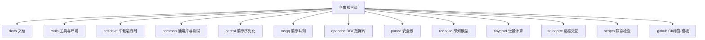
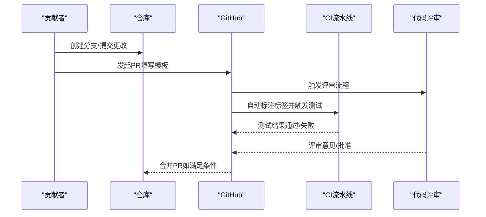
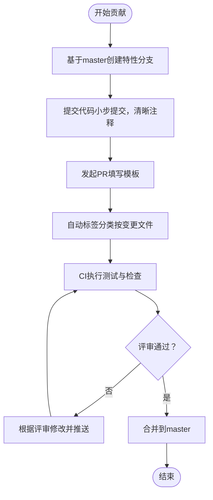
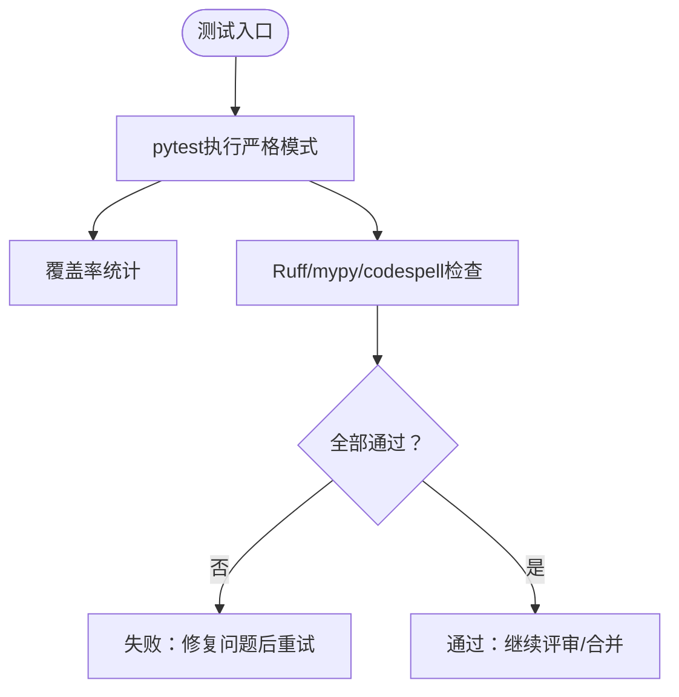
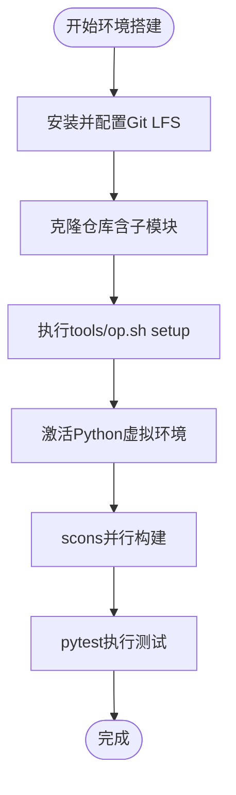
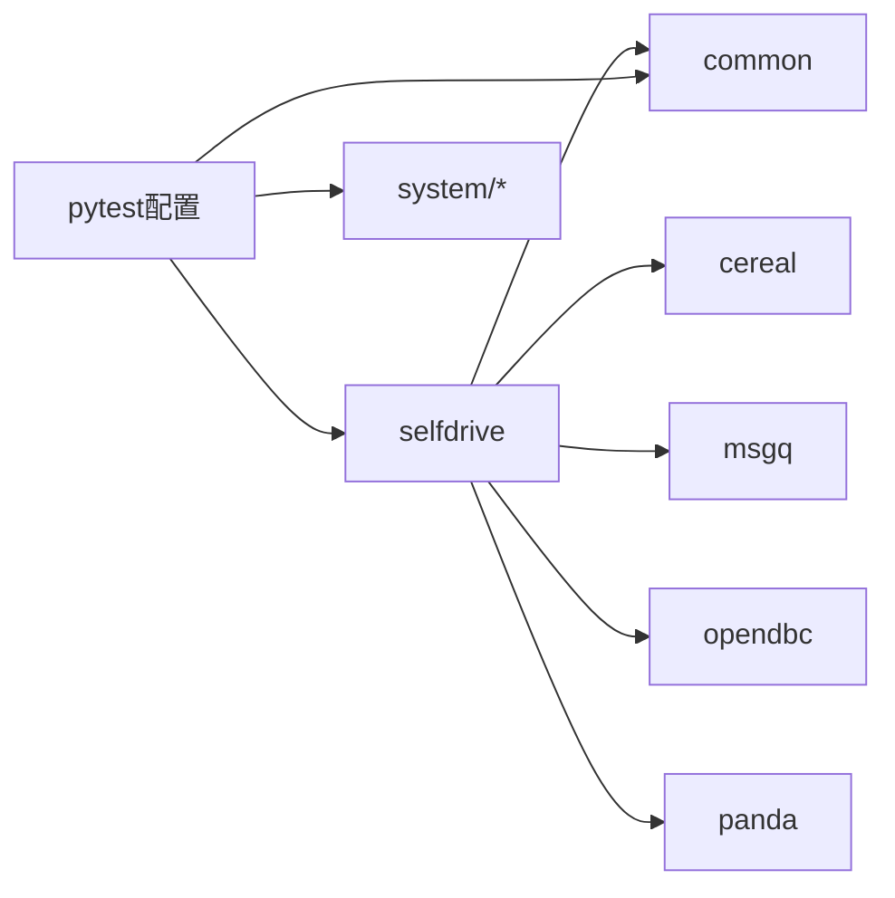

# 贡献指南

<cite>
**本文引用的文件**
- [README.md](file://README.md)
- [docs/CONTRIBUTING.md](file://docs/CONTRIBUTING.md)
- [.github/pull_request_template.md](file://.github/pull_request_template.md)
- [docs/WORKFLOW.md](file://docs/WORKFLOW.md)
- [docs/SAFETY.md](file://docs/SAFETY.md)
- [tools/README.md](file://tools/README.md)
- [pyproject.toml](file://pyproject.toml)
- [.github/labeler.yaml](file://.github/labeler.yaml)
- [tools/setup.sh](file://tools/setup.sh)
- [scripts/lint/lint.sh](file://scripts/lint/lint.sh)
- [scripts/lint/check_shebang_format.sh](file://scripts/lint/check_shebang_format.sh)
- [scripts/lint/check_raylib_includes.sh](file://scripts/lint/check_raylib_includes.sh)
- [scripts/lint/check_nomerge_comments.sh](file://scripts/lint/check_nomerge_comments.sh)
- [common/tests/test_params.py](file://common/tests/test_params.py)
- [common/tests/test_params.cc](file://common/tests/test_params.cc)
- [selfdrive/test/test_onroad.py](file://selfdrive/test/test_onroad.py)
- [system/test/docker_build.sh](file://system/test/docker_build.sh)
- [system/test/ci_shell.sh](file://system/test/ci_shell.sh)
- [system/test/setup_device_ci.sh](file://system/test/setup_device_ci.sh)
- [system/test/update_ci_routes.py](file://system/test/update_ci_routes.py)
- [cereal/messaging/tests/](file://cereal/messaging/tests/)
- [opendbc_repo/](file://opendbc_repo/)
- [panda/](file://panda/)
- [rednose_repo/](file://rednose_repo/)
- [tinygrad_repo/](file://tinygrad_repo/)
- [teleoprtc_repo/](file://teleoprtc_repo/)
- [msgq_repo/](file://msgq_repo/)
- [Jenkinsfile](file://Jenkinsfile)
- [codecov.yml](file://codecov.yml)
</cite>

## 目录
1. [简介](#简介)
2. [项目结构](#项目结构)
3. [核心组件](#核心组件)
4. [架构总览](#架构总览)
5. [详细组件分析](#详细组件分析)
6. [依赖关系分析](#依赖关系分析)
7. [性能与质量保障](#性能与质量保障)
8. [故障排查指南](#故障排查指南)
9. [结论](#结论)
10. [附录](#附录)

## 简介
本指南面向Carrot2-v9-ACC的贡献者，帮助新老贡献者快速理解并遵循项目的开发规范、测试与质量流程、提交与评审流程以及社区协作方式。内容以仓库现有文档与配置为基础，结合实际代码库中的脚本与配置文件，提供可操作的步骤与参考路径。

## 项目结构
Carrot2-v9-ACC是openpilot生态的一部分，围绕自适应巡航（ACC）增强与雷达解析展开。项目采用多子模块组织，核心目录包括：
- docs：贡献、工作流、安全等文档
- tools：本地开发环境搭建与常用工具
- selfdrive：车载运行时逻辑（含ACC相关）
- common：通用库与测试
- cereal/msgq/opendbc/panda/rednose/tinygrad/teleoprtc：消息序列化、消息队列、DBC数据库、安全板固件、感知模型、张量计算、远程交互等子系统
- scripts：静态检查与验证脚本
- .github：CI标签、PR模板等

图示来源
- [README.md:1-144](file://README.md#L1-L144)
- [docs/WORKFLOW.md:1-34](file://docs/WORKFLOW.md#L1-L34)

章节来源
- [README.md:1-144](file://README.md#L1-L144)
- [docs/WORKFLOW.md:1-34](file://docs/WORKFLOW.md#L1-L34)

## 核心组件
- 贡献与工作流
  - 贡献指南与优先级、合并策略、非代码贡献方式
  - 开发工作流与本地构建、测试、代码检查
- 质量与安全
  - 安全原则与ISO26262、MISRA等合规要求
  - CI测试与覆盖率配置
- 环境与工具
  - Ubuntu/macOS/WSL支持与安装脚本
  - 依赖安装、虚拟环境激活、构建命令
- 提交与评审
  - 分支策略、PR模板、标签器自动分类

章节来源
- [docs/CONTRIBUTING.md:1-75](file://docs/CONTRIBUTING.md#L1-L75)
- [docs/WORKFLOW.md:1-34](file://docs/WORKFLOW.md#L1-L34)
- [docs/SAFETY.md:1-37](file://docs/SAFETY.md#L1-L37)
- [pyproject.toml:138-268](file://pyproject.toml#L138-L268)
- [.github/pull_request_template.md:1-69](file://.github/pull_request_template.md#L1-L69)
- [.github/labeler.yaml:1-28](file://.github/labeler.yaml#L1-L28)

## 架构总览
下图展示从“本地开发”到“CI测试”的典型贡献流程，涵盖分支、提交、PR、标签与CI触发。

图示来源
- [docs/CONTRIBUTING.md:45-57](file://docs/CONTRIBUTING.md#L45-L57)
- [.github/labeler.yaml:1-28](file://.github/labeler.yaml#L1-L28)
- [pyproject.toml:138-167](file://pyproject.toml#L138-L167)

## 详细组件分析

### 代码规范与最佳实践
- Python编码标准
  - 使用Ruff进行风格检查与格式化，行宽限制、规则集合、忽略项在配置中明确
  - 类型检查使用mypy，排除第三方与生成代码目录
  - 依赖与测试依赖在pyproject中集中声明
- C/C++开发规范
  - 使用clang-tidy（仓库存在配置文件），建议配合Rust-style的静态检查工具链
  - 对于安全相关代码（如panda安全模型），遵循MISRA C:2012等严格规范
- 文档编写要求
  - 使用Markdown；遵循仓库内已有文档风格（如术语表、导航、FAQ）
  - 变更需同步更新相关文档，避免“文档漂移”

章节来源
- [pyproject.toml:215-268](file://pyproject.toml#L215-L268)
- [docs/SAFETY.md:14-30](file://docs/SAFETY.md#L14-L30)
- [README.md:100-107](file://README.md#L100-L107)

### 提交流程与工作流程
- 分支管理
  - 主分支为master；发布/预发/夜间版本分别对应release3/release3-staging/nightly/nightly-dev
- 提交与PR
  - PR针对master分支；PR模板覆盖“缺陷修复/指纹/端口/重构”等场景
  - PR需具备清晰目标、可验证性、基准或前后对比数据
- 代码评审标准
  - 价值与合并成本权衡；避免大而无当的PR；UI设计不在常规评审范围
- CI与标签
  - 自动标签按变更文件类型分类（CI/测试、car、simulation、ui、tools、多语言、autonomy）

图示来源
- [docs/CONTRIBUTING.md:45-57](file://docs/CONTRIBUTING.md#L45-L57)
- [.github/pull_request_template.md:1-69](file://.github/pull_request_template.md#L1-L69)
- [.github/labeler.yaml:1-28](file://.github/labeler.yaml#L1-L28)

章节来源
- [README.md:89-96](file://README.md#L89-L96)
- [docs/CONTRIBUTING.md:14-57](file://docs/CONTRIBUTING.md#L14-L57)
- [.github/pull_request_template.md:1-69](file://.github/pull_request_template.md#L1-L69)
- [.github/labeler.yaml:1-28](file://.github/labeler.yaml#L1-L28)

### 测试要求与质量保证
- 单元测试与集成测试
  - pytest配置启用严格模式、分组并发、标记过滤；测试路径覆盖common、selfdrive、system等
  - 多语言测试（C++ harness）与异步测试支持
- 性能测试与回归
  - PR若涉及优化，需提供基准数据；对调优场景提供前后对比图表
- 覆盖率与静态检查
  - 覆盖率并发设置；codespell拼写检查；mypy类型检查
- CI与硬件/仿真测试
  - Jenkinsfile定义硬件/软件在环测试；持续回放测试在设备上运行
  - codecov用于覆盖率上报

图示来源
- [pyproject.toml:138-167](file://pyproject.toml#L138-L167)
- [pyproject.toml:169-175](file://pyproject.toml#L169-L175)
- [pyproject.toml:176-214](file://pyproject.toml#L176-L214)
- [codecov.yml](file://codecov.yml)

章节来源
- [docs/CONTRIBUTING.md:111-121](file://docs/CONTRIBUTING.md#L111-L121)
- [pyproject.toml:80-97](file://pyproject.toml#L80-L97)
- [codecov.yml](file://codecov.yml)

### 开发环境搭建与工具配置
- 系统要求与安装
  - Ubuntu 24.04为主；macOS原生支持；Windows推荐WSL2
  - Git LFS需预先安装；克隆仓库后执行setup脚本
- 本地构建与运行
  - scons并行构建；pytest执行测试；op lint运行代码检查
- 常用工具
  - tools/README列出cabana、plotjuggler、joystick、replay、sim等工具

图示来源
- [tools/README.md:3-78](file://tools/README.md#L3-L78)
- [docs/WORKFLOW.md:7-33](file://docs/WORKFLOW.md#L7-L33)
- [tools/setup.sh:10-190](file://tools/setup.sh#L10-L190)

章节来源
- [tools/README.md:3-78](file://tools/README.md#L3-L78)
- [docs/WORKFLOW.md:7-33](file://docs/WORKFLOW.md#L7-L33)
- [tools/setup.sh:10-190](file://tools/setup.sh#L10-L190)

### 社区参与与沟通
- 社区渠道
  - Discord频道用于讨论与协作
  - GitHub Issues用于缺陷报告
- 贡献类型
  - 代码贡献：缺陷修复、简单重构、端口适配等
  - 非代码贡献：驾驶反馈、数据上传、标注图像、运行nightly分支等

章节来源
- [README.md:100-107](file://README.md#L100-L107)
- [docs/CONTRIBUTING.md:58-75](file://docs/CONTRIBUTING.md#L58-L75)

### 常见问题与解决方案
- 依赖冲突或缺失
  - 使用tools/op.sh安装依赖；确保Python版本符合要求；必要时清理缓存后重试
- CI失败
  - 查看标签分类是否正确；确保PR模板填写完整；修复Ruff/mypy/codespell与测试失败项
- 本地构建失败
  - 确认scons参数与平台兼容；在WSL中遇到GUI崩溃时尝试软件渲染变量

章节来源
- [pyproject.toml:1-268](file://pyproject.toml#L1-L268)
- [tools/setup.sh:10-190](file://tools/setup.sh#L10-L190)
- [scripts/lint/lint.sh](file://scripts/lint/lint.sh)

## 依赖关系分析
- 语言与工具链
  - Python 3.11–3.12；Cython、NumPy、pytest、ruff、mypy、codespell等
- 子模块耦合
  - selfdrive依赖common、cereal、msgq、opendbc、panda等
  - 测试路径排除第三方与生成代码，聚焦核心模块

图示来源
- [pyproject.toml:138-167](file://pyproject.toml#L138-L167)
- [opendbc_repo/](file://opendbc_repo/)
- [panda/](file://panda/)
- [cereal/messaging/tests/](file://cereal/messaging/tests/)

章节来源
- [pyproject.toml:138-167](file://pyproject.toml#L138-L167)

## 性能与质量保障
- 安全与合规
  - 遵循ISO26262、NHTSA相关文档；安全模型由panda实现并经软/硬件在环测试
- 质量门禁
  - PR必须通过CI；类型检查、静态检查、测试覆盖率均需达标
- 性能回归
  - 优化类PR需提供基准数据；调优类PR需提供前后对比图表

章节来源
- [docs/SAFETY.md:14-30](file://docs/SAFETY.md#L14-L30)
- [docs/CONTRIBUTING.md:45-57](file://docs/CONTRIBUTING.md#L45-L57)

## 故障排查指南
- 本地测试失败
  - 使用pytest的标记过滤跳过特定测试；检查测试路径与忽略列表
- 静态检查报错
  - Ruff/mypy/codespell分别处理风格、类型与拼写；按错误提示修正
- CI标签异常
  - 检查变更文件是否被labeler.yaml覆盖；必要时调整文件归属

章节来源
- [pyproject.toml:138-167](file://pyproject.toml#L138-L167)
- [pyproject.toml:169-175](file://pyproject.toml#L169-L175)
- [pyproject.toml:176-214](file://pyproject.toml#L176-L214)
- [.github/labeler.yaml:1-28](file://.github/labeler.yaml#L1-28)

## 结论
本指南基于仓库现有文档与配置，总结了Carrot2-v9-ACC的贡献流程、规范与质量保障机制。建议贡献者在提交前先阅读贡献指南与工作流文档，并使用提供的工具与脚本完成本地验证，以提高评审效率与合并成功率。

## 附录
- 快速参考清单
  - 环境：Ubuntu/macOS/WSL；Git LFS；Python虚拟环境；scons构建
  - 测试：pytest；Ruff/mypy/codespell；覆盖率
  - 提交：PR模板；清晰目标；可验证性；CI通过
  - 安全：遵循ISO26262与MISRA；安全模型由panda负责