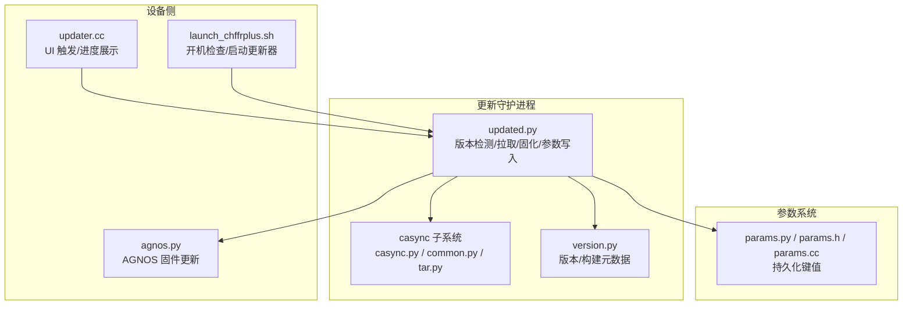
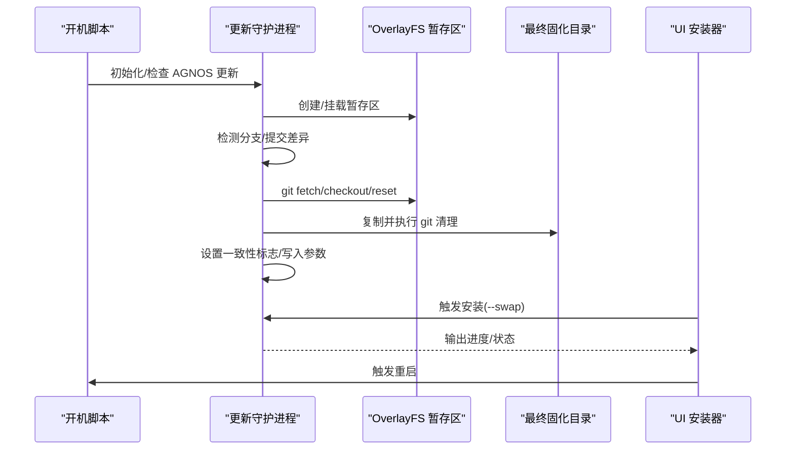
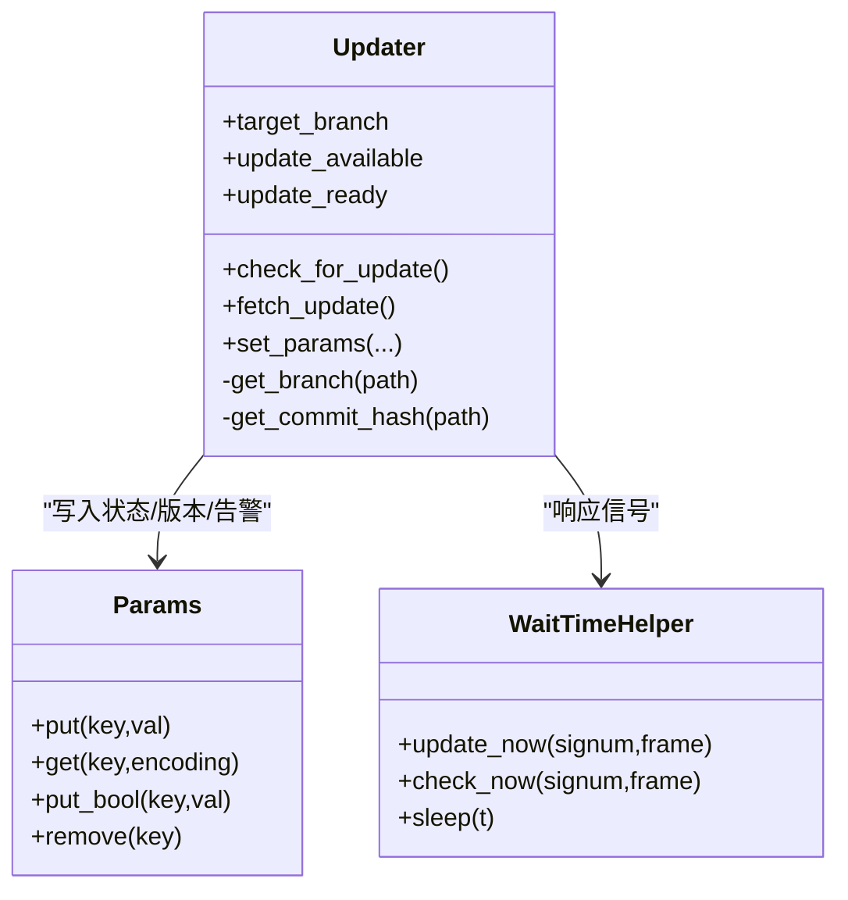
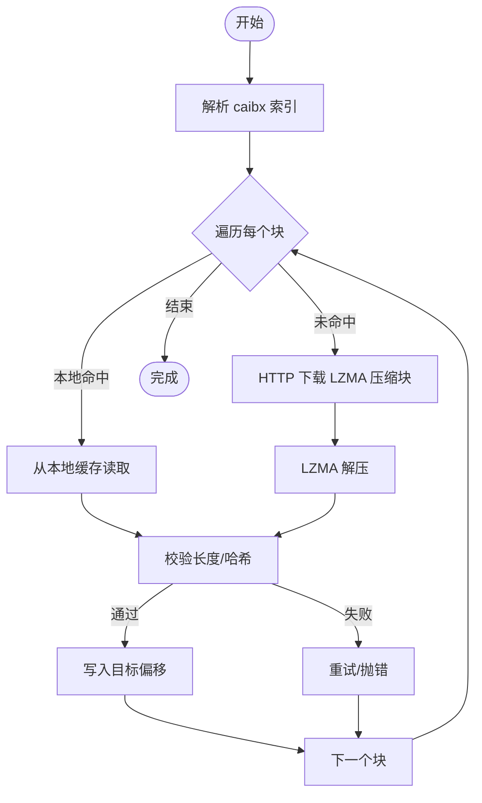
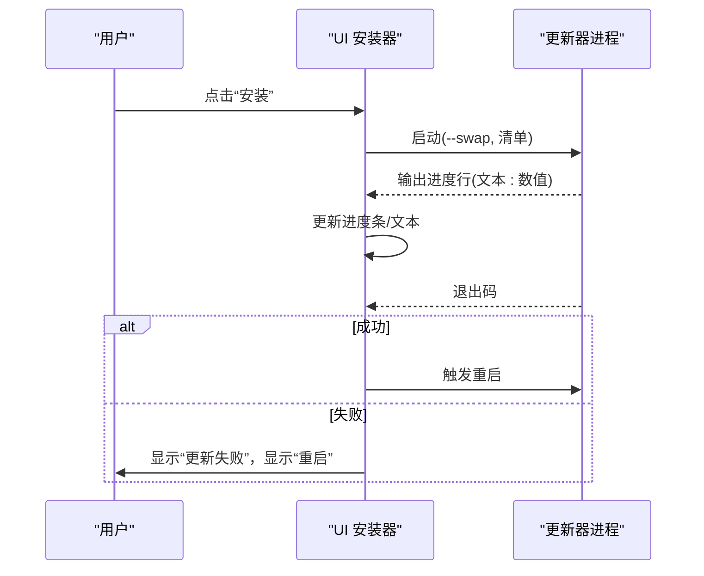
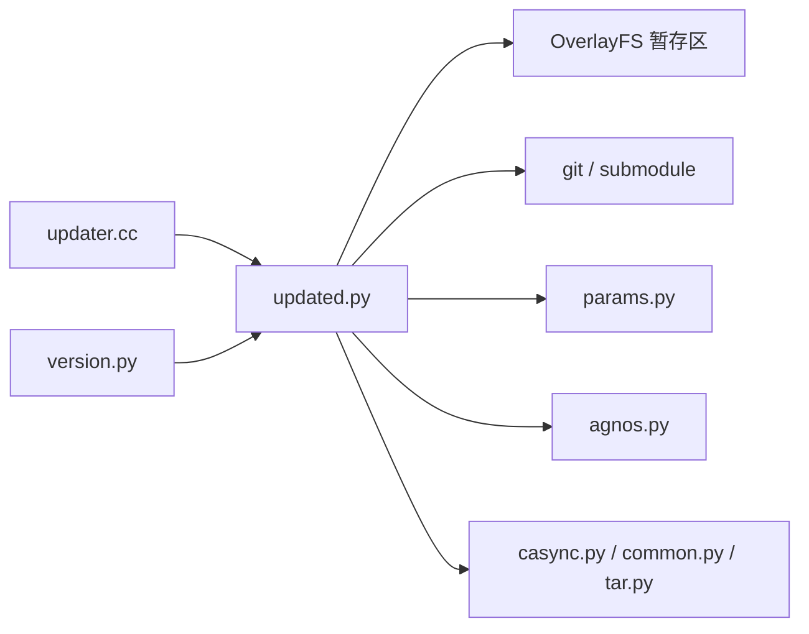

# 更新机制

<cite>
**本文引用的文件**
- [system/updated/updated.py](file://system/updated/updated.py)
- [system/updated/common.py](file://system/updated/common.py)
- [system/updated/casync/casync.py](file://system/updated/casync/casync.py)
- [system/updated/casync/common.py](file://system/updated/casync/common.py)
- [system/updated/casync/tar.py](file://system/updated/casync/tar.py)
- [system/version.py](file://system/version.py)
- [selfdrive/ui/qt/setup/updater.cc](file://selfdrive/ui/qt/setup/updater.cc)
- [selfdrive/test/test_updated.py](file://selfdrive/test/test_updated.py)
- [system/hardware/tici/agnos.py](file://system/hardware/tici/agnos.py)
- [system/hardware/tici/updater](file://system/hardware/tici/updater)
- [launch_chffrplus.sh](file://launch_chffrplus.sh)
- [scripts/stop_updater.sh](file://scripts/stop_updater.sh)
- [common/params.py](file://common/params.py)
- [common/params.h](file://common/params.h)
- [common/params.cc](file://common/params.cc)
</cite>

## 目录
1. [简介](#简介)
2. [项目结构](#项目结构)
3. [核心组件](#核心组件)
4. [架构总览](#架构总览)
5. [详细组件分析](#详细组件分析)
6. [依赖关系分析](#依赖关系分析)
7. [性能考量](#性能考量)
8. [故障排除指南](#故障排除指南)
9. [结论](#结论)
10. [附录](#附录)

## 简介
本文件面向“更新机制”模块，系统化阐述 OTA 更新系统的实现细节，覆盖版本检测、增量更新与全量更新策略、下载/验证/安装/重启流程、更新包生成与分发、回滚与故障恢复、配置与版本管理、兼容性检查以及故障排查与手动更新流程。文档以代码库中的实际实现为依据，既便于初学者理解，也为有经验的开发者提供足够的技术深度。

## 项目结构
更新机制由以下关键部分组成：
- 后台更新守护进程：负责版本检测、拉取更新、OverlayFS 阶段化部署、最终固化与参数写入
- 增量更新子系统（casync）：基于块索引与远程存储的高效差分下载
- UI 安装器：在设备端触发并监控更新安装进度
- 版本元数据与构建信息：用于显示当前/新版本信息、分支与提交摘要
- AGNOS（设备固件）更新：在 OpenPilot 更新的同时或之前进行设备侧固件升级
- 参数系统：持久化状态与用户提示（离线告警、失败计数、分支等）

**图表来源**
- [system/updated/updated.py:1-510](file://system/updated/updated.py#L1-L510)
- [system/updated/casync/casync.py:1-247](file://system/updated/casync/casync.py#L1-L247)
- [system/updated/casync/common.py:1-62](file://system/updated/casync/common.py#L1-L62)
- [system/updated/casync/tar.py:1-40](file://system/updated/casync/tar.py#L1-L40)
- [system/version.py:1-166](file://system/version.py#L1-L166)
- [selfdrive/ui/qt/setup/updater.cc:1-187](file://selfdrive/ui/qt/setup/updater.cc#L1-L187)
- [system/hardware/tici/agnos.py](file://system/hardware/tici/agnos.py)
- [launch_chffrplus.sh:1-41](file://launch_chffrplus.sh#L1-L41)
- [common/params.py](file://common/params.py)
- [common/params.h:1-54](file://common/params.h#L1-L54)
- [common/params.cc:99-199](file://common/params.cc#L99-L199)

**章节来源**
- [system/updated/updated.py:1-510](file://system/updated/updated.py#L1-L510)
- [system/updated/casync/casync.py:1-247](file://system/updated/casync/casync.py#L1-L247)
- [system/updated/casync/common.py:1-62](file://system/updated/casync/common.py#L1-L62)
- [system/updated/casync/tar.py:1-40](file://system/updated/casync/tar.py#L1-L40)
- [system/version.py:1-166](file://system/version.py#L1-L166)
- [selfdrive/ui/qt/setup/updater.cc:1-187](file://selfdrive/ui/qt/setup/updater.cc#L1-L187)
- [launch_chffrplus.sh:1-41](file://launch_chffrplus.sh#L1-L41)
- [common/params.py](file://common/params.py)
- [common/params.h:1-54](file://common/params.h#L1-L54)
- [common/params.cc:99-199](file://common/params.cc#L99-L199)

## 核心组件
- 更新守护进程（updated.py）
  - 负责初始化安全暂存区（OverlayFS）、检测可用分支与目标提交、执行 git 拉取与重置、处理 AGNOS 更新、固化最终镜像、写入参数与告警
  - 支持通过信号触发立即检查/下载，支持计量网络限制下的定时拉取
- 增量更新子系统（casync）
  - 解析 caibx 索引、从本地缓存或远端按块拉取、校验哈希并写入目标文件；支持目录打包为 tar 再压缩
- UI 安装器（updater.cc）
  - 提供“连接 Wi-Fi/安装/进度/重启”界面，调用系统更新器并监听输出进度
- 版本与构建元数据（version.py）
  - 读取版本号、发布说明、分支/提交摘要，生成 UI 描述与构建元数据
- 参数系统（params）
  - 提供键值持久化、原子写入、类型化读取与清理能力，用于保存更新状态、失败计数、分支列表等

**章节来源**
- [system/updated/updated.py:233-506](file://system/updated/updated.py#L233-L506)
- [system/updated/casync/casync.py:1-247](file://system/updated/casync/casync.py#L1-L247)
- [system/updated/casync/common.py:1-62](file://system/updated/casync/common.py#L1-L62)
- [system/updated/casync/tar.py:1-40](file://system/updated/casync/tar.py#L1-L40)
- [system/version.py:1-166](file://system/version.py#L1-L166)
- [selfdrive/ui/qt/setup/updater.cc:1-187](file://selfdrive/ui/qt/setup/updater.cc#L1-L187)
- [common/params.py](file://common/params.py)
- [common/params.h:1-54](file://common/params.h#L1-L54)
- [common/params.cc:99-199](file://common/params.cc#L99-L199)

## 架构总览
更新系统采用“后台守护进程 + 增量传输 + OverlayFS 阶段化部署”的架构：
- 守护进程周期性检查分支与提交，必要时拉取并重置到目标分支/提交
- 使用 OverlayFS 在暂存区合并基线与上层变更，避免直接修改运行时根目录
- 固化阶段将 OverlayFS 视图复制到独立目录，执行 git 清理与 LFS 处理，设置一致性标志
- UI 层可触发安装流程，等待守护进程完成固化后重启生效

**图表来源**
- [launch_chffrplus.sh:19-28](file://launch_chffrplus.sh#L19-L28)
- [system/updated/updated.py:124-206](file://system/updated/updated.py#L124-L206)
- [system/updated/updated.py:372-406](file://system/updated/updated.py#L372-L406)
- [selfdrive/ui/qt/setup/updater.cc:147-177](file://selfdrive/ui/qt/setup/updater.cc#L147-L177)

**章节来源**
- [launch_chffrplus.sh:19-28](file://launch_chffrplus.sh#L19-L28)
- [system/updated/updated.py:124-206](file://system/updated/updated.py#L124-L206)
- [system/updated/updated.py:372-406](file://system/updated/updated.py#L372-L406)
- [selfdrive/ui/qt/setup/updater.cc:147-177](file://selfdrive/ui/qt/setup/updater.cc#L147-L177)

## 详细组件分析

### 组件一：更新守护进程（Updater）
- 职责
  - 初始化 OverlayFS 暂存区，确保基线与工作区在同一文件系统
  - 列举远程分支，过滤排除分支，选择目标分支并计算提交差异
  - 在暂存区内执行 git fetch/checkout/reset/clean/submodule 更新
  - 可选地在设备侧执行 AGNOS 更新
  - 将 OverlayFS 视图复制到最终目录，执行 git gc/lfs prune，设置一致性标志
  - 写入参数（当前/新版本描述、发布说明、失败计数、分支列表、最近更新时间、离线告警）
- 关键流程
  - 版本检测：列出远程分支，解析目标分支提交，比较当前与目标差异
  - 下载与安装：在暂存区执行重置与子模块同步，随后固化
  - 参数与告警：根据失败次数与联网状态设置离线告警，写入版本描述与发布说明
- 并发与锁
  - 使用文件锁防止多实例竞争
  - 低 IO 优先级，降低对系统的影响
- 信号驱动
  - SIGHUP 触发立即下载，SIGUSR1 触发仅检查

**图表来源**
- [system/updated/updated.py:233-506](file://system/updated/updated.py#L233-L506)
- [common/params.py](file://common/params.py)

**章节来源**
- [system/updated/updated.py:233-506](file://system/updated/updated.py#L233-L506)
- [common/params.py](file://common/params.py)

### 组件二：增量更新子系统（casync）
- 功能
  - 解析 caibx 块索引，从本地缓存或远端按需下载 LZMA 压缩块
  - 校验块 SHA-256（使用 SHA-512 截断），写入目标偏移位置
  - 支持目录打包为 tar 再压缩，便于整体传输与解包
- 关键点
  - 块粒度与压缩：默认 16MB 块大小，xz 压缩
  - 重试与超时：单块下载重试与超时控制
  - 构建元数据：生成 build.json 并排除无关文件

**图表来源**
- [system/updated/casync/casync.py:109-204](file://system/updated/casync/casync.py#L109-L204)
- [system/updated/casync/common.py:10-61](file://system/updated/casync/common.py#L10-L61)

**章节来源**
- [system/updated/casync/casync.py:1-247](file://system/updated/casync/casync.py#L1-L247)
- [system/updated/casync/common.py:1-62](file://system/updated/casync/common.py#L1-L62)
- [system/updated/casync/tar.py:1-40](file://system/updated/casync/tar.py#L1-L40)

### 组件三：UI 安装器（updater.cc）
- 功能
  - 提示“需要更新”、“连接 Wi-Fi”、“安装”
  - 进度条显示更新器输出的进度文本与数值
  - 安装成功后自动重启，失败时允许手动重启
- 交互
  - 通过命令行参数传递更新器路径与清单路径
  - 连接进程标准输出以解析进度行

**图表来源**
- [selfdrive/ui/qt/setup/updater.cc:147-177](file://selfdrive/ui/qt/setup/updater.cc#L147-L177)

**章节来源**
- [selfdrive/ui/qt/setup/updater.cc:1-187](file://selfdrive/ui/qt/setup/updater.cc#L1-L187)

### 组件四：版本与构建元数据（version.py）
- 功能
  - 读取版本号与发布说明
  - 生成构建元数据（渠道、OpenPilot 元信息、是否脏）
  - 提供 UI 描述字符串与规范标识
- 用途
  - 更新参数中“当前/新版本描述”与“发布说明”的来源

**章节来源**
- [system/version.py:1-166](file://system/version.py#L1-L166)

### 组件五：参数系统（params）
- 功能
  - 原子写入、类型化读取、阻塞读取、批量读取与清理
  - 用于持久化更新状态、失败计数、分支列表、最近更新时间、离线告警开关
- 实现要点
  - 临时文件 + fsync + 原子 rename 的写入流程
  - 目录 fsync 保证落盘顺序

**章节来源**
- [common/params.py](file://common/params.py)
- [common/params.h:1-54](file://common/params.h#L1-L54)
- [common/params.cc:99-199](file://common/params.cc#L99-L199)

### 组件六：AGNOS 更新与开机检查（launch_chffrplus.sh、agnos.py）
- 功能
  - 开机时检查当前 AGNOS 版本与期望版本，必要时调用更新器并重启
  - 更新守护进程在拉取完成后可触发 AGNOS 固件更新
- 流程
  - 读取当前版本与期望版本，不一致则设置一致性标志、显示离线告警、执行固件刷写、清除告警

**章节来源**
- [launch_chffrplus.sh:19-28](file://launch_chffrplus.sh#L19-L28)
- [system/updated/updated.py:209-230](file://system/updated/updated.py#L209-L230)
- [system/hardware/tici/agnos.py](file://system/hardware/tici/agnos.py)

## 依赖关系分析
- 更新守护进程依赖
  - OverlayFS 挂载与一致性标志文件
  - Git 与子模块操作
  - 参数系统写入状态与告警
  - 可选 AGNOS 固件更新
- 增量更新依赖
  - casync 工具链与远端块存储
  - tar 归档与 LZMA 解压
- UI 依赖
  - 启动外部更新器进程并解析其输出
- 版本与构建元数据
  - 读取版本头与构建 JSON，生成 UI 描述

**图表来源**
- [system/updated/updated.py:1-510](file://system/updated/updated.py#L1-L510)
- [system/updated/casync/casync.py:1-247](file://system/updated/casync/casync.py#L1-L247)
- [system/updated/casync/common.py:1-62](file://system/updated/casync/common.py#L1-L62)
- [system/updated/casync/tar.py:1-40](file://system/updated/casync/tar.py#L1-L40)
- [system/version.py:1-166](file://system/version.py#L1-L166)
- [selfdrive/ui/qt/setup/updater.cc:1-187](file://selfdrive/ui/qt/setup/updater.cc#L1-L187)

**章节来源**
- [system/updated/updated.py:1-510](file://system/updated/updated.py#L1-L510)
- [system/updated/casync/casync.py:1-247](file://system/updated/casync/casync.py#L1-L247)
- [system/updated/casync/common.py:1-62](file://system/updated/casync/common.py#L1-L62)
- [system/updated/casync/tar.py:1-40](file://system/updated/casync/tar.py#L1-L40)
- [system/version.py:1-166](file://system/version.py#L1-L166)
- [selfdrive/ui/qt/setup/updater.cc:1-187](file://selfdrive/ui/qt/setup/updater.cc#L1-L187)

## 性能考量
- IO 优先级
  - 更新守护进程设置为后台 IO 优先级，降低对实时任务的影响
- 拉取策略
  - 在计量网络连接下，按 3 天间隔自动拉取；用户可通过信号请求立即检查/下载
- 增量传输
  - casync 以 16MB 块为单位，结合 LZMA 压缩与本地缓存命中，显著减少带宽占用
- 固化阶段
  - 执行 git gc 与 LFS prune，清理历史对象，缩短后续拉取时间

**章节来源**
- [system/updated/updated.py:422-505](file://system/updated/updated.py#L422-L505)
- [system/updated/casync/common.py:10-61](file://system/updated/casync/common.py#L10-L61)
- [system/updated/updated.py:196-206](file://system/updated/updated.py#L196-L206)

## 故障排除指南
- 常见问题与定位
  - 多实例冲突：若另一个更新进程正在运行，新的实例会因无法获取锁而退出
    - 参考：[system/updated/updated.py:416-421](file://system/updated/updated.py#L416-L421)
  - 网络受限：计量网络连接下跳过下载，需等待 3 天或用户请求
    - 参考：[system/updated/updated.py:474-479](file://system/updated/updated.py#L474-L479)
  - 设备离线告警：连续失败超过阈值且联网时，显示“更新失败”告警；长时间无联网显示“需要联网”提示
    - 参考：[system/updated/updated.py:329-341](file://system/updated/updated.py#L329-L341)
  - OverlayFS 不同文件系统：基线与合并目录不在同一文件系统会导致初始化失败
    - 参考：[system/updated/updated.py:155-156](file://system/updated/updated.py#L155-L156)
  - AGNOS 更新失败：更新守护进程会设置一致性标志、显示离线告警、执行固件刷写，失败后清除告警
    - 参考：[system/updated/updated.py:209-230](file://system/updated/updated.py#L209-L230)
- 手动停止更新器
  - 可使用脚本向更新进程发送信号或终止进程
    - 参考：[scripts/stop_updater.sh](file://scripts/stop_updater.sh)

**章节来源**
- [system/updated/updated.py:416-421](file://system/updated/updated.py#L416-L421)
- [system/updated/updated.py:474-479](file://system/updated/updated.py#L474-L479)
- [system/updated/updated.py:329-341](file://system/updated/updated.py#L329-L341)
- [system/updated/updated.py:155-156](file://system/updated/updated.py#L155-L156)
- [system/updated/updated.py:209-230](file://system/updated/updated.py#L209-L230)
- [scripts/stop_updater.sh](file://scripts/stop_updater.sh)

## 结论
该更新机制以安全的 OverlayFS 暂存区为核心，结合增量传输与严格的参数/一致性标志管理，实现了可靠的 OTA 更新流程。通过 UI 与守护进程的配合，用户可在设备端直观地感知与参与更新，系统在失败与离线场景下具备完善的告警与恢复策略。版本与构建元数据的统一管理，使得更新前后状态清晰可见，便于运维与排障。

## 附录

### 更新流程（下载/验证/安装/重启）
- 下载与验证
  - 在暂存区执行 git fetch/checkout/reset，并同步子模块
  - 可选执行 AGNOS 固件更新
  - 参考：[system/updated/updated.py:372-406](file://system/updated/updated.py#L372-L406)
- 安装与固化
  - 复制 OverlayFS 视图为最终目录，执行 git gc 与 LFS prune
  - 设置一致性标志，准备重启切换
  - 参考：[system/updated/updated.py:180-206](file://system/updated/updated.py#L180-L206)
- 重启
  - UI 安装器在安装完成后触发重启
  - 参考：[selfdrive/ui/qt/setup/updater.cc:171-172](file://selfdrive/ui/qt/setup/updater.cc#L171-L172)

**章节来源**
- [system/updated/updated.py:372-406](file://system/updated/updated.py#L372-L406)
- [system/updated/updated.py:180-206](file://system/updated/updated.py#L180-L206)
- [selfdrive/ui/qt/setup/updater.cc:171-172](file://selfdrive/ui/qt/setup/updater.cc#L171-L172)

### 更新包生成、签名与分发
- 生成与分发
  - 使用 casync 将目录打包为 tar 并生成 caibx 索引，支持本地缓存与远端拉取
  - 构建元数据写入 build.json，排除无关文件
  - 参考：[system/updated/casync/common.py:44-61](file://system/updated/casync/common.py#L44-L61)
- 签名
  - 代码库未发现内置签名逻辑；如需签名，建议在生成阶段引入签名工具并在消费端校验
  - 参考：[system/updated/casync/casync.py:188-189](file://system/updated/casync/casync.py#L188-L189)

**章节来源**
- [system/updated/casync/common.py:44-61](file://system/updated/casync/common.py#L44-L61)
- [system/updated/casync/casync.py:188-189](file://system/updated/casync/casync.py#L188-L189)

### 回滚与故障恢复
- 回滚策略
  - 当前实现未提供自动回滚；建议在安装前保留旧版本备份，或通过参数标记“旧版本目录”
- 故障恢复
  - 多实例冲突：退出并等待下次调度
  - 网络受限：等待 3 天或用户请求
  - 失败告警：显示“更新失败”或“需要联网”提示，便于人工干预
  - 参考：[system/updated/updated.py:416-421](file://system/updated/updated.py#L416-L421), [system/updated/updated.py:474-479](file://system/updated/updated.py#L474-L479), [system/updated/updated.py:329-341](file://system/updated/updated.py#L329-L341)

**章节来源**
- [system/updated/updated.py:416-421](file://system/updated/updated.py#L416-L421)
- [system/updated/updated.py:474-479](file://system/updated/updated.py#L474-L479)
- [system/updated/updated.py:329-341](file://system/updated/updated.py#L329-L341)

### 更新配置与版本管理
- 配置项
  - 锁文件与暂存根目录：UPDATER_LOCK_FILE、UPDATER_STAGING_ROOT
  - 目标分支：UpdaterTargetBranch（参数）
  - 是否计量网络：NetworkMetered（参数）
  - 是否禁用更新：DisableUpdates（参数）
  - 参考：[system/updated/updated.py:24-26](file://system/updated/updated.py#L24-L26), [system/updated/updated.py:244-248](file://system/updated/updated.py#L244-L248), [system/updated/updated.py:412-414](file://system/updated/updated.py#L412-L414)
- 版本与发布说明
  - 当前/新版本描述、发布说明来源于版本头与 RELEASES.md
  - 参考：[system/version.py:22-31](file://system/version.py#L22-L31), [system/updated/updated.py:296-319](file://system/updated/updated.py#L296-L319)

**章节来源**
- [system/updated/updated.py:24-26](file://system/updated/updated.py#L24-L26)
- [system/updated/updated.py:244-248](file://system/updated/updated.py#L244-L248)
- [system/updated/updated.py:412-414](file://system/updated/updated.py#L412-L414)
- [system/version.py:22-31](file://system/version.py#L22-L31)
- [system/updated/updated.py:296-319](file://system/updated/updated.py#L296-L319)

### 手动更新流程
- 方法一：通过信号触发
  - 发送 SIGHUP 触发立即下载，SIGUSR1 触发仅检查
  - 参考：[system/updated/updated.py:49-57](file://system/updated/updated.py#L49-L57)
- 方法二：通过 UI 安装器
  - 在 UI 中点击“安装”，更新器进程输出进度，成功后自动重启
  - 参考：[selfdrive/ui/qt/setup/updater.cc:147-177](file://selfdrive/ui/qt/setup/updater.cc#L147-L177)
- 方法三：脚本停止更新器
  - 使用脚本向更新进程发送信号或终止进程
  - 参考：[scripts/stop_updater.sh](file://scripts/stop_updater.sh)

**章节来源**
- [system/updated/updated.py:49-57](file://system/updated/updated.py#L49-L57)
- [selfdrive/ui/qt/setup/updater.cc:147-177](file://selfdrive/ui/qt/setup/updater.cc#L147-L177)
- [scripts/stop_updater.sh](file://scripts/stop_updater.sh)