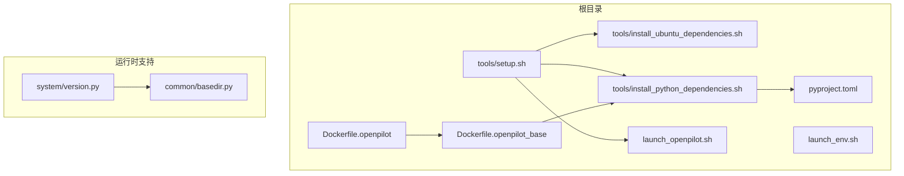
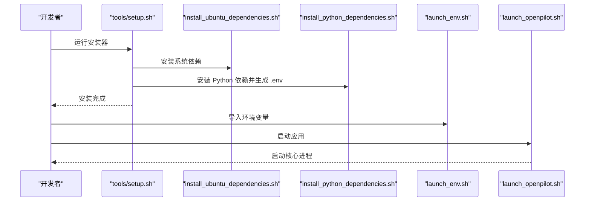
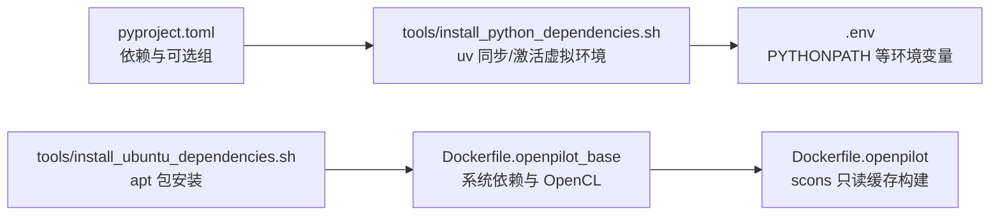

# 环境配置

<cite>
**本文引用的文件**
- [tools/setup.sh](file://tools/setup.sh)
- [tools/install_ubuntu_dependencies.sh](file://tools/install_ubuntu_dependencies.sh)
- [tools/install_python_dependencies.sh](file://tools/install_python_dependencies.sh)
- [launch_env.sh](file://launch_env.sh)
- [launch_openpilot.sh](file://launch_openpilot.sh)
- [pyproject.toml](file://pyproject.toml)
- [Dockerfile.openpilot_base](file://Dockerfile.openpilot_base)
- [Dockerfile.openpilot](file://Dockerfile.openpilot)
- [common/basedir.py](file://common/basedir.py)
- [system/version.py](file://system/version.py)
</cite>

## 目录
1. [简介](#简介)
2. [项目结构](#项目结构)
3. [核心组件](#核心组件)
4. [架构总览](#架构总览)
5. [详细组件分析](#详细组件分析)
6. [依赖分析](#依赖分析)
7. [性能考虑](#性能考虑)
8. [故障排除指南](#故障排除指南)
9. [结论](#结论)
10. [附录](#附录)

## 简介
本文件面向“carrot2-v9-acc”项目的环境配置与部署，覆盖开发环境与生产环境的搭建流程、系统依赖安装、Python 环境配置、编译构建流程、启动脚本工作原理与参数配置、环境变量与路径配置、权限管理、不同部署场景的差异与策略，并提供来自实际代码库的具体示例与可操作的排障建议。目标是让初学者快速上手，同时为有经验的开发者提供足够的技术深度。

## 项目结构
本仓库采用多子模块协作的组织方式：核心逻辑位于 openpilot 及其子目录（selfdrive、system、common 等），工具链与环境配置集中在 tools 与根目录脚本中；容器化构建通过 Dockerfile.openpilot_base 与 Dockerfile.openpilot 实现；版本与路径解析由 system/version.py 与 common/basedir.py 提供支持。

图表来源
- [tools/setup.sh:1-190](file://tools/setup.sh#L1-L190)
- [tools/install_ubuntu_dependencies.sh:1-139](file://tools/install_ubuntu_dependencies.sh#L1-L139)
- [tools/install_python_dependencies.sh:1-45](file://tools/install_python_dependencies.sh#L1-L45)
- [launch_env.sh:1-14](file://launch_env.sh#L1-L14)
- [launch_openpilot.sh:1-7](file://launch_openpilot.sh#L1-L7)
- [pyproject.toml:1-268](file://pyproject.toml#L1-L268)
- [Dockerfile.openpilot_base:1-82](file://Dockerfile.openpilot_base#L1-L82)
- [Dockerfile.openpilot:1-14](file://Dockerfile.openpilot#L1-L14)
- [common/basedir.py:1-5](file://common/basedir.py#L1-L5)
- [system/version.py:1-166](file://system/version.py#L1-L166)

章节来源
- [tools/setup.sh:1-190](file://tools/setup.sh#L1-L190)
- [pyproject.toml:1-268](file://pyproject.toml#L1-L268)

## 核心组件
- 安装器与引导脚本：tools/setup.sh 负责交互式安装、克隆仓库、调用内部 op 工具链完成后续步骤。
- 系统依赖安装：tools/install_ubuntu_dependencies.sh 统一安装 Ubuntu 24.04 所需的系统包与 udev 规则。
- Python 依赖安装：tools/install_python_dependencies.sh 使用 uv 管理虚拟环境与依赖同步，并生成 .env。
- 启动环境变量：launch_env.sh 设置多线程库的线程数限制与默认 AGNOS 版本等。
- 应用启动入口：launch_openpilot.sh 根据参数动态设置 API/Athena 主机地址后执行核心启动脚本。
- 构建与打包：Dockerfile.openpilot_base 与 Dockerfile.openpilot 提供容器化构建与只读缓存加速。
- 路径与版本：common/basedir.py 提供项目根路径；system/version.py 解析版本与构建元数据。

章节来源
- [tools/setup.sh:1-190](file://tools/setup.sh#L1-L190)
- [tools/install_ubuntu_dependencies.sh:1-139](file://tools/install_ubuntu_dependencies.sh#L1-L139)
- [tools/install_python_dependencies.sh:1-45](file://tools/install_python_dependencies.sh#L1-L45)
- [launch_env.sh:1-14](file://launch_env.sh#L1-L14)
- [launch_openpilot.sh:1-7](file://launch_openpilot.sh#L1-L7)
- [Dockerfile.openpilot_base:1-82](file://Dockerfile.openpilot_base#L1-L82)
- [Dockerfile.openpilot:1-14](file://Dockerfile.openpilot#L1-L14)
- [common/basedir.py:1-5](file://common/basedir.py#L1-L5)
- [system/version.py:1-166](file://system/version.py#L1-L166)

## 架构总览
下图展示从本地安装到容器构建的关键流程与组件关系：

图表来源
- [tools/setup.sh:1-190](file://tools/setup.sh#L1-L190)
- [tools/install_ubuntu_dependencies.sh:1-139](file://tools/install_ubuntu_dependencies.sh#L1-L139)
- [tools/install_python_dependencies.sh:1-45](file://tools/install_python_dependencies.sh#L1-L45)
- [launch_env.sh:1-14](file://launch_env.sh#L1-L14)
- [launch_openpilot.sh:1-7](file://launch_openpilot.sh#L1-L7)

## 详细组件分析

### 安装器与引导流程（tools/setup.sh）
- 功能要点
  - 支持交互式选择安装目录，默认在当前目录下创建 openpilot 子目录。
  - 自动检测是否已有有效 openpilot 目录，避免重复克隆或覆盖非目标目录。
  - 调用 git clone 获取 openpilot 源码，随后通过内部 op 工具链执行安装与后置钩子。
  - 失败时上报 Sentry 事件，便于追踪错误类型与上下文。
- 关键行为
  - 通过 OPENPILOT_ROOT 控制安装路径。
  - 非交互模式下自动采用默认路径，减少人工干预。
  - 成功后输出提示信息，引导用户查看文档与贡献指南。

章节来源
- [tools/setup.sh:1-190](file://tools/setup.sh#L1-L190)

### 系统依赖安装（tools/install_ubuntu_dependencies.sh）
- 功能要点
  - 基于 /etc/os-release 自动识别 Ubuntu 版本，优先适配 24.04。
  - 安装构建、图形、音视频、OpenCL、Qt、USB/udev、Vulkan 等核心依赖。
  - 在存在 /etc/udev/rules.d/ 的环境中写入 panda 与 jungle 设备的 udev 规则，确保 USB 权限。
- 兼容性
  - 仅在 Ubuntu 24.04 或兼容版本上进行预设安装；其他版本会提示确认继续。
- 权限管理
  - 通过 udevadm reload/trigger 生效规则，避免手动重启服务。

章节来源
- [tools/install_ubuntu_dependencies.sh:1-139](file://tools/install_ubuntu_dependencies.sh#L1-L139)

### Python 依赖安装（tools/install_python_dependencies.sh）
- 功能要点
  - 若系统未安装 uv，则根据架构选择预置二进制或在线安装，并将其加入 PATH。
  - 使用 uv sync --frozen --all-extras 同步所有依赖与可选组，保证锁定一致性。
  - 安装完成后激活虚拟环境并在根目录生成 .env 文件，设置 PYTHONPATH。
  - macOS 下额外导出 ZMQ、OBJC 等环境变量以规避平台差异。
- 与 pyproject.toml 的关系
  - 该脚本直接消费 pyproject.toml 中的依赖与可选组定义，确保本地与 CI 环境一致。

章节来源
- [tools/install_python_dependencies.sh:1-45](file://tools/install_python_dependencies.sh#L1-L45)
- [pyproject.toml:1-268](file://pyproject.toml#L1-L268)

### 启动环境变量（launch_env.sh）
- 功能要点
  - 将常见 BLAS/向量化库的线程数限制为 1，避免多线程竞争导致的性能抖动。
  - 设置默认 AGNOS_VERSION，用于设备侧运行时行为控制。
  - 设置 STAGING_ROOT，作为安全回放/测试的存储根目录。

章节来源
- [launch_env.sh:1-14](file://launch_env.sh#L1-L14)

### 应用启动入口（launch_openpilot.sh）
- 功能要点
  - 读取 /data/params/d/EnableConnect 参数，动态决定 API_HOST 与 ATHENA_HOST。
  - 最终 exec 到核心启动脚本，实现平滑切换与资源复用。

章节来源
- [launch_openpilot.sh:1-7](file://launch_openpilot.sh#L1-L7)

### 容器化构建（Dockerfile.openpilot_base 与 Dockerfile.openpilot）
- openpilot_base
  - 基于 Ubuntu 24.04，预装系统依赖与 OpenCL 运行时。
  - 创建非 root 用户并配置 sudo 权限，复制 pyproject.toml 与 uv.lock，使用 install_python_dependencies.sh 完成 Python 环境准备。
  - 预置 QTWEBENGINE 环境变量与 git 全局安全目录，提升容器稳定性。
- openpilot
  - 基于 openpilot-base，设置 PYTHONPATH，拷贝源码，使用 scons --cache-readonly 并行构建，利用缓存加速。

章节来源
- [Dockerfile.openpilot_base:1-82](file://Dockerfile.openpilot_base#L1-L82)
- [Dockerfile.openpilot:1-14](file://Dockerfile.openpilot#L1-L14)

### 路径与版本解析（common/basedir.py 与 system/version.py）
- basedir.py
  - 提供项目根目录的绝对路径，作为各模块定位资源的基础。
- version.py
  - 从头文件与 Git 信息解析版本号、分支、提交哈希与构建元数据。
  - 提供 BuildMetadata/ OpenpilotMetadata 数据类，支撑 UI 描述与渠道判断。

章节来源
- [common/basedir.py:1-5](file://common/basedir.py#L1-L5)
- [system/version.py:1-166](file://system/version.py#L1-L166)

## 依赖分析
- Python 依赖来源
  - 通过 pyproject.toml 明确定义核心依赖、可选组与测试工具链，确保一致性与可追溯性。
- 系统依赖来源
  - 通过 install_ubuntu_dependencies.sh 统一安装，涵盖构建工具链、图形/音频/视频、USB/udev、Vulkan、OpenCL、Qt 等。
- 容器依赖来源
  - openpilot_base 预装系统依赖与 OpenCL 运行时；openpilot 在只读缓存下执行 scons 构建。

图表来源
- [pyproject.toml:1-268](file://pyproject.toml#L1-L268)
- [tools/install_python_dependencies.sh:1-45](file://tools/install_python_dependencies.sh#L1-L45)
- [tools/install_ubuntu_dependencies.sh:1-139](file://tools/install_ubuntu_dependencies.sh#L1-L139)
- [Dockerfile.openpilot_base:1-82](file://Dockerfile.openpilot_base#L1-L82)
- [Dockerfile.openpilot:1-14](file://Dockerfile.openpilot#L1-L14)

章节来源
- [pyproject.toml:1-268](file://pyproject.toml#L1-L268)
- [tools/install_ubuntu_dependencies.sh:1-139](file://tools/install_ubuntu_dependencies.sh#L1-L139)
- [tools/install_python_dependencies.sh:1-45](file://tools/install_python_dependencies.sh#L1-L45)
- [Dockerfile.openpilot_base:1-82](file://Dockerfile.openpilot_base#L1-L82)
- [Dockerfile.openpilot:1-14](file://Dockerfile.openpilot#L1-L14)

## 性能考虑
- 线程数限制
  - 通过 launch_env.sh 将 OMP/MKL/NumExpr/OpenBLAS/vecLib 的线程数统一为 1，降低多线程竞争带来的抖动，适合单进程推理与训练场景。
- 缓存与并行
  - Dockerfile.openpilot 使用 scons --cache-readonly 并行构建，显著缩短二次构建时间。
- 平台差异
  - macOS 下导出 ZMQ 与 OBJC 相关变量，避免跨平台兼容性问题导致的初始化失败或性能退化。

章节来源
- [launch_env.sh:1-14](file://launch_env.sh#L1-L14)
- [Dockerfile.openpilot:1-14](file://Dockerfile.openpilot#L1-L14)
- [tools/install_python_dependencies.sh:1-45](file://tools/install_python_dependencies.sh#L1-L45)

## 故障排除指南
- 安装器无法继续
  - 现象：找不到 git 或克隆失败。
  - 排查：检查网络连通性与代理设置；确认已安装 git；必要时手动执行 git clone 并设置 OPENPILOT_ROOT。
  - 参考
    - [tools/setup.sh:131-156](file://tools/setup.sh#L131-L156)
- Ubuntu 依赖安装失败
  - 现象：apt 安装报错或版本不匹配。
  - 排查：确认系统为 Ubuntu 24.04 或兼容版本；若非官方版本，按提示确认继续；检查 sudo 权限与 /etc/os-release 内容。
  - 参考
    - [tools/install_ubuntu_dependencies.sh:96-111](file://tools/install_ubuntu_dependencies.sh#L96-L111)
- Python 依赖同步失败
  - 现象：uv sync 报错或超时。
  - 排查：增大网络带宽或更换镜像源；确保 uv 正常安装；检查 pyproject.toml 与 uv.lock 是否匹配。
  - 参考
    - [tools/install_python_dependencies.sh:34-37](file://tools/install_python_dependencies.sh#L34-L37)
- macOS 平台相关问题
  - 现象：消息队列或 GUI 初始化异常。
  - 排查：确认已导出 ZMQ 与 OBJC 相关变量；检查 QtWebEngine 环境变量。
  - 参考
    - [tools/install_python_dependencies.sh:40-44](file://tools/install_python_dependencies.sh#L40-L44)
- 容器构建卡顿
  - 现象：首次构建缓慢。
  - 排查：确保缓存可用；检查 scons --cache-readonly 是否生效；清理无效缓存后重试。
  - 参考
    - [Dockerfile.openpilot:13](file://Dockerfile.openpilot#L13)
- 启动阶段网络连接异常
  - 现象：API/Athena 地址错误导致连接失败。
  - 排查：检查 /data/params/d/EnableConnect 参数值；确认 launch_openpilot.sh 的主机变量设置。
  - 参考
    - [launch_openpilot.sh:2-6](file://launch_openpilot.sh#L2-L6)

章节来源
- [tools/setup.sh:131-156](file://tools/setup.sh#L131-L156)
- [tools/install_ubuntu_dependencies.sh:96-111](file://tools/install_ubuntu_dependencies.sh#L96-L111)
- [tools/install_python_dependencies.sh:34-37](file://tools/install_python_dependencies.sh#L34-L37)
- [tools/install_python_dependencies.sh:40-44](file://tools/install_python_dependencies.sh#L40-L44)
- [Dockerfile.openpilot:13](file://Dockerfile.openpilot#L13)
- [launch_openpilot.sh:2-6](file://launch_openpilot.sh#L2-L6)

## 结论
本环境配置文档基于实际代码库梳理了从系统依赖、Python 环境、编译构建到启动脚本与容器化的完整流程。通过统一的安装器、明确的依赖清单与容器化基线，项目在开发与生产环境下均具备良好的一致性与可维护性。建议在新环境首次部署时优先参考安装器与依赖安装脚本，在持续集成与生产部署时优先采用容器化构建。

## 附录

### 开发环境搭建步骤（概要）
- 准备系统
  - 在 Ubuntu 24.04 上运行 tools/install_ubuntu_dependencies.sh 安装系统依赖。
- 准备 Python 环境
  - 运行 tools/install_python_dependencies.sh，生成 .env 并激活虚拟环境。
- 验证路径与版本
  - 使用 common/basedir.py 与 system/version.py 确认根路径与版本信息。
- 启动应用
  - 导入 launch_env.sh 的环境变量，再执行 launch_openpilot.sh。

章节来源
- [tools/install_ubuntu_dependencies.sh:1-139](file://tools/install_ubuntu_dependencies.sh#L1-L139)
- [tools/install_python_dependencies.sh:1-45](file://tools/install_python_dependencies.sh#L1-L45)
- [common/basedir.py:1-5](file://common/basedir.py#L1-L5)
- [system/version.py:1-166](file://system/version.py#L1-L166)
- [launch_env.sh:1-14](file://launch_env.sh#L1-L14)
- [launch_openpilot.sh:1-7](file://launch_openpilot.sh#L1-L7)

### 生产环境与容器化部署（概要）
- 使用 Dockerfile.openpilot_base 构建基础镜像，预装系统依赖与 OpenCL 运行时。
- 使用 Dockerfile.openpilot 基于 openpilot-base 构建应用镜像，启用 scons 只读缓存加速。
- 在容器内通过 .env 与环境变量控制运行时行为。

章节来源
- [Dockerfile.openpilot_base:1-82](file://Dockerfile.openpilot_base#L1-L82)
- [Dockerfile.openpilot:1-14](file://Dockerfile.openpilot#L1-L14)