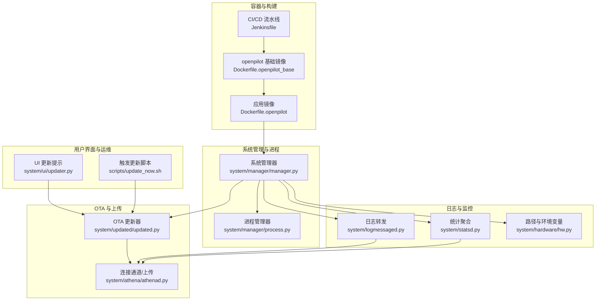
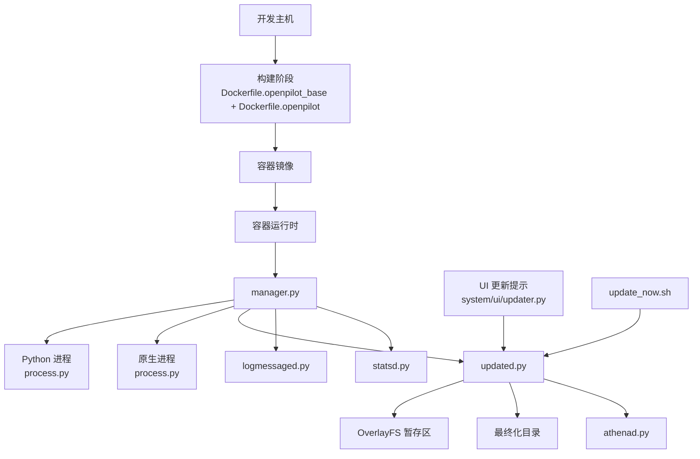
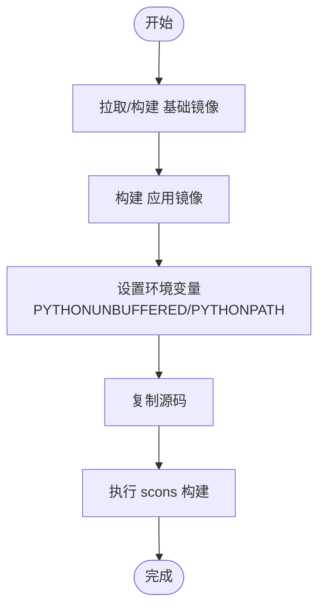
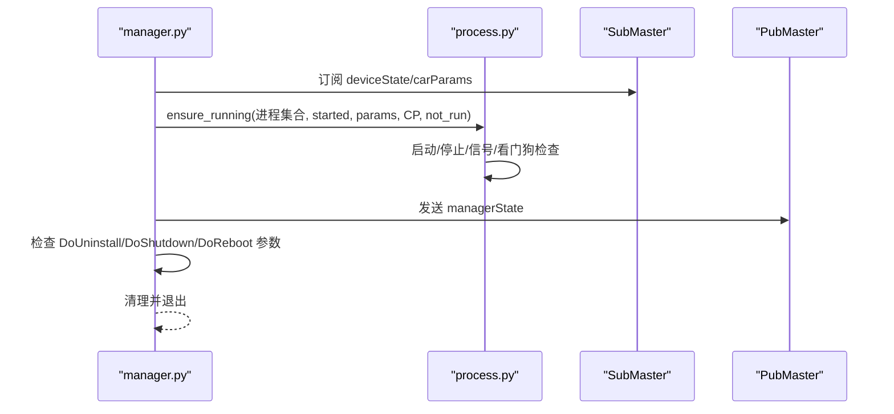
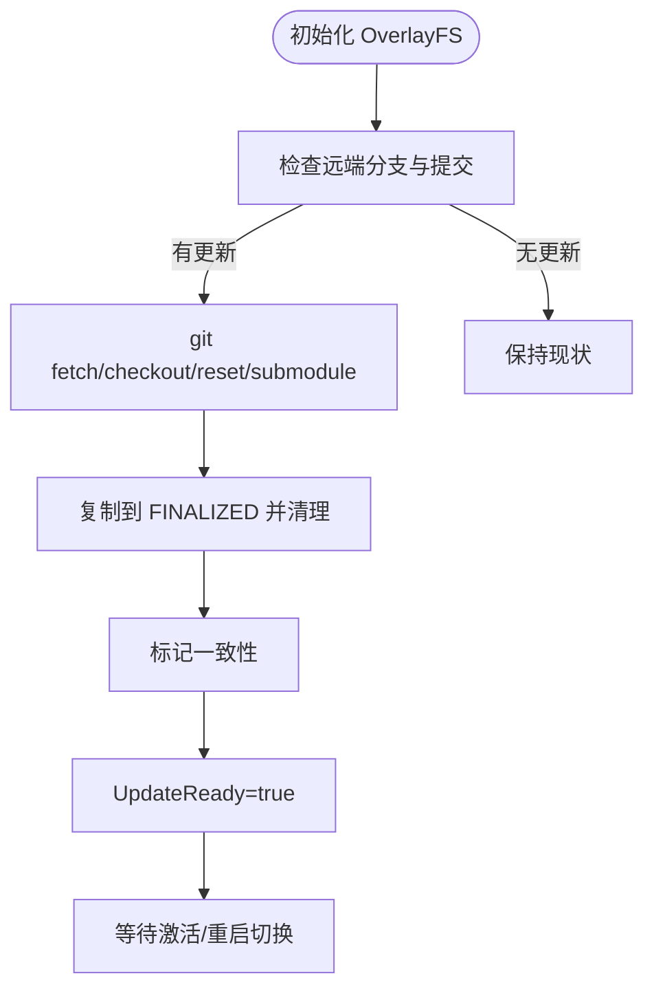
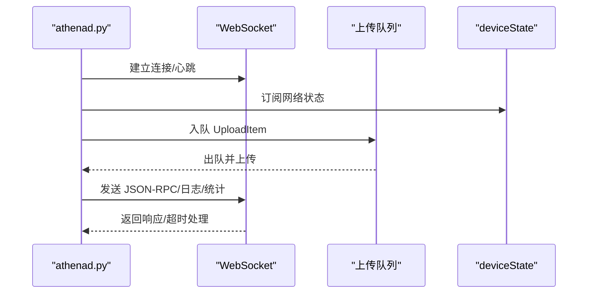
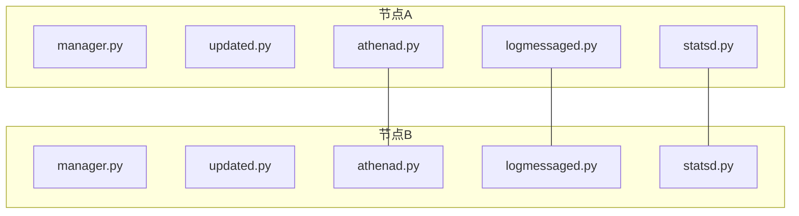
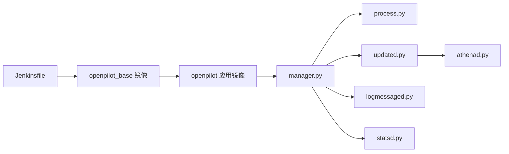

# 生产环境部署

<cite>
**本文引用的文件**
- [Jenkinsfile](file://Jenkinsfile)
- [Dockerfile.openpilot](file://Dockerfile.openpilot)
- [Dockerfile.openpilot_base](file://Dockerfile.openpilot_base)
- [system/manager/manager.py](file://system/manager/manager.py)
- [system/manager/process.py](file://system/manager/process.py)
- [system/updated/updated.py](file://system/updated/updated.py)
- [system/athena/athenad.py](file://system/athena/athenad.py)
- [system/ui/updater.py](file://system/ui/updater.py)
- [scripts/update_now.sh](file://scripts/update_now.sh)
- [system/hardware/hw.py](file://system/hardware/hw.py)
- [system/logmessaged.py](file://system/logmessaged.py)
- [system/statsd.py](file://system/statsd.py)
</cite>

## 目录
1. [简介](#简介)
2. [项目结构](#项目结构)
3. [核心组件](#核心组件)
4. [架构总览](#架构总览)
5. [详细组件分析](#详细组件分析)
6. [依赖关系分析](#依赖关系分析)
7. [性能考量](#性能考量)
8. [故障排除指南](#故障排除指南)
9. [结论](#结论)
10. [附录](#附录)

## 简介
本文件面向生产环境部署模块，围绕容器化部署、系统管理器与进程管理、OTA 更新机制、部署拓扑与架构设计、部署配置与监控、健康检查以及故障排除与回滚策略进行系统性说明。文档以代码库中的实际实现为依据，既便于初学者理解，也为有经验的开发者提供足够的技术深度。

## 项目结构
本仓库采用多模块分层组织方式：系统管理与进程管理位于 system 目录；OTA 更新与上传通道位于 system/updated 与 system/athena；容器化基础镜像与应用镜像分别由 Dockerfile.openpilot_base 与 Dockerfile.openpilot 定义；日志与统计通过独立守护进程完成；脚本用于触发更新等运维操作。

**图表来源**
- [Dockerfile.openpilot_base:1-82](file://Dockerfile.openpilot_base#L1-L82)
- [Dockerfile.openpilot:1-14](file://Dockerfile.openpilot#L1-L14)
- [Jenkinsfile:159-282](file://Jenkinsfile#L159-L282)
- [system/manager/manager.py:1-428](file://system/manager/manager.py#L1-L428)
- [system/manager/process.py:1-302](file://system/manager/process.py#L1-L302)
- [system/updated/updated.py:1-510](file://system/updated/updated.py#L1-L510)
- [system/athena/athenad.py:1-843](file://system/athena/athenad.py#L1-L843)
- [system/ui/updater.py:1-198](file://system/ui/updater.py#L1-L198)
- [scripts/update_now.sh:1-5](file://scripts/update_now.sh#L1-L5)
- [system/logmessaged.py:1-66](file://system/logmessaged.py#L1-L66)
- [system/statsd.py:1-184](file://system/statsd.py#L1-L184)
- [system/hardware/hw.py:1-66](file://system/hardware/hw.py#L1-L66)

**章节来源**
- [Dockerfile.openpilot_base:1-82](file://Dockerfile.openpilot_base#L1-L82)
- [Dockerfile.openpilot:1-14](file://Dockerfile.openpilot#L1-L14)
- [Jenkinsfile:159-282](file://Jenkinsfile#L159-L282)

## 核心组件
- 容器化基础与应用镜像
  - 基础镜像 Dockerfile.openpilot_base：定义 Ubuntu 基座、语言与工具链、Python 虚拟环境、OpenCL 驱动、用户与权限、非交互式安装等，确保构建与运行一致性。
  - 应用镜像 Dockerfile.openpilot：基于基础镜像，设置工作目录与环境变量，拷贝源码并执行 scons 构建。
- 系统管理器与进程管理
  - manager.py：初始化参数、注册设备、绑定日志、预导入进程、循环调度 ensure_running、发送 managerState、处理关机/重启/卸载。
  - process.py：抽象 ManagerProcess，支持 Python/Native/Daemon 三类进程；提供启动/停止/信号/看门狗检查；统一 ensure_running 协调策略。
- OTA 更新与上传
  - updated.py：OverlayFS 安全暂存区、分支与提交比对、git fetch/reset、AGNOS 同步更新、最终化与一致性标记、失败告警与离线提示、参数写入。
  - athenad.py：WebSocket 连接、JSON-RPC 方法、上传队列与重试、日志与统计上报、网络状态感知、本地代理、心跳与超时控制。
- 用户界面与运维脚本
  - system/ui/updater.py：图形化提示与进度展示，调用外部更新器并处理结果。
  - scripts/update_now.sh：向 updated 发送 SIGHUP 触发立即检查/下载。
- 日志与监控
  - system/logmessaged.py：接收 ZMQ 日志，落盘并发布到消息总线；错误级别上送 errorLogMessage。
  - system/statsd.py：从 ZMQ 接收指标，按 Gauge/Sample 聚合，周期性写入文件供上传或分析。

**章节来源**
- [system/manager/manager.py:212-428](file://system/manager/manager.py#L212-L428)
- [system/manager/process.py:67-302](file://system/manager/process.py#L67-L302)
- [system/updated/updated.py:233-510](file://system/updated/updated.py#L233-L510)
- [system/athena/athenad.py:1-843](file://system/athena/athenad.py#L1-L843)
- [system/ui/updater.py:1-198](file://system/ui/updater.py#L1-L198)
- [scripts/update_now.sh:1-5](file://scripts/update_now.sh#L1-L5)
- [system/logmessaged.py:1-66](file://system/logmessaged.py#L1-L66)
- [system/statsd.py:1-184](file://system/statsd.py#L1-L184)

## 架构总览
下图展示了生产环境部署的关键交互：容器镜像构建与运行、系统管理器进程编排、OTA 更新与上传通道、日志与监控数据流。

**图表来源**
- [Dockerfile.openpilot_base:1-82](file://Dockerfile.openpilot_base#L1-L82)
- [Dockerfile.openpilot:1-14](file://Dockerfile.openpilot#L1-L14)
- [system/manager/manager.py:298-365](file://system/manager/manager.py#L298-L365)
- [system/manager/process.py:284-302](file://system/manager/process.py#L284-L302)
- [system/updated/updated.py:180-231](file://system/updated/updated.py#L180-L231)
- [system/athena/athenad.py:792-843](file://system/athena/athenad.py#L792-L843)
- [system/logmessaged.py:12-54](file://system/logmessaged.py#L12-L54)
- [system/statsd.py:63-178](file://system/statsd.py#L63-L178)
- [system/ui/updater.py:43-75](file://system/ui/updater.py#L43-L75)
- [scripts/update_now.sh:3-4](file://scripts/update_now.sh#L3-L4)

## 详细组件分析

### 容器化部署与镜像构建
- 基础镜像（openpilot_base）
  - 设置非交互式安装、安装 Python/Tk/X11/SSH 等依赖、配置 locale、安装 Intel OpenCL 与 TBB、创建非 root 用户并准备虚拟环境、配置 git 权限。
  - 关键点：隔离构建缓存、精简无关包、固定驱动版本，保证跨节点一致性。
- 应用镜像（openpilot）
  - 继承基础镜像，设置 PYTHONUNBUFFERED、OPENPILOT_PATH、PYTHONPATH，复制源码后执行 scons 构建。
  - 关键点：构建缓存只读模式，避免重复编译；工作目录与路径变量一致。

**图表来源**
- [Dockerfile.openpilot_base:1-82](file://Dockerfile.openpilot_base#L1-L82)
- [Dockerfile.openpilot:1-14](file://Dockerfile.openpilot#L1-L14)

**章节来源**
- [Dockerfile.openpilot_base:1-82](file://Dockerfile.openpilot_base#L1-L82)
- [Dockerfile.openpilot:1-14](file://Dockerfile.openpilot#L1-L14)

### 系统管理器与进程管理策略
- 初始化与参数
  - 写入启动日志、清空特定类型参数、设置默认参数、创建共享内存目录、写入版本/分支/Git 信息、注册设备并绑定日志上下文。
- 运行时编排
  - 订阅 deviceState/carParams，根据 onroad/offroad 切换清理参数；调用 ensure_running 动态启停进程；周期发送 managerState。
- 进程生命周期
  - Python/Native/Daemon 三类进程封装，统一支持 watchdog、信号、阻塞/非阻塞停止、状态上报。
- 看门狗与稳定性
  - 通过共享内存文件记录时间戳，超过阈值自动重启；可配置是否启用。

**图表来源**
- [system/manager/manager.py:298-365](file://system/manager/manager.py#L298-L365)
- [system/manager/process.py:284-302](file://system/manager/process.py#L284-L302)

**章节来源**
- [system/manager/manager.py:212-428](file://system/manager/manager.py#L212-L428)
- [system/manager/process.py:67-302](file://system/manager/process.py#L67-L302)

### OTA 更新机制（版本检查、下载与安装）
- 版本检查
  - 通过 git ls-remote 获取远端分支列表，过滤排除分支，与当前分支/提交比对，判断是否有新版本。
- 下载与暂存
  - 初始化 OverlayFS 暂存区（upper/metadata/merged），在 merged 视图中执行 git fetch/checkout/reset/submodule 更新；AGNOS 分支时触发固件更新。
- 最终化与一致性
  - 将 merged 复制到 FINALIZED，执行 git gc/lfs prune，打上一致性标记，等待激活。
- 参数与告警
  - 写入当前/新版本描述、发布说明、失败计数、异常信息；根据天数阈值显示离线告警。
- 触发方式
  - 支持定时轮询与 SIGHUP/SIGUSR1 用户请求；脚本通过 pkill -HUP 触发。

**图表来源**
- [system/updated/updated.py:130-207](file://system/updated/updated.py#L130-L207)
- [system/updated/updated.py:342-407](file://system/updated/updated.py#L342-L407)
- [system/updated/updated.py:409-510](file://system/updated/updated.py#L409-L510)
- [scripts/update_now.sh:3-4](file://scripts/update_now.sh#L3-L4)

**章节来源**
- [system/updated/updated.py:233-510](file://system/updated/updated.py#L233-L510)
- [scripts/update_now.sh:1-5](file://scripts/update_now.sh#L1-L5)

### 连接通道与上传（Athena）
- 连接与任务
  - 建立 WebSocket，维护 recv/send 队列与 JSON-RPC 分发器；上传队列优先级排序，支持重试与取消；日志与统计异步上报。
- 网络感知
  - 读取 deviceState 的网络类型/是否计量，按策略允许/拒绝上传；超时与心跳检测保障连接稳定。
- 本地代理
  - 白名单端口（如 SSH）建立本地代理，携带身份令牌访问远程服务。

**图表来源**
- [system/athena/athenad.py:152-183](file://system/athena/athenad.py#L152-L183)
- [system/athena/athenad.py:242-298](file://system/athena/athenad.py#L242-L298)
- [system/athena/athenad.py:765-786](file://system/athena/athenad.py#L765-L786)

**章节来源**
- [system/athena/athenad.py:1-843](file://system/athena/athenad.py#L1-L843)

### 部署拓扑与架构设计
- 单机部署
  - 容器内运行 manager，管理各类进程；updated 在 OverlayFS 中安全暂存更新；athenad 负责上传与连接；日志与统计分别由 logmessaged 与 statsd 聚合。
- 分布式部署（概念性）
  - 可扩展多个节点：每个节点独立运行 manager/updated/athenad；日志与统计汇聚至中心；OTA 通过远端分支/镜像分发；连接通道支持多路复用与负载均衡。

[此图为概念性示意，不直接映射具体源码文件]

## 依赖关系分析
- 构建与运行
  - Jenkinsfile 使用 alpine-ssh 镜像在设备上执行构建与测试；openpilot 应用镜像依赖基础镜像；基础镜像依赖 Ubuntu 与若干系统包。
- 系统管理器
  - 依赖参数存储（Params）、硬件抽象（HARDWARE）、消息总线（cereal.messaging）、版本元数据（version）。
- 更新与上传
  - updated 依赖 git、OverlayFS、参数存储、硬件信息；athenad 依赖 requests/ws、消息总线、参数存储、硬件网络接口。

**图表来源**
- [Jenkinsfile:91-117](file://Jenkinsfile#L91-L117)
- [Dockerfile.openpilot_base:1-82](file://Dockerfile.openpilot_base#L1-L82)
- [Dockerfile.openpilot:1-14](file://Dockerfile.openpilot#L1-L14)
- [system/manager/manager.py:1-428](file://system/manager/manager.py#L1-L428)
- [system/manager/process.py:1-302](file://system/manager/process.py#L1-L302)
- [system/updated/updated.py:1-510](file://system/updated/updated.py#L1-L510)
- [system/athena/athenad.py:1-843](file://system/athena/athenad.py#L1-L843)
- [system/logmessaged.py:1-66](file://system/logmessaged.py#L1-L66)
- [system/statsd.py:1-184](file://system/statsd.py#L1-L184)

**章节来源**
- [Jenkinsfile:159-282](file://Jenkinsfile#L159-L282)
- [system/manager/manager.py:1-428](file://system/manager/manager.py#L1-L428)
- [system/updated/updated.py:1-510](file://system/updated/updated.py#L1-L510)
- [system/athena/athenad.py:1-843](file://system/athena/athenad.py#L1-L843)

## 性能考量
- 构建性能
  - 基础镜像使用 apt 缓存与非交互安装减少 IO；应用镜像启用 scons 只读缓存，避免重复编译。
- 运行时性能
  - 进程管理器对进程启动/停止采用多进程模型，避免阻塞；watchdog 仅在启用且存在 pid 文件时生效，降低误判。
  - athenad 通过优先队列与重试策略、网络状态感知、TCP 参数调整，提升上传稳定性与吞吐。
- 日志与统计
  - logmessaged 采用 ZMQ PULL/PUSH，避免磁盘争用；statsd 按周期聚合采样，减少磁盘写放大。

[本节为通用性能建议，不直接分析具体文件]

## 故障排除指南
- 更新失败与告警
  - updated 根据失败次数与时间阈值显示“更新失败”“需要联网”“即将断连”等离线告警；可通过参数查看 LastUpdateException 与 UpdaterState。
  - 触发立即检查/下载：使用脚本向 updated 发送 SIGHUP。
- 进程异常与看门狗
  - 若进程长时间未更新看门狗时间戳，manager 将自动重启；检查进程 exitcode 与共享内存文件是否存在。
- 上传中断与重试
  - athenad 对网络异常/超时进行指数退避重试；若网络变为计量网络且不允许蜂窝上传，会延迟重试。
- 日志与监控
  - logmessaged 解码失败会记录异常并继续；statsd 聚合异常会丢弃该条目但不影响整体流程。
- 回滚策略
  - 通过 OverlayFS 的 merged 与 FINALIZED 目录区分当前运行与最终化版本；若最终化未激活，可保留旧版本目录用于回滚。

**章节来源**
- [system/updated/updated.py:322-341](file://system/updated/updated.py#L322-L341)
- [scripts/update_now.sh:1-5](file://scripts/update_now.sh#L1-L5)
- [system/manager/process.py:92-112](file://system/manager/process.py#L92-L112)
- [system/athena/athenad.py:205-226](file://system/athena/athenad.py#L205-L226)
- [system/logmessaged.py:32-37](file://system/logmessaged.py#L32-L37)
- [system/statsd.py:129-133](file://system/statsd.py#L129-L133)

## 结论
本部署方案以容器化为基础，结合系统管理器的进程编排、OTA 更新的安全暂存与最终化、Athena 的上传通道与网络感知、以及日志/统计的解耦设计，形成高可用、可观测、可回滚的生产级架构。通过 Jenkinsfile 的流水线与脚本化的触发机制，实现了从构建到发布的闭环。

[本节为总结性内容，不直接分析具体文件]

## 附录

### 部署配置清单（参数与环境）
- 系统参数（部分）
  - UpdateAvailable、UpdaterState、UpdaterTargetBranch、UpdaterFetchAvailable、LastUpdateTime、LastUpdateException、UpdaterCurrentDescription、UpdaterNewDescription、DisableUpdates、NetworkMetered、InstallDate 等。
- 环境变量
  - OPENPILOT_PATH、PYTHONPATH、PYTHONUNBUFFERED、NO_WATCHDOG、UPDATER_LOCK_FILE、UPDATER_STAGING_ROOT 等。
- 路径与根目录
  - 日志根目录、持久化目录、统计目录、共享内存路径等，由 system/hardware/hw.py 提供。

**章节来源**
- [system/updated/updated.py:274-321](file://system/updated/updated.py#L274-L321)
- [system/hardware/hw.py:9-66](file://system/hardware/hw.py#L9-L66)

### 监控指标与健康检查
- 指标来源
  - statsd 从 ZMQ 接收 Gauge/Sample 指标，周期性写入文件；可结合上传通道与 UI 展示。
- 健康检查
  - manager 定期发送 managerState；updated 通过一致性标记与 OverlayFS 状态反映更新健康；athenad 通过心跳与超时控制反映连接健康。

**章节来源**
- [system/statsd.py:63-178](file://system/statsd.py#L63-L178)
- [system/manager/manager.py:350-354](file://system/manager/manager.py#L350-L354)
- [system/updated/updated.py:87-87](file://system/updated/updated.py#L87-L87)
- [system/athena/athenad.py:736-743](file://system/athena/athenad.py#L736-L743)