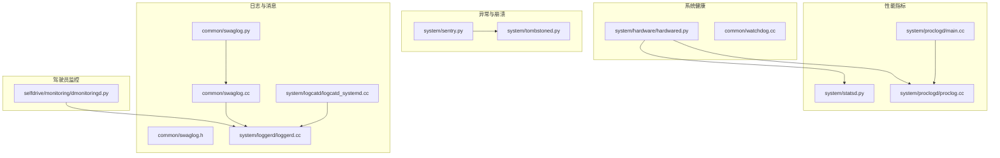
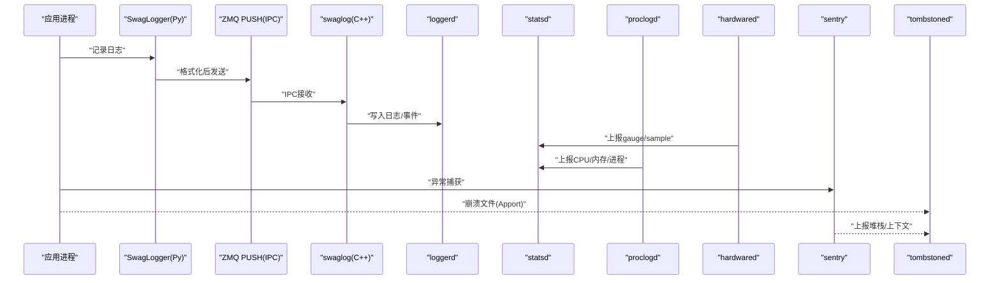
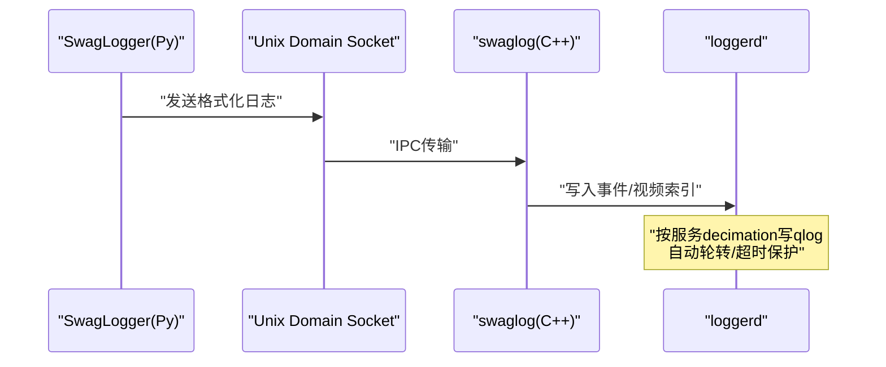
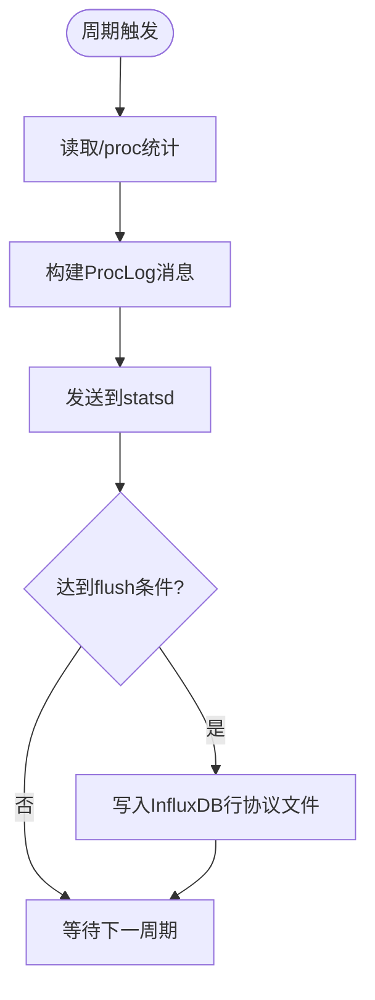
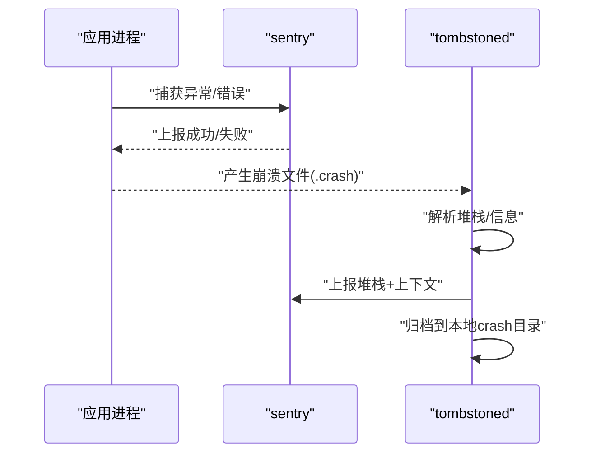
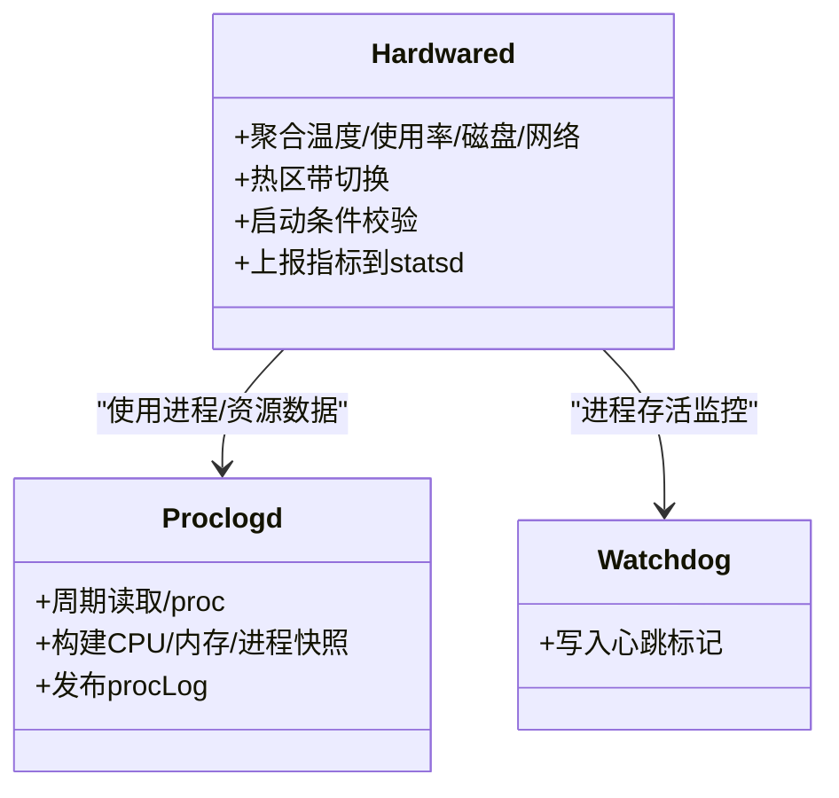
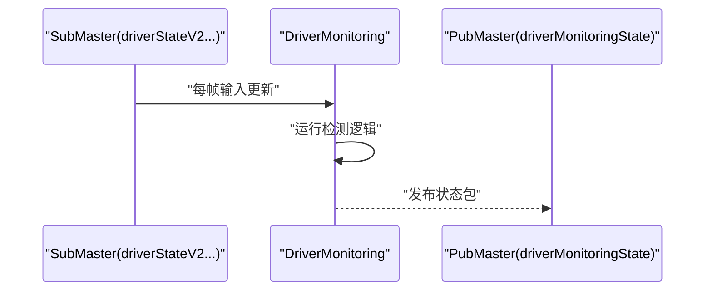
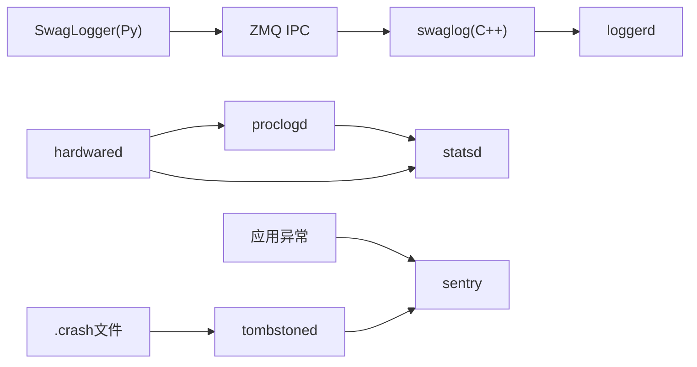

# 监控和维护

<cite>
**本文引用的文件**
- [system/loggerd/loggerd.cc](file://system/loggerd/loggerd.cc)
- [system/proclogd/main.cc](file://system/proclogd/main.cc)
- [system/proclogd/proclog.cc](file://system/proclogd/proclog.cc)
- [system/logcatd/logcatd_systemd.cc](file://system/logcatd/logcatd_systemd.cc)
- [system/statsd.py](file://system/statsd.py)
- [system/sentry.py](file://system/sentry.py)
- [system/tombstoned.py](file://system/tombstoned.py)
- [system/hardware/hardwared.py](file://system/hardware/hardwared.py)
- [common/swaglog.py](file://common/swaglog.py)
- [common/swaglog.cc](file://common/swaglog.cc)
- [common/swaglog.h](file://common/swaglog.h)
- [common/logging_extra.py](file://common/logging_extra.py)
- [common/watchdog.cc](file://common/watchdog.cc)
- [selfdrive/monitoring/dmonitoringd.py](file://selfdrive/monitoring/dmonitoringd.py)
- [traffic_analysis_00000021--81e4f7bb0c.json](file://traffic_analysis_00000021--81e4f7bb0c.json)
</cite>

## 目录
1. [简介](#简介)
2. [项目结构](#项目结构)
3. [核心组件](#核心组件)
4. [架构总览](#架构总览)
5. [详细组件分析](#详细组件分析)
6. [依赖分析](#依赖分析)
7. [性能考量](#性能考量)
8. [故障排查指南](#故障排查指南)
9. [结论](#结论)
10. [附录](#附录)

## 简介
本运维文档聚焦于监控与维护模块，覆盖日志采集、性能指标监控、异常检测、进程与资源统计、系统健康检查、错误报告与调试工具、性能分析与profiling实践，以及监控配置、告警规则与维护流程。文档以代码库为依据，结合具体实现路径，既便于初学者理解，也为有经验的开发者提供技术深度。

## 项目结构
监控与维护相关的关键目录与文件：
- 日志与消息：common/swaglog.*、system/loggerd/loggerd.cc、system/logcatd/logcatd_systemd.cc
- 性能指标：system/statsd.py、system/proclogd/*
- 异常与崩溃：system/sentry.py、system/tombstoned.py
- 系统健康：system/hardware/hardwared.py、common/watchdog.cc
- 驾驶员监控：selfdrive/monitoring/dmonitoringd.py

图表来源
- [common/swaglog.py:126-145](file://common/swaglog.py#L126-L145)
- [common/swaglog.cc:1-41](file://common/swaglog.cc#L1-L41)
- [system/loggerd/loggerd.cc:220-359](file://system/loggerd/loggerd.cc#L220-L359)
- [system/logcatd/logcatd_systemd.cc:15-76](file://system/logcatd/logcatd_systemd.cc#L15-L76)
- [system/statsd.py:63-184](file://system/statsd.py#L63-L184)
- [system/proclogd/main.cc:10-26](file://system/proclogd/main.cc#L10-L26)
- [system/proclogd/proclog.cc:160-240](file://system/proclogd/proclog.cc#L160-L240)
- [system/sentry.py:45-75](file://system/sentry.py#L45-L75)
- [system/tombstoned.py:143-177](file://system/tombstoned.py#L143-L177)
- [system/hardware/hardwared.py:192-476](file://system/hardware/hardwared.py#L192-L476)
- [common/watchdog.cc:9-12](file://common/watchdog.cc#L9-L12)
- [selfdrive/monitoring/dmonitoringd.py:8-52](file://selfdrive/monitoring/dmonitoringd.py#L8-L52)

章节来源
- [common/swaglog.py:126-145](file://common/swaglog.py#L126-L145)
- [system/loggerd/loggerd.cc:220-359](file://system/loggerd/loggerd.cc#L220-L359)
- [system/proclogd/main.cc:10-26](file://system/proclogd/main.cc#L10-L26)
- [system/statsd.py:63-184](file://system/statsd.py#L63-L184)
- [system/hardware/hardwared.py:192-476](file://system/hardware/hardwared.py#L192-L476)

## 核心组件
- 日志系统：Python侧SwagLogger与C++侧swaglog IPC通道，统一格式化与转发，支持文件回退写入。
- 日志采集器：loggerd负责订阅消息流、按需转码/写盘、自动分段轮转；logcatd从systemd journal采集并发布。
- 性能指标：statsd聚合gauge/sample指标并落盘；proclogd周期性构建CPU/内存/进程快照。
- 异常与崩溃：sentry集成上报；tombstoned扫描Apport崩溃并上报。
- 系统健康：hardwared聚合温度、CPU/GPU使用率、磁盘空间、网络状态等，驱动热区管理与启动条件。
- 驾驶员监控：dmonitoringd基于模型输出进行注意力检测并发布状态包。

章节来源
- [common/swaglog.py:126-145](file://common/swaglog.py#L126-L145)
- [common/swaglog.cc:91-155](file://common/swaglog.cc#L91-L155)
- [system/loggerd/loggerd.cc:220-359](file://system/loggerd/loggerd.cc#L220-L359)
- [system/logcatd/logcatd_systemd.cc:15-76](file://system/logcatd/logcatd_systemd.cc#L15-L76)
- [system/statsd.py:25-61](file://system/statsd.py#L25-L61)
- [system/proclogd/proclog.cc:160-240](file://system/proclogd/proclog.cc#L160-L240)
- [system/sentry.py:30-75](file://system/sentry.py#L30-L75)
- [system/tombstoned.py:61-177](file://system/tombstoned.py#L61-L177)
- [system/hardware/hardwared.py:192-476](file://system/hardware/hardwared.py#L192-L476)
- [selfdrive/monitoring/dmonitoringd.py:8-52](file://selfdrive/monitoring/dmonitoringd.py#L8-L52)

## 架构总览
监控与维护的整体数据流如下：

图表来源
- [common/swaglog.py:126-145](file://common/swaglog.py#L126-L145)
- [common/swaglog.cc:18-41](file://common/swaglog.cc#L18-L41)
- [system/loggerd/loggerd.cc:220-359](file://system/loggerd/loggerd.cc#L220-L359)
- [system/statsd.py:63-184](file://system/statsd.py#L63-L184)
- [system/proclogd/main.cc:10-26](file://system/proclogd/main.cc#L10-L26)
- [system/sentry.py:30-75](file://system/sentry.py#L30-L75)
- [system/tombstoned.py:143-177](file://system/tombstoned.py#L143-L177)

## 详细组件分析

### 日志系统与日志采集
- Python日志：SwagLogger封装，支持上下文绑定、事件记录、文件回退写入与Unix域套接字转发至C++侧。
- C++日志：建立ZMQ PUSH连接，按级别与时间戳格式化消息，支持环境变量控制本地打印级别。
- loggerd：订阅服务消息，按decimation频率写入qlog，视频编码数据写入视频文件并同步索引；具备自动轮转与超时保护。
- logcatd：从systemd journal读取日志，解析键值对，封装为androidLog消息发布。

图表来源
- [common/swaglog.py:126-145](file://common/swaglog.py#L126-L145)
- [common/swaglog.cc:18-41](file://common/swaglog.cc#L18-L41)
- [system/loggerd/loggerd.cc:220-359](file://system/loggerd/loggerd.cc#L220-L359)

章节来源
- [common/swaglog.py:126-145](file://common/swaglog.py#L126-L145)
- [common/swaglog.cc:91-155](file://common/swaglog.cc#L91-L155)
- [system/loggerd/loggerd.cc:220-359](file://system/loggerd/loggerd.cc#L220-L359)
- [system/logcatd/logcatd_systemd.cc:15-76](file://system/logcatd/logcatd_systemd.cc#L15-L76)

### 性能指标与统计
- statsd：定义gauge/sample两类指标，接收端聚合后以InfluxDB行协议写入本地文件，按启动状态与时间窗口flush。
- proclogd：周期性读取/proc，解析CPU时间片、内存、进程状态，构造ProcLog消息，供statsd与UI使用。
- hardwared：周期性汇总CPU/GPU/内存使用率、温度、磁盘空间、网络状态，驱动热区管理与启动条件，并上报多类指标。

图表来源
- [system/proclogd/proclog.cc:160-240](file://system/proclogd/proclog.cc#L160-L240)
- [system/statsd.py:63-184](file://system/statsd.py#L63-L184)
- [system/proclogd/main.cc:10-26](file://system/proclogd/main.cc#L10-L26)
- [system/hardware/hardwared.py:433-451](file://system/hardware/hardwared.py#L433-L451)

章节来源
- [system/statsd.py:25-61](file://system/statsd.py#L25-L61)
- [system/proclogd/proclog.cc:160-240](file://system/proclogd/proclog.cc#L160-L240)
- [system/hardware/hardwared.py:433-451](file://system/hardware/hardwared.py#L433-L451)

### 异常检测与错误报告
- 异常捕获：统一调用sentry捕获异常并打点，同时标记CarrotException参数。
- 崩溃上报：tombstoned扫描Apport崩溃文件，提取堆栈与关键信息，上报至Sentry并归档到本地crash目录。
- 崩溃文件处理：限制大小、清理无关段、生成唯一文件名、复制到上传目录并尝试删除原文件。

图表来源
- [system/sentry.py:30-75](file://system/sentry.py#L30-L75)
- [system/tombstoned.py:61-177](file://system/tombstoned.py#L61-L177)

章节来源
- [system/sentry.py:30-75](file://system/sentry.py#L30-L75)
- [system/tombstoned.py:61-177](file://system/tombstoned.py#L61-L177)

### 系统健康检查与进程监控
- 硬件状态：hardwared聚合温度、CPU/GPU/内存使用、磁盘空间、网络状态、NVMe/Modem温度、风扇目标转速等，驱动热区带切换与启动阻塞逻辑。
- 进程监控：proclogd周期性读取/proc，构建进程快照（PID、状态、线程数、RSS、命令行等），用于资源统计与异常定位。
- 看门狗：通过写共享内存文件标记心跳，便于外部监控进程判断存活。

图表来源
- [system/hardware/hardwared.py:192-476](file://system/hardware/hardwared.py#L192-L476)
- [system/proclogd/proclog.cc:160-240](file://system/proclogd/proclog.cc#L160-L240)
- [common/watchdog.cc:9-12](file://common/watchdog.cc#L9-L12)

章节来源
- [system/hardware/hardwared.py:192-476](file://system/hardware/hardwared.py#L192-L476)
- [system/proclogd/proclog.cc:160-240](file://system/proclogd/proclog.cc#L160-L240)
- [common/watchdog.cc:9-12](file://common/watchdog.cc#L9-L12)

### 驾驶员监控
- dmonitoringd：订阅driverStateV2等输入，按帧运行DriverMonitoring逻辑，发布driverMonitoringState，支持常开与右舵检测保存。

图表来源
- [selfdrive/monitoring/dmonitoringd.py:8-52](file://selfdrive/monitoring/dmonitoringd.py#L8-L52)

章节来源
- [selfdrive/monitoring/dmonitoringd.py:8-52](file://selfdrive/monitoring/dmonitoringd.py#L8-L52)

## 依赖分析
- 日志链路：Python日志经ZMQ IPC到C++，再由loggerd写入事件/视频索引，最终由statsd聚合指标。
- 性能链路：proclogd与hardwared分别从/proc与硬件接口获取数据，统一上报statsd。
- 健康链路：hardwared根据温度与启动条件决定是否允许上电/上路，并通过statsd上报关键指标。
- 异常链路：应用异常交由sentry上报，崩溃文件由tombstoned扫描并二次上报。

图表来源
- [common/swaglog.py:126-145](file://common/swaglog.py#L126-L145)
- [common/swaglog.cc:18-41](file://common/swaglog.cc#L18-L41)
- [system/loggerd/loggerd.cc:220-359](file://system/loggerd/loggerd.cc#L220-L359)
- [system/proclogd/proclog.cc:160-240](file://system/proclogd/proclog.cc#L160-L240)
- [system/statsd.py:63-184](file://system/statsd.py#L63-L184)
- [system/sentry.py:30-75](file://system/sentry.py#L30-L75)
- [system/tombstoned.py:143-177](file://system/tombstoned.py#L143-L177)

章节来源
- [common/swaglog.py:126-145](file://common/swaglog.py#L126-L145)
- [system/statsd.py:63-184](file://system/statsd.py#L63-L184)
- [system/hardware/hardwared.py:433-451](file://system/hardware/hardwared.py#L433-L451)

## 性能考量
- 日志吞吐：loggerd在高流量服务上会打印“大流量”警告，建议关注高频服务的decimation策略与队列长度阈值。
- IPC与磁盘：日志先走IPC再落盘，避免阻塞主线程；注意IPC队列满导致丢弃的情况。
- 指标聚合：statsd按启动状态与时间窗口flush，避免磁盘写入压力过大；建议合理设置flush间隔与样本缓冲。
- 进程扫描：/proc解析涉及大量文件读取，建议控制采样频率，避免对实时性造成影响。
- 热区管理：hardwared根据温度带动态调整行为，建议结合硬件特性优化热区边界与风扇策略。

## 故障排查指南
- 日志无法写入
  - 检查swaglog IPC连接是否可用，确认环境变量LOGPRINT级别与本地打印策略。
  - 若logmessaged未运行，确认文件回退写入是否启用。
  - 参考路径：[common/swaglog.py:126-145](file://common/swaglog.py#L126-L145)
- 日志轮转异常
  - 检查loggerd自动轮转条件（超时/无相机包/超长片段），必要时手动触发用户标志保留。
  - 参考路径：[system/loggerd/loggerd.cc:24-54](file://system/loggerd/loggerd.cc#L24-L54)
- 指标缺失
  - 确认proclogd与hardwared是否正常运行，检查statsd flush条件与磁盘空间。
  - 参考路径：[system/proclogd/main.cc:10-26](file://system/proclogd/main.cc#L10-L26)、[system/statsd.py:135-177](file://system/statsd.py#L135-L177)
- 崩溃未上报
  - 检查tombstoned是否初始化sentry、Apport目录是否存在且可读、文件大小限制。
  - 参考路径：[system/tombstoned.py:143-177](file://system/tombstoned.py#L143-L177)
- 热区过高/频繁降载
  - 检查温度带边界、风扇控制策略、启动阻塞条件，必要时降低负载或改善散热。
  - 参考路径：[system/hardware/hardwared.py:433-451](file://system/hardware/hardwared.py#L433-L451)

章节来源
- [common/swaglog.py:126-145](file://common/swaglog.py#L126-L145)
- [system/loggerd/loggerd.cc:24-54](file://system/loggerd/loggerd.cc#L24-L54)
- [system/proclogd/main.cc:10-26](file://system/proclogd/main.cc#L10-L26)
- [system/statsd.py:135-177](file://system/statsd.py#L135-L177)
- [system/tombstoned.py:143-177](file://system/tombstoned.py#L143-L177)
- [system/hardware/hardwared.py:433-451](file://system/hardware/hardwared.py#L433-L451)

## 结论
该监控与维护体系通过日志、指标、异常与健康检查四条主线协同工作：日志系统提供可观测性基础，性能指标与系统健康保障运行稳定，异常与崩溃上报完善故障闭环。配合合理的配置与维护流程，可在保证实时性的前提下实现高效运维。

## 附录

### 监控配置与告警规则建议
- 日志级别与回退：通过环境变量控制本地打印级别；启用文件回退写入以防IPC不可用。
- 自动轮转：基于时间与容量阈值，结合无相机包/超长片段的超时保护。
- 指标flush：按启动状态与固定时间窗口flush，避免磁盘写入峰值。
- 健康阈值：温度带边界、风扇目标转速、启动阻塞条件应结合硬件平台调优。
- 崩溃上报：确保Apport目录存在且可读，限制单文件大小，定期清理历史crash。

章节来源
- [common/swaglog.py:126-145](file://common/swaglog.py#L126-L145)
- [system/loggerd/loggerd.cc:24-54](file://system/loggerd/loggerd.cc#L24-L54)
- [system/statsd.py:135-177](file://system/statsd.py#L135-L177)
- [system/hardware/hardwared.py:433-451](file://system/hardware/hardwared.py#L433-L451)
- [system/tombstoned.py:143-177](file://system/tombstoned.py#L143-L177)

### 维护流程
- 日常巡检：检查日志轮转、指标文件增长、磁盘空间、温度与风扇状态。
- 异常处置：查看sentry事件与tombstoned归档，定位堆栈与上下文，修复后回归验证。
- 性能优化：调整/proc采样频率、优化高频服务decimation、优化热区带与风扇策略。
- 数据分析：利用路线与日志分析工具对典型场景进行复盘与优化。

章节来源
- [system/statsd.py:135-177](file://system/statsd.py#L135-L177)
- [system/hardware/hardwared.py:433-451](file://system/hardware/hardwared.py#L433-L451)
- [traffic_analysis_00000021--81e4f7bb0c.json:1-108](file://traffic_analysis_00000021--81e4f7bb0c.json#L1-L108)

### 性能分析与profiling
- Python性能：可使用标准库profile或pyprof2calltree等工具对关键模块进行采样与火焰图分析。
- C++性能：结合perf/valgrind/AddressSanitizer等工具定位热点与内存问题。
- 日志与指标：通过statsd与proclogd输出的数据进行趋势分析，识别异常波动。

章节来源
- [system/statsd.py:63-184](file://system/statsd.py#L63-L184)
- [system/proclogd/proclog.cc:160-240](file://system/proclogd/proclog.cc#L160-L240)