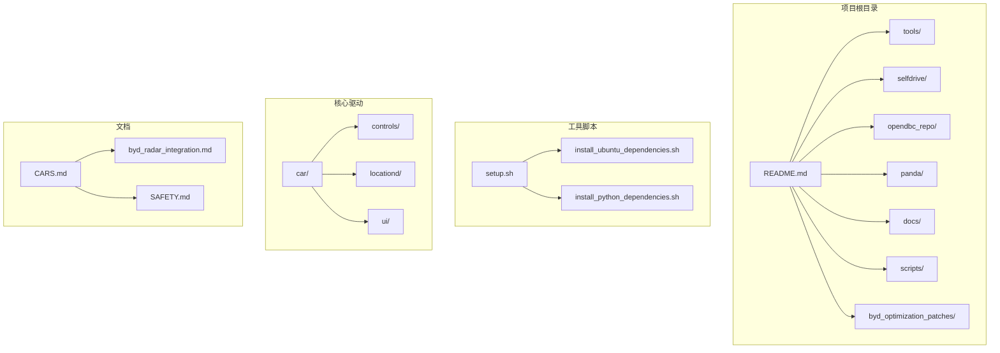
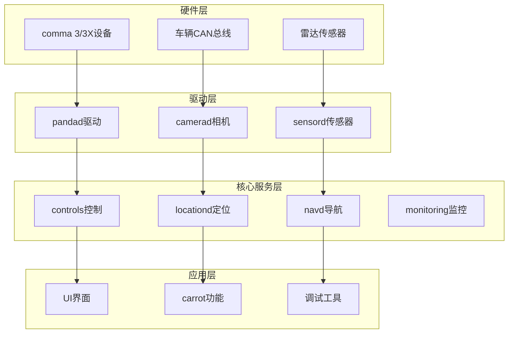
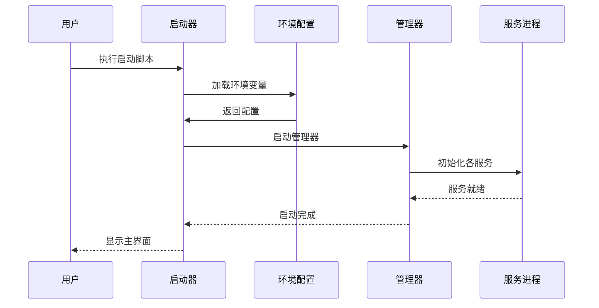
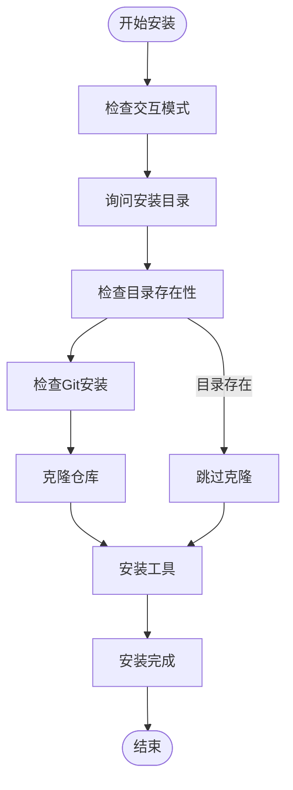
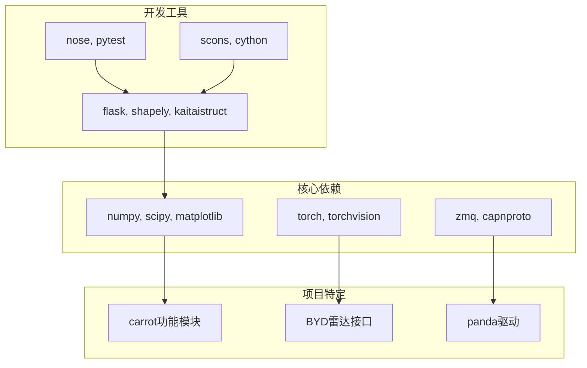

# 快速开始指南

<cite>
**本文档引用的文件**
- [README.md](file://README.md)
- [tools/setup.sh](file://tools/setup.sh)
- [tools/install_ubuntu_dependencies.sh](file://tools/install_ubuntu_dependencies.sh)
- [tools/install_python_dependencies.sh](file://tools/install_python_dependencies.sh)
- [launch_openpilot.sh](file://launch_openpilot.sh)
- [launch_env.sh](file://launch_env.sh)
- [launch_chffrplus.sh](file://launch_chffrplus.sh)
- [docs/CARS.md](file://docs/CARS.md)
- [docs/byd_radar_integration.md](file://docs/byd_radar_integration.md)
</cite>

## 目录
1. [简介](#简介)
2. [项目结构](#项目结构)
3. [核心组件](#核心组件)
4. [架构概览](#架构概览)
5. [详细组件分析](#详细组件分析)
6. [依赖关系分析](#依赖关系分析)
7. [性能考虑](#性能考虑)
8. [故障排除指南](#故障排除指南)
9. [结论](#结论)
10. [附录](#附录)

## 简介

Carrot2-v9-ACC项目是基于openpilot的自适应巡航控制系统增强版本，专门为BYD品牌车辆开发。该项目提供了完整的雷达数据集成、车辆控制算法优化和用户界面增强功能。

### 项目特点
- **BYD专用支持**: 完整的BYD车辆雷达数据集成
- **增强的ACC功能**: 改进的自适应巡航控制算法
- **多语言支持**: 韩语、简体中文、英语界面切换
- **硬件兼容性**: 支持comma 3/3X设备和多种车辆适配器

### 法律声明
⚠️ **重要法律提醒**: 根据韩国汽车管理法规定，修改或安装影响车辆安全运行的软件是被禁止的。本软件仅供研究和教育用途使用。

## 项目结构

Carrot2-v9-ACC项目采用模块化架构，主要包含以下核心目录：



**图表来源**
- [README.md:1-144](file://README.md#L1-L144)
- [tools/setup.sh:1-190](file://tools/setup.sh#L1-L190)

### 目录组织原则
- **按功能模块划分**: 每个子系统都有独立的目录结构
- **按层次组织**: 从底层硬件驱动到上层应用界面
- **文档分离**: 开发文档与源代码分离管理

**章节来源**
- [README.md:1-144](file://README.md#L1-L144)

## 核心组件

### 硬件要求

#### 设备要求
- **comma 3/3X**: 必需的车载计算设备
- **支持的车辆**: 275+种已支持的车辆型号
- **网络连接**: 稳定的互联网连接用于软件更新

#### 车辆适配器选择
根据车辆类型选择合适的适配器：

| 车辆类型 | 适配器类型 | 连接方式 |
|---------|-----------|----------|
| CAN通信车辆 | 官方comma适配器 | 连接到摄像头接口 |
| CAN FD标准车辆 | 官方comma适配器 | 连接到摄像头接口 |
| CAN FD带HDA2车辆 | 后市场适配器 | 连接到ADAS模块 |

**章节来源**
- [README.md:13-24](file://README.md#L13-L24)

### 软件依赖

#### 系统要求
- **操作系统**: Ubuntu 20.04/22.04/24.04
- **Python**: Python 3.8+
- **内存**: 至少8GB RAM
- **存储**: 至少50GB可用空间

#### Python包依赖
- **核心库**: numpy, scipy, matplotlib
- **机器学习**: torch, torchvision
- **通信**: zmq, capnproto
- **工具**: flask, shapely, kaitaistruct

**章节来源**
- [tools/install_python_dependencies.sh:1-45](file://tools/install_python_dependencies.sh#L1-L45)

## 架构概览

Carrot2-v9-ACC采用分层架构设计，从底层硬件抽象到上层应用服务：



**图表来源**
- [launch_chffrplus.sh:30-137](file://launch_chffrplus.sh#L30-L137)

### 启动流程



**图表来源**
- [launch_openpilot.sh:1-7](file://launch_openpilot.sh#L1-L7)
- [launch_env.sh:1-14](file://launch_env.sh#L1-L14)

## 详细组件分析

### 安装脚本分析

#### 主安装脚本 (tools/setup.sh)
该脚本提供了完整的自动化安装流程：



**图表来源**
- [tools/setup.sh:158-190](file://tools/setup.sh#L158-L190)

#### Ubuntu依赖安装 (tools/install_ubuntu_dependencies.sh)
该脚本负责安装所有必需的系统依赖：

**章节来源**
- [tools/setup.sh:1-190](file://tools/setup.sh#L1-L190)

### 环境配置

#### 启动环境脚本 (launch_env.sh)
配置运行时环境变量：

| 环境变量 | 默认值 | 作用 |
|---------|--------|------|
| OMP_NUM_THREADS | 1 | OpenMP线程数 |
| MKL_NUM_THREADS | 1 | Intel MKL线程数 |
| AGNOS_VERSION | 12.4 | AGNOS版本号 |
| STAGING_ROOT | /data/safe_staging | 更新存储路径 |

**章节来源**
- [launch_env.sh:1-14](file://launch_env.sh#L1-L14)

### BYD雷达集成

#### 雷达数据格式
BYD车辆使用原始雷达CAN消息格式：

| CAN ID范围 | 消息数量 | 字段含义 |
|-----------|----------|----------|
| 0x520-0x547 | 40个目标 | 目标距离、速度、角度、状态 |
| 0x250 | 1个状态 | 雷达工作状态、错误状态 |

**章节来源**
- [docs/byd_radar_integration.md:1-149](file://docs/byd_radar_integration.md#L1-L149)

## 依赖关系分析

### Python包依赖图



**图表来源**
- [tools/install_python_dependencies.sh:34-45](file://tools/install_python_dependencies.sh#L34-L45)

### 系统依赖关系

**章节来源**
- [tools/install_ubuntu_dependencies.sh:20-78](file://tools/install_ubuntu_dependencies.sh#L20-L78)

## 性能考虑

### 内存优化
- **线程数限制**: 将OpenMP/MKL线程数限制为1以避免性能下降
- **缓存管理**: 合理的Python包缓存策略
- **资源监控**: 实时监控内存使用情况

### 处理器要求
- **CPU**: 至少4核处理器
- **GPU**: 可选的GPU加速支持
- **I/O**: 高速SSD存储

## 故障排除指南

### 常见安装问题

#### Git相关问题
**问题**: Git未找到
**解决方案**: 
```bash
sudo apt-get update
sudo apt-get install git
```

**问题**: 网络连接超时
**解决方案**: 
```bash
export GIT_LFS_SKIP_SMUDGE=1
git clone --filter=blob:none https://github.com/commaai/openpilot.git
```

#### Python依赖问题
**问题**: uv安装失败
**解决方案**: 
```bash
# 手动安装uv
curl -LsSf https://astral.sh/uv/install.sh | sh
# 或使用pip安装
pip install uv
```

#### 权限问题
**问题**: 权限不足
**解决方案**: 
```bash
sudo chmod +x tools/*.sh
sudo usermod -aG plugdev $USER
sudo usermod -aG dialout $USER
```

### 硬件连接问题

#### comma 3/3X连接
1. **检查电源**: 确保设备指示灯正常
2. **USB连接**: 使用原装USB线连接到电脑
3. **网络配置**: 确保WiFi或以太网连接正常

#### 车辆适配器连接
1. **断电操作**: 连接前务必关闭车辆电源
2. **正确插拔**: 按箭头方向正确插入
3. **紧固检查**: 确保所有连接器紧固

### 车辆兼容性问题

#### 支持的车辆列表
使用以下命令查看支持的车辆：
```bash
python -m selfdrive.car.docs
```

#### 车辆识别失败
1. **检查CAN总线**: 确认CAN线连接正确
2. **DBC文件**: 验证DBC文件完整性
3. **固件版本**: 更新到最新固件版本

**章节来源**
- [docs/CARS.md:1-200](file://docs/CARS.md#L1-L200)

## 结论

Carrot2-v9-ACC项目为BYD车辆提供了完整的自适应巡航控制系统增强功能。通过模块化的架构设计和完善的安装脚本，用户可以快速部署和使用该系统。

### 主要优势
- **完整的BYD支持**: 专门针对BYD车辆的优化
- **易于安装**: 自动化安装脚本简化部署过程
- **多语言界面**: 支持韩语、中文、英语
- **实时雷达集成**: 高精度雷达数据处理

### 注意事项
- **法律合规**: 严格遵守当地法律法规
- **安全第一**: 在专业指导下进行硬件安装
- **定期更新**: 及时更新软件和固件版本

## 附录

### 快速安装命令

#### 完全自动化安装
```bash
bash <(curl -fsSL openpilot.comma.ai)
```

#### 手动安装步骤
```bash
# 1. 安装系统依赖
./tools/install_ubuntu_dependencies.sh

# 2. 安装Python依赖
./tools/install_python_dependencies.sh

# 3. 运行安装脚本
./tools/setup.sh

# 4. 启动系统
./launch_openpilot.sh
```

### 验证安装

#### 基本功能测试
1. **系统启动**: 确认设备正常启动
2. **网络连接**: 验证WiFi/以太网连接
3. **雷达检测**: 检查雷达数据接收
4. **车辆识别**: 确认车辆型号识别

#### 预期结果
- 设备屏幕显示主界面
- 系统状态栏显示"正在运行"
- 雷达数据显示正常
- 车辆信息正确识别

### 支持资源

#### 文档资源
- [官方文档](https://docs.comma.ai)
- [社区论坛](https://discord.comma.ai)
- [GitHub仓库](https://github.com/commaai/openpilot)

#### 技术支持
- **社区支持**: Discord服务器
- **文档支持**: GitHub Wiki
- **问题反馈**: GitHub Issues