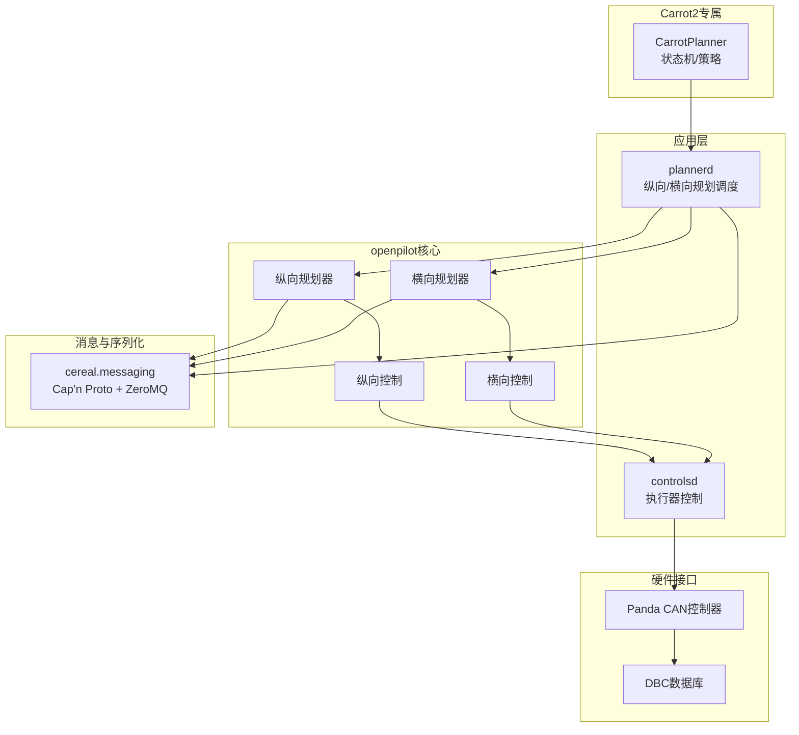
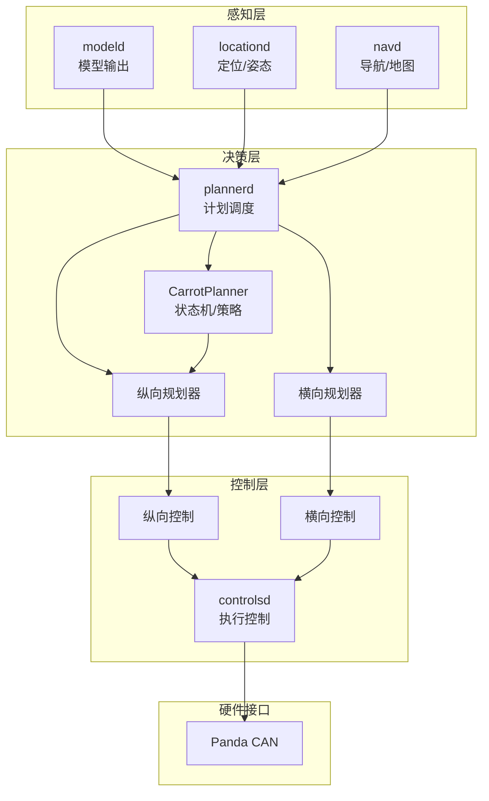
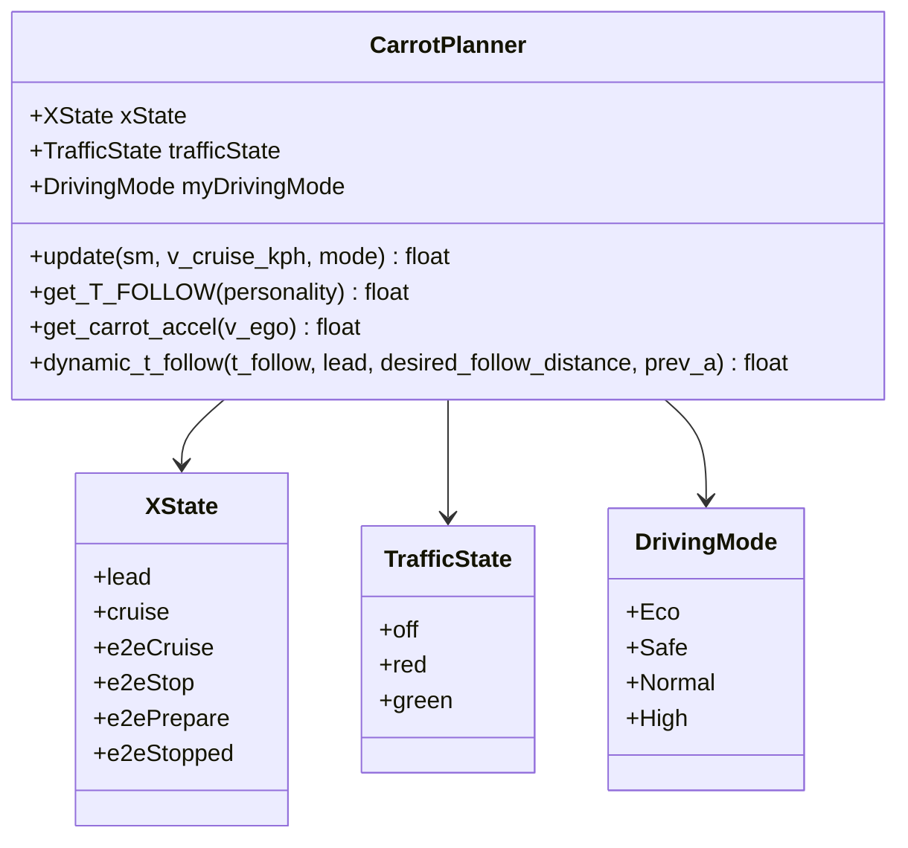
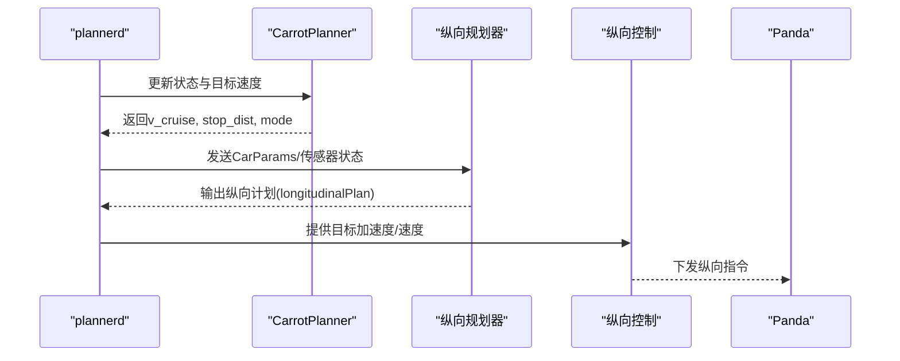
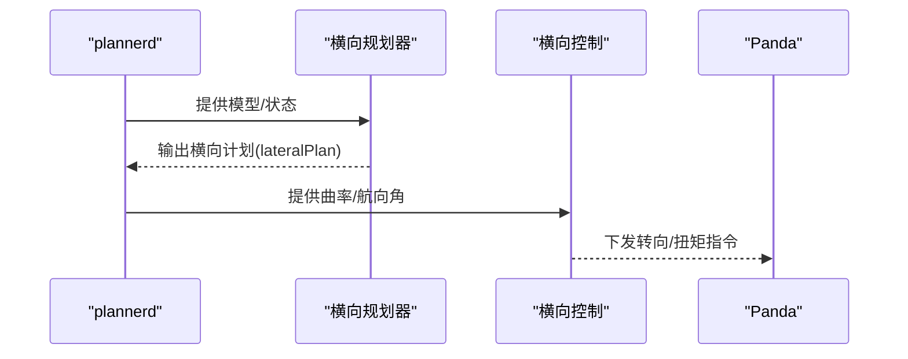
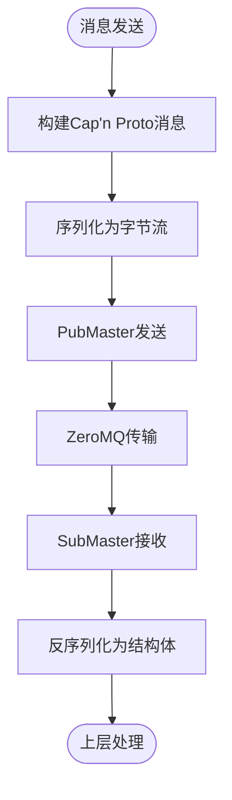
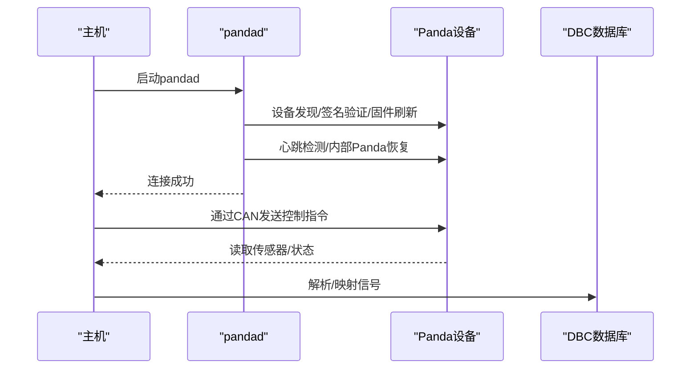
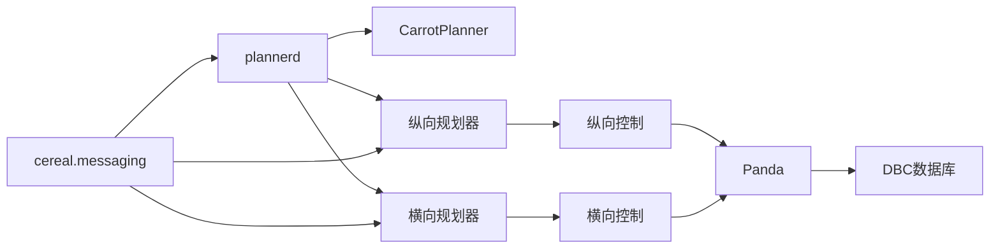

# 技术架构概览

<cite>
**本文引用的文件**
- [plannerd.py](file://selfdrive/controls/plannerd.py)
- [carrot_functions.py](file://selfdrive/carrot/carrot_functions.py)
- [longitudinal_planner.py](file://selfdrive/controls/lib/longitudinal_planner.py)
- [lateral_planner.py](file://selfdrive/controls/lib/lateral_planner.py)
- [longcontrol.py](file://selfdrive/controls/lib/longcontrol.py)
- [latcontrol_pid.py](file://selfdrive/controls/lib/latcontrol_pid.py)
- [controlsd.py](file://selfdrive/controls/controlsd.py)
- [__init__.py](file://cereal/messaging/__init__.py)
- [pandad.py](file://selfdrive/pandad/pandad.py)
- [README.md](file://README.md)
- [README_BYD_ANALYSIS.md](file://README_BYD_ANALYSIS.md)
- [final_enhanced_byd_han_with_ref.dbc](file://final_enhanced_byd_han_with_ref.dbc)
- [deep_signal_analysis.py](file://deep_signal_analysis.py)
- [uv.lock](file://uv.lock)
</cite>

## 目录
1. [简介](#简介)
2. [项目结构](#项目结构)
3. [核心组件](#核心组件)
4. [架构总览](#架构总览)
5. [详细组件分析](#详细组件分析)
6. [依赖关系分析](#依赖关系分析)
7. [性能考量](#性能考量)
8. [故障排查指南](#故障排查指南)
9. [结论](#结论)
10. [附录](#附录)

## 简介
本文件面向Carrot2-v9-ACC项目，提供基于openpilot的分层架构概览，重点覆盖感知层、决策层、控制层的职责分工；CarrotPlanner核心算法的状态机设计与控制策略实现；消息通信机制（ZeroMQ与Cap’n Proto）；与Panda CAN总线控制器的交互方式；以及系统模块间依赖关系与数据流。同时解释技术选型（Python的易用性与C/C++的性能考虑），并提供系统边界图与组件关系图，帮助开发者快速理解整体架构。

## 项目结构
Carrot2-v9-ACC在openpilot基础上扩展了自研纵向控制策略与状态机逻辑，并通过统一的消息总线与Panda控制器进行交互。主要目录与模块如下：
- selfdrive：openpilot核心运行时与各子系统
  - carrot：CarrotPlanner等Carrot2专属逻辑
  - controls：纵向/横向规划与控制
  - pandad：Panda固件管理与连接
  - modeld/locationd/navd：感知与定位
- cereal：消息与序列化基础设施（Cap’n Proto + ZeroMQ）
- opendbc：DBC数据库与CAN信号定义
- panda：Panda固件与驱动（C/C++）
- tools：分析与验证脚本

图表来源
- [plannerd.py:13-28](file://selfdrive/controls/plannerd.py#L13-L28)
- [carrot_functions.py:49-521](file://selfdrive/carrot/carrot_functions.py#L49-L521)
- [longitudinal_planner.py:162-283](file://selfdrive/controls/lib/longitudinal_planner.py#L162-L283)
- [lateral_planner.py:34-221](file://selfdrive/controls/lib/lateral_planner.py#L34-L221)
- [longcontrol.py:73-99](file://selfdrive/controls/lib/longcontrol.py#L73-L99)
- [latcontrol_pid.py:1-29](file://selfdrive/controls/lib/latcontrol_pid.py#L1-L29)
- [__init__.py:138-261](file://cereal/messaging/__init__.py#L138-L261)
- [pandad.py:64-180](file://selfdrive/pandad/pandad.py#L64-L180)

章节来源
- [plannerd.py:1-28](file://selfdrive/controls/plannerd.py#L1-L28)
- [README.md:1-144](file://README.md#L1-L144)

## 核心组件
- CarrotPlanner：纵向控制策略与状态机，负责根据模型输出、雷达状态、交通信号等更新目标速度与停止距离，驱动纵向规划器。
- 纵向规划器/控制：基于模型预测控制（MPC）与PID，计算纵向轨迹与加速度指令。
- 横向规划器/控制：基于车辆动力学模型与路径规划，计算航向角与曲率指令。
- 消息系统：cereal.messaging封装Cap’n Proto消息与ZeroMQ传输，提供Pub/Sub与频率/存活检查。
- Panda控制器：负责CAN通信与安全逻辑，通过USB/DFU与主机交互。

章节来源
- [carrot_functions.py:49-521](file://selfdrive/carrot/carrot_functions.py#L49-L521)
- [longitudinal_planner.py:162-283](file://selfdrive/controls/lib/longitudinal_planner.py#L162-L283)
- [lateral_planner.py:34-221](file://selfdrive/controls/lib/lateral_planner.py#L34-L221)
- [longcontrol.py:73-99](file://selfdrive/controls/lib/longcontrol.py#L73-L99)
- [latcontrol_pid.py:1-29](file://selfdrive/controls/lib/latcontrol_pid.py#L1-L29)
- [__init__.py:138-261](file://cereal/messaging/__init__.py#L138-L261)
- [pandad.py:64-180](file://selfdrive/pandad/pandad.py#L64-L180)

## 架构总览
Carrot2-v9-ACC采用openpilot的分层架构：
- 感知层：modeld/locationd/navd提供视觉/定位/地图能力，输出模型与位置信息。
- 决策层：plannerd聚合感知与状态，调用CarrotPlanner与传统规划器，生成纵向/横向计划。
- 控制层：controlsd读取计划，结合PID/LQR等控制算法，下发到Panda执行。

图表来源
- [plannerd.py:13-28](file://selfdrive/controls/plannerd.py#L13-L28)
- [carrot_functions.py:346-521](file://selfdrive/carrot/carrot_functions.py#L346-L521)
- [longitudinal_planner.py:162-283](file://selfdrive/controls/lib/longitudinal_planner.py#L162-L283)
- [lateral_planner.py:85-221](file://selfdrive/controls/lib/lateral_planner.py#L85-L221)
- [controlsd.py:1-33](file://selfdrive/controls/controlsd.py#L1-L33)

## 详细组件分析

### CarrotPlanner：状态机与控制策略
CarrotPlanner是Carrot2纵向控制的核心，包含以下要点：
- 状态机：XState枚举涵盖跟随、巡航、端到端巡航/停止/准备等状态，依据交通信号、雷达状态、用户输入动态切换。
- 交通信号与红绿灯：TrafficState与模型输出联动，支持“停止-启动”逻辑与左转引导触发。
- 动态跟车距离：基于速度、加速度、前车距离与动态参数，计算期望跟车时间间隔与舒适刹车率。
- 驾驶模式：根据拥堵检测与用户设置，自动选择经济/安全/正常/高性能模式，影响最大加速度与舒适刹车。
- 事件系统：通过Events上报交通信号变化、启动/停止事件等。

图表来源
- [carrot_functions.py:15-44](file://selfdrive/carrot/carrot_functions.py#L15-L44)
- [carrot_functions.py:49-521](file://selfdrive/carrot/carrot_functions.py#L49-L521)

章节来源
- [carrot_functions.py:15-44](file://selfdrive/carrot/carrot_functions.py#L15-L44)
- [carrot_functions.py:49-521](file://selfdrive/carrot/carrot_functions.py#L49-L521)

### 纵向规划与控制流程
纵向规划器根据CarrotPlanner提供的目标速度与约束，结合MPC求解速度/加速度/急动率轨迹；纵向控制通过PID实现对目标加速度的跟踪，并处理软保持、停止加速度等参数。

图表来源
- [plannerd.py:13-28](file://selfdrive/controls/plannerd.py#L13-L28)
- [carrot_functions.py:346-521](file://selfdrive/carrot/carrot_functions.py#L346-L521)
- [longitudinal_planner.py:162-283](file://selfdrive/controls/lib/longitudinal_planner.py#L162-L283)
- [longcontrol.py:73-99](file://selfdrive/controls/lib/longcontrol.py#L73-L99)

章节来源
- [plannerd.py:13-28](file://selfdrive/controls/plannerd.py#L13-L28)
- [longitudinal_planner.py:162-283](file://selfdrive/controls/lib/longitudinal_planner.py#L162-L283)
- [longcontrol.py:73-99](file://selfdrive/controls/lib/longcontrol.py#L73-L99)

### 横向规划与控制流程
横向规划器基于车道线/模型路径与当前速度，计算航向角与曲率；横向控制采用PID/角度/扭矩策略，抑制低速振荡并提升直路稳定性。

图表来源
- [lateral_planner.py:85-221](file://selfdrive/controls/lib/lateral_planner.py#L85-L221)
- [latcontrol_pid.py:1-29](file://selfdrive/controls/lib/latcontrol_pid.py#L1-L29)

章节来源
- [lateral_planner.py:34-221](file://selfdrive/controls/lib/lateral_planner.py#L34-L221)
- [latcontrol_pid.py:1-29](file://selfdrive/controls/lib/latcontrol_pid.py#L1-L29)

### 消息通信机制：ZeroMQ与Cap’n Proto
- Cap’n Proto：用于高效序列化openpilot消息结构（如Event、car、log等），支持跨语言与高性能。
- ZeroMQ：作为底层传输层，提供发布/订阅与轮询机制，配合cereal.messaging实现跨进程通信。
- PubMaster/SubMaster：封装发布/订阅与频率/存活检查，确保服务健康与数据一致性。

图表来源
- [__init__.py:30-43](file://cereal/messaging/__init__.py#L30-L43)
- [__init__.py:238-261](file://cereal/messaging/__init__.py#L238-L261)
- [__init__.py:138-236](file://cereal/messaging/__init__.py#L138-L236)

章节来源
- [__init__.py:1-261](file://cereal/messaging/__init__.py#L1-L261)

### 与Panda CAN总线控制器的交互
- pandad：负责Panda设备发现、固件签名验证与刷新、心跳检测与内部Panda恢复；随后启动pandad进程与设备通信。
- Panda：通过USB/DFU与主机交互，执行CAN收发与安全逻辑（C语言实现，符合ISO26262）。
- DBC：定义CAN信号语义，Carrot2-v9-ACC使用BYD汉DM-i的增强DBC文件，支持高精度转向与ADAS信号。

图表来源
- [pandad.py:64-180](file://selfdrive/pandad/pandad.py#L64-L180)
- [README_BYD_ANALYSIS.md:40-71](file://README_BYD_ANALYSIS.md#L40-L71)
- [final_enhanced_byd_han_with_ref.dbc:503-536](file://final_enhanced_byd_han_with_ref.dbc#L503-L536)
- [deep_signal_analysis.py:280-307](file://deep_signal_analysis.py#L280-L307)

章节来源
- [pandad.py:64-180](file://selfdrive/pandad/pandad.py#L64-L180)
- [README_BYD_ANALYSIS.md:40-71](file://README_BYD_ANALYSIS.md#L40-L71)
- [final_enhanced_byd_han_with_ref.dbc:503-536](file://final_enhanced_byd_han_with_ref.dbc#L503-L536)
- [deep_signal_analysis.py:280-307](file://deep_signal_analysis.py#L280-L307)

## 依赖关系分析
- Python生态：依赖pyzmq、pycapnp等，支撑消息与序列化；Cython加速部分计算。
- C/C++生态：panda固件与底层驱动（C/C++），保证实时性与安全性。
- 组件耦合：plannerd与CarrotPlanner强耦合，纵向/横向规划器与控制器松耦合，通过消息总线解耦。

图表来源
- [plannerd.py:13-28](file://selfdrive/controls/plannerd.py#L13-L28)
- [carrot_functions.py:49-521](file://selfdrive/carrot/carrot_functions.py#L49-L521)
- [longitudinal_planner.py:162-283](file://selfdrive/controls/lib/longitudinal_planner.py#L162-L283)
- [lateral_planner.py:85-221](file://selfdrive/controls/lib/lateral_planner.py#L85-L221)
- [longcontrol.py:73-99](file://selfdrive/controls/lib/longcontrol.py#L73-L99)
- [latcontrol_pid.py:1-29](file://selfdrive/controls/lib/latcontrol_pid.py#L1-L29)
- [__init__.py:138-261](file://cereal/messaging/__init__.py#L138-L261)
- [pandad.py:64-180](file://selfdrive/pandad/pandad.py#L64-L180)

章节来源
- [uv.lock:1246-1285](file://uv.lock#L1246-L1285)
- [__init__.py:1-261](file://cereal/messaging/__init__.py#L1-L261)

## 性能考量
- Python用于快速原型与业务逻辑（如CarrotPlanner状态机、参数管理），具备高开发效率与可维护性。
- C/C++用于底层实时控制与安全逻辑（如Panda固件），满足确定性与可靠性要求。
- 消息总线采用ZeroMQ+Cap’n Proto，兼顾跨语言与高性能序列化。
- 通过频率/存活检查与参数缓存，降低CPU占用与抖动。

[本节为通用指导，无需特定文件引用]

## 故障排查指南
- Panda连接问题：检查pandad日志与固件签名，确认内部Panda恢复与心跳丢失告警。
- 消息异常：检查SubMaster/PubMaster的alive/freq_ok/valid状态，定位丢包或频率异常。
- 参数不生效：确认Params键值与读取周期，关注CarrotPlanner参数更新计数。
- CAN信号异常：核对DBC文件与信号解析，验证BYD汉DM-i增强DBC配置。

章节来源
- [pandad.py:142-168](file://selfdrive/pandad/pandad.py#L142-L168)
- [__init__.py:192-236](file://cereal/messaging/__init__.py#L192-L236)
- [carrot_functions.py:143-184](file://selfdrive/carrot/carrot_functions.py#L143-L184)
- [README_BYD_ANALYSIS.md:40-71](file://README_BYD_ANALYSIS.md#L40-L71)

## 结论
Carrot2-v9-ACC在openpilot之上，通过CarrotPlanner引入了面向实际道路的纵向状态机与控制策略，结合Cap’n Proto与ZeroMQ实现高效消息通信，并通过Panda完成安全可靠的CAN控制。Python与C/C++的合理分工，既保证了开发效率，也满足了实时性与安全性需求。建议在后续迭代中持续完善参数化与测试覆盖，确保不同场景下的鲁棒性。

[本节为总结性内容，无需特定文件引用]

## 附录
- 系统边界：感知层（modeld/locationd/navd）、决策层（plannerd/CarrotPlanner）、控制层（controlsd/纵向/横向控制）、硬件层（Panda/DBC）。
- 关键流程：状态机驱动的纵向控制、横向路径与曲率规划、消息总线与Panda交互。

[本节为概念性内容，无需特定文件引用]