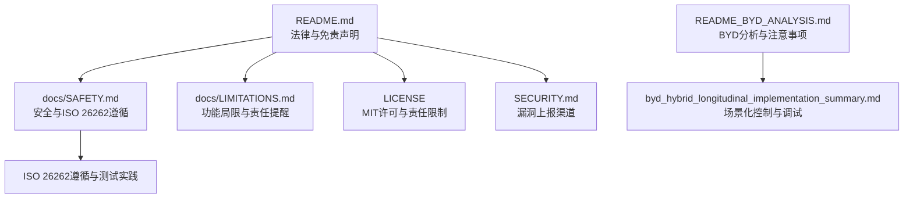
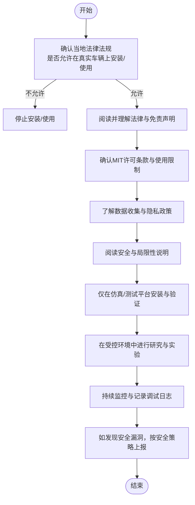
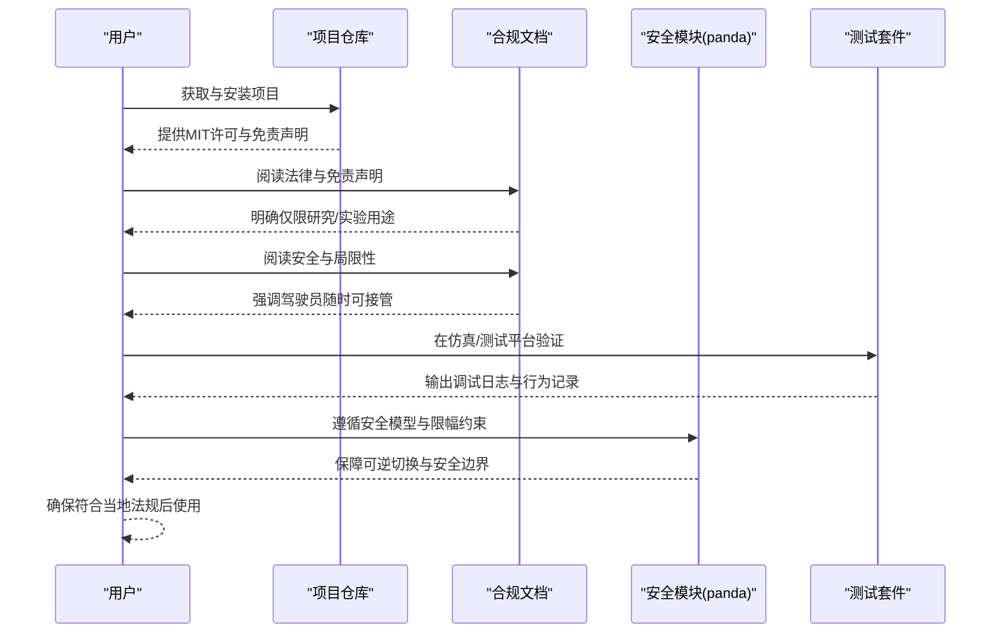

# 法律合规性

<cite>
**本文引用的文件**
- [README.md](file://README.md)
- [LICENSE](file://LICENSE)
- [SECURITY.md](file://SECURITY.md)
- [docs/SAFETY.md](file://docs/SAFETY.md)
- [docs/LIMITATIONS.md](file://docs/LIMITATIONS.md)
- [README_BYD_ANALYSIS.md](file://README_BYD_ANALYSIS.md)
- [byd_hybrid_longitudinal_implementation_summary.md](file://byd_hybrid_longitudinal_implementation_summary.md)
</cite>

## 目录
1. [引言](#引言)
2. [项目结构与合规性相关要点](#项目结构与合规性相关要点)
3. [核心合规要素](#核心合规要素)
4. [架构与流程图](#架构与流程图)
5. [组件与流程详解](#组件与流程详解)
6. [依赖关系与合规边界](#依赖关系与合规边界)
7. [性能与可靠性考量](#性能与可靠性考量)
8. [故障排查与合规提示](#故障排查与合规提示)
9. [结论](#结论)
10. [附录：关键条款与最佳实践对照](#附录关键条款与最佳实践对照)

## 引言
本文件面向Carrot2-v9-ACC项目使用者与贡献者，系统梳理与本项目相关的法律合规要求与免责声明，重点围绕以下方面展开：
- 韩国汽车管理法修订案对“修改或安装影响车辆安全运行的软件”的禁止性规定及项目仅限研究与实验目的使用的声明。
- 开源许可证MIT License的含义、权利与义务边界。
- 数据收集与隐私保护政策，包括数据类型、处理方式与用户权利。
- 安全相关ISO 26262标准的遵循情况与项目中的安全实践。
- 合规使用建议与最佳实践，以及用户需遵守当地法律法规的责任。

## 项目结构与合规性相关要点
- 项目主体README中明确标注“仅限研究与实验目的”“不承担现实安装或使用引发的法律责任”，并提示依据韩国汽车管理法修订案进行限制。
- 文档目录包含安全与局限性说明，体现对功能安全与使用边界的关注。
- BYD相关分析与实现文档体现了对信号定义、场景化控制与调试日志的重视，有助于在合规前提下开展研究与验证。

图表来源
- [README.md:1-33](file://README.md#L1-L33)
- [docs/SAFETY.md:1-37](file://docs/SAFETY.md#L1-L37)
- [docs/LIMITATIONS.md:1-59](file://docs/LIMITATIONS.md#L1-L59)
- [LICENSE:1-8](file://LICENSE#L1-L8)
- [SECURITY.md:1-6](file://SECURITY.md#L1-L6)
- [README_BYD_ANALYSIS.md:1-71](file://README_BYD_ANALYSIS.md#L1-L71)
- [byd_hybrid_longitudinal_implementation_summary.md:1-142](file://byd_hybrid_longitudinal_implementation_summary.md#L1-L142)

章节来源
- [README.md:1-33](file://README.md#L1-L33)
- [docs/SAFETY.md:1-37](file://docs/SAFETY.md#L1-L37)
- [docs/LIMITATIONS.md:1-59](file://docs/LIMITATIONS.md#L1-L59)
- [LICENSE:1-8](file://LICENSE#L1-L8)
- [SECURITY.md:1-6](file://SECURITY.md#L1-L6)
- [README_BYD_ANALYSIS.md:1-71](file://README_BYD_ANALYSIS.md#L1-L71)
- [byd_hybrid_longitudinal_implementation_summary.md:1-142](file://byd_hybrid_longitudinal_implementation_summary.md#L1-L142)

## 核心合规要素
- 韩国汽车管理法修订案与项目用途限制
  - 项目明确：仅限研究、实验、仿真目的；禁止对真实车辆进行修改或安装影响安全运行的软件；开发者不承担现实安装或使用引发的法律责任。
  - 用户须自行确保符合当地法律法规，并对自身行为负责。
- 开源许可证MIT License
  - 许可证允许使用、复制、修改、合并、出版发行、分发、再许可及销售软件及其文档，但需保留版权与许可声明；软件按“现状”提供，无任何明示或暗示担保；在任何情况下，作者或版权持有人均不对因使用本软件而引起的任何索赔、损害或其他责任负责。
- 数据收集与隐私保护
  - 默认上传驾驶数据；用户可选择禁用数据收集；日志包含车载摄像头、CAN、GPS、IMU、磁力计、热传感器、崩溃与系统日志；驾驶员摄像头仅在用户明确同意时记录；不录音频。
  - 使用即表示同意隐私政策，授予不可撤销、永久、全球范围的使用权。
- 安全与ISO 26262遵循
  - 项目遵循ISO 26262指南，实施软件/硬件在环测试与车辆内测试；强调驾驶员随时可接管控制；Actuator限幅与反应时间约束；强烈不鼓励使用缺失或未满足上述要求的安全代码的分支版本。
- 合规使用建议与免责声明
  - 严格限定在研究与实验场景；不得用于真实道路行驶；必须遵守当地法律法规；对任何直接或间接损失不承担责任。

章节来源
- [README.md:1-33](file://README.md#L1-L33)
- [README.md:122-144](file://README.md#L122-L144)
- [LICENSE:1-8](file://LICENSE#L1-L8)
- [docs/SAFETY.md:14-35](file://docs/SAFETY.md#L14-L35)
- [docs/LIMITATIONS.md:1-59](file://docs/LIMITATIONS.md#L1-L59)

## 架构与流程图
本节以“合规使用流程”为主线，展示从安装、使用到数据处理的关键节点与责任边界。

图表来源
- [README.md:1-33](file://README.md#L1-L33)
- [README.md:122-144](file://README.md#L122-L144)
- [docs/SAFETY.md:14-35](file://docs/SAFETY.md#L14-L35)
- [SECURITY.md:1-6](file://SECURITY.md#L1-L6)

## 组件与流程详解

### 法律与免责声明组件
- 韩国汽车管理法修订案与用途限制
  - 明确禁止对真实车辆进行修改或安装影响安全运行的软件；项目仅供研究与实验使用；开发者不承担现实安装或使用引发的法律责任。
- 用户责任与合规承诺
  - 用户应自行确保符合当地法律法规；对自身行为负责；项目不提供任何明示或暗示担保。

章节来源
- [README.md:1-33](file://README.md#L1-L33)

### 开源许可组件（MIT License）
- 权利与义务
  - 允许自由使用、复制、修改、合并、出版发行、分发、再许可及销售软件及其文档；必须在副本中保留版权与许可声明；软件按“现状”提供，无任何明示或暗示担保；作者或版权持有人不对因使用本软件而引起的任何索赔、损害或其他责任负责。
- 对项目的影响
  - 保证了项目的自由使用与二次开发空间，同时将责任与风险转移至使用者。

章节来源
- [LICENSE:1-8](file://LICENSE#L1-L8)

### 数据收集与隐私保护组件
- 数据类型与处理
  - 日志包含车载摄像头、CAN、GPS、IMU、磁力计、热传感器、崩溃与系统日志；驾驶员摄像头仅在用户明确同意时记录；不录音频。
- 用户权利与选择
  - 用户可自由禁用数据收集；默认上传数据用于模型训练与系统改进；使用即表示同意隐私政策。

章节来源
- [README.md:136-144](file://README.md#L136-L144)

### 安全与ISO 26262遵循组件
- ISO 26262遵循与测试实践
  - 遵循ISO 26262指南；执行软件/硬件在环与车辆内测试；强调驾驶员随时可接管控制；对执行器动作幅度与反应时间施加合理限制。
- 功能安全边界
  - 强调“驾驶员注意力是必要的，但不足以使系统安全使用”，系统不提供针对任何用途的适用性担保。

章节来源
- [docs/SAFETY.md:14-35](file://docs/SAFETY.md#L14-L35)

### BYD相关实现与场景化控制组件
- 场景化纵向控制
  - 默认使用原车ACC（保守、安全）；在过弯或“走走停停”场景切换到openpilot纵向控制；具备可逆切换与透明监控能力。
- 调试与验证
  - 提供验证脚本与调试日志输出，便于在合规前提下进行研究与验证。

章节来源
- [README_BYD_ANALYSIS.md:67-71](file://README_BYD_ANALYSIS.md#L67-L71)
- [byd_hybrid_longitudinal_implementation_summary.md:46-118](file://byd_hybrid_longitudinal_implementation_summary.md#L46-L118)

### 合规使用流程组件

图表来源
- [README.md:1-33](file://README.md#L1-L33)
- [docs/SAFETY.md:21-28](file://docs/SAFETY.md#L21-L28)
- [byd_hybrid_longitudinal_implementation_summary.md:112-118](file://byd_hybrid_longitudinal_implementation_summary.md#L112-L118)

## 依赖关系与合规边界
- 外部依赖与合规边界
  - 项目遵循ISO 26262与NHTSA相关文件；安全模型由panda实现；测试覆盖软件/硬件在环与车辆内测试。
- 数据与隐私边界
  - 默认上传驾驶数据，用户可禁用；日志范围明确；隐私政策条款清晰。
- 法律与地域边界
  - 韩国汽车管理法修订案明确禁止对真实车辆进行修改或安装影响安全运行的软件；项目仅限研究与实验用途。

章节来源
- [docs/SAFETY.md:14-19](file://docs/SAFETY.md#L14-L19)
- [README.md:122-144](file://README.md#L122-L144)
- [README.md:1-33](file://README.md#L1-L33)

## 性能与可靠性考量
- 测试与验证
  - 项目在每次提交上运行软件/硬件在环测试；panda具有安全测试套件；内部有硬件/软件在环Jenkins测试套件；持续回放路线进行稳定性验证。
- 安全边界与限幅
  - 执行器限幅与反应时间约束，确保系统在驾驶员可安全反应范围内运行；强调驾驶员随时可接管控制。

章节来源
- [README.md:114-121](file://README.md#L114-L121)
- [docs/SAFETY.md:21-28](file://docs/SAFETY.md#L21-L28)

## 故障排查与合规提示
- 漏洞上报
  - 如发现安全漏洞，请按照安全策略向指定邮箱上报。
- 合规提示
  - 严禁在真实车辆上安装或使用；仅在仿真/测试平台进行验证；保留调试日志以便追溯；遵守当地法律法规。

章节来源
- [SECURITY.md:1-6](file://SECURITY.md#L1-L6)
- [README.md:1-33](file://README.md#L1-L33)

## 结论
Carrot2-v9-ACC项目在法律、安全与隐私方面提供了清晰的边界与免责声明，并通过MIT许可保障自由使用的同时明确责任归属。项目遵循ISO 26262理念，强调驾驶员随时可接管控制与合理的执行器限幅约束。用户在使用前务必：
- 明确当地法律法规，避免在真实车辆上安装或使用；
- 遵守MIT许可条款与隐私政策；
- 在仿真/测试平台进行研究与实验；
- 保留调试日志，确保可追溯性；
- 对自身行为负责，项目不提供任何明示或暗示担保。

## 附录：关键条款与最佳实践对照
- 法律与免责声明
  - 仅限研究与实验用途；禁止对真实车辆进行修改或安装影响安全运行的软件；开发者不承担现实安装或使用引发的法律责任。
- MIT许可
  - 必须保留版权与许可声明；软件按“现状”提供，无任何明示或暗示担保；作者或版权持有人不对因使用本软件而引起的任何索赔、损害或其他责任负责。
- 数据与隐私
  - 默认上传驾驶数据；用户可禁用；日志范围明确；隐私政策条款清晰。
- 安全与ISO 26262
  - 遵循ISO 26262指南；执行软件/硬件在环与车辆内测试；强调驾驶员随时可接管控制；对执行器动作幅度与反应时间施加合理限制。
- 最佳实践
  - 仅在仿真/测试平台安装与验证；保留调试日志；在受限场景下进行场景化控制验证；遵守当地法律法规；对自身行为负责。

章节来源
- [README.md:1-33](file://README.md#L1-L33)
- [README.md:122-144](file://README.md#L122-L144)
- [LICENSE:1-8](file://LICENSE#L1-L8)
- [docs/SAFETY.md:14-35](file://docs/SAFETY.md#L14-L35)
- [README_BYD_ANALYSIS.md:67-71](file://README_BYD_ANALYSIS.md#L67-L71)
- [byd_hybrid_longitudinal_implementation_summary.md:112-118](file://byd_hybrid_longitudinal_implementation_summary.md#L112-L118)