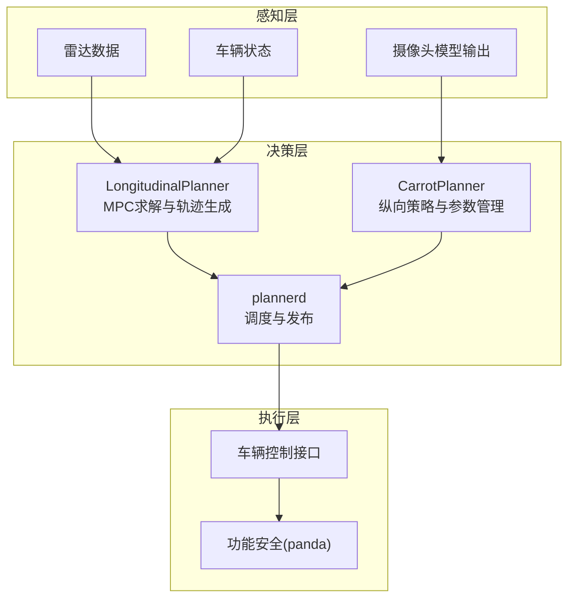
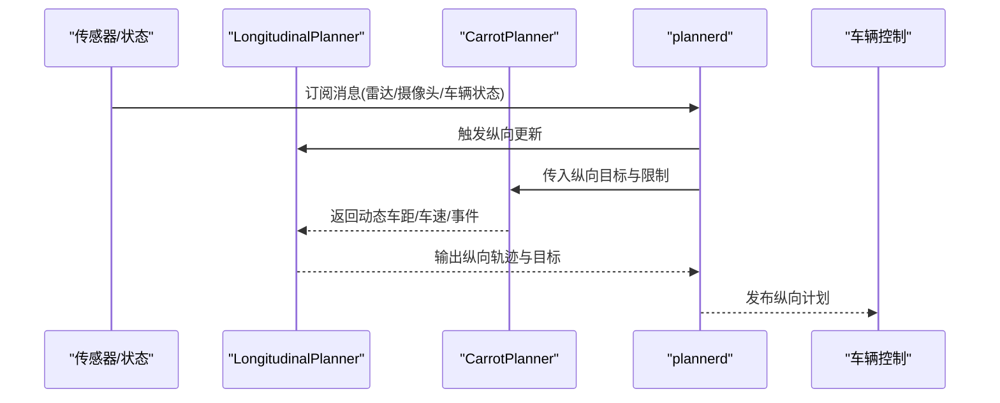
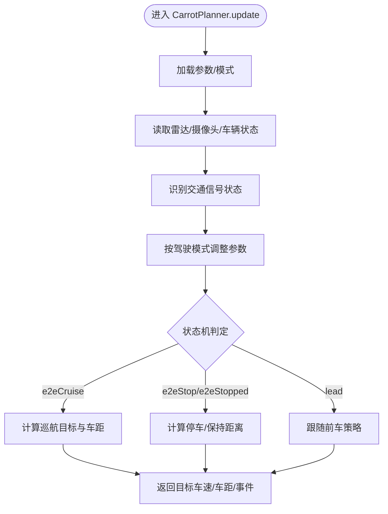
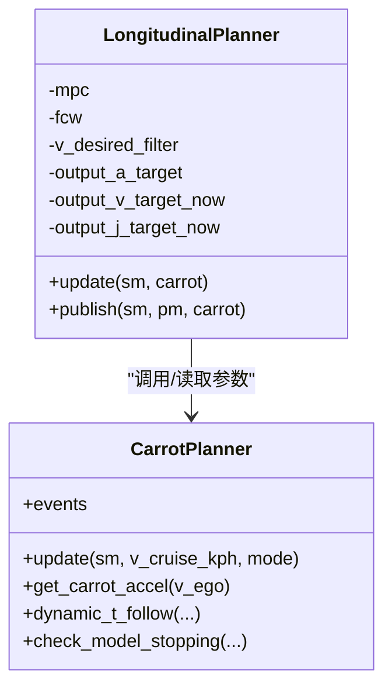
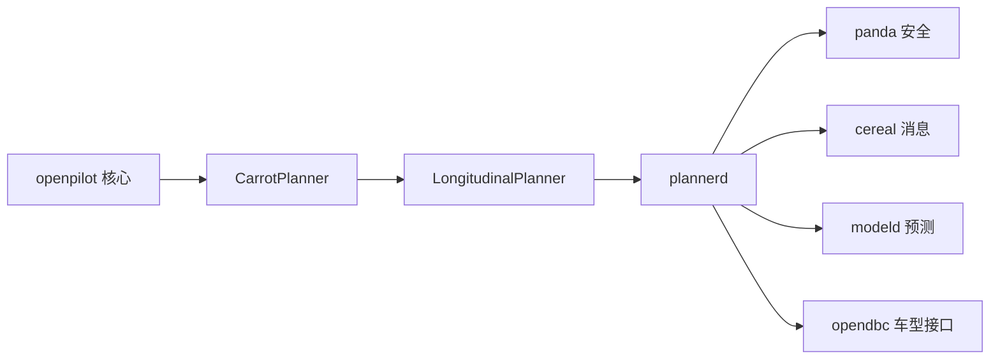

# 项目介绍

<cite>
**本文档引用的文件**
- [README.md](file://README.md)
- [docs/CARS.md](file://docs/CARS.md)
- [docs/getting-started/what-is-openpilot.md](file://docs/getting-started/what-is-openpilot.md)
- [docs/INTEGRATION.md](file://docs/INTEGRATION.md)
- [docs/concepts/glossary.md](file://docs/concepts/glossary.md)
- [docs/contributing/roadmap.md](file://docs/contributing/roadmap.md)
- [docs/CONTRIBUTING.md](file://docs/CONTRIBUTING.md)
- [LICENSE](file://LICENSE)
- [selfdrive/controls/lib/longitudinal_planner.py](file://selfdrive/controls/lib/longitudinal_planner.py)
- [selfdrive/controls/plannerd.py](file://selfdrive/controls/plannerd.py)
- [selfdrive/carrot/carrot_functions.py](file://selfdrive/carrot/carrot_functions.py)
- [pyproject.toml](file://pyproject.toml)
</cite>

## 目录
1. [项目概述](#项目概述)
2. [项目结构](#项目结构)
3. [核心组件](#核心组件)
4. [架构总览](#架构总览)
5. [详细组件分析](#详细组件分析)
6. [依赖关系分析](#依赖关系分析)
7. [性能考量](#性能考量)
8. [故障排查指南](#故障排查指南)
9. [结论](#结论)
10. [附录](#附录)

## 项目概述
Carrot2-v9-ACC 是在 openpilot 生态基础上对纵向控制（自适应巡航）进行深度增强的子项目，核心目标是显著提升原厂自适应巡航系统的体验与安全性。它通过引入 CarrotPlanner 纵向控制算法，实现更智能的跟车行为、更平滑的加减速策略以及与交通信号灯识别的协同控制，从而在 275+ 款支持车型上提供接近或超越原厂的 ACC 表现。

- 核心价值：以开源方式提供更安全、更舒适的纵向控制体验，降低驾驶疲劳，提升高速与拥堵场景下的稳定性。
- 技术创新点：
  - 动态车距与跟车策略：基于驾驶模式（经济/舒适/运动/高阶）与实时路况动态调整车距与加速度上限。
  - 交通信号灯识别与协同：结合摄像头模型输出，识别红绿灯状态并触发软起动/停车，减少误判与急刹。
  - 车道变换场景优化：在变道前后动态调整车距与急率因子，兼顾安全与舒适。
  - 与 openpilot 的深度融合：沿用 openpilot 的消息协议与模块化架构，无缝替换原厂 ACC 并保留其他原厂功能。

**章节来源**
- [README.md:1-144](file://README.md#L1-L144)
- [docs/getting-started/what-is-openpilot.md:1-13](file://docs/getting-started/what-is-openpilot.md#L1-L13)
- [docs/INTEGRATION.md:1-12](file://docs/INTEGRATION.md#L1-L12)

## 项目结构
本项目采用模块化分层架构，围绕“感知-决策-控制-执行”闭环展开，纵向控制由 CarrotPlanner 驱动，与 openpilot 的横向控制、雷达/摄像头数据、车辆接口等模块协同工作。

**图表来源**
- [selfdrive/controls/plannerd.py:13-48](file://selfdrive/controls/plannerd.py#L13-L48)
- [selfdrive/controls/lib/longitudinal_planner.py:85-284](file://selfdrive/controls/lib/longitudinal_planner.py#L85-L284)
- [selfdrive/carrot/carrot_functions.py:49-543](file://selfdrive/carrot/carrot_functions.py#L49-L543)

**章节来源**
- [selfdrive/controls/plannerd.py:1-48](file://selfdrive/controls/plannerd.py#L1-L48)
- [selfdrive/controls/lib/longitudinal_planner.py:1-284](file://selfdrive/controls/lib/longitudinal_planner.py#L1-L284)
- [selfdrive/carrot/carrot_functions.py:1-543](file://selfdrive/carrot/carrot_functions.py#L1-L543)

## 核心组件
- CarrotPlanner（纵向策略引擎）
  - 负责根据驾驶模式、交通信号状态、雷达/摄像头信息动态计算目标车速、车距与加速度上限，并输出事件与状态。
  - 关键能力：动态车距、交通信号识别、驾驶模式自适应、车道变换场景处理。
- LongitudinalPlanner（MPC纵向控制器）
  - 基于 CarrotPlanner 的目标与限制，构建速度/加速度/急率轨迹，考虑转弯时的横向加速度约束，确保纵向动作与横向控制协调。
- plannerd（调度器）
  - 统一订阅传感器与状态消息，驱动纵向/横向规划器，发布纵向计划与辅助信息。

**章节来源**
- [selfdrive/carrot/carrot_functions.py:49-543](file://selfdrive/carrot/carrot_functions.py#L49-L543)
- [selfdrive/controls/lib/longitudinal_planner.py:85-284](file://selfdrive/controls/lib/longitudinal_planner.py#L85-L284)
- [selfdrive/controls/plannerd.py:13-48](file://selfdrive/controls/plannerd.py#L13-L48)

## 架构总览
CarrotPlanner 在纵向控制链路中的位置如下：

**图表来源**
- [selfdrive/controls/plannerd.py:25-43](file://selfdrive/controls/plannerd.py#L25-L43)
- [selfdrive/controls/lib/longitudinal_planner.py:132-248](file://selfdrive/controls/lib/longitudinal_planner.py#L132-L248)
- [selfdrive/carrot/carrot_functions.py:346-521](file://selfdrive/carrot/carrot_functions.py#L346-L521)

**章节来源**
- [selfdrive/controls/plannerd.py:13-48](file://selfdrive/controls/plannerd.py#L13-L48)
- [selfdrive/controls/lib/longitudinal_planner.py:132-248](file://selfdrive/controls/lib/longitudinal_planner.py#L132-L248)
- [selfdrive/carrot/carrot_functions.py:346-521](file://selfdrive/carrot/carrot_functions.py#L346-L521)

## 详细组件分析

### CarrotPlanner 纵向策略引擎
- 驾驶模式与参数
  - 支持 Eco/Normal/Safe/High 四种模式，按模式动态调整加速度上限与舒适刹车系数。
  - 参数按帧轮询加载，支持运行时切换与自动检测（拥堵/畅通）。
- 交通信号识别与协同
  - 基于摄像头模型输出判断红绿灯状态，触发“等待/起步”事件，避免误判与急刹。
  - 支持“ATC（主动转向控制）”场景，结合导航提示动态限速与起步。
- 状态机与事件
  - 内置 e2eCruise/e2eStop/e2ePrepare/lead 等状态，依据雷达/摄像头/用户输入与交通信号综合判定。
  - 输出事件如“交通信号变化”“交通起步”“交通停止”，用于 UI 提示与日志分析。
- 动态车距与急率
  - 根据前车距离、相对加速度与车道变更状态动态调整车距与急率因子，兼顾安全与舒适。

**图表来源**
- [selfdrive/carrot/carrot_functions.py:346-521](file://selfdrive/carrot/carrot_functions.py#L346-L521)

**章节来源**
- [selfdrive/carrot/carrot_functions.py:49-543](file://selfdrive/carrot/carrot_functions.py#L49-L543)

### LongitudinalPlanner（MPC纵向控制器）
- 轨迹生成
  - 基于 CarrotPlanner 的目标与限制，设置 MPC 权重与加速度边界，生成速度/加速度/急率轨迹。
- 转弯横向约束
  - 根据期望曲率与允许横向加速度，动态压缩纵向加速度上限，避免弯道“侧翻感”或失控。
- 输出融合
  - 将 MPC 输出与端到端模型输出融合，选择更保守/激进的纵向动作，保证安全与舒适平衡。

**图表来源**
- [selfdrive/controls/lib/longitudinal_planner.py:85-284](file://selfdrive/controls/lib/longitudinal_planner.py#L85-L284)
- [selfdrive/carrot/carrot_functions.py:49-543](file://selfdrive/carrot/carrot_functions.py#L49-L543)

**章节来源**
- [selfdrive/controls/lib/longitudinal_planner.py:85-284](file://selfdrive/controls/lib/longitudinal_planner.py#L85-L284)

### plannerd（调度器）
- 实时调度
  - 以固定优先级运行，订阅多源数据，驱动纵向/横向规划器，发布纵向计划与辅助信息。
- 与 CarrotPlanner 协作
  - 通过 carrot 对象传递参数与事件，统一纵向策略入口。

**章节来源**
- [selfdrive/controls/plannerd.py:13-48](file://selfdrive/controls/plannerd.py#L13-L48)

## 依赖关系分析
- 与 openpilot 的继承关系
  - 使用 openpilot 的消息协议、参数系统、实时调度与功能安全框架。
  - 替换原厂 ACC，保留 LDW、FCW 等其他原厂功能。
- 与外部生态的集成
  - 依赖 numpy、capnp、zmq 等库；与 panda 安全模块协作实现功能安全。
  - 与 opendbc、modeld、cereal 等模块协同。

**图表来源**
- [pyproject.toml:11-71](file://pyproject.toml#L11-L71)
- [docs/INTEGRATION.md:1-12](file://docs/INTEGRATION.md#L1-L12)

**章节来源**
- [pyproject.toml:11-71](file://pyproject.toml#L11-L71)
- [docs/INTEGRATION.md:1-12](file://docs/INTEGRATION.md#L1-L12)

## 性能考量
- 实时性与延迟
  - plannerd 以高优先级运行，纵向计划发布周期短，满足实时控制需求。
  - 通过参数化的执行时间与延迟补偿，平衡 MPC 求解与系统响应。
- 能耗与舒适性
  - 驾驶模式与动态车距可降低不必要的加减速，改善能耗与乘坐舒适性。
- 可扩展性
  - 参数化策略与状态机便于针对不同品牌/车型进行微调与优化。

[本节为通用指导，无需特定文件引用]

## 故障排查指南
- 常见问题定位
  - 纵向计划未发布：检查 plannerd 是否正常启动、CarParams 是否就绪、订阅消息是否存活。
  - ACC 不生效：确认 CarrotPlanner 状态机是否处于 e2eCruise，是否存在 soft_hold 或用户油门/刹车输入。
  - 急刹/频繁启停：检查交通信号识别状态与动态车距参数，适当提高舒适刹车系数或降低动态跟随强度。
- 日志与工具
  - 使用工具链分析纵向计划、雷达/摄像头输入与事件输出，定位异常轨迹与状态切换点。

**章节来源**
- [selfdrive/controls/plannerd.py:16-19](file://selfdrive/controls/plannerd.py#L16-L19)
- [selfdrive/controls/lib/longitudinal_planner.py:250-284](file://selfdrive/controls/lib/longitudinal_planner.py#L250-L284)
- [selfdrive/carrot/carrot_functions.py:420-498](file://selfdrive/carrot/carrot_functions.py#L420-L498)

## 结论
Carrot2-v9-ACC 通过 CarrotPlanner 的智能化纵向策略，在不改变硬件的前提下显著提升了原厂 ACC 的体验与安全性。其与 openpilot 的深度集成确保了跨车型的可移植性与一致性，同时保留了原厂多项功能。对于初学者，建议从 supported cars 列表与官方文档入手，逐步理解纵向/横向控制与消息流；对于开发者，可从 CarrotPlanner 的参数与状态机切入，结合工具链进行验证与优化。

[本节为总结性内容，无需特定文件引用]

## 附录

### 应用场景与目标用户
- 场景
  - 高速公路巡航、城市拥堵跟车、红绿灯启停协同、车道变换前后的车距管理。
- 用户群体
  - 希望获得更好 ACC 体验的车主与开发者；需要在 275+ 款支持车型上部署的团队。

**章节来源**
- [docs/CARS.md:1-216](file://docs/CARS.md#L1-L216)
- [docs/getting-started/what-is-openpilot.md:1-13](file://docs/getting-started/what-is-openpilot.md#L1-L13)

### 开源与许可
- 许可证：MIT，允许自由使用、复制、修改与再发布，需保留版权与许可声明。
- 法律提示：仅限研究与教育用途，安装与实车使用可能涉及法律风险。

**章节来源**
- [LICENSE:1-8](file://LICENSE#L1-L8)
- [README.md:1-144](file://README.md#L1-L144)

### 项目发展历程与未来规划
- 当前阶段：在 275+ 车型上提供增强 ACC；持续优化纵向策略与状态机。
- 未来方向（参考 roadmap）：端到端纵向控制、Always-on 驾驶员监控、GPS 从驾驶栈移除、学习仿真训练的驾驶策略等。

**章节来源**
- [docs/contributing/roadmap.md:1-32](file://docs/contributing/roadmap.md#L1-L32)

### 自动驾驶基础概念（面向初学者）
- openpilot 是一个开放的驾驶员辅助系统，覆盖自适应巡航（ACC）、自动车道居中（ALC）、前碰撞预警（FCW）、车道偏离预警（LDW）等功能。
- “onroad/offroad”分别指点火状态下的运行态与熄火状态下的离线态；“route/segment”是行驶记录与分钟级片段。
- “panda”是设备上的安全处理器，负责功能安全并与车辆通过 CAN 通信；“comma 3X”是运行 openpilot 的硬件平台。

**章节来源**
- [docs/getting-started/what-is-openpilot.md:1-13](file://docs/getting-started/what-is-openpilot.md#L1-L13)
- [docs/concepts/glossary.md:1-10](file://docs/concepts/glossary.md#L1-L10)