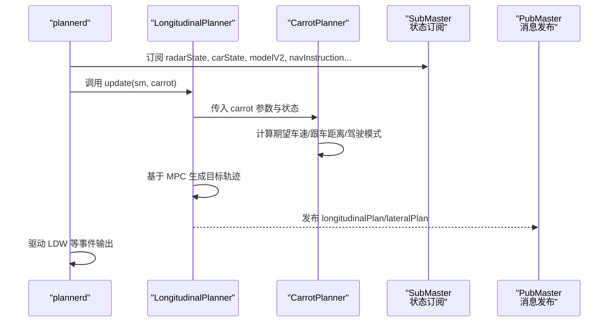
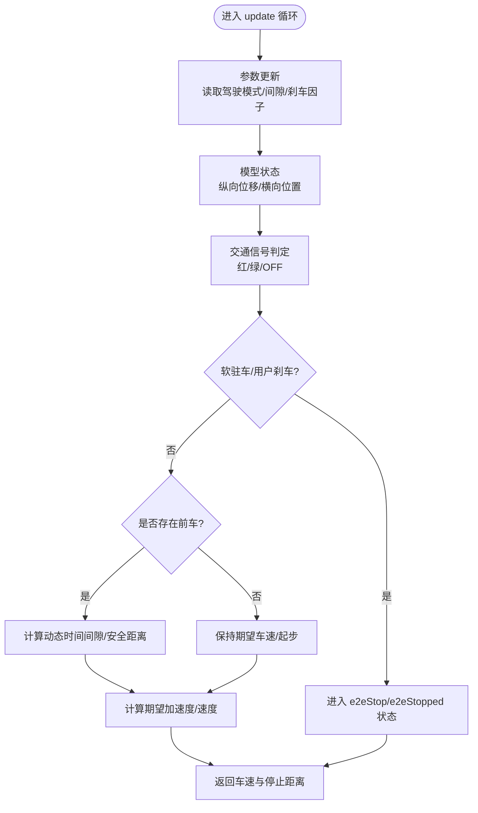
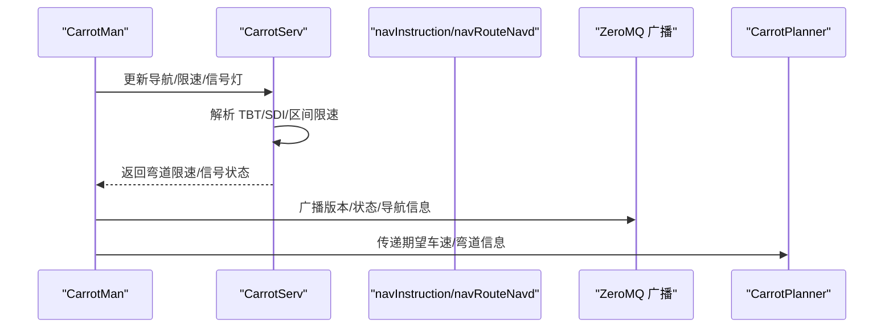
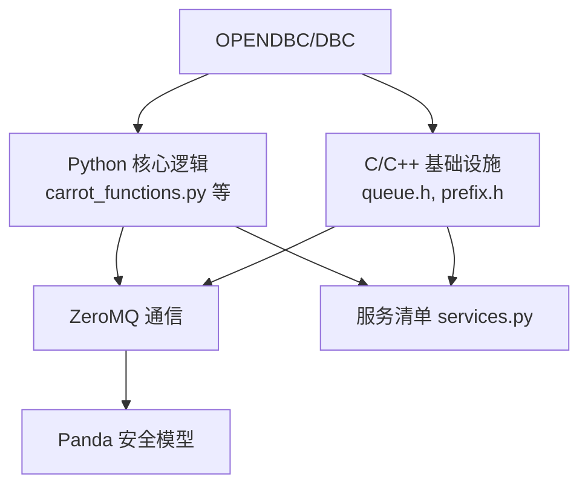

# 项目概述

<cite>
**本文引用的文件**
- [README.md](file://README.md)
- [docs/README.md](file://docs/README.md)
- [docs/getting-started/what-is-openpilot.md](file://docs/getting-started/what-is-openpilot.md)
- [docs/SAFETY.md](file://docs/SAFETY.md)
- [docs/INTEGRATION.md](file://docs/INTEGRATION.md)
- [docs/byd_radar_integration.md](file://docs/byd_radar_integration.md)
- [docs/byd_radar_vehicle_control.md](file://docs/byd_radar_vehicle_control.md)
- [selfdrive/controls/plannerd.py](file://selfdrive/controls/plannerd.py)
- [selfdrive/controls/lib/longitudinal_planner.py](file://selfdrive/controls/lib/longitudinal_planner.py)
- [selfdrive/carrot/carrot_functions.py](file://selfdrive/carrot/carrot_functions.py)
- [selfdrive/carrot/carrot_man.py](file://selfdrive/carrot/carrot_man.py)
- [selfdrive/carrot/carrot_serv.py](file://selfdrive/carrot/carrot_serv.py)
- [cereal/services.py](file://cereal/services.py)
- [common/queue.h](file://common/queue.h)
- [common/prefix.h](file://common/prefix.h)
- [uv.lock](file://uv.lock)
</cite>

## 目录
1. [引言](#引言)
2. [项目结构](#项目结构)
3. [核心组件](#核心组件)
4. [架构总览](#架构总览)
5. [详细组件分析](#详细组件分析)
6. [依赖分析](#依赖分析)
7. [性能考虑](#性能考虑)
8. [故障排查指南](#故障排查指南)
9. [结论](#结论)
10. [附录](#附录)

## 引言
本项目是基于 openpilot 的纵向控制增强实现，面向现代车辆的自适应巡航控制（ACC）能力进行深度优化与扩展，形成“CarrotPlanner”纵向规划器，并与 openpilot 生态中的导航、雷达、CAN 总线、ZeroMQ 通信等模块紧密集成。项目旨在提升原厂 ACC 的舒适性、响应性与安全性，同时保留 openpilot 对驾驶员接管的强制要求与安全边界。

法律与合规方面，项目明确标注仅限研究与仿真用途，安装或实车使用需遵守当地法律法规。安全方面，遵循 ISO26262 等行业标准，强调“失效安全被动系统”的定位，并通过 Panda 安全模型与多层测试保障。

## 项目结构
项目采用模块化分层组织，核心围绕 selfdrive 子系统展开，包含纵向规划、横向规划、雷达与导航融合、以及 ZeroMQ 通信服务等。下图展示与 CarrotPlanner 直接相关的模块关系与交互路径。

```mermaid
graph TB
subgraph "控制与规划"
LP["LongitudinalPlanner<br/>纵向规划器"]
CP["CarrotPlanner<br/>CarrotPlanner"]
LAT["LateralPlanner<br/>横向规划器"]
PLD["plannerd<br/>规划进程"]
end
subgraph "感知与输入"
RAD["radarState<br/>雷达状态"]
CAR["carState<br/>车辆状态"]
CTRL["carControl<br/>车辆控制"]
MODEL["modelV2<br/>驾驶模型"]
SELFDRV["selfdriveState<br/>系统状态"]
end
subgraph "通信与服务"
ZMQ["ZeroMQ<br/>消息总线"]
SVC["services.py<br/>服务清单"]
end
subgraph "导航与外部接口"
NAV["navInstruction<br/>导航指令"]
NAVD["navRouteNavd<br/>导航路线"]
CARROT_MAN["carrotMan<br/>CarrotMan 进程"]
CARROT_SERV["CarrotServ<br/>导航/限速/信号灯处理"]
end
PLD --> LP
PLD --> LAT
LP --> CP
LP --> SVC
CP --> SVC
LP <- --> RAD
LP <- --> CAR
LP <- --> CTRL
LP <- --> MODEL
LP <- --> SELFDRV
LP <- --> NAV
LP <- --> NAVD
CARROT_MAN --> CARROT_SERV
CARROT_MAN --> ZMQ
SVC --> ZMQ
```

图表来源
- [selfdrive/controls/plannerd.py:13-48](file://selfdrive/controls/plannerd.py#L13-L48)
- [selfdrive/controls/lib/longitudinal_planner.py:85-250](file://selfdrive/controls/lib/longitudinal_planner.py#L85-L250)
- [selfdrive/carrot/carrot_functions.py:49-522](file://selfdrive/carrot/carrot_functions.py#L49-L522)
- [cereal/services.py:12-106](file://cereal/services.py#L12-L106)
- [selfdrive/carrot/carrot_man.py:204-407](file://selfdrive/carrot/carrot_man.py#L204-L407)
- [selfdrive/carrot/carrot_serv.py:83-237](file://selfdrive/carrot/carrot_serv.py#L83-L237)

章节来源
- [selfdrive/controls/plannerd.py:13-48](file://selfdrive/controls/plannerd.py#L13-L48)
- [cereal/services.py:12-106](file://cereal/services.py#L12-L106)

## 核心组件
- CarrotPlanner（纵向规划器）：负责根据雷达、模型与导航信息，计算期望车速与安全跟车距离，结合驾驶模式与交通信号状态，输出纵向控制目标。
- LongitudinalPlanner（纵向规划器）：与 CarrotPlanner 协作，基于 MPC 与人机工程学参数生成加速度/速度轨迹，并与横向规划协同。
- CarrotMan/CarrotServ（导航与外部接口）：负责导航路线、限速、信号灯、弯道限速等信息的处理与广播，驱动 ATC（自适应弯道控制）与自适应巡航策略。
- plannerd（规划进程）：作为控制循环入口，订阅多源传感器与状态消息，协调纵向/横向规划与事件输出。

章节来源
- [selfdrive/carrot/carrot_functions.py:49-522](file://selfdrive/carrot/carrot_functions.py#L49-L522)
- [selfdrive/controls/lib/longitudinal_planner.py:85-250](file://selfdrive/controls/lib/longitudinal_planner.py#L85-L250)
- [selfdrive/carrot/carrot_man.py:204-407](file://selfdrive/carrot/carrot_man.py#L204-L407)
- [selfdrive/carrot/carrot_serv.py:83-237](file://selfdrive/carrot/carrot_serv.py#L83-L237)
- [selfdrive/controls/plannerd.py:13-48](file://selfdrive/controls/plannerd.py#L13-L48)

## 架构总览
CarrotPlanner 作为纵向规划的关键增强模块，与 openpilot 的纵向规划器协作，共同完成 ACC/自适应巡航的纵向控制闭环。其输入来自雷达、车辆状态、驾驶模型与导航指令，输出用于约束纵向加速度与速度目标，确保舒适与安全。



图表来源
- [selfdrive/controls/plannerd.py:25-44](file://selfdrive/controls/plannerd.py#L25-L44)
- [selfdrive/controls/lib/longitudinal_planner.py:165-250](file://selfdrive/controls/lib/longitudinal_planner.py#L165-L250)
- [selfdrive/carrot/carrot_functions.py:346-522](file://selfdrive/carrot/carrot_functions.py#L346-L522)

## 详细组件分析

### CarrotPlanner 工作原理
- 参数与模式：从 Params 读取驾驶模式（经济/安全/普通/激进）、跟车时间间隙、舒适刹车、交通信号检测模式等，动态调整纵向加速度上限与期望车速。
- 交通信号与模型：通过模型输出的纵向位移与横向位置判断红绿灯状态，结合软驻车与用户刹车行为，决定是否起步或停车。
- 跟车策略：依据雷达 Lead 车辆状态与动态时间间隙，计算安全距离与期望加速度，支持车道变更期间的动态时间间隙缩放。
- 输出：返回期望车速（kph）与实际停止距离（m），供纵向规划器约束目标。



图表来源
- [selfdrive/carrot/carrot_functions.py:143-522](file://selfdrive/carrot/carrot_functions.py#L143-L522)

章节来源
- [selfdrive/carrot/carrot_functions.py:49-522](file://selfdrive/carrot/carrot_functions.py#L49-L522)

### LongitudinalPlanner 与 CarrotPlanner 协作
- LongitudinalPlanner 在 ACC 模式下使用 CarrotPlanner 提供的加速度上限与驾驶模式因子，结合 MPC 生成目标速度/加速度轨迹。
- 通过服务清单与消息总线，纵向规划器与 CarrotPlanner 共享状态与参数，保证控制闭环稳定。

章节来源
- [selfdrive/controls/lib/longitudinal_planner.py:165-250](file://selfdrive/controls/lib/longitudinal_planner.py#L165-L250)
- [cereal/services.py:12-106](file://cereal/services.py#L12-L106)

### CarrotMan/CarrotServ 导航与信号灯处理
- CarrotMan 负责与导航/手机 GPS/FTP 等外部系统交互，广播版本信息与运行状态，订阅导航路线与指令。
- CarrotServ 解析导航指令（TBT、SDI 等），计算弯道限速、信号灯状态、区间限速与减速策略，驱动 ATC（自适应弯道控制）与自适应巡航。



图表来源
- [selfdrive/carrot/carrot_man.py:204-407](file://selfdrive/carrot/carrot_man.py#L204-L407)
- [selfdrive/carrot/carrot_serv.py:83-237](file://selfdrive/carrot/carrot_serv.py#L83-L237)

章节来源
- [selfdrive/carrot/carrot_man.py:204-407](file://selfdrive/carrot/carrot_man.py#L204-L407)
- [selfdrive/carrot/carrot_serv.py:83-237](file://selfdrive/carrot/carrot_serv.py#L83-L237)

### 雷达数据与车辆控制集成
- BYD 雷达数据通过原始 CAN 消息解析，提供目标距离、速度、角度与状态，用于 ACC、FCW 与 LCA 等功能。
- 雷达接口实现将角度转换为横向/纵向距离，构建完整的雷达点云，支撑纵向与横向控制。

章节来源
- [docs/byd_radar_integration.md:1-149](file://docs/byd_radar_integration.md#L1-L149)
- [docs/byd_radar_vehicle_control.md:1-407](file://docs/byd_radar_vehicle_control.md#L1-L407)

## 依赖分析
- Python 与 C/C++：核心逻辑以 Python 实现，底层通信与实时性由 C/C++ 模块（如消息队列、参数存储、硬件抽象）保障。
- ZeroMQ：用于跨进程/跨模块的消息传输，服务清单定义了各消息频率与采样策略。
- Panda 安全模型：在硬件层面执行安全约束，确保 actuator 输出在合理范围内。
- DBC/OPENDBC：定义 CAN 信号与协议，支撑雷达与车辆控制信号解析。



图表来源
- [common/queue.h:1-52](file://common/queue.h#L1-L52)
- [common/prefix.h:10-39](file://common/prefix.h#L10-L39)
- [cereal/services.py:12-106](file://cereal/services.py#L12-L106)
- [uv.lock:4584-4620](file://uv.lock#L4584-L4620)

章节来源
- [common/queue.h:1-52](file://common/queue.h#L1-L52)
- [common/prefix.h:10-39](file://common/prefix.h#L10-L39)
- [cereal/services.py:12-106](file://cereal/services.py#L12-L106)
- [uv.lock:4584-4620](file://uv.lock#L4584-L4620)

## 性能考虑
- 控制周期与频率：纵向/横向规划与消息频率在服务清单中明确，确保实时性与稳定性。
- 参数更新与滤波：通过移动平均与参数轮询，平衡响应速度与噪声抑制。
- 限速与减速策略：基于区间限速与弯道曲率的反向传播限速，避免急刹与超调。

## 故障排查指南
- 法律与合规：严格遵守当地法规，仅在仿真/实验场景使用，避免实车安装与上路。
- 安全边界：若出现系统异常，立即切换至驾驶员接管模式，确保车辆可控。
- 通信与服务：检查 ZeroMQ 服务是否正常启动，确认服务清单中的消息频率与订阅状态。
- 雷达与导航：验证 BYD 雷达 DBC 是否正确加载，确认导航指令与限速信息是否可达。

章节来源
- [README.md:1-24](file://README.md#L1-L24)
- [docs/SAFETY.md:1-37](file://docs/SAFETY.md#L1-L37)
- [docs/byd_radar_integration.md:111-149](file://docs/byd_radar_integration.md#L111-L149)

## 结论
Carrot2-v9-ACC 通过 CarrotPlanner 对 openpilot 的纵向控制进行增强，结合导航、雷达与 ZeroMQ 通信，形成一套可扩展、可验证的 ACC 改进方案。项目在安全与合规方面保持严谨，在技术实现上强调模块解耦与参数化，便于在不同车型与场景中迭代优化。

## 附录

### 快速开始指南
- 安装与运行：参考官方文档与脚本，准备设备、软件、车辆与 harness，按流程安装 openpilot。
- 验证 ACC：在仿真或封闭场地上验证纵向控制与跟车行为，观察纵向计划与事件输出。
- 导航与限速：启用 CarrotMan/CarrotServ，验证导航路线、TBT/SDI 与弯道限速联动。

章节来源
- [docs/getting-started/what-is-openpilot.md:1-13](file://docs/getting-started/what-is-openpilot.md#L1-L13)
- [README.md:78-87](file://README.md#L78-L87)

### 技术栈概览
- Python：CarrotPlanner、CarrotMan/CarrotServ、消息服务与工具脚本。
- C/C++：消息队列、参数存储、硬件抽象与实时性保障。
- ZeroMQ：跨进程通信与服务广播。
- OPENDBC/DBC：CAN 信号与协议定义。
- Panda：安全模型与硬件测试。

章节来源
- [docs/README.md:9-27](file://docs/README.md#L9-L27)
- [cereal/services.py:12-106](file://cereal/services.py#L12-L106)
- [docs/byd_radar_integration.md:25-43](file://docs/byd_radar_integration.md#L25-L43)
- [uv.lock:4584-4620](file://uv.lock#L4584-L4620)